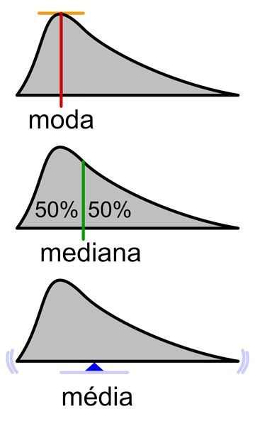

# MÉDIA, MODA E MEDIANA

### Média, moda e mediana são dados da Estatística usados para simplificar um conjunto de informações em único elemento, que são chamados de medidas de tendência central. Esses números permitem que certos valores quantitativos sejam representados por um dado central e encontrados através de conjuntos finitos e infinitos.

# Média 

Conhecida como média aritmética simples, é a operação em que todos os dados de um determinado conjunto são somados e divididos pelo valor total de membros encontrados, ou seja:

M = (x1 + x2 + x3 + … + xn) /n

Sendo,

• M: média

• x: os valores quantitativos

• n: quantidade de elementos do conjunto

A média entre {8, 11, 14, 20, 27}, por exemplo, é feita da seguinte maneira:

• x1: 8

• x2: 11

• x3: 14

• x4: 20

• x5: 27

• n: 5, pois são cinco componentes dentro do conjunto.

Substituindo na fórmula, teremos:

M = (x1 + x2 + x3 + … + xn) /n

M = (8+11+14+20 +27) / 5

M = 80/5 = 16

Percebe-se que o quociente da média aritmética não integra os elementos do conjunto. Isso acontece porque o cálculo serve para encontrar a medida de centralidade, que reúne valores baixos e altos. 

Além disso, a soma da média com os componentes do conjunto deve resultar em zero. A comprovação dessa regra é dada por: 

(x1 – M) + (x2 – M) + (x3 – M) + (x4 – M) + (x5 – M) = 

( 8 – 16) + (11 – 16 ) + (14 – 16 ) + (20 – 16) + (27 – 16) = 

( - 8) + ( - 5) + ( - 2) + 4 + 11 = 

(- 15) + 15 = 0 

# Moda

A Moda (Mo) é o valor que mais aparece dentro de um conjunto quantitativo. Com isso, para identificá-la, é necessário encontrar a frequência de determinados dados.

Entre as medidas de centralidade, a moda é uma das poucas que podem ser aplicadas em variados conjuntos (estimativas com nomes, cores, roupas, etc.). Para tal, basta calcular o termo de maior presença.

Exemplo: 

Supondo que os dados são as idades de um time de futebol, o levantamento deu origem as conjunto: {18, 19, 19, 20, 21, 21, 21 ,23, 25, 26, 27}.

Como a sequência acima já apresenta formato crescente, o próximo passo é identificar a idade de maior frequência: 2 jogadores têm 19 anos, outros 2 têm 23 anos e 3 deles apresentam 21 anos.

Portanto, a moda do time de futebol é 21 anos (Mo = 21).

# Mediana

A Mediana (Md) significa a medida central de um conjunto de dados. O seu cálculo depende de certas regras. Confira:

• Os valores quantitativos devem ser arrumados em ordem crescente.

• Quando a quantidade de elementos forma um conjunto par, a mediana é o resultado da soma de duas medidas centrais divididas por dois, isto, é: (xm + xn) / 2.

• Quando a quantidade de elementos forma um conjunto ímpar, a mediana é o valor que separa os lados maiores e menores do próprio conjunto.

Exemplos:

Dado os conjuntos:

T = {10, 1, 4, 12, 15, 6, 8}

C = {5, 11, 2, 17,14, 20}

1° passo: colocar os valores em ordem crescente:

T = {1,4,6,8,10,12,15}

C = {2,5,11,14,17,20}

Observa-se que o conjunto T é formado por 7 componentes, ou seja, um número ímpar. Com isso, a mediana será o 4° elemento, uma vez que separa as partes maiores e menores do conjunto.

Logo, Md = 8

Já o conjunto C apresenta 6 membros, ou seja, um número par. Assim, a mediana será a razão entre a soma de duas medidas centrais (3° e 4° elementos):

Md = 11 +14 / 2

Md = 25/2 = 12,5

Confirma-se que os dois elementos da esquerda (2 e 5) são realmente menores que a mediana calculada, e os da direita são maiores (17 e 20).

# Média, Moda e Mediana: valor ponderado

Através da média aritmética simples é possível determinar a média ponderada (Mp) – método que inclui os pesos dos valores quantitativos.

O cálculo matemático é dado pela soma dos produtos da multiplicação de uma medida com o seu respectivo peso e, em seguida, a divisão do resultado pela soma dos pesos.

Exemplo:

A tabela abaixo mostra uma relação de notas. Então, a média ponderada será:

|   | Notas | Pesos |
| --- | --- | --- |
| Prova 1  | 6  | 3  |
| Prova 2  | 7,3  | 2  |
| Prova 3  | 9  | 2  |

Mp = (6.3) + (7,3. 2) + (9.2) / 3+2+2 

Mp = 18 + 14,6 + 18 / 7 

Mp = 50,6/ 7 = 7, 23 

# Referencias:
https://www.educamaisbrasil.com.br/enem/matematica/media-moda-e-mediana
