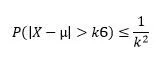
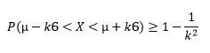
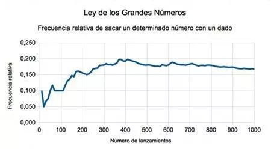

<h1>10. Inferência Estatística e Principais Teoremas de Probabilidade: Teorema de Chebyshev, Lei dos Grandes Números, Teorema Central do Limite, Intervalo de Confiança, Testes de Hipóteses</h1>
<h2 align="center">Teorema de Chebyshev (Desigualdade de Tchebycheff)</h2>

A desigualdade de Chebyshev é um teorema usado em estatística que fornece uma estimativa conservadora (intervalo de confiança) da probabilidade de que uma variável aleatória com variância finita estará a uma certa distância de sua expectativa matemática ou de sua média.

Sua expressão formal é a seguinte:

<b>X = valor estimado</b>

<b>µ = Expectativa matemática do valor estimado</b>

<b>Ϭ = desvio padrão do valor esperado</b>

<b>k = Número de desvios padrão</b>

Partindo dessa expressão geral e desenvolvendo a parte que fica dentro do valor absoluto teríamos o seguinte:

Se prestarmos atenção à expressão anterior, pode-se ver que a parte à esquerda não é mais do que um <b>intervalo de confiança</b>. Isso nos oferece um limite inferior e superior para o valor estimado. Portanto, a <b>Desigualdade de Chebyshev</b> nos diz a probabilidade mínima de que o parâmetro da população esteja dentro de um certo número de desvios-padrão acima ou abaixo de sua média. Ou, dito de outra forma, nos dá a probabilidade de que o parâmetro da população esteja dentro desse intervalo de confiança.

A <b>Desigualdade de Chebyshev</b> fornece limites aproximados para o valor estimado. Apesar de ter um certo grau de imprecisão, é um teorema muito útil, pois pode ser aplicado a uma ampla gama de variáveis ​​aleatórias, independentemente de suas distribuições. A única restrição para poder usar esta desigualdade é que k tem que ser maior que 1 (k> 1).

<b>Exemplo</b>

Suponha que sejamos administradores de um fundo de investimento. A carteira que estamos administrando tem um retorno médio de 8,14% e um desvio padrão de 5,12%. Para saber, por exemplo, qual porcentagem de nossos retornos são pelo menos 3 desvios-padrão de nossa lucratividade média, simplesmente aplicaríamos a fórmula anterior da expressão 2.

<pre align="center"><b>k = 1,96</b></pre>

Substituindo o valor de k:

<pre align="center"><b>1- (1 / (1,96**2)) = 0,739 = 73,9%</b></pre>

Isso significa que 73,9% dos resultados estão no intervalo de confiança localizado a 1,96 desvios padrão da média.

Vamos fazer o exemplo anterior para valores diferentes de k.

<pre align="center"><b>k = 2,46</b></pre>
<pre align="center"><b>k = 3</b></pre>

Substituindo o valor de k = 2,46:

<pre align="center"><b>1- (1 / (2,46**2)) = 0,835 = 83,5%</b></pre>

Substituindo o valor de k = 3:

<pre align="center"><b>1- (1 / (3**2)) = 0,889 = 88,9%</b></pre>

Existem 83,5% dos dados que estão a uma distância de 2,46 desvios-padrão da média e 88,9% que estão dentro de 3 desvios-padrão da média.

Usando a desigualdade de Chebyshev, é fácil deduzir que quanto maior o valor de K (quanto maior o desvio do valor estimado de sua média), maior a probabilidade de que a variável aleatória esteja dentro do intervalo limitado.

<h2 align="center">Lei dos Grandes Números</h2>

A lei dos grandes números é um teorema fundamental da teoria da probabilidade que indica que, se repetirmos muitas vezes (tendendo ao infinito) o mesmo experimento, a frequência de um determinado evento acontecendo tende a ser uma constante.

Ou seja, a lei dos grandes números indica que se o mesmo teste for realizado repetidamente (por exemplo, jogar uma moeda, jogar uma roleta, etc.), a frequência com que um determinado evento se repetirá (isso ocorre cabeças ou selo, o número 3 sai preto, etc) se aproximará de uma constante. Essa, por sua vez, será a probabilidade desse evento ocorrer.

<b>Origem da lei dos grandes números</b>

A lei dos grandes números foi mencionada pela primeira vez pelo matemático Gerolamo Cardamo, embora sem qualquer prova rigorosa. Mais tarde, Jacob Bernoulli conseguiu fazer uma demonstração completa em sua obra "Ars Conjectandi" em 1713. Na década de 1830, o matemático Siméon Denis Poisson descreveu em detalhes a lei dos grandes números, que veio aperfeiçoar a teoria. Outros autores também fariam contribuições posteriores.

<b>Exemplo da Lei dos Grandes Números</b>

Suponha o seguinte experimento: lance um dado comum. Agora vamos considerar o evento em que obtemos o número 1. Como sabemos, a probabilidade de que o número 1 apareça é 1/6 (o dado tem 6 faces, uma delas é uma).

O que a lei dos grandes números nos diz? Diz-nos que à medida que aumentamos o número de repetições da nossa experiência (fazemos mais lançamentos do dado), a frequência com que o evento se repetirá (obtemos 1) ficará mais próxima de uma constante, que terá um valor igual valor à sua probabilidade (1/6 ou 16,66%).

Possivelmente, nos primeiros 10 ou 20 lançamentos, a frequência com que conseguiremos 1 não será de 16%, mas de outro percentual como 5% ou 30%. Mas, à medida que fazemos mais e mais tons (digamos 10.000), a frequência com que o 1 aparece será muito próxima a 16,66%.

No gráfico a seguir, vemos um exemplo de um experimento real em que um dado é jogado repetidamente. Aqui podemos ver como a frequência relativa de desenho de um certo número está mudando.

Conforme indicado pela lei dos grandes números, nos primeiros lançamentos a frequência é instável, mas à medida que aumentamos o número de lançamentos a frequência tende a se estabilizar em um determinado número, que é a probabilidade de o evento ocorrer (neste caso, os números de 1 a 6, pois é o lançamento de um dado).

<b>Interpretação Errada da Lei dos Grandes Números</b>

Muitas pessoas interpretam mal a lei dos grandes números, acreditando que um evento tende a ser mais importante do que outro. Assim, por exemplo, eles acreditam que como a probabilidade de que o número 1 role em um dado deve ser próxima a 1/6, quando o número 1 não aparece nos primeiros 2 ou 5 lançamentos, é muito provável que no Next. Isso não é verdade, já que a lei dos grandes números só se aplica a muitas repetições, então podemos passar o dia todo jogando um dado e não atingir a frequência de 1/6.

O lançamento de um dado é um evento independente e, portanto, quando um certo número aparece, este resultado não afeta o próximo lançamento. Somente depois de milhares de repetições seremos capazes de verificar que a lei dos grandes números existe e que a frequência relativa de obtenção de um número (em nosso exemplo 1) será de 1/6.

A má interpretação da teoria pode levar as pessoas (especialmente os jogadores) a perder dinheiro e tempo.

<h2 align="center">Teorema Central do Limite</h2>
<h2 align="center">Intervalo de Confiança</h2>
<h2 align="center">Testes de Hipóteses</h2>
<h2 align="center">Referências</h2>

https://pt.economy-pedia.com/11039359-chebyshev-inequality

https://pt.economy-pedia.com/11038376-law-of-the-big-numbers

