<h1>10. Inferência Estatística e Principais Teoremas de Probabilidade: Teorema de Chebyshev, Lei dos Grandes Números, Teorema Central do Limite, Intervalo de Confiança, Testes de Hipóteses</h1>
<h2 align="center">Teorema de Chebyshev (Desigualdade de Tchebycheff)</h2>

A desigualdade de Chebyshev é um teorema usado em estatística que fornece uma estimativa conservadora (intervalo de confiança) da probabilidade de que uma variável aleatória com variância finita estará a uma certa distância de sua expectativa matemática ou de sua média.

Sua expressão formal é a seguinte:

<b>X = valor estimado</b>

<b>µ = Expectativa matemática do valor estimado</b>

<b>Ϭ = desvio padrão do valor esperado</b>

<b>k = Número de desvios padrão</b>

Partindo dessa expressão geral e desenvolvendo a parte que fica dentro do valor absoluto teríamos o seguinte:

Se prestarmos atenção à expressão anterior, pode-se ver que a parte à esquerda não é mais do que um <b>intervalo de confiança</b>. Isso nos oferece um limite inferior e superior para o valor estimado. Portanto, a <b>Desigualdade de Chebyshev</b> nos diz a probabilidade mínima de que o parâmetro da população esteja dentro de um certo número de desvios-padrão acima ou abaixo de sua média. Ou, dito de outra forma, nos dá a probabilidade de que o parâmetro da população esteja dentro desse intervalo de confiança.

A <b>Desigualdade de Chebyshev</b> fornece limites aproximados para o valor estimado. Apesar de ter um certo grau de imprecisão, é um teorema muito útil, pois pode ser aplicado a uma ampla gama de variáveis ​​aleatórias, independentemente de suas distribuições. A única restrição para poder usar esta desigualdade é que k tem que ser maior que 1 (k> 1).

<b>Exemplo</b>

Suponha que sejamos administradores de um fundo de investimento. A carteira que estamos administrando tem um retorno médio de 8,14% e um desvio padrão de 5,12%. Para saber, por exemplo, qual porcentagem de nossos retornos são pelo menos 3 desvios-padrão de nossa lucratividade média, simplesmente aplicaríamos a fórmula anterior da expressão 2.

<pre align="center"><b>k = 1,96</b></pre>

Substituindo o valor de k:

<pre align="center"><b>1- (1 / (1,96**2)) = 0,739 = 73,9%</b></pre>

Isso significa que 73,9% dos resultados estão no intervalo de confiança localizado a 1,96 desvios padrão da média.

Vamos fazer o exemplo anterior para valores diferentes de k.

<pre align="center"><b>k = 2,46</b></pre>
<pre align="center"><b>k = 3</b></pre>

Substituindo o valor de k = 2,46:

<pre align="center"><b>1- (1 / (2,46**2)) = 0,835 = 83,5%</b></pre>

Substituindo o valor de k = 3:

<pre align="center"><b>1- (1 / (3**2)) = 0,889 = 88,9%</b></pre>

Existem 83,5% dos dados que estão a uma distância de 2,46 desvios-padrão da média e 88,9% que estão dentro de 3 desvios-padrão da média.

Usando a desigualdade de Chebyshev, é fácil deduzir que quanto maior o valor de K (quanto maior o desvio do valor estimado de sua média), maior a probabilidade de que a variável aleatória esteja dentro do intervalo limitado.

<h2 align="center">Lei dos Grandes Números</h2>

A lei dos grandes números é um teorema fundamental da teoria da probabilidade que indica que, se repetirmos muitas vezes (tendendo ao infinito) o mesmo experimento, a frequência de um determinado evento acontecendo tende a ser uma constante.

Ou seja, a lei dos grandes números indica que se o mesmo teste for realizado repetidamente (por exemplo, jogar uma moeda, jogar uma roleta, etc.), a frequência com que um determinado evento se repetirá (isso ocorre cabeças ou selo, o número 3 sai preto, etc) se aproximará de uma constante. Essa, por sua vez, será a probabilidade desse evento ocorrer.

<b>Origem da lei dos grandes números</b>

A lei dos grandes números foi mencionada pela primeira vez pelo matemático Gerolamo Cardamo, embora sem qualquer prova rigorosa. Mais tarde, Jacob Bernoulli conseguiu fazer uma demonstração completa em sua obra "Ars Conjectandi" em 1713. Na década de 1830, o matemático Siméon Denis Poisson descreveu em detalhes a lei dos grandes números, que veio aperfeiçoar a teoria. Outros autores também fariam contribuições posteriores.

<b>Exemplo da Lei dos Grandes Números</b>

Suponha o seguinte experimento: lance um dado comum. Agora vamos considerar o evento em que obtemos o número 1. Como sabemos, a probabilidade de que o número 1 apareça é 1/6 (o dado tem 6 faces, uma delas é uma).

O que a lei dos grandes números nos diz? Diz-nos que à medida que aumentamos o número de repetições da nossa experiência (fazemos mais lançamentos do dado), a frequência com que o evento se repetirá (obtemos 1) ficará mais próxima de uma constante, que terá um valor igual valor à sua probabilidade (1/6 ou 16,66%).

Possivelmente, nos primeiros 10 ou 20 lançamentos, a frequência com que conseguiremos 1 não será de 16%, mas de outro percentual como 5% ou 30%. Mas, à medida que fazemos mais e mais tons (digamos 10.000), a frequência com que o 1 aparece será muito próxima a 16,66%.

No gráfico a seguir, vemos um exemplo de um experimento real em que um dado é jogado repetidamente. Aqui podemos ver como a frequência relativa de desenho de um certo número está mudando.

Conforme indicado pela lei dos grandes números, nos primeiros lançamentos a frequência é instável, mas à medida que aumentamos o número de lançamentos a frequência tende a se estabilizar em um determinado número, que é a probabilidade de o evento ocorrer (neste caso, os números de 1 a 6, pois é o lançamento de um dado).

<b>Interpretação Errada da Lei dos Grandes Números</b>

Muitas pessoas interpretam mal a lei dos grandes números, acreditando que um evento tende a ser mais importante do que outro. Assim, por exemplo, eles acreditam que como a probabilidade de que o número 1 role em um dado deve ser próxima a 1/6, quando o número 1 não aparece nos primeiros 2 ou 5 lançamentos, é muito provável que no Next. Isso não é verdade, já que a lei dos grandes números só se aplica a muitas repetições, então podemos passar o dia todo jogando um dado e não atingir a frequência de 1/6.

O lançamento de um dado é um evento independente e, portanto, quando um certo número aparece, este resultado não afeta o próximo lançamento. Somente depois de milhares de repetições seremos capazes de verificar que a lei dos grandes números existe e que a frequência relativa de obtenção de um número (em nosso exemplo 1) será de 1/6.

A má interpretação da teoria pode levar as pessoas (especialmente os jogadores) a perder dinheiro e tempo.

<h2 align="center">Teorema Central do Limite</h2>

Acompanhe o texto a seguir para conhecer o Teorema Central do Limite (TCL) e entender sua importância para a análise estatística!Porém, antes de abordar o Teorema em si, é necessário entender o que é uma distribuição amostral.

<b>Distribuição Amostral</b>

Sabemos que geralmente não temos acesso à população de interesse que estamos estudando e por isso, utilizamos amostras.

Ao retirar amostras <b>com reposição</b>, muito provavelmente elas irão ser diferentes entre si, em maior ou menor magnitude. Assim, se tivermos 5 amostras (de mesmo tamanho), cada uma terá a sua própria média, chamada de <b>média amostral</b>.

Nesse exemplo, teremos então um conjunto de 5 médias amostrais, como mostrado na figura abaixo, em que o retângulo representa a população, e os círculos as amostras:

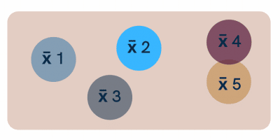

Ao <b>repetir o processo de amostragem várias vezes</b>, poderemos agrupar todas as médias amostrais possíveis em uma distribuição de probabilidade ou de frequência:

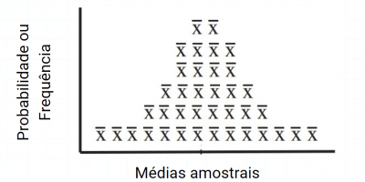

O gráfico acima é  chamado de <b>distribuição amostral das médias</b> e terá o formato de uma curva normal se certas condições forem verdadeiras como veremos mais adiante.

Tal como qualquer distribuição, podemos calcular a sua média e o desvio-padrão:

<ul>
  <li>A média da distribuição amostral das médias  <b>(μx̅), será sempre a verdadeira média da população (μ);</b></li>
  <li>E o seu desvio-padrão (conhecido como <b>erro padrão</b> ) será o desvio padrão populacional (σ)  dividido pela raiz quadrada do tamanho da amostra (n).</li>
</ul>

Lembre-se que: a distribuição amostral será obtida sempre a partir de uma  <b>estatística da amostra</b>, como a <b>média, a proporção e a variância</b>.

<b>O que diz o Teorema Central do Limite (TCL) ?</b>

Agora que estamos familiarizados com o conceito de distribuição amostral, podemos abordar o TCL. O uso do Teorema dependerá de <b>como é a forma da distribuição populacional</b> dos nossos dados. Nesse caso há duas situações possíveis:

<b>a) A população é normalmente distribuída</b>

Imagine que estamos analisando variáveis cuja população já é conhecida por ter uma  distribuição normal, como altura, peso, frequência cardíaca, etc.

Nesse caso, vamos observar que depois de fazer a amostragem com reposição, a distribuição amostral das médias obtida <b>também será normal.</b> E isso não é uma coincidência!<b> Sempre que a população for normal, a distribuição das médias também será normalmente distribuída, independentemente do tamanho da amostra.</b>

Esse cenário é o ‘melhor’ que podemos encontrar e <b>nesse caso o Teorema Central do Limite não é necessário.</b>

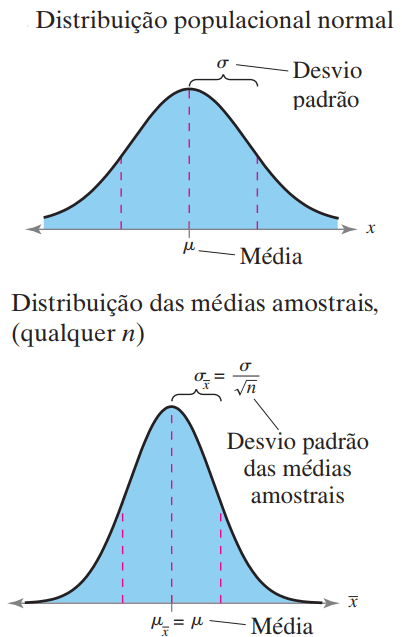

<b>b) A população não é normalmente distribuída ou não sei como é a distribuição populacional</b>

É muito comum, porém, que sequer saibamos qual é a forma da distribuição populacional que estamos lidando ou que os dados não são normalmente distribuídos. Então é aqui que o Teorema Central do Limite se aplica! 

O Teorema nos explica que se a distribuição da população de origem for desconhecida ou assimétrica, uniforme, etc, ao retirarmos amostras suficientemente grandes – acima de 30 elementos : n >=30 –  a distribuição amostral das médias será aproximadamente normal.

Assim, podemos dizer que o Teorema “funciona” em geral, se tivermos amostras de tamanho mínimo igual a  30 elementos. Entretanto, vale mencionar que em alguns casos, esse número pode ser diferente dependendo da forma da distribuição populacional que estamos lidando.

Por exemplo:

<ul>
  <li>Em distribuições em que  quase não há outliers (de cauda ‘leve’), amostras com 20 elementos já podem ser o suficiente para que o Teorema seja observado;</li>
  <li>De forma contrária, em distribuição de cauda ‘pesada’, isto é, com muitos valores atípicos (grande assimetria), amostras com 100 elementos podem ser necessárias para que o Teorema comece a ser observado. </li>
</ul>
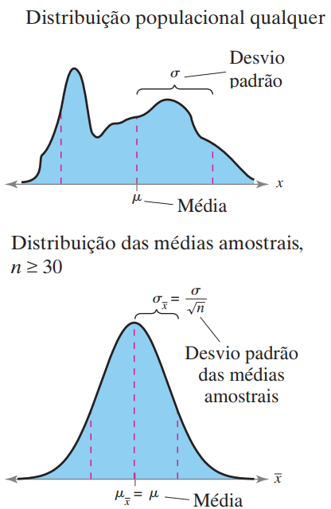

De forma geral, <b>quanto maior for a amostra, mais próxima da normal a distribuição amostral das médias será.</b>

No esquema abaixo, na primeira imagem temos uma distribuição populacional assimétrica à direita. Suponha que inicialmente foram retiradas 5.000 amostras, cada uma com <b>5 elementos.</b> Em seguida foram calculadas as médias e como resultado, obtemos uma distribuição amostral das médias ainda ligeiramente assimétrica.

Mas se retirássemos as mesmas 5.000 amostras, porém cada qual com <b>30 elementos</b>, percebemos que a distribuição das médias se torna perfeitamente simétrica e normal. E se retirássemos 5.000 amostras, cada qual com <b>100 elementos</b>, a distribuição das médias é normal e ainda menos dispersa (mais concentrada em torno da média).

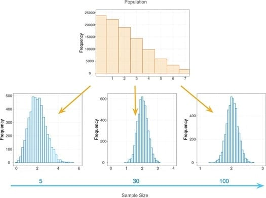

<b>Se quiser fazer suas propróprias simulações e visualizar o TCL para diferentes distribuições populacionais, acesse sites como Seeing Theory e Stat Crunch.</b>

<b>Qual a importância do TCL?</b>

Ao utilizarmos amostras, nosso objetivo final é fazer <b>inferências a respeito dos reais parâmetros da população.</b> Para isso, usamos ferramentas como intervalos de confiança e teste de hipóteses que partem da suposição da normalidade dos dados.

Desse modo, mesmo que os nossos dados sejam de uma população com distribuição desconhecida ou que não seja normalmente distribuída, ainda assim poderemos fazer tais análises uma vez que o Teorema Central do Limite é verdadeiro.

<h2 align="center">Intervalo de Confiança</h2>

Como podemos saber da média de uma população mesmo sem ter acesso aos dados individuais de cada amostra? Ou melhor, o quanto podemos confiar nessa média? Para responder essa pergunta surge o intervalo de confiança.

Sendo de fundamental importância para <b>inferências estatísticas</b>, ou seja, para conseguir fazer afirmações sobre uma população conhecendo apenas uma amostra, o intervalo de confiança é um conceito muitas vezes interpretado equivocadamente.

Se você quer finalmente entender o que significa um nível ou intervalo de confiança de uma estimativa, e não ficar mais perdido ao encontrar esses termos, você está no lugar certo.

Entenda de uma vez por todas, de forma simples, mas matematicamente correta, como interpretar o significado de um "nível de confiança de 95%” ou “uma margem de erro de 2%”.

Se ficou interessado, não deixe de acompanhar os tópicos abaixo para finalmente entender os intervalos de confiança:

<ul>
  <li>O que é Intervalo de Confiança?</li>
  <li>Como calcular o Intervalo de Confiança?</li>
  <li>Qual a importância de se calcular o Intervalo de Confiança?</li>
  <li>O que difere o nível de confiança do Intervalo de Confiança?</li>
</ul>

<b>O que é Intervalo de Confiança?</b>

Intervalo de confiança é um intervalo numérico (de um <b>parâmetro populacional</b>, como a média ou o desvio-padrão), associado a uma probabilidade (o nível de confiança), que representa a confiança de que o intervalo contém o parâmetro.

Ou seja, baseado na <b>distribuição amostral</b>, queremos obter uma faixa de valores (intervalo de confiança) com uma determinada probabilidade <b>(nível de confiança)</b> de conter o parâmetro populacional em questão.

Não entendeu? Calma que vamos simplificar. Imagine que queremos descobrir a média da quantidade de erros técnicos por pessoa em uma empresa. Porém, essa empresa possui muitos funcionários, e, por isso, só temos acesso a uma amostra do todo.

Se a média encontrada na amostra foi de 6 erros, com um nível de confiança de 95% no intervalo de confiança [5;7], que vai de 5 até 7, podemos afirmar que:

<ul>
  <li>Temos 95% de confiança de que o intervalo de confiança[5;7] contém a média populacional verdadeira (aquela que seria encontrada se tivéssemos acesso a todos os funcionários);</li>
  <li>Ao obter uma nova amostra, em 95% delas o <b>valor verdadeiro do parâmetro</b> vai estar no intervalo de confiança estabelecido.</li>
</ul>

Seria mais fácil falar que temos 95% de confiança de que a média se encontra no intervalo, mas o primeiro jeito ressalta o fato que os <b>intervalos são aleatórios</b> e o <b>parâmetro é fixo</b> (o intervalo contém a média e não o contrário).

Ou seja, para cada amostra nova que tomarmos, o intervalo de confiançaprovavelmente diferirá, mas haverá 95% de chance de encontrar a média de erros de todos os funcionários dentro de um dado intervalo.

Podemos interpretar ainda:

<ul>
  <li>Se obtivéssemos 100 amostras aleatórias dos funcionários da empresa (de forma análoga à nossa primeira), esperamos que em 5 delas o intervalo de confiança não contenha a média verdadeira!</li>
</ul>

Assim, embora não saibamos o valor real do parâmetro (média), agora sabemos um intervalo de confiança para a média com uma probabilidade associada!

Podemos aumentar a nossa confiança o quanto quisermos (até para 99%, por exemplo), mas quanto maior o <b>nível de confiança desejado</b>, maior será a margem de erro (e isso está relacionado com a própria fórmula do intervalo de confiança).

Com tudo isso, conseguimos passar de uma <b>estimativa pontual</b>, a nossa média amostral, que não considerava a incerteza em relação ao resto da população, e estabelecer um intervalo de confiança!

<b>Como calcular o intervalo de confiança?</b>

Entendido esse conceito tão importante, como calcular de fato o intervalo de confiança? Antes de explicar, vale ressaltar que, com todas as ferramentas atuais que facilitam esse processo, é muito mais importante entender o que ele é.

Para calcular, precisamos entender 3 conceitos: <b>média</b>, <b>desvio padrão</b> e <b>distribuição estatística</b> (principalmente a <b>distribuição normal</b>, mas vale a pena entender outras, como a <b>distribuição binomial</b> ou a <b>distribuição de Poisson</b>).

Antes de calcular um intervalo de confiança, vamos definir o valor crítico Z.a/2. Ele é o valor z que produz uma área a/2 debaixo da cauda superior da distribuição de nossa amostra (dividimos por 2 por considerarmos que a distribuição é normal e simétrica). Sendo  o quanto aceitamos de erro (5% no nosso exemplo anterior, com 2,5% de “erro” para cada lado).

Podemos encontrar o valor Z.a/2 para cada intervalo de confiança utilizando tabelas para consulta (na prática, softwares calculam sozinho, e ainda entregam a margem de erro).

Assim, a nossa margem de erro pode ser calculada por:

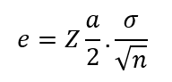

Em que a parcela que contém o sigma é o desvio padrão da nossa amostra.

Com isso, o nosso intervalo de confiança é composto simplesmente dos números que variam entre <b>± e</b>, ou seja:

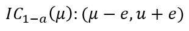

Se na linguagem matemática está muito confuso para você, calma que com um exemplo prático tudo vai ficar mais claro!

Vamos supor que pegamos outra amostra da quantidade de erros por pessoa da empresa fictícia citada anteriormente, considerando que a distribuição dos erros é normal podemos imaginar o seguinte exemplo:

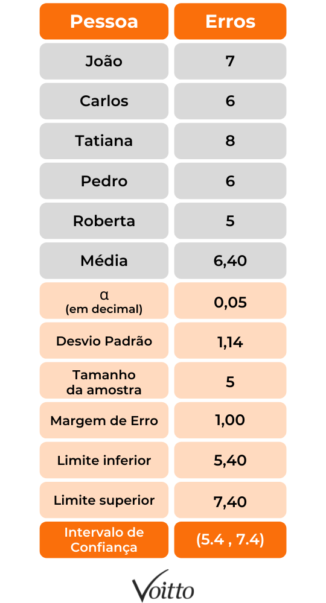

Com o novo estudo, descobrimos que temos 95% de chance de que o intervalo [5.4;7.4] contém a nossa média. Percebemos também que o intervalo de confiançaé sensível aos valores do parâmetro.

Para calcular a margem de erro de uma distribuição normal no Excel basta digitar:

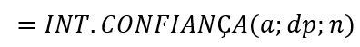

Em que “dp” é o desvio padrão amostral e “n” é o tamanho amostral.

<b>Qual a importância de se calcular o Intervalo de Confiança?</b>

Conseguimos com este método preparar ações concretas conforme o objetivo do indivíduo ou empresa com base em números mais assertivos devido à noção da margem de erro.

Afinal, com o cálculo do intervalo de confiança conseguimos decifrar a margem de incerteza em relação a um cálculo realizado, assim é possível estimar o tamanho real do resultado.

<b>O que difere o nível de confiança do intervalo de confiança?</b>

Com todos os conceitos bem entendidos, qual seria então a diferença entre o nível e o intervalo de confiança?

Matematicamente, o nível de confiança pode ser dado por:

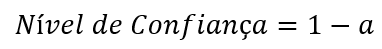

No nosso exemplo em que a=0,05,  o nível de confiança é de 1 - 0,05 = 0,95, ou seja, 95%.

Muitas vezes o intervalo e o nível de confiança são tratados como sinônimos, porém, como o nome explicita, enquanto o primeiro trata de um intervalo numérico, o outro trata de  um número (entre 0 e 1, que pode ser visto como uma probabilidade).

Diante disso, é possível utilizar diversos níveis distintos, dependendo da necessidade de cada situação, sendo os mais utilizados os níveis de confiança de 90%, de 95% e o de  99%.

Ou seja, o <b>nível de confiança</b> indica a <b>porcentagem</b> da confiança do <b>intervalo</b> possuir o parâmetro a ser estudado.

<h2 align="center">Testes de Hipóteses</h2>

Testes de hipóteses correspondem a procedimentos estatísticos que se baseiam na análise de uma amostra a partir da teoria de probabilidades e que buscam avaliar parâmetros desconhecidos de uma população. Assim, são formuladas duas hipóteses:

<ul>
  <li><b>Hipótese Nula</b> (H0): hipótese que representa a ausência do efeito que se deseja verificar;</li>
  <li><b>Hipótese Alternativa</b> (H1): hipótese que o investigador deseja verificar.</li>
</ul>

O teste <i>t</i> nada mais é que um teste de hipóteses que utiliza conceitos estatísticos para que se rejeite ou não uma hipótese nula. É normalmente utilizado quando a variância da população é desconhecida e a estatística do teste segue uma distribuição normal. Se o objetivo é testar se a média da amostra x̅ é estatisticamente diferente, menor ou maior que uma média especificada sob a hipótese nula, μ0, constrói-se o teste utilizando uma ou duas caudas da distribuição <i>t-Student</i>:

<ul>
  <li>Se a hipótese nula for x̅ =< μ0 e a hipótese alternativa  x̅ > μ0, então devemos usar o teste unicaudal;</li>
  <li>Se a hipótese nula for x̅ = μ0 e a hipótese alternativa != μ0, e devemos usar o teste bicaudal.</li>
</ul>

Assim, no teste bicaudal é preciso considerar as áreas abaixo da curva para valores superiores a <i>t</i> e inferiores a <i>-t</i>, ou seja, as duas caudas. Vale ressaltar que a vantagem de um teste unicaudal sobre um bicaudal é que este teste de uma cauda amplia a região de rejeição, tornando mais fácil rejeitar <i>H0</i> (mais robusto)

É importante salientar que, em testes de hipóteses, pretendemos aceitar ou rejeitar uma hipótese sobre a <b>média</b> da distribuição. Assim, devemos utilizar o desvio padrão amostral da média, s/√n. A fórmula do teste <i>t</i> é:

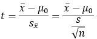

Em que x̅ é a média da amostra, μ0 é a média sob a hipótese nula, <i>s</i> o desvio padrão amostral, <i>n</i> é o tamanho da amostra e s/√n é o desvio padrão amostral da média.

Rejeita-se a hipótese nula caso a média amostral for estatisticamente diferente da média da hipótese nula, dado uma confiança desejada. Assim, caso o <i>t</i> calculado seja maior do que o valor <i>t</i> de referência (na tabela) da distribuição, rejeita-se a hipótese nula.

Pode-se dizer que o <i>t</i> calculado é a diferença, em desvios padrão, entre a média amostral e a média sob a hipótese nula. Quanto maior for o <i>t</i>, mais confiante estamos em rejeitar a hipótese nula.

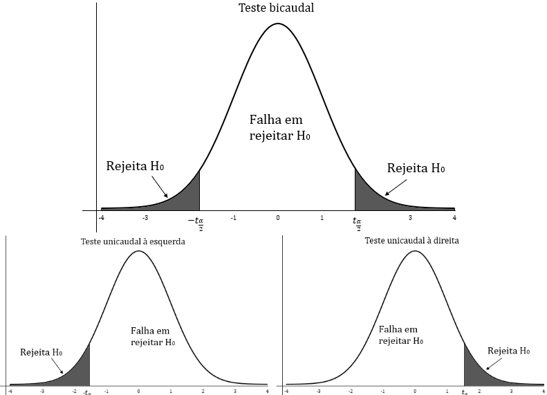

Se o teste for bicaudal e a amostra for suficientemente grande, o valor crítico de <em>t</em> para 5% de significância (ou 95% de confiança) será <i><em>t</em><em>α</em>/2 = 1,96</i> à direita e – <i><em>t</em><em>α</em>/2 = 1,96</i> à esquerda, enquanto que se o teste for unicaudal, o valor crítico para 5% será <i><em>t</em><em>α</em>= 1,65</i> à direita ou – <i><em>t</em><em>α</em>= 1,65</i> à esquerda

<b>Premissas do Teste de Hipóteses:</b>

<ul>
  <li>A amostra é aleatória (randômica): isso atesta que sujeitos, casos ou eventos de uma determinada população têm a mesma chance de serem selecionados para a pesquisa ou amostra;</li>
  <li>Variáveis independentes (independência local): dois eventos não têm nada a ver um com o outro, assim a escolha de um não afeta a escolha do outro;</li>
  <li>A distribuição do que está sendo testado é normal: formato de sino, unimodal e simétrica em relação a sua média.</li>
</ul>

<b>Erros do Tipo I e Tipo II</b>

Um erro do tipo I consiste em rejeitar uma hipótese nula que é verdadeira, ou seja, encontrar um resultado que tenha significância estatística por acidente. Já um erro do tipo II representa uma falha na rejeição de uma hipótese nula inválida. A taxa de erro tipo I é afetada por α: quanto menor for o nível α, menor será a taxa de erro tipo I. Vale ressaltar que α não é a probabilidade de um erro de tipo I; α é a probabilidade de um erro de Tipo I contanto que a hipótese nula seja verdadeira. Caso a hipótese nula seja falsa, então é impossível fazer um erro de tipo I.

O erro tipo II é o de não rejeitar uma falsa hipótese nula. Diferentemente de um erro de tipo I, um erro de tipo II não é realmente um erro. Quando um teste estatístico não é significativo, isso significa que os dados não fornecem uma forte evidência de que a hipótese nula seja falsa.

A falta de significância não sustenta a conclusão de que a hipótese nula seja verdadeira. Portanto, um pesquisador não deve cometer o erro de concluir incorretamente que a hipótese nula é verdadeira quando um teste estatístico não era significativo. Em vez disso, o pesquisador deve considerar o teste como inconclusivo. Contraste isso com um erro de tipo I no qual o pesquisador conclui erroneamente que a hipótese nula é falsa quando, de fato, é verdadeira. Um erro de tipo II só pode ocorrer se a hipótese nula for falsa. Se a hipótese nula for falsa, a probabilidade de um erro de tipo II é denominada β. A probabilidade de se rejeitar corretamente uma hipótese nula falsa é igual a 1-β.

O quadro abaixo elenca os possíveis cenários:

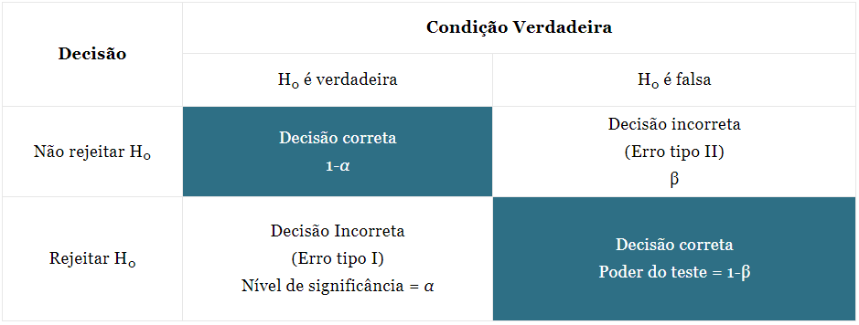

Lembrando que: β é o símbolo da probabilidade de um erro do tipo II, assim o poder de um teste estatístico é definido como 1-β. Se realizarmos um teste com alta sensitividade, teremos menos erros do tipo II; porém, se diminui a probabilidade do erro tipo II, aumenta a suscetibilidade do tipo I.

Assim, um nível de significância <em>α</em> de 0,05 (que usualmente é considerado como o patamar para avaliar a hipótese nula) indica que existe uma probabilidade de 5% de rejeitarmos uma hipótese nula quando ela é verdadeira.

<b>Valor-p</b>

O <b>Valor-p</b> é a probabilidade de se obter uma estatística do teste (por exemplo, média) que seja igual ou mais extrema que a estatística encontrada na amostra observada, sob a suposição que a hipótese nula é verdadeira. Graficamente, representa a área embaixo da curva após o t calculado.

Se o <b>Valor-p</b> é menor que o nível de significância <em>α</em>, rejeita-se a hipótese nula.

Se o <b>Valor-p</b> é maior que o nível de significância <em>α</em>, não podemos rejeitar a hipótese nula.

<b>Análise de Variância (ANOVA)</b>

Trata-se de um teste estatístico que se propõe a verificar se existe uma diferença significativa entre as médias, ou seja:

<pre>H0: <em>μ1 = μ1 = … = μk</em>;</pre>
<pre>H1: As médias não são iguais.</pre>

No caso, existem dois grupos para se calcular a variância: entre grupos (Média quadrada dos grupos – MQG) e dentro dos grupos (Média quadrada dos erros – MQR). A MQG mede a variância das médias, enquanto a MQR mede a variância que existe dentro dos grupos individuais de dados. Dessa forma, são calculados esses dois componentes de variância; caso MQG seja maior que MQR, temos o indicativo de uma diferença significativa entre os grupos.

A ANOVA pode resolver dois problemas: a níveis fixos ou a níveis aleatórios (isso é determinado pela aleatoriedade e, na maioria dos casos, trata-se de níveis fixos).

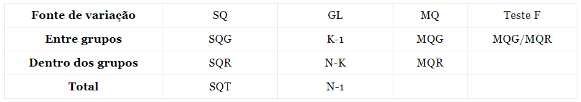
<pre>SQT = SQG + SQR (mensura a variação de todas as observações)</pre>
<pre>SQT: Soma dos quadrados totais</pre>
<pre>SQG: Soma dos quadrados dos grupos</pre>
<pre>SQR: Soma dos quadrados dos erros</pre>
<pre>MQG: Média quadrada dos grupos</pre>
<pre>MQR: Média quadrada dos erros</pre>
<pre>SQG e MQG: Medem a variação total das médias</pre>
<pre>SQR e MQR: Medem a variação das observações de cada grupo</pre>

Dessa forma, temos:

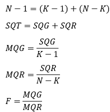

Assim, a hipótese nula será rejeitada quando o <i>F</i> calculado for maior que o valor tabelado, que acontece se a razão entre MQG e MQR seja estatisticamente significante. Por exemplo, se o <em>F</em> tabelado para um intervalo de confiança de 95% for menor que o <em>F</em> calculado, conclui-se que pelo menos uma das médias <em>μ</em> é diferente das outras, e a H0 é rejeitada com <em>α</em> = 0,05.

<b>Simulação de Monte Carlo</b>

A principal ideia por trás da simulação de Monte Carlo é que os resultados são calculados com base em uma amostragem aleatória repetidas vezes, isto é, esse método é uma experimentação aleatória. As simulações de Monte Carlo são caracterizadas por uma grande quantidade de parâmetros desconhecidos e, além disso, alguns poderiam ser difíceis de se obter experimentalmente. Os métodos de simulação de Monte Carlo nem sempre requerem números verdadeiramente aleatórios para serem úteis. Algumas das técnicas mais úteis utilizam sequências deterministas que facilitam a prova e a conferência das simulações com posteriores contraprovas.

Uma simulação do tipo Monte Carlo de qualidade deveria ser capaz de gerar números pseudoaleatórios. Esses valores precisam passar em testes de aleatoriedade, que são comumente disponíveis em diversos <i>softwares</i> de estatística. É preciso utilizar um número de amostras suficientemente grande para que se garanta resultados precisos. Além disso, é necessário que sejam utilizadas técnicas de amostragem adequadas, de modo que o algoritmo usado consiga modelar e simular o fenômeno em estudo.

As simulações de Monte Carlo têm sido utilizadas em diversas áreas da ciência, desde a teoria dos jogos até a biologia computacional. Mas é talvez em finanças que esse método tenha uma de suas maiores aplicações. Ele é comumente usado para avaliar o risco e a incerteza que afetariam o resultado de diferentes opções de mercado, dúvidas sobre investimentos etc. É possível, por exemplo, simplesmente por meio da instalação de uma extensão no Microsoft Excel, realizar simulações de Monte Carlo e, desse modo, permitir que o analista de risco empresarial incorpore os efeitos totais de incerteza, como variáveis incertas do tipo volume de vendas, commodities e preços do trabalho, juros e taxas de câmbio – para o trimestre ou ano seguinte. Simular vários cenários e ver qual seria a situação no futuro para cada um dos cenários fictícios, estipulando, assim, status como “otimista”, “neutro” ou “pessimista”. Além disso, o método é frequentemente usado para avaliar investimentos em projetos em uma unidade de negócios ou a nível corporativo. Sua utilização também é comum para avaliar derivativos financeiros. Uma das utilizações mais comuns do método de Monte Carlo é calcular o preço das opções incorporando análises de risco para diferentes cenários.

A limitação mais importante é o tempo necessário para calcular o grande número de histórias necessárias a fim de reduzir as incertezas estatísticas. Observa-se ainda a necessidade de grande capacidade computacional.

<h2 align="center">Referências</h2>

https://pt.economy-pedia.com/11039359-chebyshev-inequality

https://pt.economy-pedia.com/11038376-law-of-the-big-numbers

https://blog.proffernandamaciel.com.br/teorema_central_limite/

https://www.voitto.com.br/blog/artigo/o-que-e-intervalo-de-confianca

https://proeducacional.com/ead/curso-preparatorio-cfg-modulo-i/capitulos/metodos-quantitativos/aulas/teste-de-hipoteses/

