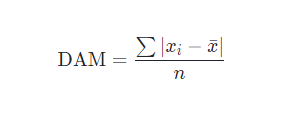
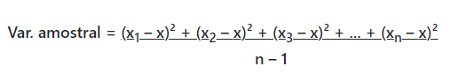
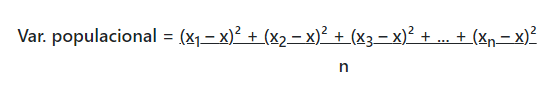
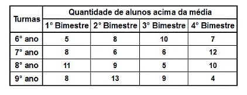
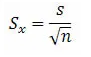

<h1>Medidas de Dispersão: Amplitude, Desvio Absoluto Médio, Variância, Desvio-padrão, Erro-padrão.</h1>
<h2>O que são as medidas de dispersão?</h2>

As medidas de dispersão são aquelas utilizadas para medir um grau de variação. Esse resultado tem como base os elementos que estão presentes em um conjunto numérico. Assim, é possível encontrar o ponto em comum entre elas, levando em consideração a sua média.

O assunto que leva essas medidas em consideração é a estatística. Ela utiliza a tendência central e as tão conhecidas média, moda e mediana. Isso porque há um desejo de representar todos os valores dentro de um mesmo conjunto numérico. Para que isso seja possível, há a utilização de um único valor inteiro.

Ainda assim, quando tratamos de medidas de dispersão, apenas a média não será suficiente. É necessário encontrar outros valores para definir o resultado. Isso porque a média é apenas um desejo a ser alcançado, uma espécie de “meta”. Quando utilizamos a dispersão, é possível avaliar o progresso de forma mais ampla.

De uma maneira geral, <b>o cálculo dessas medidas nos leva a um resultado mais assertivo.</b> Enquanto algumas contas podem servir como apoio, a dispersão nos traz algo mais assertivo. Sendo assim, quando quiser saber um resultado exato, o ideal é recorrer a esse cálculo.

<h2>Quais são as medidas de dispersão?</h2>

As medidas de dispersão são divididas para garantir uma melhor colocação dos cálculos. Além disso, cada uma delas possui uma função diferente, visando chegar a um resultado desejado. Por isso, antes mesmo de começar a calcular, é preciso ficar atento a qual das fórmulas vai se enquadrar na situação.

<h1>Amplitude</h1>

A amplitude será aplicada em casos em que <b>há a necessidade de fazer uma comparação primária.</b> Isso quer dizer que seu cálculo é menos complexo. De uma forma mais geral, dá para enxergá-la como a diferença entre o índice maior e o menor. Para que a amplitude seja encontrada, é só subtrair o menor valor do mais alto.

<h2>Como calcular a amplitude? Exemplo prático!</h2>

Para compreender melhor quais são as medidas de dispersão, é importante focar em um exemplo. Levando em consideração alguns estudantes de Ensino Fundamental e suas notas, precisamos calcular sua amplitude. A média final da escola é 7 e, portanto, precisa ser atingida.

Márcia tirou as seguintes notas: 9,0 – 7,0 – 8,0 – 6,0

Eduardo tirou as seguintes notas: 5,0 – 5,0 – 9,0 – 10,0

Com relação à nota de Márcia, a amplitude foi de 9,0 (maior nota) – 6 (menor nota) = 2. Sendo assim, a amplitude de Eduardo foi de 10 (maior nota) – 5 (menor nota) = 6. No entanto, levando em consideração esse índice, não é possível dizer quem teve o melhor desempenho.

<h1>Desvio Absoluto Médio (DAM)</h1>

O Desvio Absoluto Médio (DAM) de um conjunto de dados é a média das distâncias entre cada dado e a média. Ele nos dá uma noção da variabilidade em um conjunto de dados.

O desvio absoluto médio é calculado assim:

<b>Etapa 1:</b> calcule a média.

<b>Etapa 2:</b> calcule a distância entre cada dado e a média usando distâncias positivas. Isso é o que chamamos de desvios absolutos.

<b>Etapa 3:</b> some todos esses desvios.

<b>Etapa 4:</b> divida a soma pelo número de dados.

Seguir estas etapas no exemplo abaixo é provavelmente a melhor maneira de aprender sobre desvio absoluto médio, mas existe uma maneira mais formal de escrever estas etapas em uma fórmula:.

<h2>Exemplo</h2>

Érica adora postar as fotos de seu gato na internet. Cada uma de suas 6 últimas fotos receberam o seguinte número de "curtidas":

10, 15, 15, 17, 18, 21

<h3><b>Calcule o desvio médio absoluto.</b></h3>

<b>Etapa 1:</b> calcule a média.

A soma de todos os dados totaliza 96 "curtidas" e há 6 fotos.

média = 96/6 = 16

A média é 16.

<b>Etapa 2:</b> calcule a distância entre cada dado e a média.

| Dado | Distância da Média |
| --- | --- |
| 10 | \| 10 - 16 \| = 6 |
| 15 | \| 15 - 16 \| = 1 |
| 15 | \| 15 - 16 \| = 1 |
| 17 | \| 17 - 16 \| = 1 |
| 18 | \| 18 - 16 \| = 2 |
| 21 | \| 21 - 16 \| = 5 |

<b>Etapa 3:</b> some todas as distâncias.

6 + 1 + 1 + 1 + 2 + 5 = 16

<b>Etapa 4:</b> divida a soma pelo número de dados.

DAM = 16/6 ≈ 2,67 "Curtidas"

Na média, cada foto ficou em torno de 3 "curtidas" distante da média.

<h2>Variância</h2>

Dado um conjunto de dados, a variância é uma medida de dispersão que mostra o quão distante cada valor desse conjunto está do valor central (médio).

Quanto menor é a variância, mais próximos os valores estão da média; mas quanto maior ela é, mais os valores estão distantes da média.

Considere que <b>x1, x2, …, xn</b> são os <b>n</b> elementos de uma <b>amostra</b> e que <b>x</b> é a média aritmética desses elementos. O cálculo da <b>variância amostral</b> é dado por:

Se, em contrapartida, quisermos calcular a <b>variância populacional</b>, consideraremos todos os elementos da população, e não apenas de uma amostra. Nesse caso, o cálculo possui uma pequena diferença. Observe:

<h2>Desvio-Padrão</h2>

O desvio padrão é capaz de identificar o “erro” em um conjunto de dados, caso quiséssemos substituir um dos valores coletados pela média aritmética.

O desvio padrão aparece junto à média aritmética, informando o quão “confiável” é esse valor. Ele é apresentado da seguinte forma:

<h3><b>média aritmética (x) ± desvio padrão (dp)</b></h3>

O cálculo do desvio padrão é feito a partir da raiz quadrada positiva da variância. Portanto:

<h3><b>dp = √var</b></h3>

Vamos agora aplicar o calculo da variância e do desvio padrão em um exemplo:

Em uma escola, a direção decidiu observar a quantidade de alunos que apresentam todas as notas acima da média em todas as disciplinas. Para analisar melhor, a diretora Ana resolveu montar uma tabela com a quantidade de notas “azuis” em uma amostra de quatro turmas ao longo de um ano. Observe a seguir a tabela organizada pela diretora:

Antes de calcular a variância, é necessário verificar a <b>média aritmética (x)</b> da quantidade de alunos acima da média em cada turma:

6° ano → x = (5 + 8 + 10 + 7)/4 = 30/4 = 7,50

7° ano → x = (8 + 6 + 6 + 12)/4 = 32/4 = 8,00

8° ano → x = (11 + 9 + 5 + 10)/4 = 35/4 = 8,75

9° ano → x = (8 + 13 + 9 + 4)/4 = 34/4 = 8,50

Para calcular a variância da quantidade de alunos acima da média em cada turma, utilizamos uma <b>amostra</b>, por isso empregamos a fórmula da <b>variância amostral:</b>

<h3>6° ano</h3>

6° ano → Var = ((5 – 7,50)² + (8 – 7,50)² + (10 – 7,50)² + (7 – 7,50)²)/4-1

6° ano → Var = ((– 2,50)² + (0,50)² + (2,50)² + (– 0,50)²)/3

6° ano → Var = (6,25 + 0,25 + 6,25 + 0,25)/3

6° ano → Var = 13/3

6° ano → Var = 4,33

<h3>7° ano</h3>

7° ano → Var = ((8 – 8,00)² + (6 – 8,00)² + (6 – 8,00)² + (12 – 8,00)²)/4 – 1

7° ano → Var = ((0)² + (-2,00)² + (-2,00)² + (4,00)²)/3

7° ano → Var = (0 + 4,00 + 4,00 + 16,00)/3

7° ano → Var = 24/3

7° ano → Var = 8,00

<h3>8° ano</h3>

8° ano → Var = ((11 – 8,75)² + (9 – 8,75)² + (5 – 8,75)² + (10 – 8,75)²)/4-1

8° ano → Var = ((2,25)² + (0,25)² + (- 3,75)² + (1,25)²)/3

8° ano → Var = (5,06 + 0,06 + 14,06 + 1,56)/3

8° ano → Var = (20,74)/3

8° ano → Var = 6,91

<h3>9° ano</h3>

9° ano → Var = ((8 – 8,50)² + (13 – 8,50)² + (9 – 8,50)² + (4 – 8,50)²)/4-1

9° ano → Var = ((– 0,50)² + (4,50)² + (0,50)² + (– 4,50)²)/3

9° ano → Var = (0,25 + 20,25 + 0,25 + 20,25)/3

9° ano → Var = 41,00/3

9° ano → Var = 13,66

<h4>Conhecida a variância de cada turma, vamos calcular agora o desvio padrão:</h4>
<h3>6° ano</h3>

dp = √var

dp = √4,33

dp ≈ 2,08

<h3>7° ano</h3>

dp = √var

dp = √8,00

dp ≈ 2,83

<h3>8° ano</h3>

dp = √var

dp = √2,63

dp ≈ 2,63

<h3>9° ano</h3>

dp = √var

dp = √4,70

dp ≈ 3,70

Para concluir sua análise, a diretora pode apresentar os seguintes valores que indicam a quantidade média de alunos acima da média por turma pesquisada:

<b>6° ano: 7,50 ± 2,08 alunos acima da média por bimestre;</b>

<b>7° ano: 8,00 ± 2,83 alunos acima da média por bimestre;</b>

<b>8° ano: 8,75 ± 2,63 alunos acima da média por bimestre;</b>

<b>9° ano: 8,50 ± 3,70 alunos acima da média por bimestre;</b>

<h1>Erro-Padrão</h1>

Ao se obter uma amostra qualquer de tamanho n, calcula-se a média aritmética amostral. Provavelmente, se uma nova amostra aleatória for realizada, a média aritmética obtida será diferente daquela da primeira amostra. A variabilidade das médias é estimada pelo seu erro padrão. Assim, o erro padrão avalia a precisão do cálculo da média populacional. O erro padrão é dado pela fórmula:

Onde, 

Sx → é o erro padrão

s → é o desvio padrão

n → é o tamanho da amostra

Observação: quanto melhor a precisão no cálculo da média populacional, menor será o erro padrão.

<b>Exemplo 1.</b> Numa população obteve-se desvio padrão de 2,64 com uma amostra aleatória de 60 elementos. Qual o provável erro padrão?

Solução: 

Sx = 2,64/√60 = 0,3408

Isso indica que a média pode variar 0,3408 para mais ou para menos.

<b>Exemplo 2.</b> Numa população obteve-se desvio padrão de 1,32 com uma amostra aleatória de 121 elementos. Sabendo que para essa mesma amostra obteve-se uma média de 6,25, determine o valor mais provável para a média dos dados.

Solução: Para determinarmos o valor mais provável da média dos dados devemos calcular o erro padrão da estimativa. Assim, teremos:

Sx = 1,32/√121 = 0,12

Finalizando, o valor mais provável para a média dos dados obtidos pode ser representado por:

x̅ =  6,25 ± 0,12

<h3>Referências:</h3>

https://blog.betrybe.com/medidas-de-dispersao/#:~:text=medidas%20de%20dispers%C3%A3o!-,O%20que%20s%C3%A3o%20as%20medidas%20de%20dispers%C3%A3o%3F,em%20considera%C3%A7%C3%A3o%20a%20sua%20m%C3%A9dia.

https://pt.khanacademy.org/math/statistics-probability/summarizing-quantitative-data/other-measures-of-spread/a/mean-absolute-deviation-mad-review

https://brasilescola.uol.com.br/matematica/medidas-dispersao-variancia-desvio-padrao.htm

https://brasilescola.uol.com.br/matematica/erro-padrao-estimativa.htm

