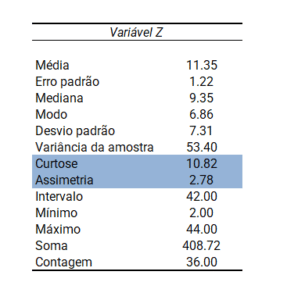
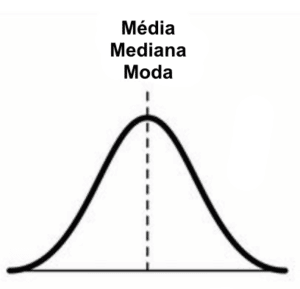
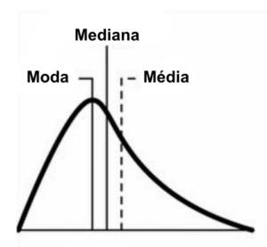
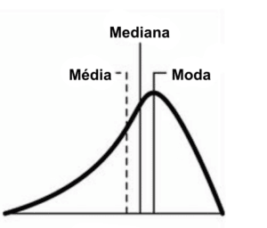
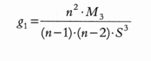
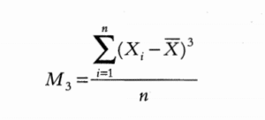
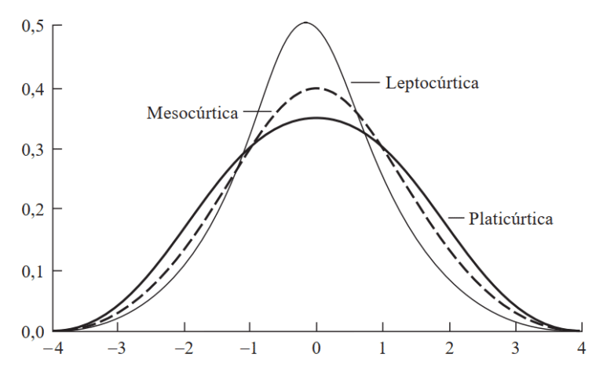
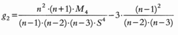
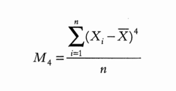

<h1>3. Medidas de Assimetria(Skewness) e Curtose(Kurtosis)</h1>

Quer saber <b>como interpretar a assimetria e curtose dos dados?</b> Fique neste texto até o final para você entender o que são essas medidas de forma e como interpretá-las.

As <b>medidas de centro e dispersão</b> são as mais utilizadas para explorar os dados inicialmente. Porém, você já deve ter percebido que nas tabelas descritivas há outras duas informações: <b>assimetria e curtose.</b>

Ambas são chamadas <b>medidas de forma</b> porque descrevem a <b>forma da curva de distribuição</b> a partir de como os dados estão distribuídos. Vamos entender melhor como interpretar cada conceito.

<h2>O que é Assimetria(Skewness)?</h2>

A assimetria (Skewness em inglês) é a falta de simetria observada quando os dados estão concentrados em um dos lados da distribuição. Podemos afirmar que a assimetria é uma medida do grau de simetria em torno da média dos dados. Podemos interpretar essa medida visualmente e numericamente. Há basicamente três classificações em relação à assimetria:

<h3>a) Distribuição simétrica:</h3>

Encontramos uma perfeita simetria na distribuição normal, em que os dados estão concentrados em um ponto central e quanto mais distante da média, menor é a frequência dos dados. Ao traçarmos uma linha no meio da curva teremos dois lados espelhados. Se você tiver acesso às demais medidas descritivas, irá verificar que a média, a mediana e a moda também são iguais.

<h3>b) Distribuição assimétrica à direita/positiva:</h3>

Percebemos que o pico da distribuição está do lado esquerdo e os dados se espalham em direção ao lado positivo da escala, criando uma cauda que se estende para a direita. A moda é a menor medida descritiva (sempre a encontramos no ponto mais alto da curva), em seguida temos a mediana e a média, que é maior por ser sensível aos valores extremos positivos. Nessa situação os dados estão concentrados abaixo da média.

<h3>c) Distribuição assimétrica à esquerda/negativa:</h3>

Os dados se encontram concentrados do lado direito e se espalham em direção ao lado negativo da escala, criando assim uma cauda esquerda mais alongada. Nesse caso, a média é o menor valor por ser afetada pelos valores extremos negativos, em seguida temos a mediana e a moda representando o maior valor (na parte mais alta da distribuição). Percebemos que os dados estão concentrados acima da média.

<h2>Interpretação Numérica</h2>

Uma das formas adotadas para o cálculo da assimetria é através do coeficiente de assimetria de Fisher. O coeficiente vem a partir do <b>terceiro momento</b> de ordem superior em torno da média através de uma <b>função geradora de momentos</b>. Momentos são medidas resumo de uma distribuição, sendo 1º momento = média (valor esperado), 2º momento = variância, 3º momento = assimetria e 4º momento = curtose.

O coeficiente de Assimetria de Fisher pode ser escrito como:

Sendo que o terceiro momento é:

A interpretação, será:

<b>g1 = 0, a distribuição é simétrica;</b>

<b>g1 > 0, a distribuição é assimétrica positiva (à direita);</b>

<b>g1 < 0, a distribuição é assimétrica negativa (à esquerda).</b>

É desejável que a assimetria dos nossos dados esteja próxima da normal, isto é, no intervalo [-1, +1].

Na tabela inicial desse post temos a <b>assimetria de 2,78</b> para uma variável hipotética “Z”  apresentada no Excel (que utiliza o coeficiente de Fisher para encontrar a assimetria). Podemos fazer a seguinte interpretação: o sinal positivo significa que a distribuição é assimétrica à direita e como 2,78 é maior que o intervalo de referência, os dados apresentam alto grau de assimetria.

Para encontrar a assimetria no Excel, se usa a função <b>DISTORÇÃO</b> ou através do <b>suplemento Análise de Dados</b>.
<h2>O que é Curtose(Kurtosis)?</h2>

A curtose (kurtosis em inglês) representa o grau de achatamento da distribuição, isto é, quão espalhados os dados estão em torno da média. Novamente, usamos a curva normal padrão como referência e podemos interpretar a curtose por meio de gráficos ou numericamente. Pode ser classficada em três tipos:

a) <b>Mesocúrtica</b>: que é própria curva normal padrão 

b) <b>Platicúrtica</b>: possui grau de achatamento maior que da curva normal padrão, o que nos indica que os dados estão mais espalhados (logo, o desvio padrão também é maior).

c) <b>Leptocúrtica</b>: seu grau de achatamento é menor que o da curva normal padrão (curva mais pontiaguda), indica que os dados estão mais concentrados (desvio padrão menor).

<h2>Interpretação Numérica</h2>

A curtose pode ser calculada pelo coeficiente de Curtose de Fisher, que neste caso utiliza o quarto momento de ordem superior ao redor da média:

Em que o quarto momento é dado por:

Assim, se:

<b>g2 = 0, a curva é normal padrão, isto é, mesocúrtica</b>

<b>g2 > 0, grau de achatamento baixo, a curva é leptocúrtica</b>

<b>g2 < 0, grau de achatamento alto, a curva é platicúrtica</b>

Em alguns programas estatísticos, como o STATA, é comum encontrar a curtose da distribuição normal como K = 3. Neste caso, a interpretação é a mesma. Isto é:

<b>K = 3, curva normal padrão</b>

<b>K > 3, curva leptocúrtica</b>

<b>k < 3, curva platicúrtica</b>

Como interpretar na prática? Para a variável hipotética “Z” da tabela inicial, o Excel encontrou uma curtose de 10,82, o que nos indica que a curva é leptocúrtica, isto é, é menos achatada que a curva normal – o pico da distribuição é mais acentuado – então sabemos que os dados estão mais concentrados.

No Excel, a curtose pode ser encontrada por meio da função CURT e pelo suplemento Análise de Dados mencionado anteriormente.

<h3>Refêrencias:</h3>

https://blog.proffernandamaciel.com.br/assimetria-e-curtose-dos-dados/#:~:text=As%20medidas%20de%20centro%20e,duas%20informa%C3%A7%C3%B5es%3A%20assimetria%20e%20curtose.

