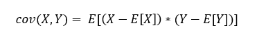

<h1>4. Medidas de Associação entre Variáveis Quantitativas: Diagrama de Dispersão, Covariância, Correlação.</h1>
<h2>Diagrama de Dispersão</h2>

Um diagrama de dispersão é um tipo de exibição de dados que mostra a relação entre duas variáveis numéricas. Cada item do conjunto de dados é plotado como um ponto cujas coordenadas(x,y) estão relacionadas com seus valores para as duas variáveis.

Por exemplo, esse é um diagrama de dispersão que mostra a numeração dos sapatos e as pontuações em um teste dos alunos de uma sala de aula:

Cada ponto representa um aluno, cuja coordenada (x)(→) revela a numeração do sapato, e a coordenada (y)(↑) revela sua pontuação no teste.

<h2>Covariância</h2>

Em geral observa-se que, quando os juros sobem, os preços das ações caem. Esse comportamento sugere que há uma covariância negativa entre as variáveis <b>taxa de juros</b> e <b>preços de ações</b>

A covariância é uma medida de variação entre duas variáveis aleatórias. No caso em que os valores maiores de uma variável correspondem principalmente aos valores maiores da outra variável (e se o mesmo ocorrer com os valores menores), as variáveis tendem a mostrar comportamento semelhante. Isso significa que a covariância será positiva. Entretanto, se os valores maiores de uma variável correspondem principalmente aos valores menores da outra amostra, as variáveis tendem a mostrar comportamento oposto, e a covariância será negativa.

O sinal de covariância mostrará a tendência na relação linear entre as variáveis. Se o sinal for negativo, significa que as variáveis têm relação oposta,<em> i.e.</em> enquanto uma aumenta, a outra diminui. Já se o sinal for positivo, significa que a relação também é positiva,<em> i.e.</em> enquanto uma aumenta, a outra também aumenta. Vale ressaltar que isso não significa que aumentam e diminuem na mesma magnitude, pois a magnitude da covariância é de difícil interpretação, posto que ela não é normalizada, dependendo das magnitudes das variáveis.

Na versão normalizada da covariância, no entanto, o coeficiente de correlação mostra, através de sua magnitude, a força da relação linear. Resumindo:

Em que <i>E</i> representa o operador valor esperado e <i>X, Y</i> representam as amostras em estudo.

Assim, as covariâncias populacional e amostral podem ser descritas como:

<h3>Saiba Mais</h3>

O símbolo que utilizamos acima, E[ ], é o valor esperado, uma propriedade útil de qualquer variável aleatória. Geralmente notado como E(X), o valor esperado pode ser calculado pela somatória dos valores distintos que a variável aleatória pode assumir. O símbolo E(X) é lido como valor esperado de X.

Por exemplo, uma amostra do conjunto <i>A = 2, 1, 2, 5</i> e do conjunto <i>B = 8, 10, 12, 14</i> possuem covariância de 3,333, pois, aplicando a equação que vimos acima, teremos:

Quando a covariância é positiva, duas variáveis tendem a variar na mesma direção; isto é, se uma sobe, a outra tende a subir e vice-versa. Quando a covariância é negativa, duas variáveis tendem a variar em direções opostas; isto é, se uma sobe a outra tende a cair e vice-versa. Quanto mais próxima de zero for a covariância, menor a possibilidade de se identificar um comportamento interdependente entre as variáveis.

Nas finanças, por exemplo, o CDI e a rentabilidade de um fundo em DI possuem covariância positiva. Isso significa que caminham na mesma direção. Diferentemente da taxa de juros e do mercado acionário, que possuem covariância negativa, ou seja, em que o aumento dos juros diminui os investimentos do mercado acionário.

<h2>Correlação</h2>

A covariância busca mostrar se há um comportamento de interdependência linear entre duas variáveis, mas é uma medida dimensional, sendo afetada pelas unidades de medida das séries X e Y. Para corrigir esse problema, chegou-se à medida de correlação, uma normalização da covariância representado por um número adimensional que varia entre -1 e 1.

A correlação (ou coeficiente de correlação linear de Pearson) populacional e amostral é dada pelas fórmulas:

Ou seja, a correlação é a covariância de X e Y (σXY ou sXY) dividida pela multiplicação dos desvios padrão de X e Y (σX*σY ou sX*sY). Na parte direita da equação, os termos <em>n </em>ou <em>n-1</em> se cancelam.

A grande propriedade possuída pelo coeficiente de correlação é que ele varia entre -1 e 1, revelando a magnitude da relação entre os comportamentos de duas variáveis, sem ser afetado pelo problema dimensional presente na covariância, que é incapaz de indicar a força da correlação. A interpretação do coeficiente se dá da seguinte forma:

<ul>
  <li>Se ele assumir o valor -1, significa que as variáveis possuem correlação negativa perfeita. Isto é, quando X aumenta em uma unidade, Y recua na mesma magnitude;</li>
  <li>Quando a correlação é igual a zero, as variáveis não são linearmente correlacionadas. Ou seja, uma variação em X não está associada a uma variação em Y de forma linear;</li>
  <li>Por outro lado, quando a correlação é de 1, significa que as variáveis possuem correlação perfeita. A variação de X em uma unidade causa uma variação idêntica em Y e no mesmo sentido.</li>
</ul>

<em>r</em> = 1: relação linear perfeita e positiva

<em>r</em> = 0: inexistência linear

<em>r</em> = -1: relação linear perfeita e negativa

<em>r</em> > 0: relação linear positiva

<em>r</em> < 0: relação linear negativa

A correlação ainda possui uma propriedade adicional: se X e Y forem multiplicados ou divididos pelo mesmo valor, ela não se altera.

<b>Correlação Forte e Positiva.</b>

<b>Correlação Fraca e Positiva.</b>

<b>Correlação Não Linear.</b>

<b>Correlação Fraca e Negativa.</b>

<b>Correlação Forte e Negativa.</b>

<b>Exemplo:</b>

Determinado investidor deseja saber se há uma correlação entre a taxa de câmbio (X) e o retorno do ativo Y. Para isso, pegou uma amostra da evolução da taxa de câmbio e do retorno do ativo no decorrer de três períodos.

<b>Evolução da taxa de câmbio.</b>

Qual o coeficiente de correlação das duas variáveis?

<b>Resolução:</b>

Média de X e Y:

Covariância de X e Y:

Variância de X e Y:

Desvio Padrão de X e Y:

Correlação:

Assim, há uma correlação de 0,826 entre a taxa de câmbio e o retorno do ativo Y.

<h2>Coeficiente de Determinação</h2>

Outra medida importante de associação entre duas variáveis é o coeficiente de determinação, ou R². Definindo uma equação, ou modelo matemático, que relaciona duas variáveis, o R² seria a medida que nos informa o quão capaz esse modelo é de explicar o comportamento de uma variável em relação à outra. Ou seja, se trata de uma medida de ajuste que varia de zero a 1, indicando, em porcentagem, o quanto um modelo matemático consegue explicar os valores observados. Assim, quanto maior o <i>R²</i>, mais explicativo é o modelo e melhor ele se ajusta à amostra. O coeficiente de terminação de um modelo de regressão linear é literalmente o coeficiente <em>r</em>, ou coeficiente de correlação linear de Pearson, visto nessa aula, elevado ao quadrado.

O <i>R²</i> possui uma capacidade de encontrar a probabilidade de eventos futuros dentro dos resultados previstos. Assim, caso mais amostras sejam adicionadas, o coeficiente mostrará a probabilidade de um novo ponto cair na linha estimada pela regressão. No entanto, é importante ressaltar que, mesmo quando há uma forte conexão entre as duas variáveis, a determinação não provará causalidade. Por exemplo, um estudo sobre aniversários que mostra que um grande número de aniversários acontece dentro de um período em determinado mês não significa que a passagem do tempo ou a mudança das estações do ano influencie na ocorrência de gravidez.

<h3>Referências:</h3>

https://pt.khanacademy.org/math/statistics-probability/describing-relationships-quantitative-data/introduction-to-scatterplots/a/scatterplots-and-correlation-review

https://proeducacional.com/ead/curso-preparatorio-cfg-modulo-i/capitulos/metodos-quantitativos/aulas/covariancia-e-correlacao/

