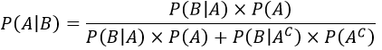

<h1>5. Probabilidade: Experimento Aleatório, Espaço Amostral, Eventos, Operações com Eventos, Eventos Mutuamento Excludentes, Eventos Independentes, Probabilidade Condicional e Teorema de Bayes</h1>
<h2 align="center">Experimento Aleatório</h2>

Considere a seguinte situação: lança-se um dado (comum, não-viciado) e anota-se o número da face de cima. 

É evidente que os valores de cada lançamento, isto é, o número da face superior podem ser 1, 2, 3, 4, 5 ou 6. Ou seja, há diferentes resultados, apesar de o experimento (lançar um dado e anotar o número da face de cima) ser o mesmo.

Do mesmo modo, podemos ilustrar outra situação: de um baralho, retira-se uma carta e toma-se seu valor e seu naipe. 

Podemos aqui verificar uma quantidade muito grande de resultados distintos entre si. Por exemplo, há a possibilidade de se obter um ás de copas; ou, ainda, um rei de ouros; e, também, podemos retirar do baralho um 5 de paus.

Mais uma vez: o experimento, que é retirar uma carta de um baralho e anotar seu valor e seu naipe, é o mesmo, mas produz resultados diferentes.

Definimos, assim, um <b>experimento aleatório</b> como sendo aquele que <b>produz resultados diferentes (e independentes entre si), nas mesmas circunstâncias.</b>

Os dois exemplos acima: lançamento de um dado com anotação do número da face de cima e retirada de uma carta de um baralho com verificação do seu valor e seu naipe são ilustrações típicas de experimentos aleatórios.

Um outro exemplo que podemos considerar seria o sexo de um bebê. A princípio, dadas as mesmas circunstâncias, o sexo da criança pode ter resultados diferentes: masculino ou feminino.

<h2 align="center">Espaço Amostral</h2>

O <b>espaço amostral</b>, denotado pela letra <i><b>S</b></i>, é o conjunto de todos os possíveis resultados de um experimento aleatório.

Então, no lançamento de um dado e visualização do número da face superior, o espaço amostral é:

<i><b>S = {1,2,3,4,5,6}</b></i>

Já se o experimento aleatório for o sexo de um bebê, então:

<i><b>S = {masculino, feminino}</b></i>

Vamos supor que temos em uma caixa bolas coloridas, podendo uma bola ser ou azul, vermelha, ou branca. O nosso experimento aleatório consiste em retirar uma bola da caixa e verificar sua cor.

É fácil ver que existem três possíveis resultados para este experimento. Logo, o seu espaço amostral é dado por:

<i><b>S = {azul, vermelha, branca}</b></i>

<h2 align="center">Evento</h2>

Um <b>evento</b> é qualquer subconjunto de um espaço amostral. Ele pode conter nenhum elemento (conjunto vazio) ou todos os elementos de um <b>espaço amostral.</b> O número de elementos do evento é representado da seguinte maneira: n(E), sendo E o evento em questão.

São exemplos de eventos:

a) Sair cara em um lançamento de uma moeda

O <b>evento</b> é sair cara e possui um único elemento. A representação dos eventos também é feita com notações de conjuntos:

<i><b>E = {cara}</b></i>

O seu <b>número de elementos</b> é n(E) = 1.

b) Sair um número par no lançamento de um dado.

O <b>evento</b> é sair um número par:

<i><b>E = {2, 4, 6}</b></i>

O seu <b>número de elementos</b> é n(E) = 3.

Os <b>eventos</b> que possuem apenas um elemento (ponto amostral) são chamados de simples. Quando o evento é igual ao <b>espaço amostral</b>, ele é chamado de evento certo e sua <b>probabilidade</b> de ocorrência é de 100%. Quando um evento é igual ao conjunto vazio, ele é chamado de evento impossível e possui 0% de chances de ocorrência.

<h2 align="center">Operaçõees com Eventos</h2>

Operações com eventos são uma parte fundamental da introdução à teoria da probabilidade. Eles oferecem uma estrutura para operar com conjuntos. Da mesma forma que podemos operar com outros tipos de elementos, também podemos fazê-lo com probabilidades.

Dentro das operações com eventos, existem vários que vale a pena conhecer. Todos eles são desenvolvidos em nosso dicionário. Desenvolvido, explicado e com exemplos trabalhados.

Para simplificar a explicação, vamos supor que temos dois eventos A e B.

<li><b>União de eventos:</b> A união de eventos é caracterizada pela solução da questão: Qual é a probabilidade de que A ou B apareçam?</li>
<li><b>Interseção do evento:</b> A interseção de eventos, por outro lado, responde à pergunta: Qual é a probabilidade de A e B aparecerem ao mesmo tempo?</li>
<li><b>Diferença de evento:</b> A diferença de eventos pode ser normal ou simétrica. A diferença normal responde à pergunta: Qual é a probabilidade de que A saia e B não saia? Enquanto isso, a diferença simétrica responde à pergunta: qual é a probabilidade de que A ou B apareça, mas não os dois ao mesmo tempo?</li>

Cada uma dessas operações possui algumas propriedades. É importante conhecer essas propriedades para ter uma base estatística que nos permita aprender conceitos mais avançados.

Uma vez que cada conceito é desenvolvido individualmente, a seguir iremos simplesmente dar um exemplo com seu resultado. Ou seja, para ver a explicação recomenda-se acessar cada conceito:

Temos três eventos: A, B e C. Cada um deles tem uma probabilidade de acontecer que é mostrada a seguir:

<b>P (A):</b> 0,5 <b>P (B):</b> 0,6 <b>P (C):</b> 0,1

<b>P (A U C):</b> 0.3 e <b>P (A ∩ B):</b> 0,2

Vamos denotar o complemento de B por <b>B*</b>

Levando em consideração que A e B não são disjuntos, qual é a probabilidade de união?

P (A U B) = P (A) + P (B) - P (A ∩ B)

P (A U B) = 0,5 + 0,6 - 0,2 = 0,9

A probabilidade de união de A e B é de 0,9. Ou dito em porcentagem, a probabilidade é de 90%.

Agora, vamos dar uma olhada em um exemplo de interseção de eventos. Levando em consideração que A e C não são eventos disjuntos, qual é a probabilidade da interseção de A e C?

P (A ∩ C) = P (A) + P (B) - P (A U C)

P (A ∩ C) = 0,5 + 0,6 - 0,3 = 0,8

A probabilidade da interseção entre A e C ocorrer é de 0,8. Ou seja, a probabilidade de que A e C ocorram ao mesmo tempo é de 80%.

Por fim, veremos um exemplo de diferença normal de eventos. Qual é a probabilidade de que A ocorra e de que B não ocorra?

P (A - B) = P (A ∩ B* ) = P (A) - P (A ∩ B)

P (A - B) = 0,5 - 0,2 = 0,3

A probabilidade da diferença dos eventos A e B (nessa ordem) é 0,3. Ou seja, a probabilidade de que A ocorra e B não ocorra é de 30%.

<h2 align="center">Eventos Mutuamente Excludentes</h2>

Qual é a probabilidade de conseguirmos, em <b>um único</b> lançamento de uma moeda, obter cara e coroa <b>simultaneamente?</b>

Você consegue notar rapidamente que há 50% de chances de a moeda cair em cara e 50% de a moeda cair em coroa. Isso, porque há uma chance entre duas possíveis (1/2 = 0,5 = 50%). E você também consegue notar facilmente que é impossível obter os dois resultados ao mesmo tempo, já que a moeda vai cair em cara ou do lado da coroa, nunca em ambos simultaneamente. Portanto, a probabilidade de obter os dois resultados ao mesmo tempo é zero e um evento deste tipo é chamado de <b>mutuamente excludente.</b>

<h2 align="center">Eventos Independentes</h2>

Em um pacote, há 3 balas de limão, 3 de morango e 4 de café. Qual é a probabilidade de serem retiradas 3 balas de café sucessivamente sabendo que a cada retirada, a bala sorteada é posta de volta ao pacote?

Note que o espaço amostral é composto por 10 elementos (balas de todos os sabores) e, como a cada retirada a bala sorteada volta a fazer parte do pacote, o número de elementos do espaço amostral não é alterado. Então, para a primeira escolha temos 4 (são quatro balas de café) chances dentro de 10 possibilidades de conseguir tirar uma bala de café, como a bala retirada volta ao pacote, na segunda escolha também teremos 4 possibilidades em 10, na terceira escolha isso se repete, 4 possibilidades em 10. Perceba, portanto, que a probabilidade de ocorrer o segundo evento (escolha da segunda bala) não depende do primeiro (escolha da primeira bala), assim como a probabilidade de ocorrer o terceiro evento não depende do segundo e assim por diante. Eventos desse tipo, em que a probabilidade de um evento ocorrer não depende do outro e que há reposição de elementos, são denominados <b>eventos independentes.</b>

Resolvendo este problema, teremos o seguinte:

<h2 align="center">Probabilidade Condicional</h2>

<b>Probabilidade condicional</b> refere-se à probabilidade de um evento ocorrer com base em um evento anterior. Evidentemente, esses dois eventos precisam ser conjuntos não vazios pertencentes a um espaço amostral finito.

Em um lançamento simultâneo de dois dados, por exemplo, obtêm-se números em suas faces superiores. Qual é a <b>probabilidade</b> de que a soma desses números seja 8, desde que ambos os resultados sejam ímpares?

Veja que a <b>probabilidade</b> de a soma desses números ser 8 está <b>condicionada</b> a resultados ímpares nos dois dados. Logo, lançamentos que apresentam um ou dois números pares na face superior podem ser descartados e, por isso, há uma redução no espaço amostral.

O novo espaço amostral é composto pelos pares:

<b>{1,1}; {1,3}; {1,5}; {3,1}; {3,3}; {3,5}; {5,1}; {5,3} e {5,5}</b>

Desses, apenas {3,5} e {5,3} possuem soma 8. Logo, a <b>probabilidade</b> de que se obtenha soma 8 no lançamento de dois dados, dado que os resultados obtidos são ambos ímpares, é de:

2/9

<b>Fórmula da Probabilidade Condicional:</b>

Seja K um espaço amostral que contém os eventos A e B não vazios. A <b>probabilidade</b> de A acontecer, dado que B já aconteceu, é representada por P(A|B) e é calculada pela seguinte expressão:

<b>P(A|B) = P(A∩B)/P(B)</b>

Caso seja necessário calcular a <b>probabilidade</b> da intersecção entre dois eventos, pode-se utilizar a seguinte expressão:

<b>P(A∩B) = P(A|B)·P(B)</b>

<b>Exemplos</b>

<b>Calcule a probabilidade de obter soma 8 no lançamento de dois dados em que o resultado do lançamento foi dois números ímpares.</b>

<b>Solução:</b>

Seja A = Obter soma 8 e B = Obter dois números ímpares.

P(A∩B) é a probabilidade de se obter apenas números ímpares que somam 8 no lançamento de dois dados. As únicas combinações das 36 possíveis são:

{3,5} e {5,3}

Portanto,

P(A∩B) = 2/36

Já P(B) é a probabilidade de obter somente números ímpares no lançamento de dois dados. As únicas combinações dentro das 36 possíveis são:

{1,1}; {1,3}; {1,5}; {3,1}; {3,3}; {3,5}; {5,1}; {5,3} e {5,5}

Logo,

P(B) = 9/36

Utilizando a fórmula para probabilidade condicional, teremos:

<b>P(A|B) = P(A∩B)/P(B)</b>

P(A|B) = (2/36)/(9/36)

P(A|B) = (2/36).(36/9)

P(A|B) = 2/9

<h2 align="center">Teorema de Bayes</h2>

Conhecido como o <b>“cálculo que prova milagres”</b>, o Teorema de Bayes é uma regra criada há mais de dois séculos que faz parte da probabilidade estatística. O seu objetivo é calcular as chances de um evento acontecer com base em dados e um conhecimento prévio.

Sendo desenvolvido por Thomas Bayes, um pastor protestante e matemático inglês, no século XVIII, o Teorema de Bayes está presente nas nossas vidas até os dias atuais, principalmente no ramo da informática.

E falando especificamente dessa área, <b>o Teorema de Bayes ajudou Alan Turing</b>, considerado atualmente como o pai da computação, a decifrar um código alemão durante a Segunda Guerra Mundial.

É bastante comum para os estudiosos tentar descrever um determinado fenômeno através do estudo da probabilidade de ocorrência de um evento a ele associado.

Afinal de contas, é exatamente isso que acontece quando em um projeto Seis Sigma estudamos um processo e tentamos estimar a probabilidade de ocorrência de um determinado tipo de defeito.

Hoje você aprenderá tudo sobre o Teorema de Bayes, sua origem, como calculá-lo e outras curiosidades.

<b>O que é o Teorema de Bayes?</b>

O Teorema de Bayes é uma <b>fórmula matemática</b> usada para o cálculo da <b>probabilidade</b> de um evento dado que outro evento já ocorreu, o que é chamado de probabilidade condicional.

A grande questão do Teorema de Bayes é que eu preciso ter alguma informação anterior, ou seja, preciso saber que um determinado evento já ocorreu e qual a probabilidade desse evento.

É baseado nessa inferência bayesiana que surge a expressão “grau de crença”, que é essa confiança em algum evento anterior, essa suposição inicial.

Se você ainda não conseguiu compreender, fique tranquilo, pois com alguns exemplos práticos, tenho certeza de que ficará mais simples.

<b>Origem do teorema Bayesiano</b>

Como já resumimos na introdução do nosso artigo, as primeiras evidências mostram que o Teorema de Bayes foi criado por <b>Thomas Bayes</b>, um pastor protestante e matemático inglês, no século XVIII.

Ele foi o responsável por elaborar um cálculo que permitiu que novos eventos colaborassem para a atualização da propabilidade a partir de informações anteriores.

Contudo, o matemático francês <b>Pierre-Simon Laplace</b> foi a pessoa que formalizou o Teorema de Bayes, reproduzindo e afirmando os resultados obtidos no século XVIII.

<b>O que é Inferência Bayesiana</b>

<b>O Teorema de Bayes possui diversas formas de ser aplicado.</b> Uma delas se dá por meio da inferência bayesiana.

A inferência bayesiana é uma abordagem da inferência estatística e consiste na avaliação de eventos, ou hipóteses, de acordo com a semelhança dos mesmos e que podem ter diversas interpretações de probabilidade.

<b>Como calcular o Teorema de Bayes?</b>

Para o cálculo da probabilidade de um evento A dado que um evento B ocorreu, “P(A|B)”, pelo Teorema de Bayes temos que:

Ou seja, precisamos de alguns dados, que são:

<li>P(B|A): probabilidade de B acontecer dado que A ocorreu</li>

<li>P(A): probabilidade de A ocorrer</li>

<li>P(B): probabilidade de B ocorrer</li>

Para esclarecer mais, nada melhor que um exemplo, não é mesmo?

<b>Exemplo</b>

Imagine que um casal tem dois filhos. Qual a probabilidade dos dois filhos serem meninos dado que um deles é menino?

Para calcular essa probabilidade, precisamos definir alguns eventos e probabilidades. Vamos definir os eventos:

<li>A: dois filhos meninos (evento desejado)</li>

<li>B: um dos filhos é um menino (evento dado)</li>

Definidos os eventos, vamos definir algumas das probabilidades que precisamos para o cálculo:

<li>P(A): probabilidade de que os dois filhos sejam meninos</li>

<li>P(B): probabilidade de que um filho seja um menino</li>

Com cálculos simples, chegamos à conclusão de que a probabilidade de que dois filhos sejam meninos é ¼. Assumindo que a probabilidade de que uma criança seja menino é ½, então a probabilidade de que pelo menos um dos filhos do casal seja um menino é ¾.

Podemos concluir também que P(B|A), ou seja, a probabilidade de que um dos filhos seja menino dado que os dois são meninos é 1.

Sendo assim, temos:

<b>P(A) = ¼</b>

<b>P(B) = ¾</b>

<b>P(B|A) = 1</b>

<b>Logo, aplicando o Teorema de Bayes:</b>

<b>O famoso problema de Monty Hall</b>

Uma das aplicações do Teorema de Bayes é no famoso <b>problema de Monty Hall</b>. Esse problema, ou paradoxo, controverso e contra intuitivo reflete bem essa mudança das probabilidades baseada em um grau de crença.

O que é esse problema? Bem, <b>trata-se do famoso jogo das portas</b>,comum em muitos game shows, em que o convidado tem que escolher 1 de 3 portas, pois essa contêm um prêmio. Assim que você escolhe, outra porta é aberta revelando estar vazia e, então, é perguntado se você deseja trocar de porta.

O grau de crença assumido é que o apresentador do programa sabe exatamente onde está o prêmio. Sendo assim, independente se você escolheu a porta certa de primeira, ele abrirá uma porta que está vazia e te perguntará se deseja trocar.

Partindo-se dessa informação dada, de que o apresentador sabe onde está o prêmio, você deve trocar ou não de porta?

Já te adianto a resposta: sim! Trocar de porta dobra suas chances de ganhar o prêmio. Talvez você esteja chocado agora, mas calma, a matemática assume daqui em diante.

Vamos supor que você escolha a porta número 1. O apresentador abre a porta número 2, que está vazia. Lembre-se de que ele sabe onde está o prêmio. Ele então te pergunta se você deseja trocar de porta.

<b>Vamos aos dados:</b>

Quando você escolhe a porta número 1, você tem 1/3 de chance de ganhar, pois temos 3 portas, com somente uma contendo o prêmio. Então, o que acontece com suas chances quando o apresentador abre uma porta vazia? Elas se mantêm na mesma. Como assim?

<b>Definindo os eventos:</b>

<li>A = a porta escolhida (nº 1) tem o prêmio</li>

<li>B = o apresentador abre uma porta vazia</li>

<b>Assim, vamos partir para o Teorema de Bayes:</b>

Sabemos que P(A) = 1/3. Para calcular P(B), precisamos cobrir todas as possibilidades de o apresentador abrir uma porta vazia. Ou seja, quais são as probabilidades de o apresentador abrir uma porta vazia tendo você escolhido ou não a porta certa.

<b>Assim, o Teorema fica dessa forma:</b>

<b>Assim, vamos definir as probabilidades:</b>

<li>P(A) = probabilidade de o prêmio estar na porta número 1.</li>

<li>P(B|A) = probabilidade de o apresentador escolher uma porta vazia dado que o prêmio está na porta número 1.</li>

<li>P(B|AC) = probabilidade de o apresentador escolher uma porta vazia dado que o prêmio NÃO está na porta número 1.</li>

<li>P(AC) = probabilidade de o prêmio NÃO estar na porta número 1.</li>

Podemos afirmar que probabilidade de o apresentador abrir uma porta vazia (o prêmio estando ou não na porta número 1) é 1, ou seja, P(B|A) = P(B|AC) = 1. Por quê? Porque essa informação foi dada previamente, isto é, o apresentador sempre escolherá uma vazia, pois ele sabe atrás de qual porta se encontra o prêmio.

Ou seja, se você não mudar de porta, sua chance de ganhar permanece em 1/3, enquanto se você trocar, dobra suas chances para 2/3. Isso não garante que você ganhará o prêmio, pois pode acontecer que você tenha acertado de primeira, mas na maioria das vezes, o prêmio estará atrás da outra porta.

Um jeito simples de constatar isso é através de uma tabela. Assumindo que você tenha escolhido a porta número 1, temos as seguintes possibilidades:

Lembrando que o apresentador abrirá uma porta vazia, quando você troca de porta, você ganha em 2 de 3 vezes. Percebeu agora? Embora pareça estranho e nada intuitivo, você logo pode notar que, baseado na informação de que o apresentador sabe onde está o prêmio, trocar é a melhor opção.

<h3>Referencias</h3>

https://querobolsa.com.br/enem/matematica/experimento-aleatorio-e-espaco-amostral

https://mundoeducacao.uol.com.br/matematica/definicoes-basicas-probabilidade.htm

https://pt.economy-pedia.com/11036070-operations-with-events

https://resumos.mesalva.com/eventos-mutuamente-excludentes-eventos-independentes/

https://mundoeducacao.uol.com.br/matematica/probabilidade-condicional.htm#:~:text=Probabilidade%20condicional%20refere%2Dse%20%C3%A0,n%C3%BAmeros%20em%20suas%20faces%20superiores.

https://www.voitto.com.br/blog/artigo/teorema-de-bayes

