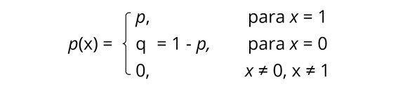

<h1>7. Distribuições Discretas: Distribuição de Bernoulli, Distribuição Binomial, Distribuição de Poisson</h1>
<h2>Distribuição de Bernoulli</h2>

Na prática, há vários experimentos que admitem somente dois tipos de resultados, como sucesso e fracasso, esses experimentos são chamados de Distribuição de Bernoulli.

O sucesso é o que se deseja observar, por exemplo, se o seu interesse for observar a ocorrência de defeito em peças. Uma peça selecionada aleatoriamente, com defeito, seria um resultado do tipo “sucesso” (o resultado “sucesso” não está associado a algo bom, necessariamente).

Considere um problema (experimento) no qual só podem ocorrer dois tipos de resultados, “sucesso” e “fracasso”.

<b>Exemplos</b>

<ul>
  <li>Uma venda é efetuada ou não por um vendedor em loja física;</li>
  <li>Um cliente pode ser do tipo adimplente ou inadimplente;</li>
  <li>Uma peça fabricada por uma indústria pode ser perfeita ou defeituosa;</li>
  <li>Um consumidor pode devolver ou não um produto comprado;</li>
  <li>Um exame médico pode ter como resultado positivo ou negativo.</li>
</ul>

<b>Função de Probabilidade</b>

Associando uma variável aleatória x aos possíveis resultados de um determinado experimento, ficaremos com:

x = 1, se o resultado for “sucesso”,

x = 0, se o resultado for “fracasso”.

Assim, a função de probabilidade da Distribuição de Bernoulli será dada por:

<b>Média e Variância</b>

É importante que você saiba que a média e a variância serão obtidas por:

Média = p

Variância = pq

Sendo,

p= probabilidade de sucesso

q= probabilidade de fracasso

<b>Mais um exemplo</b>

A partir de uma pesquisa no comércio on-line, foi verificado que no período de vendas de Natal, cada cliente que entra no site de determinada loja tem 60% de chance de comprar um produto qualquer. Qual a probabilidade de sucesso e de não comprar produto algum?

<b>Solução:</b>

Nesse caso, temos uma probabilidade de sucesso (o cliente adquirir um produto qualquer) de 0,6 e uma probabilidade de não comprar produto algum de 0,4 (q = 1 – 0,6).

A repetição de experimentos de Bernoulli independentes dá origem ao modelo Binomial, que você estudará abaixo.

<h2>Distribuição Binomial</h2>

<h2>Referências</h2>

https://blog.proffernandamaciel.com.br/distribuicao-de-bernoulli/

https://blog.proffernandamaciel.com.br/distribuicao-de-probabilidade-binomial/

