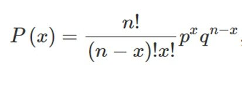
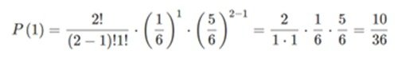

<h1>7. Distribuições Discretas: Distribuição de Bernoulli, Distribuição Binomial, Distribuição de Poisson</h1>
<h2>Distribuição de Bernoulli</h2>

Na prática, há vários experimentos que admitem somente dois tipos de resultados, como sucesso e fracasso, esses experimentos são chamados de Distribuição de Bernoulli.

O sucesso é o que se deseja observar, por exemplo, se o seu interesse for observar a ocorrência de defeito em peças. Uma peça selecionada aleatoriamente, com defeito, seria um resultado do tipo “sucesso” (o resultado “sucesso” não está associado a algo bom, necessariamente).

Considere um problema (experimento) no qual só podem ocorrer dois tipos de resultados, “sucesso” e “fracasso”.

<b>Exemplos</b>

<ul>
  <li>Uma venda é efetuada ou não por um vendedor em loja física;</li>
  <li>Um cliente pode ser do tipo adimplente ou inadimplente;</li>
  <li>Uma peça fabricada por uma indústria pode ser perfeita ou defeituosa;</li>
  <li>Um consumidor pode devolver ou não um produto comprado;</li>
  <li>Um exame médico pode ter como resultado positivo ou negativo.</li>
</ul>

<b>Função de Probabilidade</b>

Associando uma variável aleatória x aos possíveis resultados de um determinado experimento, ficaremos com:

x = 1, se o resultado for “sucesso”,

x = 0, se o resultado for “fracasso”.

Assim, a função de probabilidade da Distribuição de Bernoulli será dada por:

<b>Média e Variância</b>

É importante que você saiba que a média e a variância serão obtidas por:

Média = p

Variância = pq

Sendo,

p= probabilidade de sucesso

q= probabilidade de fracasso

<b>Mais um exemplo</b>

A partir de uma pesquisa no comércio on-line, foi verificado que no período de vendas de Natal, cada cliente que entra no site de determinada loja tem 60% de chance de comprar um produto qualquer. Qual a probabilidade de sucesso e de não comprar produto algum?

<b>Solução:</b>

Nesse caso, temos uma probabilidade de sucesso (o cliente adquirir um produto qualquer) de 0,6 e uma probabilidade de não comprar produto algum de 0,4 (q = 1 – 0,6).

A repetição de experimentos de Bernoulli independentes dá origem ao modelo Binomial, que você estudará abaixo.

<h2>Distribuição Binomial</h2>

Agora vamos estudar uma variável aleatória específica que gera uma distribuição de probabilidade muito utilizada em problemas do dia a dia de qualquer profissional: a distribuição Binomial.

<b>Conceito</b>

Uma distribuição de probabilidade binomial resulta de um experimento que satisfaz os seguintes requisitos:

<ul>
  <li>O experimento tem um número finito de tentativas.</li>
  <li>As tentativas devem ser independentes (o resultado de qualquer tentativa individual não afeta as probabilidades nas outras tentativas).</li>
  <li>Cada tentativa deve ter todos os resultados classificados em duas categorias (em geral, chamadas de sucesso e fracasso).</li>
  <li>A probabilidade de sucesso permanece constante em todas as tentativas.</li>
</ul>

<b>Indo para a prática</b>

Para exemplificar, vamos falar do número de vezes que sai o número 5 no lançamento de dois dados. Observe que nesse caso temos satisfeitos os quatro requisitos da definição de probabilidade binomial:

O lançamento de dois dados pode ser interpretado como dois (número finito) lançamentos. O resultado do primeiro lançamento do dado não interfere no resultado do segundo lançamento, por isso são classificados como independentes.

Cada lançamento pode resultar em um sucesso (sair 5) ou em um fracasso (sair um número diferente de 5).

A probabilidade de sair 5 é sempre igual a 1/6 em cada um dos lançamentos.

Em qualquer distribuição binomial, a probabilidade de ocorrência de sucessos em um conjunto de tentativas pode ser calculada a partir da expressão seguinte:

Sendo,

p= a probabilidade de sucesso em uma tentativa;

q= a probabilidade de fracasso em uma tentativa;

n= o número de tentativas;

x= a quantidade de sucesso nas n tentativas.

<b>Exemplo</b>

No lançamento de dois dados não viciados, qual é a probabilidade de ocorrência de exatamente UM resultado igual a 5?

Solução:

Nesse exemplo, temos que n=2 (dois lançamentos), x=1 (um sucesso), p=1/6 e q= 1 – 1/6 = 5/6.

Aplicando a equação A, temos:

<h2>Referências</h2>

https://blog.proffernandamaciel.com.br/distribuicao-de-bernoulli/

https://blog.proffernandamaciel.com.br/distribuicao-de-probabilidade-binomial/

