<h1>8. Distribuições Contínuas: Distribuição Uniforme, Distribuição Normal, Distribuição Log-Normal</h1>

Uma variável aleatória contínua é uma variável que pode tomar qualquer valor num dado intervalo. As variáveis contínuas são medidas, não contadas. Itens tais como altura, peso e tempo são contínuas e podem tomar valores decimais. Por exemplo, um jogador de basketball pode ter 2,10 m de altura.

<h2 align="center">Distribuição Uniforme (ou Retangular)</h2>

Entre as distribuições de probabilidades contínuas, a distribuição uniforme é a mais simples de todas. A figura seguinte mostra um exemplo de uma distribuição uniforme. Em uma distribuição uniforme, a área sob a curva é igual ao produto do comprimento pela altura do retangulo e igual a 1.

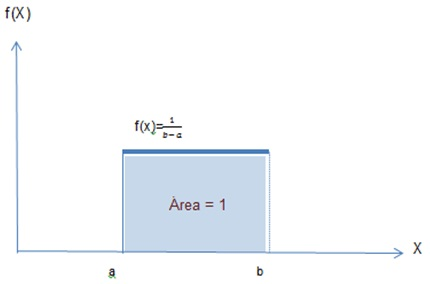

Onde,

a=limite inferior do intervalo

b= limite superior do intervalo

Note que no gráfico acima, como a área do retângulo = (comprimento)(altura) =1, e como o comprimento = (b - a), então podemos escrever: (b - a)(altura) = 1 ou altura = f(X) = 1/(b - a).

As equações seguintes são usadas para se encontrar a média e o desvio padrão de uma distribuição uniforme:

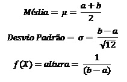

<b>Exemplo</b>

Existem muitos cassos nos quais podemos ser capazes de aplicar a distribuição uniforme. Como um exemplo, suponhamos que o departamento de pesquisa de uma fábrica de aço acredita que uma das máquinas de rotação da companhia esteja produzindo folhas de aço de diferentes espessuras. A espessura é uma variável aleatória uniforme com os valores entre 150 e 200 milímetros. Qualquer folha com menos de 160 milímetros de espessura deve ser descartada devido serem inaceitáveis pelos compradores. Queremos calcular a média e o desvio padrão de X (a espessura da folha produzida por esta máquina), e a fração das folhas de aço produzidas por esta máquina que terão de ser descartadas. A figura seguinte mostra a distribuição uniforme para este exemplo.

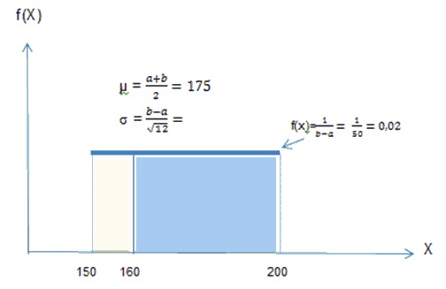

Note que para distribuições contínuas, a probabilidade é calculada encontrando-se a área sob a função num determinado intervalo específico. Em outras palavras, para distribuições contínuas, não há probabilidade em um dado ponto. A probabilidade de X>= b ou de X<= a é zero porque não há área acima de b ou abaixo de a, e a área entre a e b é igual a 1, ver figura 1.

A probabilidade das variáveis caírem entre quaisquer dois pontos, tal como c e d na figura 2, são calculadas como segue:

<pre align="center"><b>P (c <= x <=d) = c*[1/(b - a)] = ?</b></pre>

Neste exemplo c=a=150, d=160, e b=200, portanto:

<pre align="center">Média = (a + b)/2 = (150 + 200)/2 = 175 milímetros.</pre>
<pre align="center">O desvio padrão é igual a 14,43 milímetros</pre>
<pre align="center">P(c <= x <=d) = [(160-150)/(200-150)] = "1/5"</pre>

Assim, de todas as folhas feitas por esta máquina, 20% da produção deve ser descartada).

<h2 align="center">Distribuição Normal</h2>

Dizemos que é uma distribuição normal se puder ser descrita pela função (considerando um conjunto de dados que possui média μ e desvio-padrão σ):

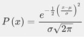

Calma, fique tranquilo! A função anterior, por conta da sua complexidade, não precisará ser utilizada em nenhum momento ao longo do texto. No lugar dela, utilizaremos uma tabela com valores previamente calculados e que garantem toda a ferramenta necessária para o estudo das distribuições normais.

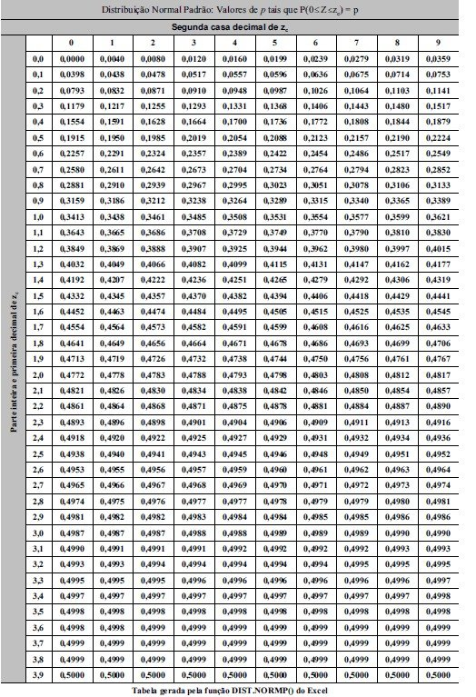

Uma vez fixados os parâmetros μ e σ, a função anterior possui como gráfico a curva a seguir.

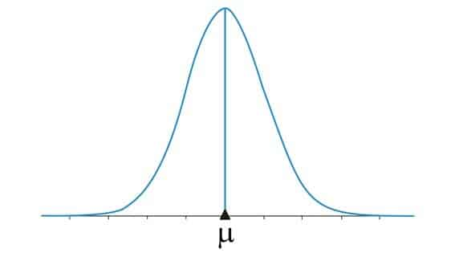

A curva anterior, por conta do seu formato, é chamada de curva sino, curva normal ou curva de Gauss.

A principal propriedade da curva de Gauss é a sua simetria em torno da média μ.

Observe que a lei que define tal curva depende apenas da média e do desvio-padrão. Uma vez alterados esses parâmetros, a curva se altera, mas mantém a forma de sino. A figura a seguir ilustra esse fato.

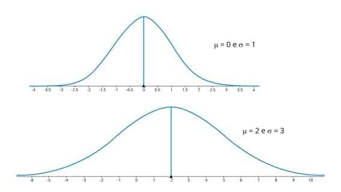
<h3 align="center">Distribuição Normal Padrão</h3>

Iniciaremos nosso estudo assumindo que a média e o desvio-padrão são constantes e iguais a 0 e 1, respectivamente. Nesse caso, chamamos a nossa distribuição de normal padrão. Na próxima seção, aprenderemos a trabalhar com parâmetros diferentes dos assumidos na distribuição-padrão (μ=0 e σ=1).

<b>Propriedades</b>

Uma distribuição normal padrão tem as propriedades a seguir.

<ul>
  <li>A média é igual a 0.</li>
  <li>O desvio-padrão é igual a 1.</li>
  <li>O gráfico possui o formato de sino.</li>
</ul>

<b>Área sob a curva</b>

A área sob a curva normal é sempre igual a 1, o que garante a existência de uma correspondência entre tal área e a probabilidade. Dessa fórmula, para calcular alguma probabilidade em uma distribuição normal, calcularemos alguma área abaixo da curva normal.

Como a função que descreve a curva normal é extremamente complexa e o procedimento para determinação de áreas de regiões delimitadas por ela requer cálculos longos, utilizaremos a tabela que consta no início deste texto para determinar essas áreas procuradas.

Para usar a tabela, é muito importante que você se atente aos itens a seguir:

<ul>
  <li>A tabela só pode ser utilizada quando a distribuição for normal padrão (μ=0 e σ=1).</li>
  <li>A tabela é dividida em duas partes: uma para valores negativos e outra para valores positivos.</li>
  <li>Um z-score é um valor limitante da área, situado no eixo horizontal. Na tabela, ela corresponde à primeira coluna e primeira linha.</li>
  <li>Cada valor observado na tabela corresponde à área acumulada até o valor do z-score (área sempre à esquerda de z).</li>
</ul>

Por convenção, utilizaremos a variável z apenas quando a distribuição for padrão. Para casos gerais, utilizaremos a variável x.

<b>Exemplo</b>

Considere que a variável z possui distribuição normal com média μ=0 e desvio-padrão σ=1, ou seja, a distribuição é normal padrão. Qual a probabilidade de que z≤1,32?

Essa pergunta pode ser respondida com o valor da área indicada em azul na figura a seguir. Ou seja: a área abaixo da curva de normal para z≤1,32.

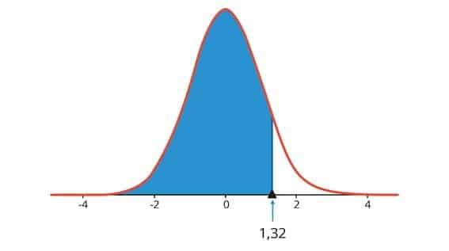

Para determinação desta área, vamos recorrer à tabela de z-scores. Procurando na primeira coluna o valor de 1,3 e na primeira linha o valor de 0,02, obtemos a área (probabilidade) igual a 0,9066. Ou seja: a probabilidade para que z≤1,32 é igual a 90,66%.

<h3 align="center">Distribuição Normal Não Padronizada</h3>

Nessa seção, discutiremos como calcular probabilidades para distribuições normais não padronizadas, ou seja, μ≠0 ou σ≠1.

Nos casos de distribuições não padronizadas, converteremos a variável da questão para escores z, utilizando a relação a seguir.

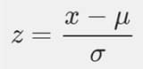

A figura a seguir ilustra a conversão que deve ser realizada. Nela você deve observar que a área procurada permanece a mesma, o que justifica a troca de variáveis.

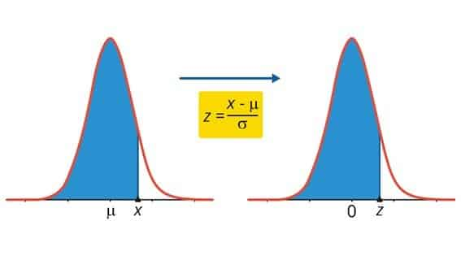

<b>Exemplo</b>

Os dados de uma pesquisa mostram algumas informações sobre o tempo de cirurgias para recostrução do Ligamento Cruzado Anterior (um ligamento do joelho) em hospitais com alto volume de cirurgia. A partir dos dados foram calculados, o tempo médio de 129 minutos com um desvio padrão de 14 minutos.

<ul>
  <li>Qual é a probabilidade de uma cirurgia do Ligamento Cruzado Anterior, em um hospital com alto volume de cirurgias, requerer um tempo maior do que dois desvios-padrão acima da média?</li>
  <li>Qual é a probabilidade de uma cirurgia do Ligamento Cruzado Anterior, em um hospital com alto volume de cirurgias ser completada em menos de 100 minutos?</li>
</ul>

<b>Resolução</b>

<ul>
  <li>Qual é a probabilidade de uma cirurgia ACL, em um hospital com alto volume de cirurgias, requerer um tempo maior do que dois desvios-padrão acima da média?/li>
  <pre align="center">1−P(Z<2)=1−ϕ(2)=0.0228</pre>
  <li>Qual é a probabilidade de uma cirurgia ACL, em um hospital com alto volume de cirurgias ser completada em menos de 100 minutos? Seja X o tempo, onde X∼N(129,14)</li>
  <pre align="center">Seja X o tempo, onde X∼N(129,14)</pre>
</ul>
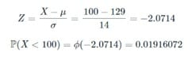
<h2 align="center">Distribuição Log-Normal</h2>

<h2>Referências</h2>

https://www.bertolo.pro.br/FinEst/Estatistica/EstatisticaNosNegocios/l6.html

https://blog.proffernandamaciel.com.br/distribuicao-normal/

