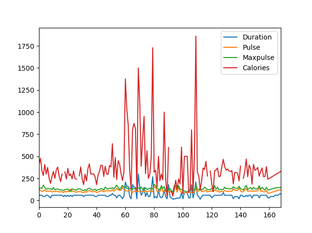
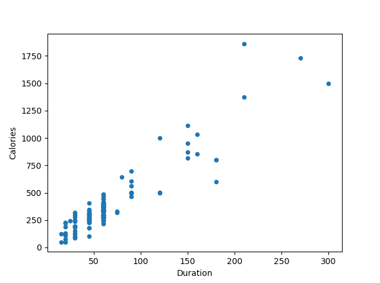
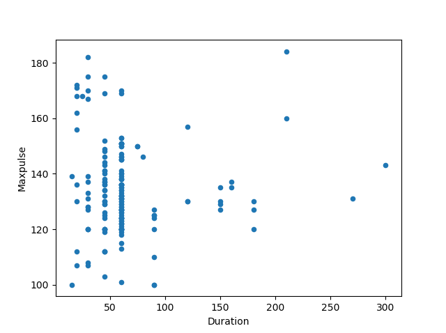
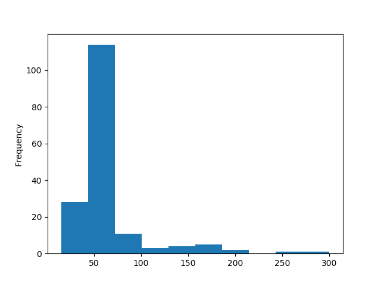

<h1 align="center">Avançado</h1>
<h1 align="center">Correlações de Dados com Pandas</h1>
<h2 align="center">Encontrando Relacionamentos</h2>

Um ótimo aspecto do módulo Pandas é o método corr().

O método corr() calcula a relação entre cada coluna no seu conjunto de dados.

Os exemplos nesta página usam um arquivo CSV chamado 'data.csv'.

Open <a href="https://www.w3schools.com/python/pandas/data.csv.txt">data.csv</a>

<b>Exemplo:</b>

Abaixo iremos usar o .corr() para mostrar os relacionamentos entre as colunas:

<pre>
df.corr()
</pre>

<b>Resultado:</b>

<pre>
         Duration     Pulse  Maxpulse  Calories
Duration  1.000000 -0.155408  0.009403  0.922721
Pulse    -0.155408  1.000000  0.786535  0.025120
Maxpulse  0.009403  0.786535  1.000000  0.203814
Calories  0.922721  0.025120  0.203814  1.000000
</pre>

<b>Observação:</b> O método corr() ignora colunas "não numéricas".

<h3 align="center">Explicação do Resultado</h3>

O resultado do método corr() é uma tabela com muitos números que representam o quão bem é a relação entre duas colunas.

O número varia de -1 a 1.

1 significa que há uma relação 1 para 1 (uma correlação perfeita), e neste conjunto de dados, toda vez que um valor aumentou na primeira coluna, o outro também aumentou.

0.9 também é uma boa relação e, se você aumentar um valor, o outro provavelmente aumentará também.

-0.9 seria uma relação tão boa quanto 0.9, mas se você aumentar um valor, o outro provavelmente diminuirá.

0.2 significa NÃO uma boa relação, o que significa que se um valor aumentar, não significa que o outro também aumentará.

O que é uma boa correlação? Isso depende do uso, mas acredito que é seguro dizer que você deve ter pelo menos 0.6 (ou -0.6) para chamá-lo de uma boa correlação.

<h3 align="center">Correlação Perfeita:</h3>

Podemos ver que "Duração" e "Duração" têm o número 1.000000, o que faz sentido, cada coluna sempre tem uma relação perfeita consigo mesma.

<h3 align="center">Boa Correlação:</h3>

"A duração" e "Calorias" têm uma correlação de 0.922721, que é uma correlação muito boa, e podemos prever que quanto mais tempo você se exercita, mais calorias queima, e vice-versa: se você queimou muitas calorias, provavelmente teve um treino longo.

<h3 align="center">Má Correlação:</h3>

"A duração" e "Máximo de Batimentos Cardíacos" têm uma correlação de 0.009403, o que é uma correlação muito ruim, o que significa que não podemos prever o máximo de batimentos cardíacos apenas olhando para a duração do treino e vice-versa.

<h3 align="center">Correlação Inversa:</h3>

Quando a correlação é próxima de -1, isso indica uma correlação inversa, onde um aumento em uma variável está associado a uma diminuição na outra variável. Mesmo que a correlação seja 0, uma relação inversa pode existir se a relação entre as variáveis não for linear.

<h1 align="center">Visualização de Dados com Pandas</h1>

<h2 align="center">Plotagem</h2>

O Pandas utiliza o método plot() para criar diagramas.

Podemos usar o Pyplot, um submódulo da biblioteca Matplotlib, para visualizar o diagrama na tela.

Saiba mais sobre o Matplotlib na sua <a href="https://www.w3schools.com/python/pandas/data.csv.txt">documentação</a>.

<b>Exemplo:</b>

<pre>
import pandas as pd
import matplotlib.pyplot as plt

df = pd.read_csv('data.csv')

df.plot()

plt.show()
</pre>

The examples in this page uses a CSV file called: 'data.csv'.

Open <a href="https://www.w3schools.com/python/pandas/data.csv.txt">data.csv</a>

<h2 align="center">Gráfico de Dispersão</h2>

Especifique que você deseja um gráfico de dispersão com o argumento kind:

kind = 'scatter'

Um gráfico de dispersão requer um eixo x e um eixo y.

No exemplo abaixo, usaremos "Duration" para o eixo x e "Calories" para o eixo y.

Inclua os argumentos x e y da seguinte maneira:

x = 'Duration', y = 'Calories'

<b>Exemplo:</b>

<pre>
import pandas as pd
import matplotlib.pyplot as plt

df = pd.read_csv('data.csv')

df.plot(kind = 'scatter', x = 'Duration', y = 'Calories')

plt.show()
</pre>

<b>Resultado:</b>

Lembre-se: No exemplo anterior, aprendemos que a correlação entre "Duration" e "Calories" era 0.922721, e concluímos que quanto maior a duração significa mais calorias queimadas.

Olhando o gráfico de dispersão, eu terei que concordar.

Vamos criar outro gráfico de dispersão, onde a relação entre as colunas é ruim, como "Duration" e "Maxpulse", com correlação 0.009403:

<b>Exemplo:</b>

Um gráfico de dispersão onde não há relação entre as colunas:

<pre>
import pandas as pd
import matplotlib.pyplot as plt

df = pd.read_csv('data.csv')

df.plot(kind = 'scatter', x = 'Duration', y = 'Maxpulse')

plt.show()
</pre>

<b>Resultado:</b>

<h2 align="center">Histograma</h2>

Use o argumento kind para especificar que deseja um histograma:

kind = 'hist'

Um histograma precisa de apenas uma coluna.

Um histograma nos mostra a frequência de cada intervalo, por exemplo, quantos treinos duraram entre 50 e 60 minutos?

No exemplo abaixo, usaremos a coluna "Duration" para criar o histograma:

<b>Exemplo:</b>

<pre>
df["Duration"].plot(kind = 'hist')
</pre>

<b>Resultado:</b>

<h2 align="center">Referências</h2>

https://www.w3schools.com/python/pandas/pandas_correlations.asp

https://www.w3schools.com/python/pandas/pandas_plotting.asp

