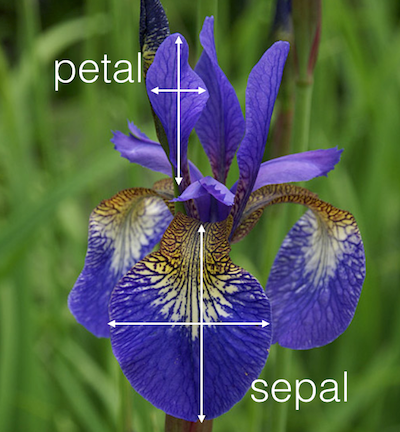
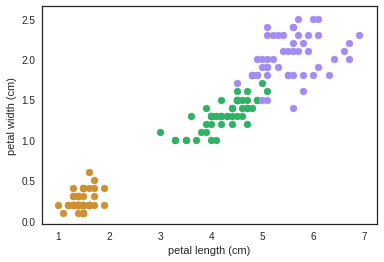
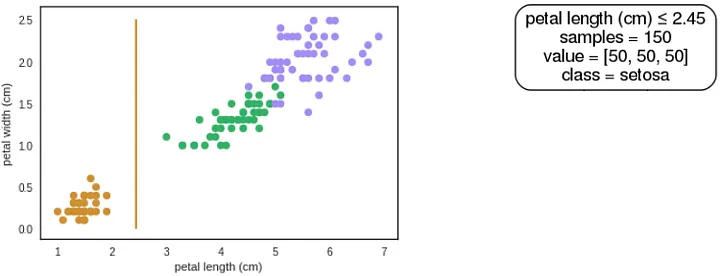
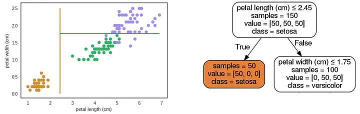
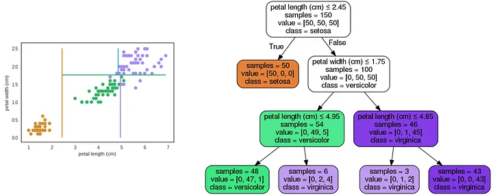

<h1 align="center">Árvores de Decisão</h1>
<h2 align="center">O que são?</h2>

Árvores de decisão são métodos de aprendizado de máquinas supervisionado não-paramétricos, muito utilizados em tarefas de classificação e regressão.

Antes de explicarmos melhor o significado dessa definição, vamos entender o que é uma árvore de decisão a partir de uma perspectiva mais geral.

Provavelmente, você já deve ter visto ou utilizado uma árvore de decisão em sua vida. Por exemplo, você já deve ter utilizado ou visto um fluxograma, não é mesmo? Espero que sim (senão dê uma olhada na figura abaixo). Isso mesmo! Um fluxograma pode ser considerado uma árvore de decisão (caso não contenha loop).

Árvores, de um modo geral em computação, são estruturas de dados formadas por um conjunto de elementos que armazenam informações chamadas nós. Na figura acima, os nós são representados pelos quadradinhos com as perguntas e as informações podem ser consideradas as perguntas e suas possíveis respostas. Além disso, toda árvore possui um nó chamado raiz, que possui o maior nível hierárquico (o ponto de partida) e ligações para outros elementos, denominados filhos. Esses filhos podem possuir seus próprios filhos que por sua vez também possuem os seus. O nó que não possui filho é conhecido como nó folha ou terminal (representado pelo símbolo arredondado na figura). Tendo essas definições esclarecidas, uma árvore de decisão nada mais é que uma árvore que armazena regras em seus nós, e os nós folhas representam a decisão a ser tomada (no caso do exemplo, qual jogo escolher).

Em uma árvore de decisão, uma decisão é tomada através do caminhamento a partir do nó raiz até o nó folha. Para elucidar melhor, suponha que tenhamos essa situação: você vai fazer uma reunião com seus amigos em sua casa, e vai rolar comidas e bebidas. Você quer jogar um jogo de tabuleiro, mas não sabe qual o melhor para essa situação, portanto, você vai recorrer a árvore de decisão para tomar sua decisão de forma mais correta. Para isso vamos caminhar por ela a partir do nó raiz, que contém a pergunta: Está jogando com crianças? Não, então iremos para nó filho da esquerda. Vamos jogar por mais de duas horas? Acho que sim! Assim, o próximo é: Regras difíceis? Vou tomar uma, logo não vou querer pensar muito rsrs. Reposta é não. Todos os jogadores vão ficar até o final? Vamos supor que sim! Desse modo, chegamos ao nó folha, com jogo <a href="https://boardgamegeek.com/boardgame/35677/le-havre">Le Havre</a>.

Simples assim! Mas o que isso tem a ver com aprendizado de máquina? De fato, uma árvore de decisão por si só não é aprendizado de máquina já que eu posso criar uma sem auxílio de um computador e utilizá-la para organizar melhor minhas ideias e tomada de decisão (como alguém fez com o problema de escolher jogos de tabuleiro). Todavia, seu processo de construção automático, a partir de um conjunto de dados, é. No geral, os algoritmos para isso o fazem de forma não-paramétrica (termo estatístico que significa, em termos gerais: não assumir nada sobre os dados de antemão) e supervisionada (os dados devem conter as respostas/rótulos, mais detalhes <a href="https://medium.com/opensanca/aprendizagem-de-maquina-supervisionada-ou-n%C3%A3o-supervisionada-7d01f78cd80a">aqui</a>).

Tendo tudo isso em vista, na próxima seção veremos como aprender a estrutura da árvore de decisão de forma automática a partir dos dados.

<h2 align="center">Como construir uma Árvore de Decisão?</h2>

A ideia geral de métodos baseados em árvores é particionar o espaço recursivamente em retângulos (sub-regiões), nos quais um modelo simples é aprendido.

Para elucidar melhor como a árvore de decisão particiona o espaço em sub-regiões, vamos introduzir o conjunto de dados de <a href="https://archive.ics.uci.edu/dataset/53/iris">flores de íris</a>.

Esse conjunto de dados contém exemplos de três espécies de flor de Íris. Cada um dos quais possui 4 atributos, que são a largura e comprimento da pétala e da sépala da flor.
Nós iremos utilizar apenas 2 atributos em nosso exemplo (comprimento e largura da pétala), já que é mais fácil para visualização no plano 2d. Além disso, conseguimos dividir o espaço satisfatoriamente apenas com esses dois atributos, ou seja, são dois atributos bem discriminativos para esse problema.

O espaço é representado pelo gráfico ao lado, onde cada uma das três cores representa uma espécie da flor de íris, são elas: setosa (amarela), versicolor (verde) e viriginica (roxa). Tendo isso em vista, nos queremos construir uma árvore de decisão para determinar a qual espécie uma nova flor de íris pertence dada suas características (nesse caso, comprimento e largura da pétala). Para isso, vamos particionar o espaço recursivamente, fazendo cortes ortogonais, levando em consideração uma variável por vez, que maximiza a pureza das sub-regiões resultantes (pureza = homogeneidade no que diz respeito às espécies/rótulos). Cada divisão do espaço é representada por um nó na árvore de decisão. A primeira divisão (nós raiz da árvore) leva em consideração todos os exemplos (pontos) do espaço ao encontrar o ponto de corte que maximiza a pureza, de acordo com algum critério de impureza (veremos adiante), das sub-regiões resultantes. Vamos supor que o comprimento da pétala de valor 2,45 cm é o ponto de corte que melhor divide o espaço. Portanto, essa será o nó raiz de nossa árvore de decisão.

A figura acima mostra como fica essa divisão (esquerda) e nosso nó raiz (direita). De fato, esse corte nos deu uma região totalmente pura (conseguimos separa as setosas do restante) e uma outra heterogênea. Agora, vamos recursivamente particionar as duas sub-regiões do espaço (da esquerda e da direita). Na esquerda, temos uma região completamente pura e isso significa que qualquer corte que fizermos nessa região teremos como resultados regiões puras. Portanto, podemos parar o particionamento, ou seja, essa região será considerada um nó folha em nossa árvore. Já a região da direita não é pura, assim devemos continuar o particionamento por ela até que cheguemos em sub-regiões puras. Figura a seguir mostra a próxima partição.

A partição na sub-região da direita, foi feita no eixo da largura da pétala no valor 1,75 cm. Como pode-se notar, foram gerados mais duas novas sub-regiões disjuntas, que, por sua vez, não estão completamente puras. Esse processo é repetido recursivamente até que um critério de parada seja alcançado (i.e., profundidade, número de folhas) ou que todas as folhas sejam puras, que implica na costrução até sua profundidade máxima . A figura a seguir mostra como ficaria nossa árvore e as partições (quase) puras do espaço.

Essa é a intuição do algoritmo de construção de uma árvore de decisão. Há vários algoritmos para aprender sua estrutura, são eles CART, ID3 e C4.5, todos seguem mais ou menos essa lógica. Nesse artigo, vamos focar no algoritmo CART, pois é um dos mais intuitivos e simples de implementar, além de sua implementação estar disponível em várias bibliotecas de aprendizado de máquinas, tal como scikit-learn. O código a seguir sintetiza o algoritmo.

<pre>
def build_tree(data, labels, tree, depth = 1):
    classes, counts = np.unique(labels, return_counts=True)
    n_classes = classes.shape[0]

    #criétio de parada
    if not stopping_criterion(n_classes, depth, tree.max_depth):
        node = Node()

        #encontra melhor ponto de corte dado a região atual do espaço
        # de acordo com critério de impureza escolhido
        feature, threshold = find_cut_point(data, labels, 
                                            tree.impurity_criterion)
        
        #aplicando o limiar para particionar o espaço
        mask = data[:, feature] <= threshold
        
        #contruindo árvore recursivamente para
        #os sub-espaço da direita e da esquerda.
        left = build_tree(data[mask], labels[mask], tree, depth + 1)
        right = build_tree(data[~mask], labels[~mask], tree, depth + 1)
     
        return Node(feature=feature, threshold=threshold, left=left, right=right)

    #calcula a quantidade de exemplos por classe nesse nó folha
    #e instancia um nó folha com essas quantidades, lembre-se que isso
    #será usado para predição. 
    values = np.zeros(tree.n_classes)
    values[classes] = counts
    return Node(is_leaf=True, counts=values)
</pre>
<h2 align="center">Encontrando "Melhor" Ponto de Corte</h2>

Nós estamos interessados em encontrar a melhor divisão em termos de alguma medida de impureza, tal como Gini Index, Entropia ou taxa de erro (detalharemos mais adiante). Encontrar o ponto de corte que leva a árvore de decisão ótima pode ser computacionalmente inviável (construir a árvore de decisão binária ótima é um problema np-completo). Portanto, nós nos contentamos em fazer escolhas locais ótimas (não garantindo o ótimo global) para encontrar o melhor atributo e limiar para o particionamento (linha 7 do código acima).

Para encontrar melhor ponto de corte, nós temos de testar todos os possíveis, ou seja, para cada atributo e valores possíveis calcular o ganho de informação (quão pura a divisão torna o espaço) para cada um dos pontos de corte candidatos. Após essa etapa, nós escolhemos o candidato com maior ganho de informação para ser o ponto de corte do nó em questão. O código para isso ficaria o seguinte.

<pre>
def find_cut_point(data, labels, impurity_criterion = gini_criterion):
  """ find the best cut point

    Parameters
  ----------
  data: numpy array-like = [n_samples, n_features]
  labels: numpy array-like, shape = [n_samples]
  impurity_criterion: callable, default=gini_criterion
  
      Return
  ------
  feature, threshold
  """
  n_samples, n_features = data.shape

  max_info_gain = np.iinfo(np.int32).min
  feat_id = 0
  best_threshold = 0

  #pré-calculando a impureza da região atual
  H_parent = impurity_criterion(data, labels)
  #para cada um dos atributos
  #vamos tentar encontrar o limiar que maximiza o ganho de informação
  for j in range(n_features):
    # só nos interessa os valores ordenados únicos 
    # do atributo j nessa região do espaço
    values = np.unique(data[:, j])
    
    for i in range(values.shape[0] - 1):
      #usamos o ponto médio dos valores possíveis
      #como limiar candidato para o ponto de corte
      threshold = (values[i] + values[i + 1]) / 2.

      mask = data[:, j] <= threshold

      info_gain = H_parent \
                  - (mask.sum() * impurity_criterion(data[mask], labels[mask]) \
                  + (~mask).sum() * impurity_criterion(data[~mask], labels[~mask])) \
                  / float(n_samples)

      if max_info_gain < info_gain:
        best_threshold = threshold
        feat_id = j
        max_info_gain = info_gain
        
  return feat_id, best_threshold
</pre>
<h2 align="center">Calculando o Ganho de Informação</h2>

O ganho de informação, de grosso modo, representa a informação aprendida sobre os rótulos (no nosso exemplo, as espécies) quando dividimos uma região do espaço em duas sub-regiões de acordo com ponto de corte. E é definida pela fórmula:

<pre>
InfoGain(R, R_e, R_d) = H(R) - (|R_e|*H(R_e) + |R_d|*H(R_d)) / |R|,
</pre>

onde H é a impureza da região, R é a região atual, R_e é sub-região da esquerda, R_d é sub-região da direita e |.| é quantidade de exemplos na dada região. Os critérios de impureza mais comuns para classificação são a Entropia e o índice Gini, definidos a seguir:

<pre>
entropia(R) = -∑ p(c|R) log (p(c|R)) ,
</pre>
<pre>
gini(R) = ∑ p(c|R) (1 - p(c|R)),
</pre>

onde p(c|R) é a probabilidade de um ponto da região R pertencer a classe c. Essa probabilidade é estimada pela razão entre quantidade de pontos da classe c e o total de pontos em R.

Para ficar mais claro, vamos calcular o ganho de informação para o ponto de corte mostrado na figura utilizando tanto a entropia quanto o gini. Vamos iniciar calculando p(c|R) para cada região e espécie.

Sabendo que temos 50 exemplos de cada espécie, a p(c|R) para todas as espécies é 50 / 150 ~ 0.33 . Calculando para a sub-região da esquerda, temos que p(c = setosa | R_e) = 1.0 (só temos setosa nessa região) e p(c = versicolor | R_e) = p(c = virginica | R_e) = 0.0. Para direita, p(c = setosa | R_d) = 0.0 e p(c = versicolor | R_d) = p(c = virginica | R_d) = 0.5.

Com esses valores em mãos, fica fácil calcular a entropia e gini de cada região e, por consequência, obter o ganho de informação.

<pre>
entropia(R) = -∑ p(c|R) log (p(c|R)) =- 3 * (0.33 log(0.33)) ~0.48
</pre>
<pre>
entropia(R_e) =-(1.0 log(1.0) + 0.0 log(0.0) + 0.0 log(0.0)*) = 0
</pre>
<pre>
entropia(R_d) =-(0.0 log(0.0) + 0.5 log(0.5) + 0.5 log(0.5)*) ~0.30
</pre>

Portanto, o ganho de informação usando entropia como critério de impureza é:

<pre>
InfoGain = 0.48 - (50*0 + 100*0.30) / 150 = 0.28
</pre>

Calculando o gini de maneira análoga,

<pre>
gini(R) = ∑ p(c|R) (1 - p(c|R)) = 3 * (0.33 *(1 - 0.33)) ~0.66
</pre>
<pre>
gini(R_e) =(1.0 * (1.0 - 1.0) + 0.0 * (1 - 0.0) + 0.0 * (1 - 0.0)) = 0
</pre>
<pre>
gini(R_d) =(0.0 * (1 - 0.0) + 0.5 * (1 - 0.5) + 0.5 * (1 - 0.5)) ~0.5
</pre>

Portanto, o ganho de informação usando gini como critério de impureza é:

<pre>
InfoGain = 0.66 - (50*0 + 100*0.50) / 150 = 0.16
</pre>

As implementações desses critérios de impureza seriam:

<pre>
def entropy_criterion(data, labels):
  """ Entropy
  Parameters
  ----------
  data: numpy array-like = [n_samples, n_features]
  labels: numpy array-like, shape = [n_samples]
  
  Return
  ------
  entropy: float
  """
  classes = np.unique(labels)
  
  s = 0
  for c in classes:
    p = np.mean(labels == c)
    s -= p * np.log(p)
    
  return s
  

def gini_criterion(data, labels):
  """ Gini Index
  Parameters
  ----------
  data: numpy array-like = [n_samples, n_features]
  labels: numpy array-like, shape = [n_samples]
  
  Return
  ------
  gini: float
  """
  classes = np.unique(labels)
  
  s = 0
  for c in classes:
    p = np.mean(labels == c)
    s += p * (1 - p)
    
  return s
</pre>

O algoritmo está praticamente finalizado, só precisamos definir nosso critério de parada e pronto (essa é parte mais fácil).

<pre>
def stopping_criterion(n_classes, depth, max_depth):
  """ Stopping criterion
  Parameters
  ----------
  n_classe: int
            number of classes in the region, one means that the region is pure.
  depth: int,
          current tree depth
  max_depth: int, default=None
          maximal tree depth. None for fully grown tree.
  Return
  ------
  bool
  """
  return (max_depth is not None and max_depth == depth) or (n_classes == 1)
</pre>

Traduzindo o código, nosso critério é verdadeiro se atingir uma profundidade máxima preestabelecida ou se a região é pura (caso max_depth seja None a árvore crescerá até sua profundidade máxima).

<h2 align="center">Por que as Árvores de Decisão são Populares?</h2>

Como pode-se ver, árvores de decisões são conceitualmente simples, porém poderosas. Sua popularidade é, principalmente, devido a suas características singulares:

<ul>
    <li>Fácil explicabilidade e interpretação, já que podemos facilmente visualizá-las (quando não são muito profundas).</li>
    <li>Requerem pouco esforço na preparação dos dados, métodos baseados em árvores normalmente não requerem normalização dos dados. Além disso, conseguem lidar com valores faltantes, categóricos e numéricos (não é o caso da CART que implementamos).</li>
    <li>Complexidade logarítmica na etapa de predição.</li>
    <li>São capazes de lidar com problemas com múltiplos rótulos.</li>
</ul>

As árvores de decisão muito populares para problemas de classificação, regressão, análise exploratória entre outras tarefas.

<h2 align="center">Nem Sempre um Mar de Rosas!</h2>

Árvores de decisão possuem alguns probleminhas que podem degradar seu poder preditivo, são eles:

<ul>
    <li>Árvore crescida até sua profundidade máxima pode decorar o conjunto de treino (o temido overfitting), o que pode degradar seu poder preditivo quando aplicado a novos dados. Isso pode ser mitigado "podando" a árvore de decisão ao atribuir uma profundidade máxima ou uma quantidade máxima de folhas.</li>
    <li>São modelos instáveis (alta variância), pequena variações nos dados de treino podem resultar em árvores completamente distintas. Isso pode ser evitado ao treinarmos várias árvores distintas e agregar suas predições (que veremos em outro post).</li>
    <li>Como vimos, o algoritmo de construção da árvore de decisão é guloso, ou seja, não garante a construção da melhor estrutura para o dados de treino em questão. Esse problema também pode ser mitigado ao treinarmos várias árvores distintas e agregar suas predições (veremos em outro post como fazer).</li>
</ul>
<h2 align="center">Conclusão</h2>

Nesse post mostramos o que são árvores de decisão, para que servem. Além do mais, mostramos de forma detalhada como construir uma a partir dos dados e disponibilizamos uma implementação do algoritmo CART (mesmo implemento pelo scikit-learn, porém sem otimização alguma).

<h2 align="center">Refêrencias</h2>

https://medium.com/machine-learning-beyond-deep-learning/%C3%A1rvores-de-decis%C3%A3o-3f52f6420b69

