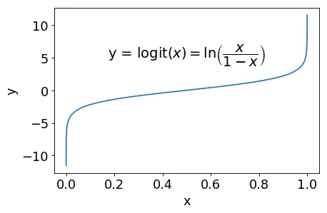
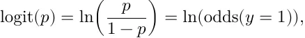
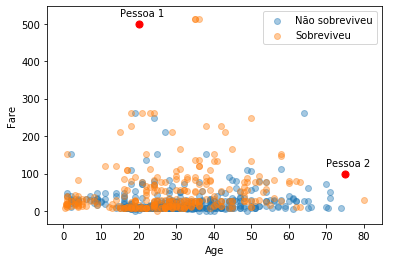

<h1 align="center">Regressão Logística</h1>

Já vimos alguns modelos de predição, como o SVM, que é usado principalmente para classificação. Hoje vamos ver mais um modelo de classificação: a regressão logística (sim, a regressão logística é um modelo de classificação).

<h2 align="center">O que é a Regressão Logística?</h2>

Vamos analisar brevemente um dos modelos de classificação que vimos nas últimas semanas: o <b>SVM</b>. De forma simplificada, em um problema de classificação binária com 2 features, o SVM tenta achar curvas que separem os pontos de acordo com sua classificação. Com isso, podemos predizer a classificação de um ponto arbitrário olhando em qual lado da reta ele está.

No entanto, em geral, os modelos cometerão erros. Às vezes, pode ser importante ter uma ideia da confiança do modelo na predição feita. Nesses casos, poderíamos usar a distância do ponto à reta como uma medida de confiança. Uma medida ainda melhor seria se a saída do modelo fosse a probabilidade da observação ter classe 1 (supondo um problema de classificação binária, com classes 0 e 1). É exatamente esse tipo de modelo que vamos construir no resto desse post.

O SVM simplesmente separa as duas classes de pontos. Já a regressão logística prediz a probabilidade dos pontos pertencerem a cada uma das classes.

<h2 align="center">Matematicamente, o que o modelo faz?</h2>

A partir daqui, vamos tentar entender como a regressão logística funciona matematicamente. Recomendamos fortemente que você tente entender o modelo, mas se você não estiver interessado na parte matemática, é só pular para a parte 6.

<h3 align="center">Noções de Probabilidade</h3>

Para acompanhar o resto da parte matemática desse post, é necessário saber o básico de probabilidade. Se você já se sentir confortável com o assunto, sinta-se livre para pular essa introdução.

Usamos o conceito de probabilidade cotidianamente; por exemplo, quando ouvimos na previsão do tempo que a probabilidade de chuva amanhã é de 20%. Essa frase reflete a nossa incerteza sobre um evento: é improvável que chova amanhã, mas não temos certeza do que acontecerá de fato.

No exemplo anterior, dizemos que “chover amanhã” é um evento, de forma que podemos escrever P(chover amanhã) = 20%, onde P(A) indica a probabilidade de um evento A. Essa probabilidade pode variar entre 0% e 100%, onde 0% indica certeza de que A não ocorrerá e 100% indica certeza de que A ocorrerá. É muito comum utilizarmos, ao invés de porcentagens entre 0% e 100%, números entre 0 e 1. Nessa notação, a probabilidade de chuva seria 0,20.

Ainda no exemplo da chuva, qual seria a probabilidade de não chover amanhã?

<pre>
P(chover ou não chover) = P(chover) + P(não chover) = 1
</pre>

Uma vez que certamente ou choverá ou não choverá. Dessa forma, a probabilidade de não chover é igual a 1 − P(chover) = 0,80.

Por último, como esse post trata de classificação, vamos escrever os eventos de maneira um pouco diferente. Denotando a classe de uma observação por y, o evento “a observação tem classe 1” pode ser escrito como “y=1”. Analogamente, se a probabilidade da classe ser 0 for de 32%, podemos escrever P(y=0) = 0,32.

<h3 align="center">O Modelo</h3>

O nosso objetivo, como vimos no final da seção 1, é encontrar um modelo de regressão que calcule a probabilidade de um dado ponto ter classificação 0 ou 1 (que chamaremos também de classificações negativa e positiva, respectivamente). Nesse momento, podemos pensar na regressão linear que vimos duas semanas atrás. Será que podemos usar ela para estimar a probabilidade de classificação positiva? Não, pelo menos não diretamente. Observe que a regressão linear gera uma saída no intervalo (−∞, +∞), mas probabilidades estão no intervalo [0, 1]. Para resolver isso, precisamos de uma função que ligue esses dois intervalos: uma função de ligação. A função que utilizaremos é a função logit(x), que recebe um número entre 0 e 1, e retorna um número real:

Para interpretar essa função, primeiramente, definimos a chance (odds) de um evento A como:

Onde A’ é a negação de A. Por exemplo, considere que chove uma vez a cada dez dias, de forma que a probabilidade de chover é 1/10 = 0,1. Então, odds = 0,1/0,9 = 1/9, ou seja, a chance de chover é de 1 para 9 (para cada dia de chuva, há 9 dias sem chuva).

Tomando a probabilidade de um ponto x ter classe positiva como p = P(y = 1), temos então que:

De forma que a função logit está intimamente relacionada com a chance de um evento ocorrer. Veremos mais a frente que essa relação nos ajudará a interpretar os resultados obtidos com a regressão linear.

Agora que temos um número real, podemos estimá-lo usando um regressor f qualquer. Lembrando que para classificar um ponto queremos estimar o probabilidade de y = 1, temos:

Onde σ é a inversa de logit, também chamada de função sigmoide ou logística. É por isso que o modelo é chamado de regressão logística: ele calcula a probabilidade P(y=1) como σ(f(x)), onde σ é a função logística e f(x) é uma função de regressão.

Mas qual regressor devemos usar como f? No caso da regressão logística, utiliza-se um regressor linear:

Após predizer a probabilidade de um dado ponto ter classe positiva, o algoritmo precisa classificar esse ponto. Para fazer isso, simplesmente escolhemos a classe mais provável: se p > 0,5, a classe predita é positiva; caso contrário, é negativa.

Resumidamente, a regressão logística prediz P(y=1) usando um modelo linear para logit(P(y=1)):

<b>Obs:</b> Chamamos os modelos que adaptam a regressão linear de modelos lineares generalizados. Em particular, dizemos que a regressão logística é um modelo linear generalizado com função de ligação logit(x).

<h3 align="center">Classificação com Mais de Duas Classes</h3>

Até agora falamos somente de classificação com duas classes. No entanto, é possível estender a regressão linear para mais de duas classes. Há dois modos principais de fazer isso.

O primeiro já vimos quando falamos de SVMs: trata-se do modelo “one-vs-rest”, em que, para cada classe, criamos um classificador que nos dá a probabilidade de um ponto pertencer ou não àquela classe. A classificação escolhida seria então aquela com a maior probabilidade.

O outro modo, que chamamos de multinomial, consiste em adaptar a função de ligação para que o modelo consiga predizer diretamente a probabilidade de cada classe.

<h2 align="center">Como Interpretar os Coeficientes?</h2>

Para conseguir interpretar os coeficientes wi, vamos primeiro entender o seu significado em um caso específico. Suponha que o nosso objetivo seja modelar a probabilidade de alguém desenvolver câncer de fígado com base em seu histórico familiar. Denotando por p a probabilidade de câncer e por x o número de familiares com câncer, temos:

Como eʷ¹ é a razão entre a chance de câncer quando x=1 e quando x=0, podemos dizer que para cada familiar a mais com câncer, a sua chance de desenvolver câncer é multiplicada por eʷ¹.

Estendendo isso para várias features, podemos dizer que:

<ul>
  <li>eʷ⁰ é a chance de classe positiva quando todas as features são nulas;</li>
  <li>eʷⁱ representa por quanto a chance é multiplicada quando aumentamos a feature i por 1.</li>
</ul>
<h2 align="center">Treinando o Modelo</h2>

A primeira vista, poderíamos pensar em treinar a regressão logística do mesmo modo que treinamos a regressão linear: minimizando o erro quadrático médio. No entanto há alguns problemas com o erro quadrático médio (MSE) para regressão logística, como:

<ul>
  <li>O MSE não é convexo na regressão logística, ou seja, podem haver vários mínimos locais que não são mínimos globais. Durante o treinamento, o modelo pode ficar “preso” em um desses mínimos locais.</li>
  <li>O MSE funciona bem para dados contínuos, mas não tanto para classificação (matematicamente, ele assume algumas propriedades estatísticas sobre o target).</li>
</ul>
<h3 align="center">Entropia Cruzada Binária</h3>

Uma função de custo melhor no caso da regressão logística é a entropia cruzada binária. Esse nome pode parecer complicado, mas a interpretação é relativamente simples.

Buscamos um modelo que dê probabilidades altas a observações positivas e probabilidades baixas a observações negativas. Pensando em uma observação positiva, a nossa função de custo deve ser elevada se p = P(y=1) for baixo. Essa condição é modelada pela entropia cruzada H:

Entropia cruzada de uma observação positiva. O sinal de menos corresponde ao fato do logaritmo ser negativo para p < 1.

De forma análoga, podemos definir Hi = −ln(1 − p) para observações negativas. Juntando essas duas definições temos:

Observe que, para observações positivas, o termo com (1−y) se anula e, para observações negativas, o termo com y se anula. A entropia cruzada é¹:

<ul>
  <li>Nula quando o modelo prediz a classe correta com alta confiança (y=p=1 ou y=p=0);</li>
  <li>Infinita quando o modelo prediz a classe errada com alta confiança (y=1 e p=0, ou y=0 e p=1);</li>
  <li>Entre 0 e infinito quando o modelo não tem alta confiança.</li>
</ul>

Dessa forma, a entropia cruzada serve como uma medida de incerteza. A entropia cruzada no dataset inteiro é então a soma da entropia cruzada em cada observação:

Na fórmula acima, yi é a classe da i-ésima observação e p é a probabilidade da observação ter classe positiva, ou seja, a saída da regressão logística. Como p = σ(f(x)), onde f é a regressão linear, o custo J depende dos parâmetros wi.

Para visualizar melhor a entropia cruzada, vamos analisar o seu comportamento em dois datasets, cada um com apenas uma feature.

Os pontos amarelos representam observações positivas e os roxos, negativas. A curva em azul indica a probabilidade da classe ser positiva, conforme predito por uma regressão logística.

No gráfico da direita, todos os pontos com x > 0 são positivos, enquanto os pontos com x < 0 são negativos. Dessa forma, p é quase sempre 0 ou 1 (alta confiança) e vai de 0 para 1 muito rapidamente, o que corresponde a uma baixa entropia.

Já no gráfico da esquerda, os dados estão muito mais espalhados e misturados (por exemplo, há uma observação positiva no meio de observações negativas). Isso significa que o modelo não consegue aprender tão bem e p passa mais lentamente de 0 para 1, correspondendo a uma maior entropia.

Agora que temos uma boa função de custo, o treinamento consiste em achar os parâmetros wi que minimizam o custo², ou seja, aqueles que maximizam a certeza (entropia) do modelo. Isso pode ser feito utilizando gradiente descendente ou outras técnicas, como IRLS.

<h2 align="center">Regressão Logística × SVM Linear, qual é melhor?</h2>

Visto que tanto a regressão logística como o SVM linear são modelos que separam as classes com retas, você pode estar se perguntando qual a diferença entre eles. Abaixo, listamos algumas dessas diferenças conceituais:

<ul>
  <li>Enquanto o SVM simplesmente prediz a classe da observação, a regressão logística prediz também a probabilidade de cada classe.</li>
  <li>A regressão logística considera todas as observações no treinamento. Em contrapartida, o SVM considera apenas os pontos mais próximos à reta, o que pode melhorar a capacidade de generalização do modelo.</li>
</ul>

Na prática, ambos os modelos apresentam resultados similares. Nesse caso, a regressão logística pode ser melhor, uma vez que fornece as probabilidades das classes. No entanto, em um problema que não é linearmente separável, ou seja, no qual não há uma reta ou plano que separe as classes, um SVM não linear apresentará resultados muito melhores.

<h2 align="center">Regressão Logística na Prática com Scikit-learn</h2>

Agora que já entendemos como funciona a regressão linear, é hora de aplicá-la em algum dataset. Utilizando a biblioteca scikit-learn, o código fica bem parecido com o dos últimos modelos.

<pre>
# Primeiramente, importamos as bibliotecas que vamos usar:
import pandas as pd
import matplotlib.pyplot as plt
from sklearn.model_selection import cross_val_score
from sklearn.linear_model import LogisticRegression

%matplotlib inline
</pre>

O dataset no qual vamos testar o modelo é o do Titanic. Esse dataset tem várias informações sobre os passageiros do Titanic e o objetivo é identificar quais passageiros sobreviveram. Nesse exemplo, vamos utilizar apenas as seguintes variáveis:

<ul>
  <li>Age: idade do passageiro (em anos)</li>
  <li>Fare: custo da passagem</li>
  <li>Survived: 1 se o passageiro sobreviveu, 0 caso contrário</li>
</ul>
<pre>
# Carregar o dataset e remover passageiros cuja idade ou
# o custo da passagem são desconhecidos.
titanic = pd.read_csv('train.csv')
</pre>
<pre>
titanic.head()
</pre>
<table border="1">
  <tr>
    <th></th>
    <th>PassengerId</th>
    <th>Survived</th>
    <th>Pclass</th>
    <th>Name</th>
    <th>Sex</th>
    <th>Age</th>
    <th>SibSp</th>
    <th>Parch</th>
    <th>Ticket</th>
    <th>Fare</th>
    <th>Cabin</th>
    <th>Embarked</th>
  </tr>
  <tr>
    <td class="highlight">0</td>
    <td>1</td>
    <td>0</td>
    <td>3</td>
    <td>Braund, Mr. Owen Harris</td>
    <td>male</td>
    <td>22.0</td>
    <td>1</td>
    <td>0</td>
    <td>A/5 21171</td>
    <td>7.2500</td>
    <td>NaN</td>
    <td>S</td>
  </tr>
  <tr>
    <td class="highlight">1</td>
    <td>2</td>
    <td>1</td>
    <td>1</td>
    <td>Cumings, Mrs. John Bradley (Florence Briggs Thayer)</td>
    <td>female</td>
    <td>38.0</td>
    <td>1</td>
    <td>0</td>
    <td>PC 17599</td>
    <td>71.2833</td>
    <td>C85</td>
    <td>C</td>
  </tr>
  <tr>
    <td class="highlight">2</td>
    <td>3</td>
    <td>1</td>
    <td>3</td>
    <td>Heikkinen, Miss. Laina</td>
    <td>female</td>
    <td>26.0</td>
    <td>0</td>
    <td>0</td>
    <td>STON/O2. 3101282</td>
    <td>7.9250</td>
    <td>NaN</td>
    <td>S</td>
  </tr>
  <tr>
    <td class="highlight">3</td>
    <td>4</td>
    <td>1</td>
    <td>1</td>
    <td>Futrelle, Mrs. Jacques Heath (Lily May Peel)</td>
    <td>female</td>
    <td>35.0</td>
    <td>1</td>
    <td>0</td>
    <td>113803</td>
    <td>53.1000</td>
    <td>C123</td>
    <td>S</td>
  </tr>
  <tr>
    <td class="highlight">4</td>
    <td>5</td>
    <td>0</td>
    <td>3</td>
    <td>Allen, Mr. William Henry</td>
    <td>male</td>
    <td>35.0</td>
    <td>0</td>
    <td>0</td>
    <td>373450</td>
    <td>8.0500</td>
    <td>NaN</td>
    <td>S</td>
  </tr>
</table>
<pre>
titanic.info()
</pre>
<pre>
<class 'pandas.core.frame.DataFrame'>
RangeIndex: 891 entries, 0 to 890
Data columns (total 12 columns):
PassengerId    891 non-null int64
Survived       891 non-null int64
Pclass         891 non-null int64
Name           891 non-null object
Sex            891 non-null object
Age            714 non-null float64
SibSp          891 non-null int64
Parch          891 non-null int64
Ticket         891 non-null object
Fare           891 non-null float64
Cabin          204 non-null object
Embarked       889 non-null object
dtypes: float64(2), int64(5), object(5)
memory usage: 83.6+ KB
</pre>

Observe que há pessoas com idade desconhecida. Para que possamos aplicar o nosso modelo, é necessário lidar com isso. Nesse exemplo, vamos simplesmente ignorar as pessoas cuja idade não sabemos.

<pre>
# Remove as linhas com idade faltando. O parâmetro subset=['Age'] significa
# que só vamos considerar a coluna 'Age' (as linhas com 'Cabin' faltando não
# serão removidas)
titanic = titanic.dropna(subset=['Age'])

x = titanic[['Age', 'Fare']]
y = titanic['Survived']
</pre>
<h3 align="center">Aplicação do Modelo</h3>

A utilização do modelo é parecida com a dos outros modelos (SVM, regressão linear, ...). Abaixo, criamos um modelo de regressão logística e realizamos validação cruzada.

<pre>
# O parâmetro 'liblinear' especifica como o sklearn deve
# encontrar os parâmetros que minimizam o custo.
lr = LogisticRegression(solver='liblinear')
scores = cross_val_score(lr, x, y, cv=10, scoring='accuracy')
print('Acurácia média:', scores.mean())
</pre>
<pre>
Acurácia média: 0.6568661971830986
</pre>
<h3 align="center">Visualização do Modelo</h3>

No gráfico abaixo, podemos ter uma ideia da distribuição dos dados. Como há muitos pontos próximos, utilizamos o parâmetro alpha=.4, que faz com que os pontos fiquem parciamente transparentes. Assim, conseguimos ter uma ideia de onde há mais pontos, mesmo que eles estejam acumulados um em cima do outro.

<pre>
def plot_scatter():
    plt.scatter(x['Age'][y == 0], x['Fare'][y == 0], alpha=.4, label='Não sobreviveu')
    plt.scatter(x['Age'][y == 1], x['Fare'][y == 1], alpha=.4, label='Sobreviveu')
    plt.legend()
    plt.xlabel('Age')
    plt.ylabel('Fare')
plot_scatter()
</pre>

Agora podemos testar o nosso modelo com algumas pessoas aleatórias.

<pre>
pessoas = [[20, 500], # pessoa 1
           [75, 100]] # pessoa 2
lr.fit(x, y)
print('Classificações:', lr.predict(pessoas))
print('Probabilidades:\n', lr.predict_proba(pessoas))
</pre>
<pre>
Classificações: [1 0]
Probabilidades:
 [[3.92078070e-04 9.99607922e-01]
 [5.06575178e-01 4.93424822e-01]]
</pre>

O nosso modelo prediz que a primeira pessoa (20 anos, pagou 500) sobreviveu e a segunda (100 anos, pagou 100) não sobreviveu. Além disso, a probabilidade da pessoa 1 sobreviver é de 99%, enquanto a probabilidade da pessoa 2 morrer é de apenas 50,6%.

Abaixo, colocamos essas pessoas junto com o dataset no scatterplot.

<pre>
plt.scatter([20, 75], [500, 100], c='red', s=50)
plt.annotate('Pessoa 1', (15, 520))
plt.annotate('Pessoa 2', (70, 120))
plot_scatter()
</pre>

<h2 align="center">Referências</h2>

https://medium.com/turing-talks/turing-talks-14-modelo-de-predi%C3%A7%C3%A3o-regress%C3%A3o-log%C3%ADstica-7b70a9098e43

