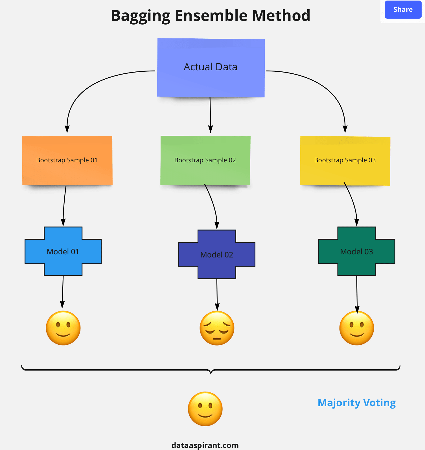

<h1 align="center">Floresta Aleatória (Random Forest)</h1>

Random Forest é um algoritmo de aprendizado de máquina amplamente utilizado, desenvolvido por Leo Breiman e Adele Cutler, que combina a saída de múltiplas árvores de decisão para obter um único resultado. Sua facilidade de uso e flexibilidade impulsionaram sua adoção, pois lida tanto com problemas de classificação quanto de regressão. Neste artigo, vamos entender como o algoritmo Random Forest funciona, como ele difere de outros algoritmos e como usá-lo.

<h2 align="center">O que é o Algoritmo Floresta Aleatória (Random Forest)?</h2>

A ampla popularidade do algoritmo Random Forest advém de sua natureza amigável ao usuário e adaptabilidade, permitindo lidar efetivamente tanto com problemas de classificação quanto de regressão. A força do algoritmo reside em sua capacidade de lidar com conjuntos de dados complexos e mitigar o overfitting, tornando-o uma ferramenta valiosa para várias tarefas preditivas em aprendizado de máquina.

Uma das características mais importantes do algoritmo Random Forest é que ele pode lidar com conjuntos de dados contendo variáveis contínuas, como no caso da regressão, e variáveis categóricas, como no caso da classificação. Ele apresenta um desempenho melhor para tarefas de classificação e regressão. Neste tutorial, vamos entender o funcionamento do Random Forest e implementar o algoritmo em uma tarefa de classificação.

<h2 align="center">Analogia da Vida Real do Random Forest</h2>

Vamos explorar uma analogia da vida real para entender melhor esse conceito. Um estudante chamado X deseja escolher um curso após o ensino médio, e está confuso sobre a escolha do curso com base em suas habilidades. Então, ele decide consultar várias pessoas, como primos, professores, pais, estudantes universitários e trabalhadores. Ele faz a eles diversas perguntas, como por que deveria escolher esse curso, oportunidades de emprego com esse curso, taxa do curso, etc. Finalmente, após consultar várias pessoas sobre o curso, ele decide fazer o curso sugerido pela maioria.

<h2 align="center">Funcionamento do Algoritmo Random Forest</h2>

Antes de entender o funcionamento do algoritmo de random forest em aprendizado de máquina, devemos examinar a técnica de aprendizado em conjunto. A técnica de aprendizado em conjunto simplesmente significa combinar vários modelos. Assim, uma coleção de modelos é usada para fazer previsões em vez de um modelo individual.

O aprendizado em conjunto utiliza dois tipos de métodos:

<h3 align="center">Boosting</h3>

Isso combina aprendizes fracos em aprendizes fortes, criando modelos sequenciais de forma que o modelo final tenha a maior precisão. Por exemplo, ADA BOOST, XG BOOST.

<h3 align="center">Bagging</h3>

Isso cria um subconjunto de treinamento diferente a partir de dados de treinamento amostrais com reposição, e a saída final é baseada na votação majoritária. Por exemplo, Random Forest.

Como mencionado anteriormente, o Random Forest opera segundo o princípio do Bagging. Agora, vamos aprofundar e entender o Bagging em detalhes.

<h3 align="center">Bagging</h3>

Bagging, também conhecido como Bootstrap Aggregation, serve como a técnica de aprendizado em conjunto no algoritmo Random Forest. Aqui estão as etapas envolvidas no Bagging:

<ul>
  <li><b>Seleção do Subconjunto:</b> O Bagging começa escolhendo uma amostra aleatória, ou subconjunto, de todo o conjunto de dados.</li>
  <li><b>Amostragem Bootstrap:</b> Em seguida, cada modelo é criado a partir dessas amostras, chamadas de Amostras Bootstrap, que são retiradas dos dados originais com reposição. Esse processo é conhecido como amostragem de linhas.</li>
  <li><b>Bootstrapping:</b> A etapa de amostragem de linhas com reposição é chamada de bootstrapping.</li>
  <li><b>Treinamento Independente do Modelo:</b> Cada modelo é treinado independentemente em sua correspondente Amostra Bootstrap. Esse processo de treinamento gera resultados para cada modelo.</li>
  <li><b>Votação Majoritária:</b> A saída final é determinada combinando os resultados de todos os modelos por meio da votação majoritária. A previsão mais comum entre os modelos é selecionada.</li>
  <li><b>Agregação:</b> Esta etapa, que envolve a combinação de todos os resultados e a geração da saída final com base na votação majoritária, é conhecida como agregação</li>
</ul>

Agora, vamos analisar um exemplo, quebrando-o com a ajuda da seguinte figura. Aqui, a amostra bootstrap é retirada dos dados reais (Amostra Bootstrap 01, Amostra Bootstrap 02 e Amostra Bootstrap 03) com reposição, o que significa que há uma alta probabilidade de que cada amostra não contenha dados exclusivos. O modelo (Modelo 01, Modelo 02 e Modelo 03) obtido dessa amostra bootstrap é treinado de forma independente. Cada modelo gera resultados conforme mostrado. Agora, o emoji Feliz tem maioria em comparação com o emoji Triste. Assim, com base na votação majoritária, a saída final é obtida como o emoji Feliz.

<h3 align="center">Boosting</h3>

Boosting é uma das técnicas que utiliza o conceito de aprendizado em conjunto. Um algoritmo de boosting combina vários modelos simples (também conhecidos como aprendizes fracos ou estimadores base) para gerar a saída final. Isso é feito construindo um modelo usando modelos fracos em série.

Existem vários algoritmos de boosting; o AdaBoost foi o primeiro algoritmo de boosting realmente bem-sucedido desenvolvido para fins de classificação binária. AdaBoost é uma abreviação de Adaptive Boosting e é uma técnica de boosting prevalente que combina múltiplos "classificadores fracos" em um único "classificador forte". Existem outras técnicas de boosting que você pode procurar saber mais sobre.

<h3 align="center">Passos Envolvidos no Algoritmo Random Forest</h3>
<ul>
  <li><b>Passo 1:</b> No modelo de Random Forest, um subconjunto de pontos de dados e um subconjunto de características são selecionados para construir cada árvore de decisão. Em termos simples, n registros aleatórios e m características são retirados do conjunto de dados que possui k registros.</li>
  <li><b>Passo 2:</b> Árvores de decisão individuais são construídas para cada amostra.</li>
  <li><b>Passo 3:</b> Cada árvore de decisão gera uma saída.</li>
  <li><b>Passo 4:</b> A saída final é considerada com base na Votação Majoritária ou na Média, para Classificação e regressão, respectivamente.</li>
</ul>

<b>Por exemplo:</b>

Considere a cesta de frutas como os dados, conforme mostrado na figura abaixo. Agora, n amostras são retiradas da cesta de frutas, e uma árvore de decisão individual é construída para cada amostra. Cada árvore de decisão gera uma saída, conforme mostrado na figura. A saída final é considerada com base na votação majoritária. Na figura abaixo, você pode ver que a maioria das árvores de decisão dá como saída uma maçã em comparação com uma banana, então a saída final é considerada como uma maçã.

<h2 align="center">Características Importantes do Random Forest</h2>
<ul>
  <li><b>Diversidade:</b> Nem todos os atributos/variáveis/características são considerados ao criar uma árvore individual; cada árvore é diferente.</li>
  <li><b>Imune à Maldição da Dimensionalidade:</b> Como cada árvore não considera todas as características, o espaço de características é reduzido.</li>
  <li><b>Paralelização:</b> Cada árvore é criada independentemente a partir de dados e atributos diferentes. Isso significa que podemos utilizar totalmente a CPU para construir florestas aleatórias.</li>
  <li><b>Divisão de Treino-Teste:</b> Em uma floresta aleatória, não precisamos segregar os dados para treino e teste, pois sempre haverá 30% dos dados que não são vistos pela árvore de decisão.</li>
  <li><b>Estabilidade:</b> A estabilidade surge porque o resultado é baseado em votação majoritária/média.</li>
</ul>
<h2 align="center">Diferença Entre Árvore de Decisão e Random Forest</h2>

Random Forest é uma coleção de árvores de decisão; ainda assim, há muitas diferenças em seu comportamento.

<table>
    <tr>
        <th>Árvores de Decisão</th>
        <th>Random Forest</th>
    </tr>
    <tr>
        <td>1. Árvores de decisão normalmente sofrem com o problema de overfitting se forem permitidas a crescer sem controle.</td>
        <td>1. As florestas aleatórias são criadas a partir de subconjuntos de dados, e a saída final é baseada na média ou na classificação da maioria; portanto, o problema de overfitting é tratado.</td>
    </tr>
    <tr>
        <td>2. Uma única árvore de decisão é mais rápida em termos de computação.</td>
        <td>2. É comparativamente mais lenta.</td>
    </tr>
    <tr>
        <td>3. Quando um conjunto de dados com características é usado como entrada por uma árvore de decisão, ela formulará algumas regras para fazer previsões.</td>
        <td>3. A floresta aleatória seleciona aleatoriamente observações, constrói uma árvore de decisão e obtém o resultado médio. Não utiliza nenhum conjunto de fórmulas.</td>
    </tr>
</table>
