<h1 align="center">AdaBoost</h1>

A seguir apresentaremos uma explicação intuitiva do algoritmo AdaBoost! AdaBoost é um algoritmo de impulsionamento (Boosting) baseado em Florestas Aleatórias (Random Forests).

<h2 align="center">Desmatamento! Oh não!</h2>

Se você já está familiarizado com Florestas Aleatórias(Random Forests), lembrará que uma Floresta Aleatória (Random Forests) é composta por muitas Árvores de Decisão diferentes. AdaBoost é construído usando um conceito semelhante, mas em vez de árvores, o algoritmo usa stumps (tocos).

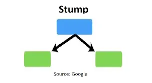

Visualização de stumps (tocos) (imagem cortesia do Google)

Um toco (stump) é uma árvore de decisão composta por um nó raiz + nós folha. E é isso!

À primeira vista, uma floresta de tocos não parece ser uma metodologia de classificação precisa. E é totalmente correto que um único toco não faz um ótimo trabalho de classificação de amostras. Também é verdade que muitos tocos independentes combinados provavelmente não fariam um ótimo trabalho de classificação de uma amostra. É por isso que o AdaBoost combina estruturas de toco com um conceito chamado Impulsionamento.

<h2 align="center">O Impulso no AdaBoost!</h2>

Este artigo pressupõe que você já está familiarizado com o conceito de Impulsionamento. Como lembrete rápido, o Impulsionamento é uma técnica de aprendizado em conjunto em que cada modelo é construído sequencialmente iterando sobre o modelo anterior.

Na floresta de tocos que compõe o AdaBoost, cada toco tem uma quantidade diferente de influência na decisão final de classificação para cada amostra. Isso é diferente do algoritmo de Floresta Aleatória, onde cada árvore tem um voto igual.

No AdaBoost, a ordem é importante. Os erros que o primeiro toco comete influenciam como o segundo toco é feito, e assim por diante, até que o máximo possível de erros seja levado em consideração.

Vamos começar a construir o primeiro toco de um problema de classificação simplificado e inventado para entender melhor como isso funciona.

<h2 align="center">Construindo Nosso Primeiro Stump (Toco)</h2>

Usaremos nossos próprios dados meteorológicos para simular o algoritmo AdaBoost. Neste conjunto de dados fictício, a variável-alvo é RainTomorrow, e possui dois valores possíveis, "Sim" e "Não". O objetivo do nosso problema de classificação é descobrir se choverá no próximo dia com base na temperatura, umidade e se choveu ou não no dia em questão.

O primeiro passo do algoritmo é atribuir a cada amostra um peso igual. Como há quatro amostras em nosso exemplo simplificado, cada amostra receberá o peso 1/4. Após a criação do primeiro toco, os pesos serão alterados para orientar como o próximo toco é criado.

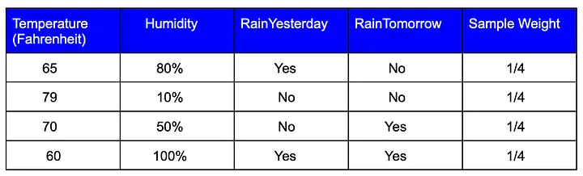

Em seguida, encontramos a variável que faz o melhor trabalho na classificação das amostras usando o Índice GINI. Neste passo, podemos ignorar os pesos, pois atualmente todos são iguais.

Vamos supor que a Umidade teve o maior Índice GINI e escolhê-la para o nó raiz da nossa primeira amostra. Digamos que ela classificou corretamente todas as amostras, exceto a destacada abaixo.

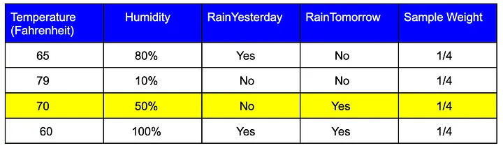

Para determinar quanto peso este toco tem em nossa classificação final, precisaremos calcular o Erro Total e a Quantidade de Influência.

Vamos começar com o erro total. O Erro Total para um toco é a soma dos pesos associados às amostras incorretamente classificadas. Aqui, o erro total é 1/4.

É importante observar que, como todos os Pesos das Amostras somam 1, o Erro Total sempre estará entre 0 (para um toco perfeito) e 1 (para um toco horrível).

Em seguida, usamos o Erro Total para calcular a Quantidade de Influência que um toco tem na classificação final. Isso é calculado usando a equação abaixo.

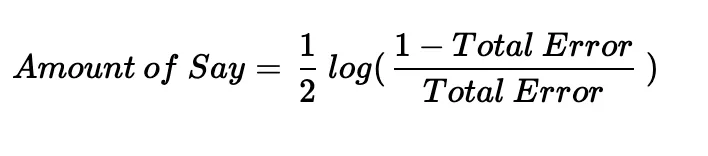

Para entender melhor como esta equação determina a quantidade de influência, vamos visualizá-la.

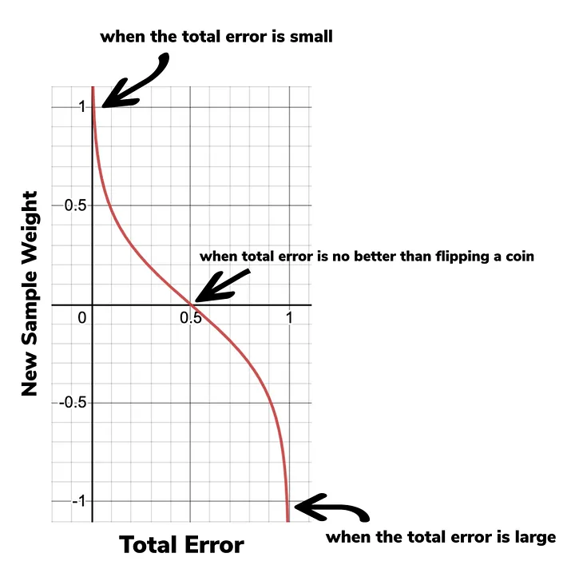

Após analisar a visualização acima, podemos ver que quando um toco faz um bom trabalho e o erro total é pequeno, a Quantidade de Influência é um valor relativamente grande e positivo. E quando um toco faz um trabalho terrível e o Erro Total está próximo de 1 (o que significa que o toco consistentemente fornece a resposta oposta para a classificação), então a Quantidade de Influência será um valor grande e negativo.

Além disso, quando um toco não é melhor na classificação do que um palpite aleatório, como jogar uma moeda, então a Quantidade de Influência será 0. Observação: se o Erro Total for 1 ou 0, então a equação da Quantidade de Influência é indefinida.

Podemos calcular nossa Quantidade de Influência usando nosso Erro Total de 1/4. Isso resulta em:

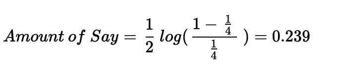

Agora temos nosso Erro Total e nossa Quantidade de Influência, mas precisamos incorporá-los ao nosso algoritmo para que nosso próximo toco leve em consideração os erros do toco atual. Faremos isso usando o Erro Total e a Quantidade de Influência para calcular novos pesos de amostra.

<h2 align="center">Calculando Novos Pesos de Amostra</h2>

A ideia principal por trás do cálculo de novos pesos de amostra é que as amostras que o primeiro toco classifica erroneamente recebem um peso aumentado antes que o próximo toco seja construído. Isso significa que quando o algoritmo for construir a segunda árvore, ele saberá quais amostras são mais importantes para acertar desta vez.

Vamos calcular nossos novos pesos. Para calcular novos pesos de amostra, precisaremos de duas equações separadas. Primeiro, a fórmula para aumentar o peso da amostra que foi classificada incorretamente.

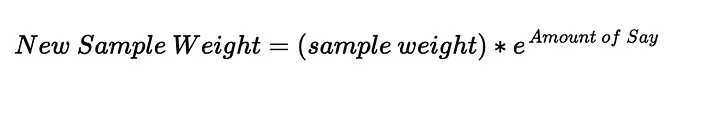

Podemos mais uma vez visualizar isso para nos ajudar a entender melhor como nossa equação funciona.

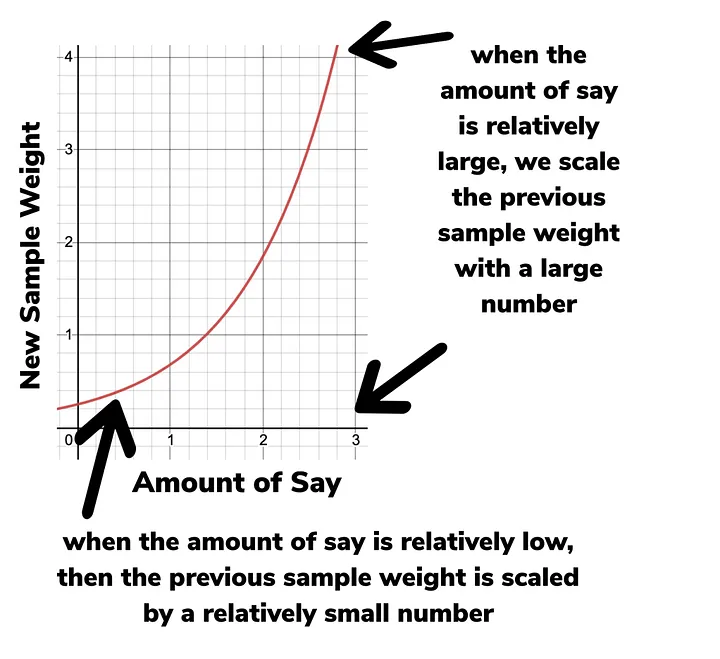

Como você pode ver, quando a Quantidade de Influência é relativamente grande (ou seja, o último toco fez um bom trabalho na classificação das amostras), escalamos o peso anterior da amostra com um número grande. Isso faz com que o novo peso da amostra seja muito maior que o anterior.

E quando a quantidade de influência é relativamente baixa, o peso anterior da amostra é escalado por um número relativamente pequeno. Isso significa que o novo peso da amostra será apenas ligeiramente maior que o anterior.

Vamos calcular nosso novo peso de amostra para nossa amostra classificada incorretamente.

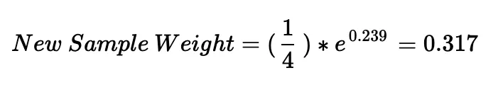

Nossa segunda fórmula é para diminuir os pesos das amostras que foram classificadas corretamente. A fórmula é fornecida abaixo.

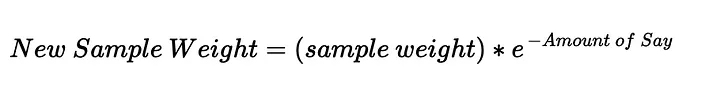

Vamos visualizar essa equação.

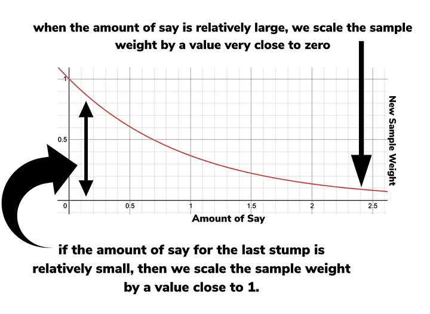

Quando a quantidade de influência é relativamente grande, escalamos o peso da amostra por um valor muito próximo de zero. Isso faz com que o novo peso da amostra seja muito pequeno.

Se a quantidade de influência do último toco for relativamente pequena, então escalamos o peso da amostra por um valor próximo a 1. Isso faz com que o novo peso da amostra seja apenas um pouco menor que o anterior.

Vamos calcular nossos novos pesos de amostra para nossas três amostras classificadas corretamente. Observe que esse valor é menor que 0,25, que foi o valor do primeiro peso da amostra para essas amostras.

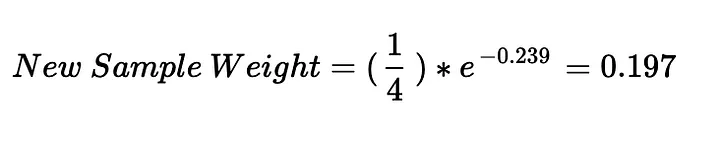

Agora que temos nossos novos pesos de amostra, podemos colocá-los em nosso quadro de dados.

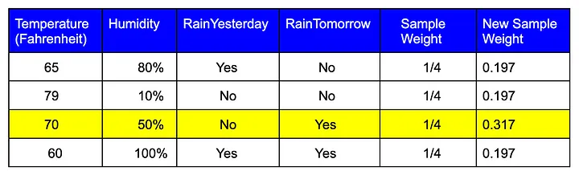

Há mais um passo que precisamos concluir antes de prosseguir. Precisamos normalizar os novos pesos das amostras. Como lembrete, isso significa ajustar cada peso da amostra para que todos os quatro pesos das amostras somem 1. Isso pode ser feito dividindo cada peso da amostra pela soma de todos os novos pesos das amostras.

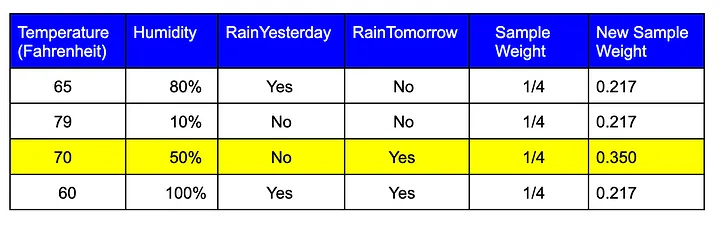

E finalmente, não precisamos mais dos nossos primeiros pesos das amostras. Portanto, nossos novos pesos das amostras tornam-se nossos pesos atuais das amostras!

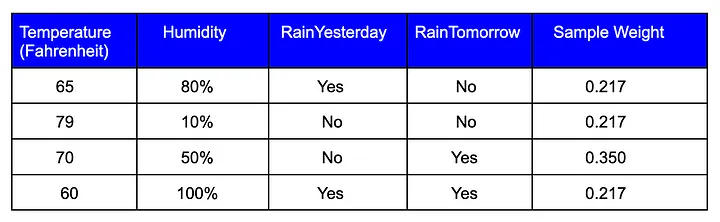

Agora que temos nossos dados meteorológicos de amostra com pesos baseados no primeiro toco, podemos construir nosso próximo toco. (E assim por diante! Isso é AdaBoost!).

<h2 align="center">Configurando Nosso Segundo Stump (Toco)</h2>

Para construir nosso segundo toco, temos duas opções.

<ul>
  <li>Podemos calcular um Índice Gini ponderado para que a variável que faz um bom trabalho na classificação de amostras previamente classificadas incorretamente seja escolhida como a raiz do segundo toco.</li>
  <li>Podemos criar uma nova coleção de amostras que contenha cópias duplicadas das amostras com os maiores pesos das amostras. Isso é feito criando um novo conjunto de dados vazio. Em seguida, para cada linha no novo conjunto de dados vazio, escolheríamos um número aleatório entre 0 e 1 e veríamos onde esse número se encaixa quando usamos os pesos das amostras como uma distribuição. Em seguida, preencheríamos a linha de acordo. Continuaríamos esse processo até que todas as linhas na nova coleção de amostras sejam preenchidas.</li>
</ul>

Uma vez escolhido o método para configurar o segundo toco, essa metodologia será usada para todos os tocos restantes.

<h2 align="center">Decidindo a Classificação Final</h2>

Você pode estar se perguntando — uma vez que todos os tocos realizaram a classificação, como esta floresta de tocos decide a classificação final para cada amostra? Aqui está como funciona para uma amostra. Vamos assumir que a variável-alvo tinha duas respostas possíveis, assim como nossos dados de exemplo — 'Sim' e 'Não'.

Primeiro, somamos a quantidade de influência para todos os tocos que classificaram como 'Sim'. Em seguida, fazemos o mesmo para todos os tocos que classificaram como 'Não'. A soma que for maior vence como a classificação final da amostra.

Esse processo é realizado para todas as amostras no conjunto de dados de teste. Uma vez concluído esse processo, a classificação do AdaBoost também está concluída."

