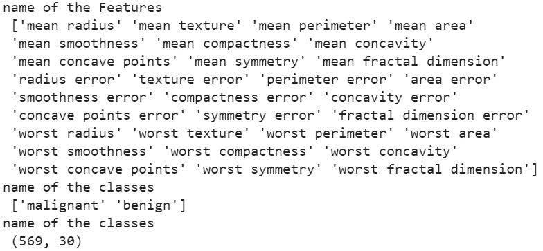

<h1 align="center">Gradient Boosting</h1>

Nos últimos artigos, discutimos a introdução aos algoritmos de boosting e conhecemos o Algoritmo AdaBoost. Este artigo tem como objetivo continuar esta série de artigos e discutir o algoritmo Gradient Boosting.

Este algoritmo é uma parte crucial da família de modelos de aprendizado de máquina em conjunto. A ideia básica por trás desse algoritmo baseia-se na principal ideia do algoritmo de boosting. Como o nome sugere, este algoritmo também é baseado na ideia do algoritmo de gradiente descendente.

Como já sabemos, usamos algoritmos de boosting para aumentar a precisão do procedimento de modelagem de aprendizado de máquina. Aqui, a rapidez na tomada de decisões e a precisão fazem com que este algoritmo se destaque. Esta é a razão pela qual encontramos sua aplicação em muitas competições e projetos de ciência de dados do mundo real. Vamos começar a entender o algoritmo Gradient Boosting usando a seguinte tabela de conteúdos.

<h2 align="center">O que é o Algoritmo Gradient Boosting</h2>

Devido aos artigos anteriores, já sabemos que a ideia por trás do algoritmo de boosting é alinhar vários modelos em sequência para que possam aprender com os erros dos outros modelos e, nas etapas finais, fornecer uma maior precisão. Uma pergunta que surge aqui é como o método de descida do gradiente funciona nesse alinhamento sequencial?

Se olharmos para o método de descida do gradiente, veremos que é um algoritmo de otimização iterativo usado para minimizar uma determinada função de perda ou função de custo. No aprendizado de máquina, usamos para atualizar os parâmetros de um modelo ou encontrar os valores ideais que minimizam a diferença entre valores previstos e reais.

Quando fazemos isso funcionar no paradigma do algoritmo de boosting, atribuímos a esse método um papel de otimizar os parâmetros do novo modelo. Em cada iteração, o novo modelo é treinado para minimizar a função de perda ajustando seus parâmetros usando a descida do gradiente. Devido ao uso deste método na otimização e redução da perda, chamamos este método de método de boosting por gradiente.

<h2 align="center">Como o Gradient Boosting Funciona</h2>

Acima, ficamos sabendo que, devido ao uso do método de descida do gradiente para otimizar os parâmetros do novo modelo no boosting, chamamos isso de gradient boosting. A ideia-chave no gradient boosting é que cada novo modelo adicionado ao conjunto se concentra em corrigir os erros cometidos pelos modelos anteriores. Ao minimizar iterativamente os resíduos e melhorar as previsões, o conjunto aumenta gradualmente sua precisão.

Vamos tentar entender o funcionamento deste algoritmo de boosting usando um exemplo de um conjunto de dados com uma variável de entrada (x) e uma variável-alvo contínua (y). Nosso objetivo aqui é construir um modelo de regressão usando o algoritmo de gradient boosting.

O algoritmo seguirá as etapas a seguir:

<ul>
  <li>Ele começará treinando um modelo base (geralmente uma árvore de decisão). Este modelo fornece previsões para todo o conjunto de dados.</li>
  <li>Após fazer previsões, usando os valores originais, ele calcula os erros. Esses erros podem ser considerados como as partes de y que ainda não foram explicadas pelo modelo base.</li>
  <li>Antes de aplicar o próximo modelo sequenciado, o algoritmo aplica o método de descida do gradiente para calcular os parâmetros otimizados do próximo modelo.</li>
  <li>Treina um novo modelo, e esse modelo é ajustado para minimizar a diferença entre os resíduos previstos e os resíduos reais.</li>
  <li>Após treinar um novo modelo, este algoritmo calcula os novos resíduos subtraindo as previsões atualizadas dos valores reais de y. Esses resíduos representam a variabilidade restante não explicada na variável-alvo.</li>
  <li>Todo esse processo é repetido iterativamente, adicionando os novos modelos ao conjunto enquanto aplica a descida do gradiente nele e atualiza as previsões e resíduos.</li>
  <li>Na etapa final, o método combina as previsões de todos os modelos, onde consideramos as previsões finais como uma estimativa refinada de y.</li>
</ul>

O exemplo acima representa o modelo de regressão usando o algoritmo de gradient boosting, e também podemos realizar classificação usando o mesmo método. Agora, vamos dar uma olhada na implementação de um algoritmo de gradient boosting usando a linguagem de programação Python.

<h2 align="center">Código Python</h2>

Para implementar o algoritmo de gradient boosting na linguagem de programação Python, a biblioteca Scikit-learn fornece a funcionalidade por meio de seu pacote de aprendizado de conjunto. Neste artigo, estamos utilizando o popular conjunto de dados de câncer de mama (do Scikit-learn) para ver a implementação. Vamos começar importando bibliotecas importantes.

<pre>
from sklearn.datasets import load_breast_cancer
from sklearn.ensemble import GradientBoostingClassifier
from sklearn.model_selection import train_test_split
from sklearn.metrics import accuracy_score,confusion_matrix
</pre>

Agora vamos importar os dados.

<pre>
data = load_breast_cancer()
X = data.data
y = data.target
</pre>

Aqui, importamos os dados; vamos verificar a descrição desses dados.

<pre>
print('name of the Features \n', data.feature_names)
print('name of the classes \n', data.target_names)
print('name of the classes \n', data.data.shape)
</pre>

Output:

Aqui podemos ver os nomes das características, classes e o tamanho dos dados. Dividiremos os dados para que, após treinar o modelo de gradient boosting, possamos testar o modelo e verificar seu desempenho.

<pre>
X_train, X_test, y_train, y_test = train_test_split(X, y, test_size=0.2, random_state=42)
</pre>

Vamos treinar o modelo de gradient boosting.

Definindo o objeto do modelo

<pre>
GBM = GradientBoostingClassifier(n_estimators=100, random_state=42)
</pre>

Treinando o modelo

<pre>
GBM.fit(X_train, y_train)
</pre>

Fazendo previsões a partir dos dados treinados.

<pre>
y_pred = GBM.predict(X_test)
</pre>

Vamos validar o modelo calculando a precisão (accuracy) com base nas previsões feitas pelo modelo.

<pre>
accuracy = accuracy_score(y_test, y_pred)
print("Accuracy of Gradient Boosting:", accuracy)
</pre>

Output:

<pre>
Accuracy of Gradient Boosting: 0.956140350877193
</pre>

Aqui podemos ver a precisão do modelo; vamos verificar a matriz de confusão para validá-la mais.

<pre>
import pandas as pd
import numpy as np
cm = confusion_matrix(y_test, y_pred)
cm_df = pd.DataFrame(cm, index=[i for i in range(2)], columns=[i for i in range(2)])
cm_df
</pre>

Output:

Aqui podemos ver que o modelo fez 5 previsões incorretas em 114 pontos de dados. Isso pode ser considerado um bom desempenho do modelo. Vamos dar uma olhada nas vantagens e desvantagens do algoritmo de gradient boosting.

<h2 align="center">Vantagens e Desvantagens do Gradient Boosting</h2>
<h3 align="center">Vantagens do Gradient Boosting</h3>

Assim como outros algoritmos de aprendizado de máquina, este algoritmo também possui suas próprias vantagens e desvantagens. Quando falamos sobre o poder preditivo de diferentes modelos, este algoritmo possui alta precisão preditiva e é capaz de capturar relações e padrões complexos nos dados. Existem várias vantagens. Vamos dar uma olhada nelas:

<ul>
  <li>É capaz de se sair bem em problemas de classificação e regressão, podendo ser considerado um algoritmo flexível.</li>
  <li>Algoritmos de gradient boosting com árvores de decisão podem lidar com valores ausentes nos dados usando divisões substitutas durante o processo de construção da árvore.</li>
  <li>O gradient boosting é relativamente robusto a valores atípicos, pois a influência de pontos de dados individuais é mitigada por meio da abordagem de conjunto.</li>
</ul>
<h3 align="center">Desvantagens do Gradient Boosting</h3>
<ul>
  <li>Embora seja robusto a valores atípicos, também é computacionalmente caro, especialmente ao lidar com grandes conjuntos de dados ou árvores profundas. Treinar o modelo pode exigir mais tempo e recursos em comparação com algoritmos mais simples.</li>
  <li>No caso de modelos complexos ou taxas de aprendizado elevadas, o gradiente descendente pode ser propenso ao problema de overfitting.</li>
  <li>O gradiente descendente é frequentemente considerado um modelo menos interpretável ou de "caixa preta". Compreender a relação exata entre preditores e resultados pode ser desafiador devido à estrutura de conjunto complexa.</li>
</ul>
<h2 align="center">Conclusão</h2>

Neste artigo, vimos como dois métodos diferentes podem ser combinados para criar um novo método. O método de aprendizado de conjunto discutido acima é uma combinação dos algoritmos de boosting e gradient descent. Nessa combinação, o boosting tenta alinhar modelos em uma sequência, enquanto o gradiente descendente tenta otimizar os parâmetros dos novos modelos na sequência para que haja uma redução maior nos erros.

Podemos pensar neste método como o primeiro algoritmo de boosting que trabalha com outro algoritmo de aprendizado de máquina. Existem várias vantagens, bem como desvantagens, neste algoritmo de aprendizado de máquina, e ao conhecê-las, podemos usar esse algoritmo de maneira mais apropriada.

