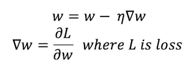

<h1 align="center">XGBoost</h1>

A Inteligência Artificial enfrenta desafios quando precisa lidar com dados não estruturados, como sequenciamento de DNA, transações com cartão de crédito e até mesmo em cibersegurança, que é a base para manter nossa presença online segura. Curioso? Não se preocupe! Nós cuidamos disso para você. Na era cibernética, a Aprendizado de Máquina (ML), como um campo da Inteligência Artificial, nos proporcionou soluções para muitos problemas considerados insolúveis, incluindo os mencionados acima, com a implementação de Máquinas de Impulso Gradiente (GBM, na sigla em inglês). Existem muitos algoritmos prontamente disponíveis para realizar o impulso gradiente; no entanto, ainda podemos enfrentar diferentes problemas, como baixa precisão, perda elevada, grande variação no resultado, dependendo da aplicação. Portanto, vamos apresentar a você um algoritmo de aprendizado de máquina de última geração chamado XGBoost, desenvolvido por Tianqi Chen, que não apenas superará esses problemas, mas também se sairá excepcionalmente bem para problemas de regressão e classificação. Este blog ajudará você a descobrir a lógica, técnicas e habilidades com o XGBoost que você pode aplicar em seus projetos de aprendizado de máquina.

<h2 align="center">XGBoost, em uma visão geral!</h2>

eXtreme Gradient Boosting (XGBoost) é uma versão escalável e aprimorada do algoritmo de impulso gradiente (atenção à terminologia) projetada para eficácia, velocidade computacional e desempenho do modelo. É uma biblioteca de código aberto e faz parte da Comunidade de Aprendizado de Máquina Distribuído. O XGBoost é uma combinação perfeita de capacidades de software e hardware projetadas para aprimorar as técnicas de impulso existentes com precisão em um curto período de tempo. Dê uma olhada rápida em uma comparação objetiva de benchmark do XGBoost com outros algoritmos de impulso gradiente treinados em uma floresta aleatória com 500 árvores, realizada por Szilard Pafka.

Muito complexo para compreender? Não se preocupe! Vamos primeiro entender os rudimentos dos métodos de aprendizado de máquina que nos levam ao XGBoost e à vitalidade de seu desempenho.

<h2 align="center">Um breve retrospecto sobre Boosting:</h2>

Boosting geralmente significa aumentar o desempenho. Em ML, Boosting é uma técnica sequencial de aprendizado de conjunto (outra atenção à terminologia, não se preocupe! vamos explicar isso também) para converter uma hipótese fraca ou aprendizes fracos em aprendizes fortes para aumentar a precisão do modelo.
Podemos entender a necessidade de boosting por meio de um exemplo simples de classificação: Classificar uma conta no Twitter como Bot ou Humana com a ajuda de regras subjacentes (limitadas em extensão):

<ul>
  <li>Nenhuma informação da conta e foto de perfil → Bot</li>
  <li>Nome de usuário é um absurdo → Bot</li>
  <li>Tweetando em mais de um idioma → Bot</li>
  <li>Tem uma quantidade adequada de atividade e uma foto → Humana</li>
  <li>Uma quantidade enorme de tweets por dia → Bot</li>
  <li>Outras contas de mídia social vinculadas → Humana</li>
</ul>

Agora que estamos cientes das regras, vamos aplicá-las no exemplo abaixo: <b>Cenário</b> — Uma conta postando tweets em inglês e francês.

A terceira regra classificará como um bot, mas isso será uma previsão incorreta, pois uma pessoa pode conhecer e tweetar em vários idiomas. Consequentemente, com base em uma única regra, nossa previsão pode ser falha. Uma vez que essas regras individuais não são fortes o suficiente para fazer uma previsão precisa, são chamadas de aprendizes fracos. Tecnicamente, um aprendiz fraco é um classificador que tem uma correlação fraca com o valor real. Portanto, para tornar nossas previsões mais precisas, criamos um modelo que combina as previsões dos aprendizes fracos para criar um aprendiz forte, e isso é feito usando a técnica de boosting.

Regras fracas são geradas em cada iteração por algoritmos de aprendizado base, que em nosso caso podem ser de dois tipos:

<ul>
  <li>Árvore como aprendiz base</li>
  <li>Aprendiz base linear</li>
</ul>

Geralmente, árvores de decisão são aprendizes base padrão para boosting.

Interessado em saber mais sobre aprendizes? Fique tranquilo, demonstraremos como usar ambos os aprendizes base para treinar modelos XGBoost em uma seção posterior.

Primeiro, vamos entender a técnica de aprendizado de conjunto mencionada acima.

<h2 align="center">Aprendizado de Conjunto (Ensemble Learning):</h2>

O aprendizado de conjunto é um processo no qual decisões de vários modelos de aprendizado de máquina são combinadas para reduzir erros e melhorar as previsões quando comparadas a um único modelo de aprendizado de máquina. Em seguida, a técnica de votação máxima é usada nas decisões agregadas (ou previsões na linguagem de aprendizado de máquina) para deduzir a previsão final. Está confuso?

Pense nisso como organizar rotas eficientes para o trabalho, faculdade ou supermercados. Assim como você pode usar várias rotas para chegar ao seu destino, tende a aprender sobre o tráfego e o atraso que pode causar em diferentes momentos do dia, permitindo que você planeje uma rota perfeita, o aprendizado de conjunto é semelhante!

Esta imagem mostra uma clara distinção entre um único modelo de aprendizado de máquina em relação a um aprendiz de conjunto:

<h3 align="center">Tipos de Aprendizado de Conjunto (Ensemble Learning):</h3>

Os métodos de aprendizado de conjunto podem ser realizados de duas maneiras:

<ul>
  <li>Bagging (conjunto paralelo)</li>
  <li>Boosting (conjunto sequencial)</li>
</ul>

Embora ambos tenham alguma matemática fascinante por baixo, não precisamos conhecê-la para poder usá-los como ferramentas. Nosso foco será mais na compreensão do Boosting devido à sua relevância para o XGBoost.

<h3 align="center">Funcionamento do algoritmo de boosting:</h3>

O algoritmo de boosting cria novos aprendizes fracos (modelos) e combina sequencialmente suas previsões para melhorar o desempenho geral do modelo. Para qualquer previsão incorreta, são atribuídos pesos maiores às amostras classificadas incorretamente e menores às amostras classificadas corretamente. Modelos de aprendizes fracos que se saem melhor têm pesos mais altos no modelo de conjunto final. O boosting nunca altera o preditor anterior e apenas corrige o próximo preditor aprendendo com os erros. Como o boosting é ganancioso, é recomendável definir um critério de parada, como o desempenho do modelo (parada precoce) ou várias etapas (por exemplo, profundidade da árvore em aprendizes baseados em árvore) para evitar o overfitting dos dados de treinamento. A primeira implementação do boosting foi chamada de AdaBoost (Adaptive Boosting) que já vimos nos estudos passados.

<pre>
Capital F(i) é o modelo atual, F(i-1) é o modelo anterior e f(i) representa um modelo fraco.
</pre>

Se sentindo confiante? Dê uma olhada em mais dois algoritmos (CART e Gradient Boosting) para entender a mecânica do XGBoost antes de aprofundarmos mais no tópico.

<h3 align="center">Árvores de Classificação e Regressão (CART):</h3>

Uma árvore de decisão é um algoritmo de aprendizado de máquina supervisionado usado para modelagem preditiva de uma variável dependente (alvo) com base na entrada de várias variáveis independentes. Ela tem uma estrutura em forma de árvore com a raiz no topo. CART, que significa Classificação e Regressão de Árvores, é usado como um termo genérico para se referir aos seguintes tipos de árvores de decisão:

<b>Árvores de Classificação</b>: onde a variável de destino é fixa ou categórica, esse algoritmo é usado para identificar a classe/categoria na qual o alvo mais provavelmente se encaixaria.

<b>Árvores de Regressão</b>: onde a variável de destino é contínua e a árvore/algoritmo é usado para prever seu valor, por exemplo, prever o tempo.

<h3 align="center">Gradient Boosting:</h3>

O gradient boosting é um caso especial de algoritmo de boosting, onde os erros são minimizados por um algoritmo de descida de gradiente e produzem um modelo na forma de modelos de previsão fracos, como árvores de decisão.

A principal diferença entre boosting e gradient boosting está em como ambos os algoritmos atualizam o modelo (aprendizes fracos) a partir de previsões incorretas. O gradient boosting ajusta os pesos pelo uso do gradiente (uma direção na função de perda) usando um algoritmo chamado Descida de Gradiente, que otimiza iterativamente a perda do modelo atualizando os pesos. Perda normalmente significa a diferença entre o valor previsto e o valor real. Para algoritmos de regressão, usamos a perda de MSE (Erro Quadrático Médio) como métrica de avaliação, enquanto para problemas de classificação, usamos a perda logarítmica.

<pre>
w representa o vetor de pesos, η é a taxa de aprendizado.
</pre>
<h3 align="center">Processo de Gradient Boosting:</h3>

O gradient boosting utiliza Modelagem Aditiva, na qual uma nova árvore de decisão é adicionada uma de cada vez a um modelo que minimiza a perda usando descida de gradiente. As árvores existentes no modelo permanecem intocadas, diminuindo assim a taxa de overfitting. A saída da nova árvore é combinada com a saída das árvores existentes até que a perda seja minimizada abaixo de um limiar ou o número especificado de árvores seja atingido.

A Modelagem Aditiva na matemática é uma decomposição de uma função na adição de N subfunções. Em termos estatísticos, pode ser considerada como um modelo de regressão no qual a resposta y é a soma aritmética dos efeitos individuais das variáveis preditoras x.

<h2 align="center">XGBOOST em ação</h2>

O que torna o XGBoost um algoritmo essencial para ganhar em Machine Learning e competições Kaggle?

<h3 align="center">Recursos do XGBOOST</h3>

Não é interessante ver uma única ferramenta para lidar com todos os nossos problemas de impulso! Aqui estão os recursos com detalhes e como eles são incorporados no XGBoost para torná-lo robusto.

<h3 align="center">Processo de Gradient Boosting:</h3>
<ul>
  <li><b>Poda de Árvores (Tree Pruning)</b> — A poda é uma técnica de aprendizado de máquina para reduzir o tamanho de árvores de regressão, substituindo nós que não contribuem para melhorar a classificação nas folhas. A ideia da poda de uma árvore de regressão é evitar o overfitting dos dados de treinamento. O método mais eficiente para poda é o de Poda de Complexidade de Custo ou Poda do Elo Mais Fraco, que internamente utiliza erro médio quadrático, validação cruzada k-fold e taxa de aprendizado. O XGBoost cria nós (também chamados de divisões) até a max_depth especificada e inicia a poda de trás para frente até que a perda esteja abaixo de um limiar. Considere uma divisão que tem uma perda de -3 e o nó subsequente tem uma perda de +7, o XGBoost não removerá a divisão apenas olhando uma das perdas negativas. Ele calculará a perda total (-3 + 7 = +4) e, se for positiva, manterá ambas.</li>
  <li><b>Encontrar Divisões Conscientes de Esparsidade (Sparsity Aware Split Finding)</b> — É bastante comum que os dados que coletamos tenham esparsidade (muitos valores ausentes ou vazios) ou se tornem esparsos após a realização de engenharia de dados (codificação de características). Para estar ciente dos padrões de esparsidade nos dados, uma direção padrão é atribuída a cada árvore. O XGBoost lida com dados ausentes atribuindo-os à direção padrão e encontrando o melhor valor de imputação para minimizar a perda de treinamento. A otimização aqui é visitar apenas os valores ausentes, o que faz com que o algoritmo execute 50 vezes mais rápido do que o método ingênuo.</li>
</ul>
<h3 align="center">Aprimoramentos no Sistema:</h3>
<ul>
  <li><b>Parallelization (Paralelização)</b> — A aprendizagem da árvore precisa de dados de maneira ordenada. Para reduzir os custos de ordenação, os dados são divididos em blocos comprimidos (cada coluna com o valor de característica correspondente). O XGBoost ordena cada bloco paralelamente usando todos os núcleos/threads disponíveis da CPU. Essa otimização é valiosa, uma vez que um grande número de nós é criado frequentemente em uma árvore. Em resumo, o XGBoost paraleliza o processo sequencial de geração de árvores.</li>
  <li><b>Cache Aware (Consciência de Cache)</b> — Por meio de otimização consciente de cache, armazenamos estatísticas de gradiente (direção e valor) para cada nó de divisão em um buffer interno de cada thread e realizamos a acumulação de maneira por mini-lotes. Isso ajuda a reduzir o tempo de overhead de operações de leitura/gravação imediatas e também evita a falta de cache. A consciência de cache é alcançada escolhendo o tamanho ideal do bloco (geralmente 2¹⁶).</li>
</ul>
<h3 align="center">Flexibilidade no XGBoost:</h3>

1.<b>Função Objetivo Personalizada (Customized Objective Function)</b> — Uma função objetivo tem a intenção de maximizar ou minimizar algo. Em ML, tentamos minimizar a função objetivo, que é uma combinação da função de perda e termo de regularização."

<pre>
L(Φ) é a função objetiva
</pre>

Otimizar a função de perda incentiva modelos preditivos, enquanto otimizar a regularização leva a uma menor variância e torna as previsões mais estáveis. Diferentes funções objetivas disponíveis no XGBoost são:

<ul>
  <li>reg: linear para regressão</li>
  <li>reg: logistic e binary: logistic para classificação binária</li>
  <li>multi: softmax e multi: softprob para classificação multiclasse</li>
</ul>

2.Métrica de Avaliação Personalizada — Esta é uma métrica usada para monitorar a precisão do modelo nos dados de validação.

<ul>
  <li>rmse — Erro quadrático médio (Regressão)</li>
  <li>mae — Erro médio absoluto (Regressão)</li>
  <li>error — Erro de classificação binária (Classificação)</li>
  <li>logloss — Log-verossimilhança negativa (Classificação)</li>
  <li>auc — Área sob a curva (Classificação)</li>
</ul>
<h3 align="center">Cross-validation (Validação Cruzada):</h3>

1.Validação Cruzada Incorporada — A validação cruzada é um método estatístico para avaliar modelos de aprendizado de máquina em dados não vistos. É útil quando o conjunto de dados é limitado e evita o overfitting, não retirando uma amostra independente (holdout) dos dados de treinamento para validação. Ao reduzir o tamanho dos dados de treinamento, comprometemos as características e padrões ocultos nos dados, o que pode induzir erros em nosso modelo. Isso é semelhante à funcionalidade cross_val_score fornecida pela biblioteca scikit-learn.

O XGBoost usa a função de validação cruzada incorporada cv():

<pre>
xgb.cv()
</pre>

<b>Quer experimentar por conta própria?</b>

<pre>
import xgboost as xgb
import pandas as pd
from sklearn.datasets import load_boston

#Carrega o conjunto de dados de Boston
X, y = load_boston(return_X_y=True)

#Cria uma matriz DMatrix a partir dos dados
boston_dmatrix = xgb.DMatrix(data=X, label=y)

#Lista de parâmetros de regularização
reg_params = [1, 10, 100]

#Parâmetros do modelo
params = {"objective": "reg:squarederror", "max_depth": 3}

#Cria uma lista vazia para armazenar os valores de RMSE em função da complexidade da regressão ridge
ridge_regression = []

#Itera sobre os parâmetros de regularização
for reg in reg_params:

    #Atualiza a força do termo L2
    params["lambda"] = reg

    #Passa este dicionário de parâmetros atualizado para o cv
    cv_results_rmse = xgb.cv(dtrain=boston_dmatrix, params=params, nfold=5, num_boost_round=5, metrics="rmse", as_pandas=True, seed=123)

    #Adiciona o melhor RMSE (última rodada) à lista
    ridge_regression.append(cv_results_rmse["test-rmse-mean"].tail(1).values[0])

#Exibe o melhor RMSE para cada parâmetro de regularização
print("Best RMSE as a function of ridge regression (L2 regularization):")
print(pd.DataFrame(list(zip(reg_params, ridge_regression)), columns=["l2", "rmse"]))
</pre>

DMatrix é uma estrutura de dados interna usada pelo XGBoost, otimizada para eficiência de memória e velocidade de treinamento. Precisamos transformar nosso array numpy de dados usando DMatrix para que ele possa ser posteriormente utilizado nos parâmetros dtrain e dtest de suas funções integradas.

2. k-fold Cross-validation — Na validação cruzada k-fold, os dados são embaralhados e divididos em k subamostras de tamanhos iguais. Uma das k subamostras é usada como conjunto de teste/validação, e as restantes (k - 1) subamostras são agrupadas para serem usadas como dados de treinamento. Em seguida, ajustamos um modelo usando dados de treinamento e o avaliamos usando o conjunto de teste. Esse processo é repetido k vezes, de modo que cada ponto de dados permaneça no conjunto de validação exatamente uma vez. Os k resultados de cada modelo devem ser médios para obter a estimativa final. A vantagem desse método é que reduzimos significativamente o viés, a variância e aumentamos a robustez do modelo.

Validação cruzada k-fold usando sklearn no XGBoost:

<pre>
from sklearn.model_selection import KFold, cross_val_score

kfold = KFold(n_splits=15)
xgboost_score = cross_val_score(xg_cl, X, y, cv=kfold)
</pre>
<h3 align="center">Tunando como um profissional!</h3>

O ajuste de modelo no XGBoost pode ser implementado por estratégias de validação cruzada como GridSearchCV e RandomizedSearchCV.

1. Grid Search — Passamos um dicionário de parâmetros para a função e comparamos a pontuação de validação cruzada para cada combinação de parâmetros (muitos para muitos) no dicionário e retornamos o conjunto com os melhores parâmetros.

2. Random Search — Selecionamos um valor aleatório durante cada iteração a partir do intervalo de valores especificados para cada hiperparâmetro pesquisado e avaliamos um modelo com esses hiperparâmetros. Após completar todas as iterações, ele escolhe a configuração de hiperparâmetros com a melhor pontuação.

<pre>
import xgboost as xgb
import numpy as np
from sklearn.model_selection import GridSearchCV
from sklearn.model_selection import RandomizedSearchCV
from sklearn.datasets import load_boston

#Carrega o conjunto de dados de Boston para regressão
X, y = load_boston(return_X_y=True)

#Converte os dados para uma estrutura otimizada para XGBoost (DMatrix)
dmatrix = xgb.DMatrix(data=X, label=y)

#Parâmetros para Grid Search
grid_search_params = {
    'colsample_bytree': [0.3, 0.7],
    'learning_rate': [0.01, 0.1, 0.2, 0.5],
    'n_estimators': [100],
    'subsample': [0.2, 0.5, 0.8],
    'max_depth': [2, 3, 5]
}

#Instancia um regressor XGBoost para Grid Search
xg_grid_reg = xgb.XGBRegressor(objective= "reg:squarederror")

#Configura o Grid Search com os parâmetros especificados
grid = GridSearchCV(estimator=xg_grid_reg, param_grid=grid_search_params, scoring='neg_mean_squared_error',
                    cv=4, verbose=1, iid=True)
                    
#Executa o Grid Search no conjunto de dados
grid.fit(X, y)
print("GridSearchCV")
print("Best parameters found: ", grid.best_params_)
print("Lowest RMSE found: ", np.sqrt(np.abs(grid.best_score_)))

#Parâmetros para Random Search
params_random_search = {
    'learning_rate': np.arange(0.01, 1.01, 0.01),
    'n_estimators': [200],
    'max_depth': range(2, 12),
    'subsample': np.arange(0.02, 1.02, 0.02)
}

#Instancia um regressor XGBoost para Random Search
xg_random_reg = xgb.XGBRegressor(objective= "reg:squarederror")

#Configura o Random Search com os parâmetros especificados
randomized_mse = RandomizedSearchCV(param_distributions=params_random_search, estimator=xg_random_reg,
                                    scoring="neg_mean_squared_error", n_iter=5, cv=4, verbose=1, iid=True)

#Executa o Random Search no conjunto de dados                                    
randomized_mse.fit(X, y)

print("Randomize Search Cross Validation")
print("Best parameters found: ", randomized_mse.best_params_)
print("Lowest RMSE found: ", np.sqrt(np.abs(randomized_mse.best_score_)))
</pre>

Output usando Grid Search

Outuput usando Random Serch

Configurações totais no Grid Search → 2*4*1*3*3 = 72

Configurações totais no Random Search → 100*1*10*50 = 50000

<h3 align="center">Extensibilidade:</h3>
<h3 align="center">1. Classificação usando XGBoost</h3>
<pre>
import numpy as np
from numpy import loadtxt
import xgboost as xgb
from matplotlib import pyplot
from sklearn.model_selection import train_test_split

#Carrega os dados a partir de um arquivo CSV 
df = loadtxt('./dataset.csv', delimiter=",")

#Divide os dados em matrizes de características (X) e rótulos (y)
X = df[:, 0:8]
y = df[:, 8]

#Divide os dados em conjuntos de treinamento e teste
X_train, X_test, y_train, y_test = train_test_split(X, y, test_size=0.2, random_state=123)

#Instancia um classificador XGBoost para classificação binária
xg_cl = xgb.XGBClassifier(objective='binary:logistic', n_estimators=100, seed=123)

#Define o conjunto de avaliação para monitorar o desempenho durante o treinamento
eval_set = [(X_train, y_train), (X_test, y_test)]

#Treina o classificador no conjunto de treinamento
xg_cl.fit(X_train, y_train, eval_metric=["error"], eval_set=eval_set, verbose=True)

#Obtém os resultados da avaliação durante o treinamento
results = xg_cl.evals_result()

#Faz previsões no conjunto de teste
predictions = xg_cl.predict(X_test)

#Calcula a acurácia do modelo
accuracy = float(np.sum(predictions == y_test))/y_test.shape[0]
print("accuracy: %f" % (accuracy*100))

#Plota a curva de erro de classificação ao longo do treinamento
epochs = len(results['validation_0']['error'])
x_axis = range(0, epochs)
fig, ax = pyplot.subplots()
ax.plot(x_axis, results['validation_0']['error'], label='Train')
ax.plot(x_axis, results['validation_1']['error'], label='Test')
</pre>

<h3 align="center">2. Regressão usando XGBoost:</h3>
<h3 align="center">2.1. Aprendizado Base com Árvore de Decisão</h3>
<pre>
import xgboost as xgb
import pandas as pd
from sklearn.model_selection import train_test_split
from sklearn.metrics import explained_variance_score

#Dados da casa KC
df = pd.read_csv('./kc_house_data.csv')
df_train = df[['bedrooms', 'bathrooms', 'sqft_living', 'floors', 'waterfront', 'view', 'grade', 'lat', 'yr_built', 'sqft_living15']]

X = df_train.values
y = df.price.values

#Divide os dados em conjuntos de treinamento e teste
X_train, X_test, y_train, y_test = train_test_split(X, y, test_size=0.2, random_state=123)

#Ajustando o modelo de regressão XGB e o aprendizado base padrão é a Árvore de Decisão
xgb_reg = xgb.XGBRegressor(objective="reg:linear", n_estimators=75, subsample=0.75, max_depth=7)
xgb_reg.fit(X_train, y_train)

#Fazendo previsões
predictions = xgb_reg.predict(X_test)

#Pontuação de variância
print((explained_variance_score(predictions, y_test)))

#Para converter a tabela de dados em uma matriz
kc_dmatrix = xgb.DMatrix(data=X, label=y, feature_names=df_train)

#Criar o dicionário de parâmetros: params
params = {"objective": "reg:linear", "max_depth": 2}

#Treinar o modelo: xg_reg
xg_reg = xgb.train(params=params, dtrain=kc_dmatrix, num_boost_round=10)

#Plotar a primeira árvore com num_trees = 0 e a importância das features
xgb.plot_tree(xg_reg, num_trees=0)
xgb.plot_importance(xg_reg)
</pre>

<h3 align="center">2.2. Aprendizado Base Linear</h3>
<pre>
import numpy as np
import xgboost as xgb
from sklearn.datasets import load_boston
from sklearn.metrics import mean_squared_error
from sklearn.model_selection import train_test_split

#Aprendizado Base Linear
#Carrega o conjunto de dados de Boston para regressão
X, y = load_boston(return_X_y=True)

#Divide os dados em conjuntos de treinamento e teste
X_train, X_test, y_train, y_test = train_test_split(X, y, test_size=0.2, random_state=123)

#Converte os conjuntos de treinamento e teste em DMatrixes
boston_train = xgb.DMatrix(data=X_train, label=y_train)
boston_test = xgb.DMatrix(data=X_test, label=y_test)

#Parâmetros com o impulsionador (booster) definido como gblinear para o aprendizado base linear
params = {"booster": "gblinear", "objective": "reg:linear"}

#Treina o modelo: xg_reg
xg_reg = xgb.train(params=params, dtrain=boston_train, num_boost_round=5)

#Realiza previsões
predictions = xg_reg.predict(boston_test)

#Calcula o Erro Quadrático Médio (RMSE)
print("RMSE: %f" % (np.sqrt(mean_squared_error(y_test, predictions))))
</pre>

<h3 align="center">Módulo de Plotagem de Importância:</h3>

A biblioteca XGBoost fornece uma função incorporada para plotar características ordenadas por sua importância. A função é plot_importance(model), e ela recebe o modelo treinado como seu parâmetro. A função gera um gráfico de barras informativo representando a significância de cada característica e as nomeia de acordo com seu índice no conjunto de dados. A importância é calculada com base em uma variável importance_type, que aceita os parâmetros:

<pre>
xgb.plot_importance(model)
</pre>

