<h1 align="center">K-means</h1>
<h2 align="center">O que é K-means?</h2>

O K-Means divide o conjunto de dados em k (um hiperparâmetro) clusters usando uma estratégia de otimização iterativa. Cada cluster é representado por um centro. Um ponto pertence a um cluster cujo centro está mais próximo dele. Para simplificar, assume-se que os centros são inicializados aleatoriamente.

O objetivo do modelo é encontrar clusters que minimizem a soma de SSE (Erro Quadrático Médio) sobre k clusters, movendo seus centros. SSE, ou Soma dos Erros Quadráticos, de um cluster é a soma das distâncias quadráticas entre o seu centro e seus pontos.

Usando cálculo, pode-se provar que a melhor maneira de minimizar o SSE é mover o centro do cluster para o centróide (=média) de todos os pontos no cluster. Reatribuímos os pontos aos clusters com base na mesma estratégia de centro mais próximo com os centros atualizados.

Repita o processo até que os centros não se movam muito e converjam.

<pre>
K-Means Resumo
------------------------------
X -> dataset com N pontos e M características ((N,M) matriz)
k -> Número de centros escolhidos (hiperparâmetro)
centers -> centros k inicializados aleatoriamente (matriz (k, M))
for i in n_steps:
    - atribuir cada ponto a um cluster com base no centro mais próximo. Pontos no j-ésimo cluster são denotados por X_j
    - updated_centers -> centros k inicializados aleatoriamente ((k,M) matriz)
    - for j in [1, 2, .. k]
          - updated_center[j] = mean(X_j)

    - if distance(updated_centers, centers) is small
          - exit
    - else
          - centers = updated_centers
          - continue 
</pre>
<h2 align="center">Código Python</h2>
<pre>
import numpy as np

class CustomKMeans:
    def __init__(self, k, centroids, X):
        '''
        k: número de clusters
        centroids:  valor inicial dos centros.
                    np.array de forma (k, n_features)
        X:  conjunto de dados de m pontos e n_features.
            array de forma (m, n_features)
        '''
        self.k = k
        self.centroids = centroids
        self.X = X
        self.dim = X.shape[1]
        self.index = {i:[] for i in range(len(self.centroids))}

    def get_squared_distance_from_centroid(self, centroid):
        '''
        calcula a distância quadrada de um
        centróide de cada ponto em X
        '''
        return np.sum(np.square(self.X-centroid), axis=1)

    def get_cluster_variances(self):
        '''
        Para cada centróide,
        obtém get_squared_distance_from_centroid
        '''
        intra_cluster_variances = []
        for i in range(self.k):
            centroid = self.centroids[i]
            distance = self.get_squared_distance_from_centroid(centroid)
            intra_cluster_variances.append(
                                    distance.reshape(-1,1)
                                )
        return np.hstack(intra_cluster_variances)

    def update_centroids(self, min_variance_clusters):
        '''
        Atualiza o índice com base no centróide mais próximo
        para um ponto e, em seguida, atualiza o centróide
        com base neste índice atualizado
        '''
        for i in range(self.k):
            self.index[i] = np.where(min_variance_clusters==i)[0]
            self.centroids[i] = np.mean(
                                    self.X[self.index[i]], 
                                    axis=0
                                )

    
    def update(self):
        '''
        Etapa de atualização no algoritmo KMeans.
        '''
        intra_cluster_variances = self.get_cluster_variances()
        min_variance_clusters = np.argmin(
                                    intra_cluster_variances, 
                                    axis=1
                                )
        self.update_centroids(min_variance_clusters)
        

    
centroids = np.array([
    [0, 0.5],
    [1, 0]
])
k = 2
X = np.random.randn(1000, 2)

model = CustomKMeans(k, centroids, X)
</pre>
<h2 align="center">Coisas a saber antes de usar o KMeans</h2>

A maioria dos modelos de aprendizado de máquina tem pressupostos sobre os dados nos quais são ajustados. É essencial verificar esses pressupostos antes de inferir qualquer coisa de um modelo treinado. Para o K-Means, aqui estão algumas considerações:

<h3 align="center">K-Means não pode lidar com estruturas não globulares</h3>

Conjuntos de dados podem ter qualquer número de padrões que podem ser interpretados visualmente. O trabalho dos algoritmos de agrupamento é capturar essa informação. Algoritmos diferentes usam estratégias diferentes. Algoritmos baseados em protótipos, como o K-Means, usam o centróide como referência (=protótipo) para cada cluster. Algoritmos baseados em densidade, como o DBSCAN, usam a densidade dos pontos de dados para formar clusters.

Considere os dois conjuntos de dados abaixo:

<h3 align="center">Globular (como um globo)</h3>
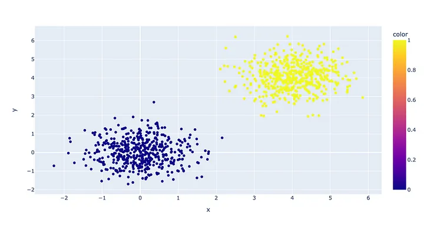
<h3 align="center">Non-Globular</h3>
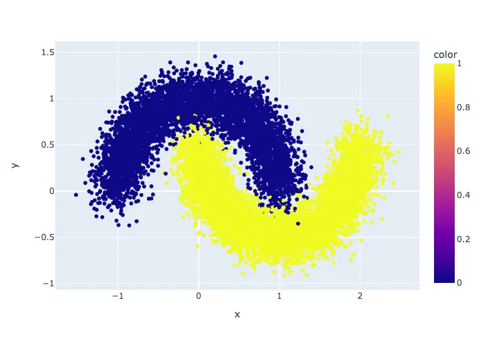

K-Means capturaria melhor a semântica estrutural para dados globulares. Isso é evidente a partir de como o K-Means é ajustado aos dados. Sabemos que o K-Means faz o seguinte:

Cada cluster possui um centróide. Um ponto pertence a um cluster com o centróide mais próximo. O K-Means minimiza a soma dos erros quadráticos (SSE) otimamente movendo os centróides de maneira iterativa.

De certa forma, o K-Means trabalha criando uma partição rígida no conjunto de dados, que atua como os limites do cluster. Por exemplo:

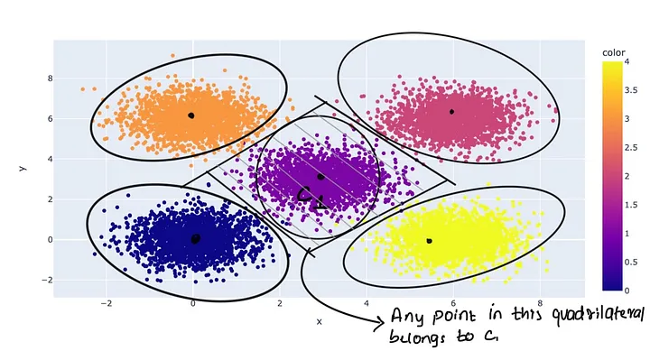

Neste exemplo, com cinco clusters, o centróide central (C1) é flanqueado pelos outros quatro em todos os lados. O cercado de quatro lados é a fronteira de decisão para qualquer ponto ser ou não ser colocado no cluster-1, com base no centróide mais próximo.

Para um novo ponto, a atribuição do cluster depende exclusivamente da distância dos centróides. A posição do ponto não importa, desde que esteja mais próximo de um centróide específico. Isso funciona bem em uma estrutura globular. Lembre-se de que a fronteira de um círculo é o lugar geométrico dos pontos que têm uma distância fixa em relação ao centro.

Em contraste, vejamos como o K-Means funciona em uma configuração não globular.

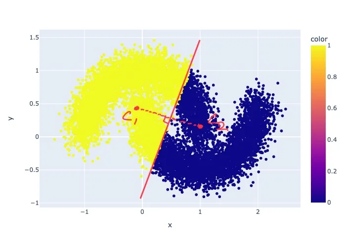

Resultados do agrupamento KMeans em um conjunto de dados não globular. Como você pode ver, os clusters não capturam a semântica real no conjunto de dados.

<h3 align="center">KMeans é sensível a outliers</h3>

Como o K-Means é um algoritmo baseado em distância, ele é suscetível a valores atípicos. Em cada etapa de atualização, os centróides são recomputados pela média dos pontos em um cluster. As médias, como sabemos, podem ser sensíveis a valores atípicos. Por exemplo:

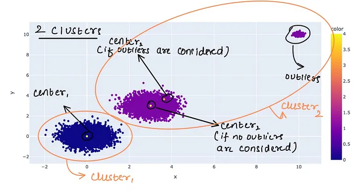

Observe o centro do cluster2 em dois casos diferentes - agrupamento com e sem pontos atípicos. Quando os pontos atípicos são considerados, o centro se desloca um pouco em direção aos valores atípicos.

<h3 align="center">Como resolver esse problema?</h3>

Lembre-se de que os valores atípicos contribuem desproporcionalmente para a etapa de atualização. Você pode identificar valores atípicos traçando a densidade das distâncias entre centróides e pontos. No exemplo acima, a distribuição das distâncias dos pontos no cluster2 até o centro2 se parece com:

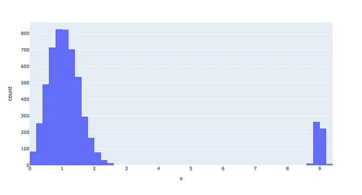

Observe as pequenas densidades no extremo direito. Elas correspondem aos valores outliers.

Você pode remover este ponto do conjunto de dados para obter os clusters reais.

Outra maneira é aumentar o número de clusters na esperança de que os valores atípicos possam formar um cluster próprio. No caso acima (Fig. 5), se definirmos o número de clusters=3, obtemos

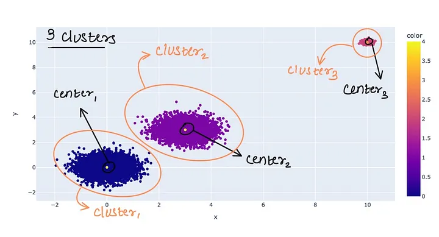

Note que o terceiro cluster é totalmente composto por outliers.

sso se reflete no gráfico (discutido acima). Adicionar o terceiro cluster reduz drasticamente a soma das variâncias intra-cluster. Portanto, você notaria uma queda acentuada no gráfico.

<h3 align="center">Você deve dimensionar seus dados antes de usar o KMeans?</h3>

Muitos algoritmos de aprendizado de máquina se beneficiam da escala das características usando métodos como a escala min-max ou a escala padrão. O 'benefício' é medido por um aumento na métrica.

Como a escala afeta o KMeans? Como sabemos se será bom ou não? Vamos entender o que a escala faz com nosso modelo.

Se tivermos duas características, X1, X2. A faixa de X1 é -1 a 1, e X2 é -100 a 100. Ao calcular as variâncias intra-cluster, X2 contribuirá mais para o SSE do que X1. Portanto, o modelo pode minimizar esse SSE mais minimizando a contribuição de X2. Isso não acontecerá se você usar a escala padrão, onde você transforma a característica como:

<pre>
X_transformed = (X-X_média)/X_desvio_padrao
</pre>

Vamos ver exemplos!

Recursos escalados:

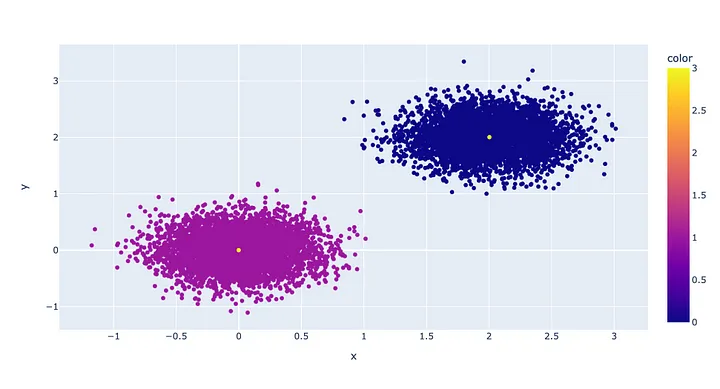

Clusters com features escalados. A partição está perfeita!

Mesmos dados, mas features não escaladas:

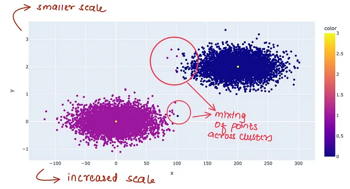

Observe a escala no eixo x e a mistura de pontos entre clusters.

Você deseja que um pequeno conjunto de features domine sua análise de cluster, ou prefere que todas as features tenham a mesma contribuição?

<h3 align="center">Como medir o desempenho do modelo?</h3>

A falta de rótulos limita o que você pode dizer sobre um modelo de agrupamento. Mas nem tudo está perdido. Queremos principalmente analisar o quão bem os clusters são formados no agrupamento. A definição de 'bem' não é muito precisa.

<pre>
Idealmente, queremos que os clusters sejam bem separados, grandes, mas densos.
</pre>

Você pode obter o maior cluster definindo k (o número de clusters) tão pequeno quanto um. Você pode obter clusters mais densos usando um k grande, criando muitos microclusters densos. Perdemos qualquer informação perspicaz que possamos querer inferir dos clusters em ambos os casos.

Felizmente, podemos medir a quantidade, densidade e separação.

<pre>
Quantidade --> número de pontos nos clusters.
Densidade --> média da distância entre dois pontos em um cluster.
Separação --> sobreposição entre dois clusters.
</pre>

Considere um modelo KMeans sendo ajustado a um conjunto de dados. Como decidimos o número de clusters? Lembre-se de que o KMeans minimiza o SSE entre clusters. À medida que aumentamos k, nosso SSE entre clusters diminuiria. Em k=número de pontos no conjunto de dados, o SSE será 0 para todos os clusters, pois cada ponto será seu próprio cluster e seu próprio centróide. No entanto, isso não é útil. Portanto, queremos aumentar k, mas apenas até um ponto em que a queda no SSE com incremento adicional seja marginal.

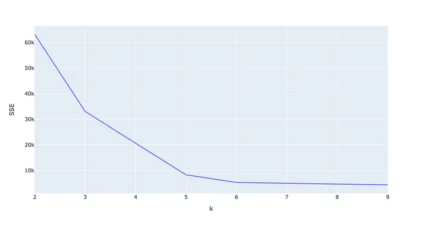

Eixo Y = soma do SSE entre clusters. Eixo X = k. Isso também é conhecido como gráfico scree ou curva elbow.

Vemos que a queda no SSE após k=5 é marginal. Portanto, podemos escolher 5 clusters.

Nossos clusters são grandes o suficiente? Vamos verificar.

<pre>
cluster index   number of points
--------------------------------
    0                 5001
    1                 5001
    2                 9952
    3                 5047
    4                 4999
</pre>

Parece que sim. Cada cluster tem um número considerável de pontos. É tentador escolher k=5 e seguir em frente na vida. No entanto, não verificamos o grau de separação. Podem existir clusters significativos e densos que se sobrepõem. Não queremos isso.

Deixe-me apresentar a você o silhouette score. É uma métrica que indica quanto sobreposição existe entre os clusters. Variando de -1 a 1, quanto maior o score, menor a sobreposição. Ele é calculado para cada ponto p no conjunto de dados, calculando duas medidas —

<ul>
    <li>a = Média da distância intra-cluster de p com todos os pontos no mesmo cluster.</li>
    <li>b = Média da distância de p com qualquer cluster que não seja o cluster ao qual p pertence. Se houver N clusters, obtemos N-1 dessas médias. Pegue a mínima delas e chame-a de b.</li>
</ul>
<pre>
silhouette score para p = (b - a) / max(b, a)
</pre>

Para obter uma pontuação em nível de cluster, tire a média das pontuações de cada ponto no cluster.

Vamos entender intuitivamente. Se dois clusters se sobrepõem, muitos pontos de sobreposição terão um b mais baixo e vice-versa. Um b mais baixo significa uma pontuação mais baixa. Se a=0, então a pontuação é 1. Isso só acontece quando há um único ponto no cluster. Se a expressão acima não estiver clara, consulte a visualização abaixo

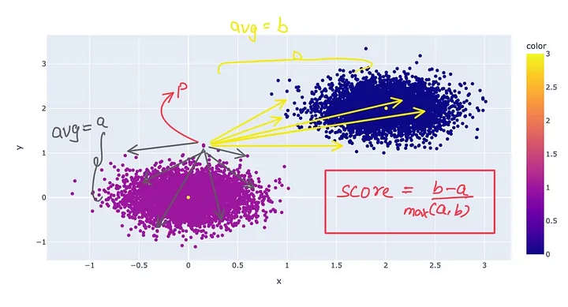

Exemplo de visualização para o silhouette score de um ponto p.

Gráfico do silhouette score vs número de clusters.

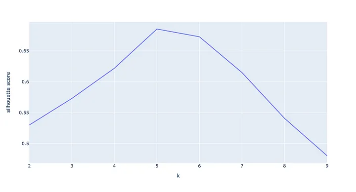

silhouette score vs k. Obtemos a pontuação mais alta para k=5.

Podemos afirmar que k=5 resulta em clusters melhores em termos de tamanho, densidade e separação. Observe que essas medidas se concentram mais na distribuição do espaço de incorporação. A semântica do cluster depende da aplicação. Por exemplo, ao inspecionar a predominância de tópicos em clusters de documentos.

<h3 align="center">Conclusão</h3>

O K-Means é uma ferramenta poderosa para explorar conjuntos de dados complexos e encontrar padrões usando matemática euclidiana. Certifique-se de seguir as diretrizes acima para evitar imprecisões. Espero que você as tenha achado úteis.

