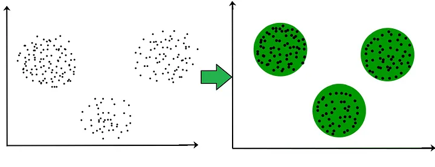
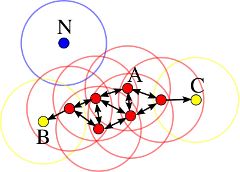
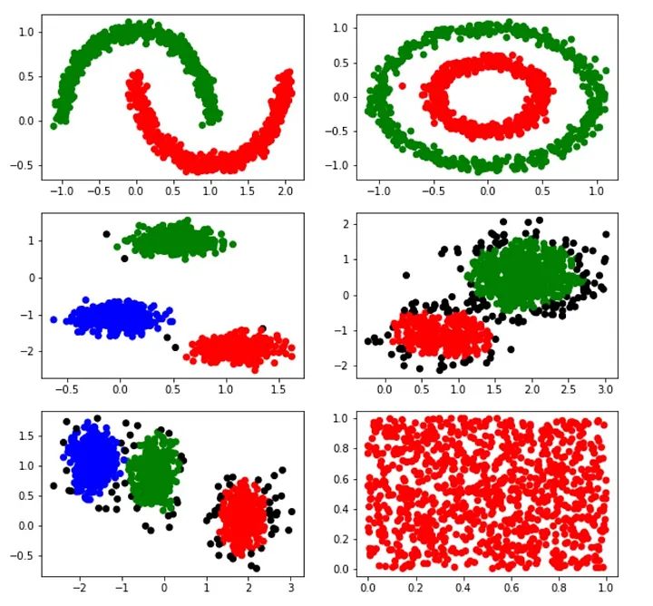
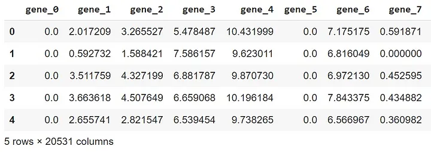
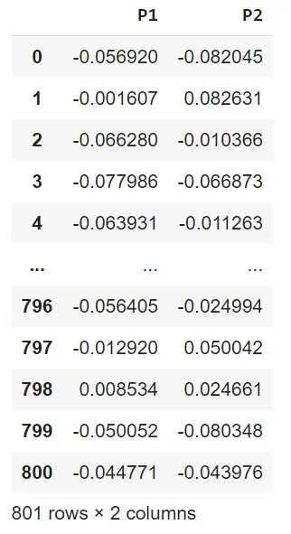
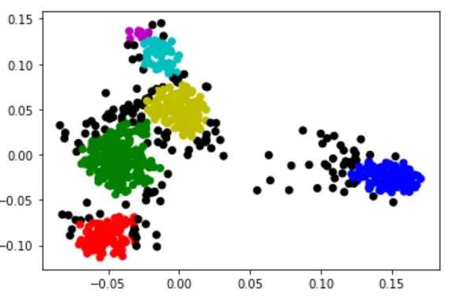
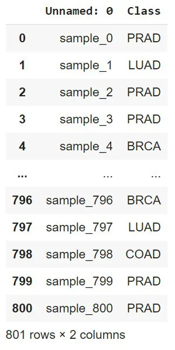
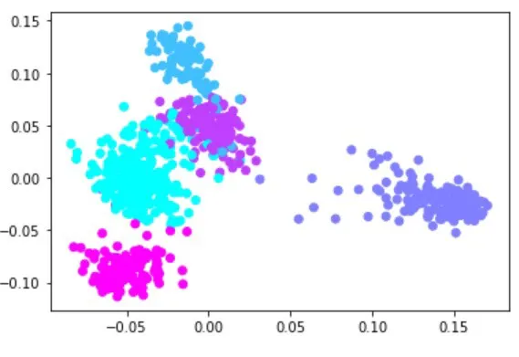

<h1 align="center">DBSCAN</h1>
<h2 align="center">O que é “Clustering” ?</h2>

Clustering se trata de uma técnica muito utilizada em diferentes campos de análises estatísticas. Análise de imagens, mineração de dados, bioinformática e machine learning são apenas algumas áreas onde esta técnica pode ser aplicada. No campo de Machine Learning, ela faz parte da área de aprendizado não supervisionado.

Aplicar a técnica de clustering se resume em agrupar dados que se relacionam. Imagine-se como um comerciante que possui uma boa quantidade de dados sobre seus clientes e pretende com isso segmentá-los para entender suas necessidades individuais. Utilizar um método de clustering parece ser uma ótima iniciativa, pois você conseguirá agrupar os clientes baseados em dados como registros de compras, frequência das compras entre outros. No entanto, para cada problema é necessário escolher o algoritmo de clustering mais interessante de análise.

<h2 align="center">Modelos famosos de Clustering</h2>
<ul>
  <li><b>K-Means</b> - O modelo conhecido como K-Means é um dos mais famosos e importantes nas análises de clustering. O objetivo por trás dele é encontrar um número K de clusters em uma amostra. Ele faz isso definindo centróides, que são sempre atualizados utilizando o valor médio dos pontos próximos daquele cluster. O aprimoramento desses centróides nas iterações do algoritmo são chave para que estes virem referências confiáveis para classificação de novos dados posteriormente.</li>
  <li><b>Clustering Hierárquico</b> - Outro modelo muito conhecido para realizar clustering se trata do Clustering Hierárquico. Este algoritmo trabalha de uma forma parecida com uma árvore de decisão. Na abordagem Top-Down, é criado um único cluster com todos os dados que depois se divide em diversos clusters menores. Já na abordagem Bottom-Up ocorre o inverso, primeiro são gerados diversos clusters pequenos que se juntam em um cluster maior ao final. Em ambas abordagens é gerado um Dendograma, um gráfico responsável por concluir qual o melhor número de clusters para aquela amostra.</li>
</ul>
<h2 align="center">Modelo DBSCAN</h2>

Finalmente, o modelo DBSCAN, sigla dada para “Density-Based Spatial Clustering of Applications with Noise”, possui uma abordagem de agrupamento baseado na densidade. A densidade de pontos em determinada região é responsável pela formação dos clusters. Caso um determinado ponto não obedeça critérios de densidade ou critérios dos limites de distância, este não pode ser classificado em um cluster.

<h3 align="center">Parâmetros</h3>

Os dois parâmetros necessários para aplicação do modelo DBSCAN são:

<ul>
  <li><b>Eps:</b> Raio máximo em que dois pontos podem estar para serem considerados do mesmo cluster.</li>
  <li><b>MinPts:</b> Número mínimo de pontos em uma região necessários para garantir uma densidade desejada.</li>
</ul>

A escolha dos parâmetros é algo crucial para o bom funcionamento do algoritmo. Escolher um Eps pequeno demais levará a muitos ruídos, já que não será possível classificar estes pontos mais distantes. Porém, escolher um valor alto pode levar a classificação de poucos clusters muito generalizados. Técnicas como gráfico de k-distância podem ajudar a definir o melhor valor de Eps. Agora quando se trata do MinPts é recomendável a decisão do valor baseado na dimensão do dataset. Valores maiores para este parâmetro são efetivos para datasets com muito ruído.

<h3 align="center">Algoritmo</h3>

Na seção de parametros, já foi mencionado a presença de ruídos. Isto é porque a classificação de um ponto do dataset é crucial para a aplicação do algoritmo. São três tipos de pontos que podemos encontrar:

<ul>
  <li><b>Núcleos:</b> Um ponto é considerado núcleo quando possui MinPts pontos ou mais dentro de um raio de Eps de distância.</li>
  <li><b>Bordas:</b> Um ponto é considerado borda quando não possui MinPts dentro de um raio Eps de distância, porém está inserido dentro de um raio Eps de um outro ponto no qual é núcleo.</li>
  <li><b>Ruídos(ou Outliers):</b> Um ponto é considerado um ruído quando este não está presente no raio Eps de um núcleo e nem possui MinPts dentro do seu raio Eps.</li>
</ul>

Com os tipos de classificações em mente, podemos partir para como o algoritmo itera sobre os dados:

<ul>
  <li>1. Escolher um ponto arbitrário</li>
  <li>2. Classificá-lo como Núcleo, Borda ou Ruído</li>
  <li>3. Se o ponto do momento é um Núcleo, todos os pontos à sua volta com um raio de distância Eps formam um cluster. Reclassificações podem ocorrer.</li>
  <li>4. Depois de classificar todos os pontos da região do núcleo, volta-se à etapa 1.</li>
  <li>5. O algoritmo termina quando todos os pontos tiverem sido classificados corretamente.</li>
</ul>

Um conceito muito importante a ser mencionado no método DBSCAN é o de Densidade Alcançável. Pode se dizer que um ponto possui uma densidade alcançável direta de outro se e apenas se a distância entre os mesmos estiver dentro de um raio Eps, porém um dos pontos deve ser um núcleo. Já pontos do tipo borda podem ser incluídos em clusters quando possuem densidade alcançável de um ponto que faz parte de uma cadeia de núcleos com densidade alcançável direta. Pontos que são núcleos podem alcançar pontos não-núcleos, porém pontos não-núcleos por mais que alcancem núcleos, não podem ser alcançados por outros pontos. Observe a imagem abaixo para facilitar o entendimento:

<h3 align="center">Implementação</h3>

Observe abaixo como implementar a técnica DBSCAN utilizando a biblioteca sklearn do Python. Cada gráfico representa a atuação do DBSCAN em agrupar dados em diferentes em datasets exemplo da própria biblioteca:

<pre>
from sklearn import cluster, datasets 

#Geração de dados
n_samples = 1000

#Criação de conjuntos de dados com formas diferentes
noisy_moons, _ = datasets.make_moons(n_samples=n_samples, noise=.05) 
noisy_circles, _ = datasets.make_circles(n_samples=n_samples, factor=.5, noise=.05)
blobs1, _ = datasets.make_blobs(n_samples=n_samples, random_state=10, center_box=(-2, 2),cluster_std=0.2)
blobs2, _ = datasets.make_blobs(n_samples=n_samples, random_state=4, center_box=(-2, 2),cluster_std=0.4)
blobs3, _ = datasets.make_blobs(n_samples=n_samples, random_state=7, center_box=(-2, 2),cluster_std=0.3)
no_structure, _ = np.random.rand(n_samples, 2), None

#Lista de exemplos a serem analisados pelo DBSCAN
examples = [noisy_moons, noisy_circles, blobs1, blobs2, blobs3, no_structure]

from sklearn.cluster import DBSCAN 

plt.figure(figsize=(10, 10))

#Mapeamento de rótulos para cores
colours = {} 
colours[0] = 'r'
colours[1] = 'g'
colours[2] = 'b'
colours[3] = 'y'
colours[4] = 'c'
colours[5] = 'm'
colours[6] = 'tab:pink'
colours[7] = 'tab:orange'
colours[8] = 'tab:olive'
colours[9] = 'tab:brown'
colours[-1] = 'k'

#Aplicação do DBSCAN e plotagem dos resultados  
for num, i in enumerate(examples):

  #Aplicação do DBSCAN com parâmetros específicos
  db_default = DBSCAN(eps = 0.2, min_samples = 20).fit(i)

  #Obtenção dos rótulos atribuídos pelo DBSCAN
  labels = db_default.labels_ 

  #Mapeamento dos rótulos para cores
  cvec = [colours[label] for label in labels] 

  #Subplot para cada exemplo
  plt.subplot(3, 2, num+1)

  #Scatter plot dos dados coloridos pelos rótulos atribuídos
  plt.scatter(i[:, 0], i[:, 1], color = cvec)

#Exibição do gráfico  
plt.show()
</pre>

Gerando os pontos de forma aleatória seguindo os datasets já prontos no sklearn é possível observar a qualidade do DBSCAN na hora de encontrar e dividir núcleos mais densos de dados.

<h3 align="center">Aplicando DBSCAN no mundo real</h3>

Agora que já sabemos como a técnica DBSCAN funciona e como aplicá-la utilizando sklearn, vamos contextualizar sua aplicação em um caso real.

Para esse estudo foi utilizado uma base de dados da UC Irvine contendo dados de pacientes com câncer. A coleção de dados é uma parte da sequência RNA (Hi-Seq) PANCAN, ela representa uma extração aleatória de expressões genéticas de pacientes tendo 5 diferentes tipos de tumor, BRCA, KIRC, COAD, LUAD e PREAD.

O DataFrame possui dados de 801 pacientes, cada valor representando a quantidade do gene presente no RNA do paciente. Para tratar os dados foi utilizado um simple inputer, objetivando preencher os valores faltantes com a média de cada coluna e também uma normalização simples dos dados, para tornar todos equiparáveis entre si.

<pre>
#Pipeline é uma sequência de transformações, onde cada etapa é definida como um par (nome, transformador)
from sklearn.pipeline import Pipeline

#Criando um pipeline para tratar valores ausentes usando SimpleImputer e, em seguida, normalizando os dados
#Etapa 1:Imputação de valores ausentes usando a mediana
num_pipeline = Pipeline(
    [
        ("imputer", SimpleImputer(strategy="median")),
    ]
)

#Aplicando o pipeline aos dados do DataFrame df
df_prepared = num_pipeline.fit_transform(df)

#Normalizando os dados após a imputação
df_prepared = normalize(df_prepared)
</pre>

Para aplicar o DBSCAN, antes era necessário tornar os dados mais facilmente agrupáveis. Uma forma de fazer isso tornando sua visualização possível é a redução da dimensionalidade dos parâmetros do modelo, a biblioteca scikit-learn possui métodos prontos para resolver a situação. Nesta análise foi usado o método PCA que estudaremos também no próximo modulo.

<pre>
from sklearn.decomposition import PCA
  
#Criando uma instância de PCA (Análise de Componentes Principais) com 2 componentes principais
pca = PCA(n_components = 2) 

#Aplicando a transformação PCA nos dados preparados (após imputação e normalização)
df_principal = pca.fit_transform(df_prepared) 

#Criando um DataFrame com os componentes principais resultantes
df_principal = pd.DataFrame(df_principal) 

#Renomeando as colunas para 'P1' e 'P2'
df_principal.columns = ['P1', 'P2'] 

#O DataFrame resultante (df_principal) agora contém as duas componentes principais
df_principal
</pre>

Após aplicar o DBSCAN com os parâmetros Eps e MinPts, é evidente no plot dos resultados a formação de 5 clusters principais, representados pelas cores verde, vermelho, ciano, azul e amarelo.

<pre>
from sklearn.cluster import DBSCAN 

#Criando uma instância do DBSCAN com parâmetros específicos (eps = 0.008, min_samples = 10)
db_default = DBSCAN(eps = 0.008, min_samples = 10).fit(df_principal) 

#Obtendo as etiquetas atribuídas a cada ponto pelo DBSCAN
labels = db_default.labels_ 

#Mapeando as etiquetas para cores específicas
#-1 é usado para representar outliers (pontos que não pertencem a nenhum cluster)
colours = {} 
colours[0] = 'r'
colours[1] = 'g'
colours[2] = 'b'
colours[3] = 'y'
colours[4] = 'c'
colours[5] = 'm'
colours[6] = 'tab:pink'
colours[7] = 'tab:orange'
colours[8] = 'tab:olive'
colours[9] = 'tab:brown'
colours[-1] = 'k'

#Atribuindo cores às etiquetas dos clusters
cvec = [colours[label] for label in labels] 

#Criando um gráfico de dispersão com as duas dimensões principais, usando as cores atribuídas
plt.scatter(df_principal['P1'], df_principal['P2'], c = cvec) 

#Exibindo o gráfico  
plt.show()
</pre>

Para validar os resultados foi usado uma segunda base de dados contendo o tipo de tumor que cada paciente com os labels já definidos e assim, ao associar nossa base inicial com dimensionalidade reduzida e plotar o gráfico é possível observar que os clusters formados pelo DBSCAN são exatamente os 5 tumores separados pelas cores definidas pelos tumores de cada paciente:

<pre>
from sklearn.preprocessing import OrdinalEncoder

#Lendo o arquivo labels.csv
labels = pd.read_csv('labels.csv')

labels
</pre>

<pre>
#Criando uma instância do OrdinalEncoder
enc = OrdinalEncoder()
  
#Criando uma instância do OrdinalEncoder  
labels = enc.fit_transform(labels[['Class']])

#Multiplicando os rótulos por 100 (pode ser usado para ampliar as diferenças entre os valores)  
labels *= 100

#Criando um gráfico de dispersão com as duas dimensões principais, usando os rótulos como cores
#cmap=plt.cm.cool define o mapa de cores a ser usado (aqui, usando a escala de cores "cool")  
plt.scatter(df_principal['P1'], df_principal['P2'], c=labels , cmap=plt.cm.cool)

#Exibindo o gráfico  
plt.show()
</pre>

<h3 align="center">Conclusão</h3>

Por fim, conseguimos discutir o que é um modelo de clustering, quais as principais técnicas usadas, como o modelo DBSCAN funciona e suas aplicações. As vantagens desta técnica apresentada são muitas:

<ul>
  <li>Utilizar DBSCAN não requer a pré definição de números de clusters e utiliza apenas dois parâmetros.</li>
  <li>Os parâmetros são facilmente ajustados caso haja um bom conhecimento sobre os dados.</li>
  <li>DBSCAN se comporta muito bem em identificar clusters de tamanhos arbitrários, como visto no exemplo de implementação.</li>
  <li>A classificação de ruídos é muito bem feita.</li>
</ul>

No entanto, é importante listar também porque esta técnica pode não ser a mais indicada em certos casos:

<ul>
  <li>Se não há um bom conhecimento sobre os dados, a definição de parâmetros pode se tornar uma tarefa mais complicada.</li>
  <li>Quando se trata de dados com alta dimensionalidade, a distância Euclidiana que é mais utilizada para determinar o parâmetro Eps acaba não funcionando. Desta forma, a definição deste parâmetro se torna um desafio.</li>
  <li>DBSCAN não performa bem em datasets com variabilidade de densidade entre os dados.</li>
  <li>O DBSCAN não é uma técnica completamente determinística. Isto é possível de perceber tratando de pontos de borda que estão dentro do raio de núcleos referentes a diferentes clusters. Na maioria das situações, pode ser que isso não influencie em uma análise.</li>
</ul>
