<h1 align="center">Regressão Linear</h1>

Dentro do aprendizado supervisionado, a regressão linear é um dos modelos mais conhecidos para predizer respostas quantitativas, por causa de sua simplicidade em representar os dados em uma reta e rapidez de treino. Por causa disso, é essencial ter um bom entendimento do que é o modelo antes de partirmos para modelos mais avançados. Neste artigo vamos revisar o que é a Regressão Linear Simples e Múltipla e formas de encontrar melhores ajustes para o modelo de previsão.

<h1 align="center">Regressão Linear Simples</h1>

A regressão linear, como o nome diz, busca predizer uma variável resposta (y) com base em uma variável X (ex. preço do condomínio, número de quartos, área) assumindo que a relação entre X e y é linear, isto é, sempre que aumentamos x em uma unidade o valor y aumenta β unidades. O modelo pode ser equacionado como:

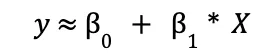

Utilizando um exemplo do mercado imobiliário, X pode ser uma qualidade do apartamento, como área, e Y representa o preço (aquilo que queremos prever). Assim, podemos dizer que estamos regredindo o preço (Y) com relação à área (X) para ajustar um modelo linear e, dado um aumento na área, observaremos também um crescimento linear no preço.

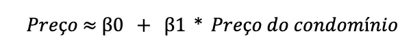

Nas equações acima, podemos observar a presença de dois coeficientes β, desconhecidos, que representam o intercepto (o valor que y assumiria caso X fosse igual a zero) e a inclinação da reta em relação ao eixo x, respectivamente. Após descobrirmos os melhores coeficientes, também chamados de parâmetros, podemos predizer o ŷ (o chapéu é uma forma de diferenciar o valor real e o estimado), dado X.

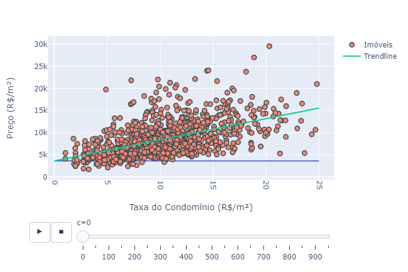

Quando falamos em “melhores coeficientes”, estamos nos referindo àqueles coeficientes que resultarão na reta o mais próxima possível da curva real. Mas o problema agora é: como descobri-los?

<h2 align="center">Estimado os melhores coeficientes: Método dos Mínimos Quadrados</h2>

A forma mais comum para escolher β é utilizando o Método dos Mínimos Quadrados. Esse método consiste em minimizar o resíduo, isto é, o erro entre o real e o previsto de cada dado (i) da sua amostra de teste:

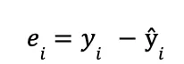
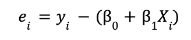

Como o foco é encontrar o tamanho do erro, isto é, a qual a distância do erro à reta (também chamada de reta dos mínimos quadráticos), sendo ele positivo ou negativo, é elevado o valor ao quadrado.

Assim, é definido o Resíduo da Soma de Quadrados (Residual Sum of Squares — RSS), como o nome diz, é a soma dos erros ao quadrado:

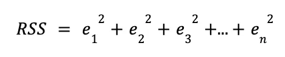

Para diminuir o erro ao máximo, procura-se o menor RSS possível. Não é escopo do artigo nos aprofundar na matemática utilizada para definição dos β, todavia deixamos uma referência ao artigo sobre regressão linear presente no wikipedia, este explicitando como gerar o resultado abaixo:

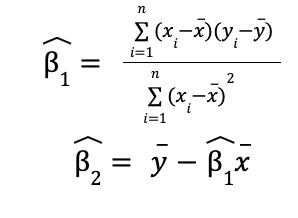

Onde x e y são o i-ésimo do nosso conjunto de dados x e y; e x e y são a média dos pontos x e y.

Apesar de parecer muito complicada, ela está dizendo que 1 (coeficiente de inclinação da reta) é resultado do desvio dos pontos x e y da média deles. A ideia da melhor reta, então, é diminuir essa distância (x-x e y-y) para que ela fique o mais calibrada possível.

<h1 align="center">Regressão Linear Múltipla</h1>

Existem cenários em que utilizar somente uma variável não é suficiente para descrever nossa variável resposta (target). Utilizando o exemplo do mercado imobiliário, apesar da área do apartamento ser uma métrica de extrema importância na hora de calcular o preço, entendemos que outros regressores (features), como estado de conservação, número de quartos, número de banheiros e andar, possuem sua relevância na hora de construir o preço. Em situações como essa, pode-se modelar uma regressão simples para cada variável versus o preço, todavia, não capturamos as relações reais entre o target e cada uma das features. Eis que entra em jogo a Regressão Linear Múltipla.

Ao invés de rodarmos uma regressão linear simples para cada variável, expandimos os estimadores, construindo uma ponderação para cada variável em relação a nossa variável resposta. Ou seja, como agora o preço dos nossos imóveis passará a ser descrito como uma combinação de várias características desse mesmo imóvel, cada um desses atributos influenciará, de forma independente uns dos outros, com maior ou menor intensidade, no resultado final. Pode-se construir essa relação através da atribuição de um coeficiente de inclinação para cada variável em relação ao target. A fim de equacionar o modelo, tem-se:

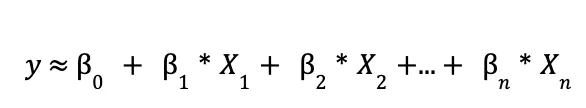

No modelo, β assume o papel de coeficiente da n-ésima variável e X assume o papel da n-ésima variável sobre a qual estamos modelando. O interessante dessa aproximação é que, ao construirmos cada um dos coeficientes conseguimos entender as relações lineares entre cada X.

No exemplo comentado acima, ao modelarmos a regressão múltipla com a premissa de construir o preço a partir de variáveis distintas estima-se como:

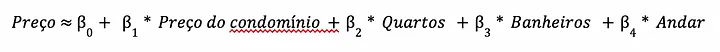

Assim como na regressão simples, ainda precisamos otimizar nossos coeficientes, mas como fazemos isso assumindo que estamos trabalhando com n dimensões (sendo n nosso número de variáveis)?

<h2 align="center">Estimado os melhores coeficientes: Método dos Mínimos Quadrados</h2>

O racional para otimização na regressão linear múltipla é muito parecido com a perspectiva simples. Neste cenário focaremos em otimizar os resíduos, escolhendo os βn de acordo com a minimização do nosso RSS, conforme a equação abaixo demonstra:

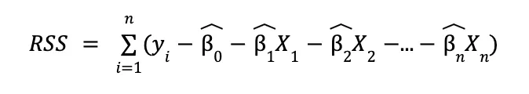

Apesar da complexidade de minimização destes coeficientes, tendo que transformar em matrizes, existem muitos softwares prontos que conseguem executar essa minimização. Consequentemente, acredita-se que vale incentivar o leitor a tentar rodar em uma ferramenta (excel, por exemplo) o modelo de regressão linear múltipla.

Importante apresentar a visão gráfica, assumindo que tenhamos um modelo de 2 variáveis e um target. Com isso teríamos um plano que demonstra nossa equação parametrizada.

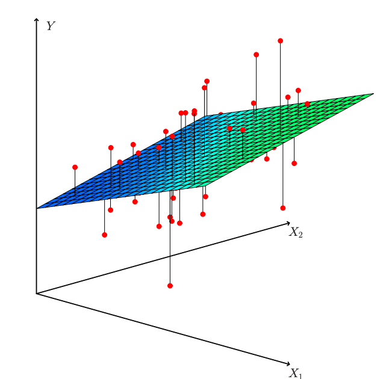

No cenário acima, os pontos vermelhos representam nossas predições, as linhas seriam nossos erros e o plano seria a representação gráfica da nossa regressão. Um ponto de atenção na regressão linear múltipla é a questão de co-dependência linear entre variáveis, ou seja, a existência de variáveis que podem ser construídas a partir de uma combinação linear de outras duas variáveis (como com uma multiplicação direta entre valores). Não vamos nos estender neste ponto, mas vale salientar que, variáveis que sejam codependentes linearmente, tendem a gerar regressões enviesadas.

<h2 align="center">Medidas de Perfomance Mais Comuns</h2>

Dentre as medidas de performance mais comuns para avaliar a qualidade do modelo de regressão estão o RSE (Erro Padrão Residual) e o R², que serão apresentadas a seguir.

<h3 align="center">Raiz Quadrática Média Residual (RMSE)</h3>

O RMSE calcula a raiz quadrática média dos erros entre valores observados e predições, ou seja, mede o quanto sua amostra desviará da curva prevista.

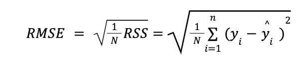

Seu resultado pode ser lido como o “desvio padrão do erro”, assim, quanto menor RMSE, melhor.

<h3 align="center">R²</h3>

Assim como o RMSE, o R² também mede a qualidade do modelo, mas diferente do anterior, ele considera um erro proporcional da variação da variável resposta em cima da previsão (reta de regressão).

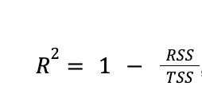

Sendo que a TSS (Soma Total dos Quadrados) mede a variância inerente dos dados de y, uma vez que a diferença do yie a média de todos y:

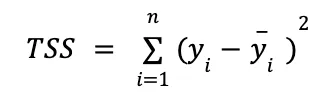

Dessa forma, pondera-se o erro da previsão (RSS) pela variância inerente dos dados de y. Isso permite medir o quanto da variabilidade de Y que pode ser explicado usando X.

<ul>
  <li>Valores próximos ou iguais a 0: indicam que a regressão não consegue explicar a variabilidade de Y, devido à baixa ou nenhuma relação entre o modelo e os dados.</li>
  <li>Valores próximos ou igual a 1: grande proporção da variabilidade pode ser explicada pela regressão, isto é, alta correlação entre o modelo e os dados.</li>
  <li>Valores menores que 0: significa que o modelo de regressão é pior que um modelo que prediz a média dos valores Y. Isso acontece em menos de 1% dos casos.</li>
</ul>

Apesar do R² ter maior interpretabilidade que o RMSE, pois mostra a porcentagem de correlação entre os dados, o desafio de uso dessa métrica é definir o mínimo de variância aceitável.

