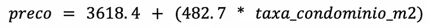

<h1 align="center">Regressão Linear</h1>

Dentro do aprendizado supervisionado, a regressão linear é um dos modelos mais conhecidos para predizer respostas quantitativas, por causa de sua simplicidade em representar os dados em uma reta e rapidez de treino. Por causa disso, é essencial ter um bom entendimento do que é o modelo antes de partirmos para modelos mais avançados. Neste artigo vamos revisar o que é a Regressão Linear Simples e Múltipla e formas de encontrar melhores ajustes para o modelo de previsão.

<h1 align="center">Regressão Linear Simples</h1>

A regressão linear, como o nome diz, busca predizer uma variável resposta (y) com base em uma variável X (ex. preço do condomínio, número de quartos, área) assumindo que a relação entre X e y é linear, isto é, sempre que aumentamos x em uma unidade o valor y aumenta β unidades. O modelo pode ser equacionado como:

Utilizando um exemplo do mercado imobiliário, X pode ser uma qualidade do apartamento, como área, e Y representa o preço (aquilo que queremos prever). Assim, podemos dizer que estamos regredindo o preço (Y) com relação à área (X) para ajustar um modelo linear e, dado um aumento na área, observaremos também um crescimento linear no preço.

Nas equações acima, podemos observar a presença de dois coeficientes β, desconhecidos, que representam o intercepto (o valor que y assumiria caso X fosse igual a zero) e a inclinação da reta em relação ao eixo x, respectivamente. Após descobrirmos os melhores coeficientes, também chamados de parâmetros, podemos predizer o ŷ (o chapéu é uma forma de diferenciar o valor real e o estimado), dado X.

Quando falamos em “melhores coeficientes”, estamos nos referindo àqueles coeficientes que resultarão na reta o mais próxima possível da curva real. Mas o problema agora é: como descobri-los?

<h2 align="center">Estimado os melhores coeficientes: Método dos Mínimos Quadrados</h2>

A forma mais comum para escolher β é utilizando o Método dos Mínimos Quadrados. Esse método consiste em minimizar o resíduo, isto é, o erro entre o real e o previsto de cada dado (i) da sua amostra de teste:

Como o foco é encontrar o tamanho do erro, isto é, a qual a distância do erro à reta (também chamada de reta dos mínimos quadráticos), sendo ele positivo ou negativo, é elevado o valor ao quadrado.

Assim, é definido o Resíduo da Soma de Quadrados (Residual Sum of Squares — RSS), como o nome diz, é a soma dos erros ao quadrado:

Para diminuir o erro ao máximo, procura-se o menor RSS possível. Não é escopo do artigo nos aprofundar na matemática utilizada para definição dos β, todavia deixamos uma referência ao artigo sobre regressão linear presente no wikipedia, este explicitando como gerar o resultado abaixo:

Onde x e y são o i-ésimo do nosso conjunto de dados x e y; e x e y são a média dos pontos x e y.

Apesar de parecer muito complicada, ela está dizendo que 1 (coeficiente de inclinação da reta) é resultado do desvio dos pontos x e y da média deles. A ideia da melhor reta, então, é diminuir essa distância (x-x e y-y) para que ela fique o mais calibrada possível.

<h1 align="center">Regressão Linear Múltipla</h1>

Existem cenários em que utilizar somente uma variável não é suficiente para descrever nossa variável resposta (target). Utilizando o exemplo do mercado imobiliário, apesar da área do apartamento ser uma métrica de extrema importância na hora de calcular o preço, entendemos que outros regressores (features), como estado de conservação, número de quartos, número de banheiros e andar, possuem sua relevância na hora de construir o preço. Em situações como essa, pode-se modelar uma regressão simples para cada variável versus o preço, todavia, não capturamos as relações reais entre o target e cada uma das features. Eis que entra em jogo a Regressão Linear Múltipla.

Ao invés de rodarmos uma regressão linear simples para cada variável, expandimos os estimadores, construindo uma ponderação para cada variável em relação a nossa variável resposta. Ou seja, como agora o preço dos nossos imóveis passará a ser descrito como uma combinação de várias características desse mesmo imóvel, cada um desses atributos influenciará, de forma independente uns dos outros, com maior ou menor intensidade, no resultado final. Pode-se construir essa relação através da atribuição de um coeficiente de inclinação para cada variável em relação ao target. A fim de equacionar o modelo, tem-se:

No modelo, β assume o papel de coeficiente da n-ésima variável e X assume o papel da n-ésima variável sobre a qual estamos modelando. O interessante dessa aproximação é que, ao construirmos cada um dos coeficientes conseguimos entender as relações lineares entre cada X.

No exemplo comentado acima, ao modelarmos a regressão múltipla com a premissa de construir o preço a partir de variáveis distintas estima-se como:

Assim como na regressão simples, ainda precisamos otimizar nossos coeficientes, mas como fazemos isso assumindo que estamos trabalhando com n dimensões (sendo n nosso número de variáveis)?

<h2 align="center">Estimado os melhores coeficientes: Método dos Mínimos Quadrados</h2>

O racional para otimização na regressão linear múltipla é muito parecido com a perspectiva simples. Neste cenário focaremos em otimizar os resíduos, escolhendo os βn de acordo com a minimização do nosso RSS, conforme a equação abaixo demonstra:

Apesar da complexidade de minimização destes coeficientes, tendo que transformar em matrizes, existem muitos softwares prontos que conseguem executar essa minimização. Consequentemente, acredita-se que vale incentivar o leitor a tentar rodar em uma ferramenta (excel, por exemplo) o modelo de regressão linear múltipla.

Importante apresentar a visão gráfica, assumindo que tenhamos um modelo de 2 variáveis e um target. Com isso teríamos um plano que demonstra nossa equação parametrizada.

No cenário acima, os pontos vermelhos representam nossas predições, as linhas seriam nossos erros e o plano seria a representação gráfica da nossa regressão. Um ponto de atenção na regressão linear múltipla é a questão de co-dependência linear entre variáveis, ou seja, a existência de variáveis que podem ser construídas a partir de uma combinação linear de outras duas variáveis (como com uma multiplicação direta entre valores). Não vamos nos estender neste ponto, mas vale salientar que, variáveis que sejam codependentes linearmente, tendem a gerar regressões enviesadas.

<h2 align="center">Medidas de Perfomance Mais Comuns</h2>

Dentre as medidas de performance mais comuns para avaliar a qualidade do modelo de regressão estão o RSE (Erro Padrão Residual) e o R², que serão apresentadas a seguir.

<h3 align="center">Raiz Quadrática Média Residual (RMSE)</h3>

O RMSE calcula a raiz quadrática média dos erros entre valores observados e predições, ou seja, mede o quanto sua amostra desviará da curva prevista.

Seu resultado pode ser lido como o “desvio padrão do erro”, assim, quanto menor RMSE, melhor.

<h3 align="center">R²</h3>

Assim como o RMSE, o R² também mede a qualidade do modelo, mas diferente do anterior, ele considera um erro proporcional da variação da variável resposta em cima da previsão (reta de regressão).

Sendo que a TSS (Soma Total dos Quadrados) mede a variância inerente dos dados de y, uma vez que a diferença do yie a média de todos y:

Dessa forma, pondera-se o erro da previsão (RSS) pela variância inerente dos dados de y. Isso permite medir o quanto da variabilidade de Y que pode ser explicado usando X.

<ul>
  <li>Valores próximos ou iguais a 0: indicam que a regressão não consegue explicar a variabilidade de Y, devido à baixa ou nenhuma relação entre o modelo e os dados.</li>
  <li>Valores próximos ou igual a 1: grande proporção da variabilidade pode ser explicada pela regressão, isto é, alta correlação entre o modelo e os dados.</li>
  <li>Valores menores que 0: significa que o modelo de regressão é pior que um modelo que prediz a média dos valores Y. Isso acontece em menos de 1% dos casos.</li>
</ul>

Apesar do R² ter maior interpretabilidade que o RMSE, pois mostra a porcentagem de correlação entre os dados, o desafio de uso dessa métrica é definir o mínimo de variância aceitável.

<h1 align="center">Estudo de Caso</h1>

A melhor forma de entender um modelo, é aplicando um problema a ele! Então, utilizando o contexto da Loft, aplicamos a Regressão Linear Simples e Múltipla a dados de apartamentos.

Felizmente, no Python temos a biblioteca do Scikit-Learn, que possui, dentre muitos modelos, a Regressão Linear. Com ele, vamos aplicar dados já tratados de apartamentos, como:

<ul>
  <li>Preço;</li>
  <li>Taxa de condomínio;</li>
  <li>Área;</li>
  <li>Número de quartos;</li>
  <li>Andar;</li>
</ul>

Um ponto de atenção importante é sobre a utilização da área como feature para prever o preço absoluto (ex. R$250.000,00): ela tem uma forte correlação com o preço. Isso significa que, no caso de uma regressão múltipla principalmente, as demais features podem perder muita significância, ou seja, o coeficiente da área será muito grande comparado aos outros coeficientes, por exemplo:

Dessa forma, é mais interessante realizar uma união do preço com a área, isto é, predizer preço por m2, para reduzirmos as correlações entre features, além de reduzir os impactos de outliers (por exemplo, apartamentos precificados acima do esperado podem se tornar ruídos na base de treino, pois induzirão o modelo a buscar uma relação fora do padrão entre os atributos e a variável resposta).

Antes de começar, precisamos estabelecer as métricas de erro propostas pelo livro Introduction to Statistical Learning:

<pre>
from sklearn.metrics import mean_squared_error, r2_score
import numpy as np
def get_errors(y_test, y_pred):
print(f’RMSE:{mean_squared_error(y_test, y_pred, squared=False)}’)
print(f’R2: {r2_score(y_test, y_pred).round(3)}’)
</pre>

Apenas para facilitar a visualização, podemos criar uma função que retorna a equação da reta:

<pre>
def get_equation(regressor, features):
coef_eq = ‘’
for i in range(0,len(features)):
coef_eq += ‘ + (‘+ str(round(float(regressor.coef_[0][i]),1)) + ‘ * ‘ + str(features[i]) + ‘)’
print(f’preco = {round(float(regressor.intercept_),1)}{coef_eq}’)
</pre>

Agora podemos iniciar o nosso primeiro modelo:

<h2 align="center">Regressão Linear Simples</h2>
<pre>
from sklearn.linear_model import LinearRegression
from sklearn.model_selection import train_test_split
feature = ['taxa_condominio_m2']
X = sample[feature].values.reshape(-1, 1)
Y = sample.price_m2.values.reshape(-1, 1)
X_train, X_test, y_train, y_test = train_test_split(X, Y, test_size=0.33, random_state=42)
regressor = LinearRegression()
regressor.fit(X_train, y_train)
y_pred = regressor.predict(X_test)
get_errors(y_test, y_pred)
> RMSE: 3214.57
> R2: 0.28
get_equation(regressor, feature)
> preco = 3618.4 + (482.7 * taxa_condominio_m2)
</pre>

O gráfico acima mostra como o modelo super simplifica a relação entre as observações em uma simples reta, equacionada como:

Essa equação mostra que a cada R$1,00 em taxa de condomínio, o preço do apartamento aumenta em R$482,70 e que quando a taxa é R$0, o valor do apartamento é R$3618,40/m2 (intercepto). Podemos já observar que o modelo não consegue ter uma boa precisão, podendo errar, de acordo com o RMSE, 土R$3.214,57 no preço do metro quadrado, o que de cara é bastante coisa! No nosso caso, isso acontece, porque existem apartamentos que tem um preço de metro quadrado alto, mas não necessariamente o preço será alto (pode ser um apartamento antigo, que necessita de muita manutenção, mas não tem muito valor de mercado) ou o contrário, um condomínio com preço baixo pode existir em um apartamento de alto valor do metro quadrado, porque fica em uma localização boa e tem muitos condôminos, o que dilui o preço, por exemplo. Assim, é importante adicionar novas features ao modelo, como andar, número de quartos, entre outros.

<h2 align="center">Regressão Linear Múltipla</h2>

Similar a regressão linear simples, iremos utilizar o scikit-learn para entender o modelo. Decidimos utilizar o valor do condomínio, número de quartos e o andar a fim de modelar nossa regressão. O trecho de código abaixo apresenta nosso treino, juntamente com o plot e os erros.

<pre>
features = [‘taxa_condominio_m2’, ‘bedrooms’, ‘floor’]
X_multiplo = sample[features].values
Y_multiplo = sample.price_m2.values.reshape(-1, 1)
X_train_multiplo, X_test_multiplo, y_train_multiplo, y_test_multiplo = train_test_split(X_multiplo, Y_multiplo, test_size=0.33, random_state=42)
regressor_multiplo = LinearRegression()
regressor_multiplo.fit(X_train_multiplo, y_train_multiplo)
y_pred_multiplo = regressor_multiplo.predict(X_test_multiplo)
get_errors(y_test_multiplo, y_pred_multiplo)
> RSE: 3186.27
> R2: 0.29
get_equation(regressor_multiplo, features)
> preco = 2858.1 + (478.8 * taxa_condominio_m2) + (188.0 * quartos) + (52.4 * andar)
</pre>

De cara percebe-se um R² e RMSE melhores que a regressão linear simples, todavia, ainda não conseguimos um erro satisfatório. Apesar da diminuição do RMSE, ainda temos mais de R$3000,00 de erro por metro quadrado, o que em uma precificação de apartamentos pode ser crítico.

O gráfico acima demonstra um corte da representação gráfica vinda da regressão linear. Dado que a regressão múltipla resulta em uma representação gráfica de N+1 dimensões (sendo N o número de features mais a dimensão de nosso target), no nosso exemplo por termos utilizado 3 features, teríamos 4 dimensões, o que dificulta a representação (diferentemente da regressão linear simples). Observando o gráfico, entendemos que nossas predições conseguem aumentar a especificidade, mas ainda estão distantes do esperado, como mostram os erros.

Mesmo ao adicionar features, nota-se que a aproximação de regressão linear talvez não seja a mais efetiva para resolução do nosso problema. Aqui entram as críticas aos modelos supramencionados.

<h2 align="center">Críticas ao Modelo</h2>

Como comentado no início do artigo, os modelos de regressão linear, ainda que muito importantes para criação de uma base sólida estatística, possuem déficits que devem ser explicitados neste artigo. Deixaremos alguns problemas delimitados aqui, mas encorajamos a pessoa leitora a se aprofundar nesta parte no nosso livro referência, já que muitos modelos atacam justamente os problemas que citaremos.

Um problema que vimos no fit da regressão múltipla foi a necessidade de termos dependência linear explícita entre as variáveis utilizadas e nosso target. Em nossa modelagem percebe-se que mesmo adicionando outras variáveis nossa modelagem não melhora significativamente, muito pelo modelo não conseguir capturar relação que não são lineares, por exemplo, se houver uma dependência entre condomínio e a nossa variável target que não seja direta, não conseguimos interpretar com a aproximação linear.

Outra problemática que encontramos é a correlação entre fatores de erro. Assumimos que os resíduos utilizados para o cálculo do nosso R² não possuem nenhum tipo de interdependência, ou seja, saber o sinal ou valor de um i não ajudaria a entender o sinal ou valor de um i+1, mas isso nem sempre é verdade. Dois exemplos clássicos de que isso nem sempre irá acontecer seriam:

<ul>
  <li>Caso você duplique seu dataset: imagine o cenário que você duplicou seu dataset por um erro, agora seus erros estão pareados, isso resultaria em um desvio para o dobro de linhas mas com os mesmos erros, o que resultaria em um intervalo de confiança muito menor;</li>
  <li>Caso você esteja trabalhando com séries temporais: existe a chance de observações temporais em tempos muito próximos terem erros muito próximos também, isso pode ser observado ao plotar um gráfico de resíduos versus tempos, percebemos que observações próximas possuem erros muito próximos, gerando uma tendência, o gráfico abaixo demonstra o cenário supracitado;</li>
</ul>

Por fim, outra problemática com este tipo de modelagem são outliers, estes são valores que a observação real está muito longe do valor previsto pelo modelo. Sendo assim, o resíduo desta previsão é extremamente alto (independente do sentido desse erro). Muitas vezes o outlier pode ser um erro de coleta de dados, consequentemente, nestes casos, podemos removê-lo do estudo, mas devemos ter cuidado, já que outliers podem indicar uma deficiência em nosso modelo, como por exemplo, a existência de relações não lineares entre nossas variáveis e o target.

<h2 align="center">Refêrencias</h2>

[1] HASTIE, T.; TIBSHIRANI, R.; JAMES, G.; e WITTEN, D. Introduction to Statistical Learning. Segunda Edição, 2021. Disponível em: https://www.statlearning.com/

https://medium.com/loftbr/regress%C3%A3o-linear-65fc8caeb729

