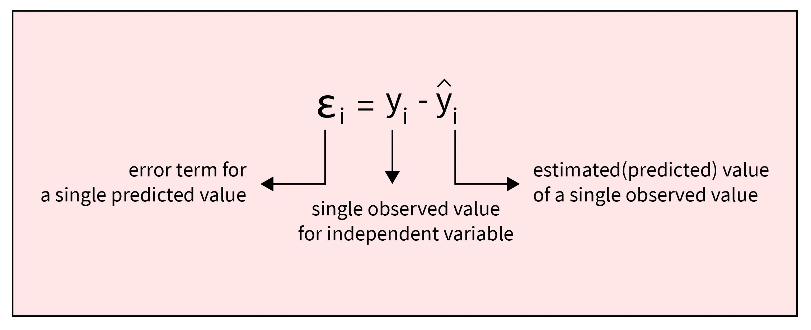
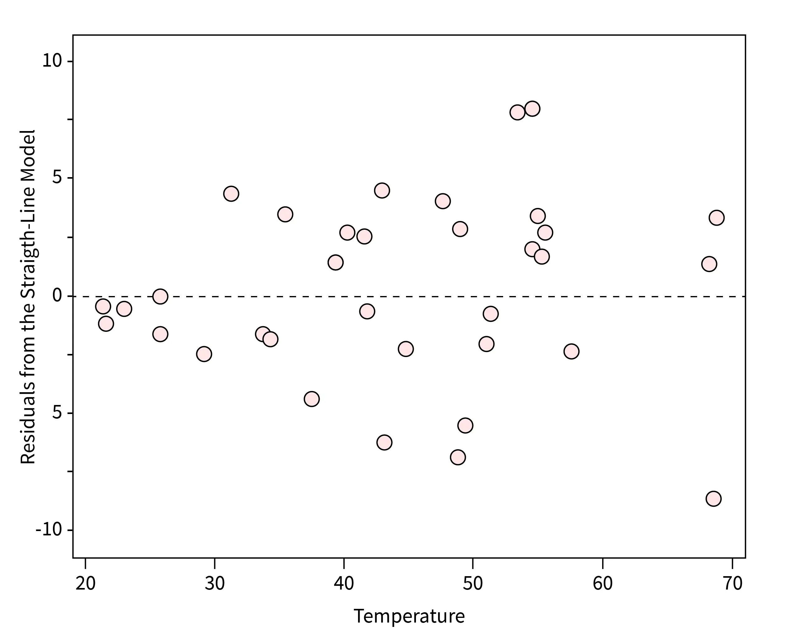
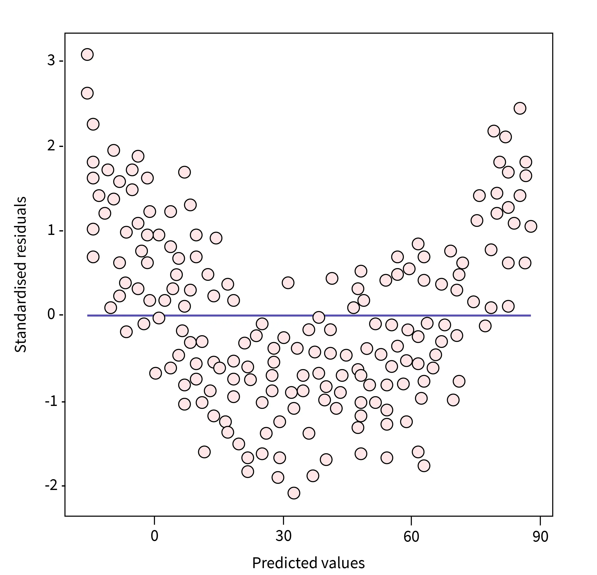
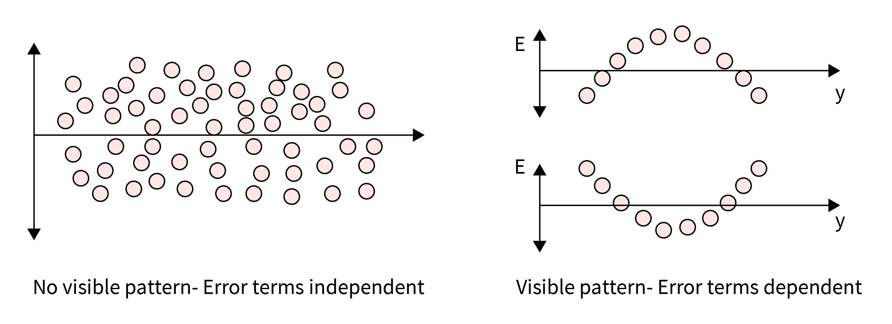
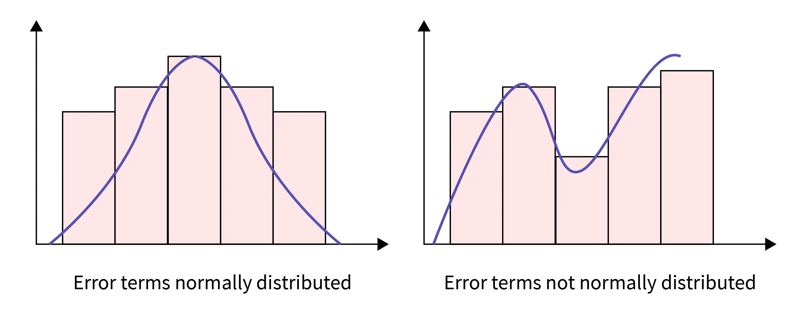
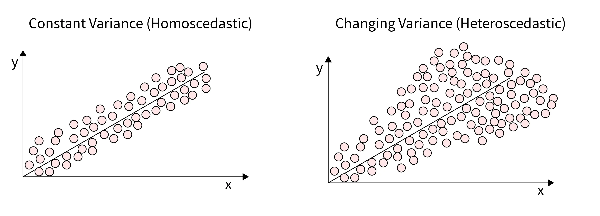
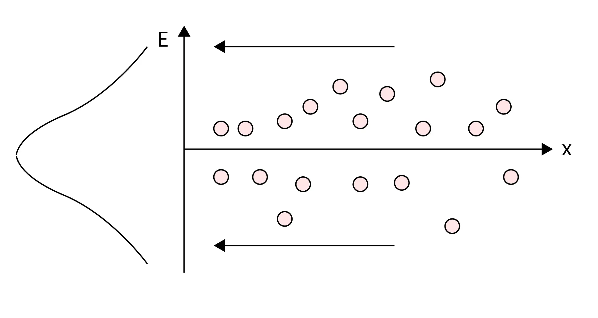
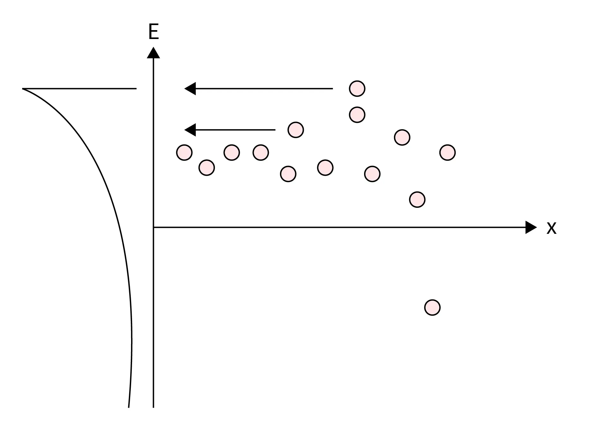

<h1 align="center">Análise de Resíduos</h1>
<h2 align="center">Introdução</h2>

Um dos aspectos mais importantes de um Ciclo de Desenvolvimento de Aprendizado de Máquina é validar e avaliar o desempenho do modelo de Aprendizado de Máquina. Para modelos de Aprendizado de Máquina de regressão, várias técnicas, como o coeficiente de determinação R², entre outras, estão disponíveis para medir a adequação e precisão do modelo.

A análise de resíduos é uma técnica usada para avaliar a validade de um modelo de regressão, examinando as diferenças entre os valores observados e os valores previstos pelo modelo.

<h2 align="center">O que são Resíduos?</h2>
<ul>
  <li>Em estatísticas, um resíduo é a diferença entre o valor observado de uma variável e o valor previsto da variável com base em um modelo estatístico ou de Aprendizado de Máquina. Em outras palavras, em modelos de regressão, um resíduo mede o quão distante um ponto está da linha de regressão.</li>
  
  <li>Em uma análise de resíduos, os resíduos são usados para avaliar a validade de um modelo estatístico ou de Aprendizado de Máquina (ML). O modelo é considerado um bom ajuste se os resíduos estiverem distribuídos aleatoriamente. Se houver padrões nos resíduos, então o modelo não está capturando com precisão a relação entre as variáveis. Pode ser necessário melhorá-lo ou selecionar outro modelo.</li>
</ul>
<h2 align="center">Gráfico de Resíduos</h2>
<ul>
  <li>Um gráfico de resíduos é um gráfico de dispersão no qual o eixo X representa a variável independente ou a variável-alvo, e o eixo Y representa os valores dos resíduos com base no modelo de ML.</li>
  <li>Um gráfico de resíduos é usado para identificar os padrões subjacentes nos valores dos resíduos. Podemos avaliar a validade do modelo de ML com base nos padrões observados.</li>
</ul>
<h2 align="center">Tipos de Gráficos de Resíduos</h2>

Com base nos padrões observados nos valores dos resíduos, existem vários tipos de gráficos de resíduos, como mencionado a seguir:

<h3 align="center">Padrão Aleatório</h3>
<ul>
  <li>Nesta categoria de gráficos de resíduos, os valores dos resíduos estão distribuídos aleatoriamente, e não há nenhum padrão visível nos valores. Nesse caso, o modelo de ML desenvolvido é considerado um bom ajuste.    
  </li>
</ul>

<h3 align="center">Padrão em Forma de U</h3>
<ul>
  <li>Nesta categoria, o gráfico de resíduos segue uma curva em forma de U, como mencionado na figura abaixo. Nesse caso, o modelo não é considerado um bom ajuste, e pode ser necessária a utilização de um modelo não linear.</li>
</ul>

<h2 align="center">Pressupostos sobre Resíduos na Regressão Linear</h2>

Antes de avaliar os modelos de regressão linear usando a análise de gráficos de resíduos, vamos primeiro entender três pressupostos básicos dos modelos de regressão linear em relação aos resíduos.

<h3 align="center">Independência</h3>
<ul>
  <li>O modelo de regressão linear pressupõe que os resíduos ou erros são independentes e que não há nenhum padrão visível. Isso significa que a covariância entre eles é zero.</li>
  <li>Se os termos de erro não forem independentes, a unicidade da solução de mínimos quadrados é perdida, e o modelo não é considerado um bom ajuste.</li>
</ul>

<h3 align="center">Normalidade</h3>
<ul>
  <li>Neste pressuposto, assume-se que os resíduos estão distribuídos normalmente. Se os resíduos não seguirem uma distribuição normal, isso implica que o modelo não é capaz de explicar as relações entre as variáveis no conjunto de dados.</li>
</ul>

<h3 align="center">Homoscedasticidade</h3>
<ul>
  <li>É chamada de pressuposto de variância constante. Nesse pressuposto, assume-se que o termo de erro ou resíduo é constante em diferentes valores da variável-alvo. Isso significa que ele segue a mesma variância em diferentes valores da variável-alvo.</li>
</ul>

<h2 align="center">Análise do Gráfico de Resíduos</h2>
<ul>
  <li>A análise de gráfico de resíduos é usada para avaliar a validade de modelos de regressão linear ao traçar os resíduos e verificar se os pressupostos dos modelos de regressão linear estão sendo atendidos. O pressuposto mais importante de um modelo de regressão linear é que os termos de erro ou resíduos sejam independentes e distribuídos normalmente.</li>
  <li>Um modelo de regressão linear pode ser considerado uma combinação de termos determinísticos e estocásticos. Usando modelos de equações lineares, tentamos prever a parte determinística, e a parte restante é considerada como erros ou resíduos. Esses termos de erro ou resíduos devem ser independentes e distribuídos normalmente, ou seja, estocásticos. É isso que procuramos em um gráfico de resíduos para um modelo.</li>
</ul>
<h3 align="center">Características de um Bom Gráfico de Resíduos</h3>

Um excelente gráfico de resíduos deve apresentar as seguintes características:

<ul>
  <li>Uma alta densidade de pontos próximos ao eixo X, ou seja, os pontos devem estar mais concentrados perto do eixo horizontal e menos densos longe do eixo horizontal.</li>
  <li>Deve ser simétrico em relação ao eixo X.</li>
</ul>

Vamos dar uma olhada na figura abaixo, que é um bom gráfico de resíduos. Como você pode ver, se os resíduos forem projetados no eixo vertical, eles seguirão uma distribuição normal. Nesse caso, o modelo é considerado um bom ajuste.

A figura abaixo mostra um gráfico de resíduos ruim, no qual os termos de erro seguem uma distribuição assimétrica. Nesse caso, o modelo não é considerado um bom ajuste.

<h2 align="center">Tipos de Modelos Suportados</h2>
<ul>
  <li>A análise de gráfico de resíduos suporta a avaliação de modelos paramétricos lineares e não lineares por meio da plotagem dos resíduos do modelo.</li>
  <li>A análise de gráfico de resíduos não está disponível para modelos de resposta em frequência (FRD).</li>
</ul>
<h2 align="center">Conclusão</h2>
<ul>
  <li>A análise de gráfico de resíduos é uma técnica usada para avaliar a validade de um modelo de regressão linear examinando os padrões dos resíduos. Em um gráfico de resíduos, os resíduos são plotados no eixo vertical, e os valores da variável-alvo são plotados no eixo horizontal.</li>
  <li>O modelo é um bom ajuste se os resíduos estiverem distribuídos aleatoriamente. Se houver padrões nos resíduos, então o modelo não está capturando com precisão a relação entre as variáveis.</li>
</ul>
<h2 align="center">Refêrencias</h2>

https://www.scaler.com/topics/data-science/residual-analysis/

