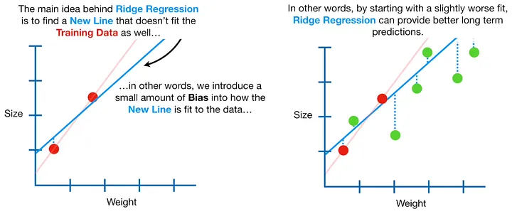
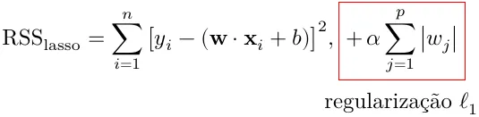
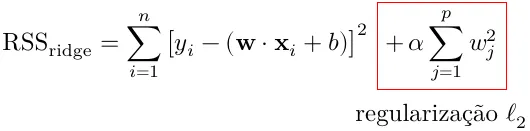
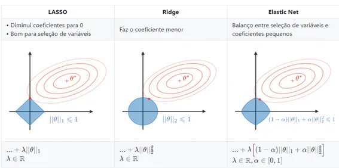

<h1 align="center">Regularização L1 e L2</h1>
<h2 align="center">Regularização</h2>

Regularização é uma técnica para análises estatísticas que aparecem em algumas aplicações, uma delas talvez mais conhecida é a regularização L1 e L2 para machine learning, também conhecida como Lasso e Ridge regression.

A regularização é importante principalmente para lidar com bastante variáveis para determinar os melhores parâmetros num aprendizado de máquina, onde a ideia é deixar menos propenso ao overfitting. E como ele faz isso?

Imagine que o seu conjunto de treino tem apenas 2 linhas, a melhor função da reta onde minimiza o erro é traçar uma reta entre esses dois pontos, oque daria 0 de erro. Mas se adicionar mais pontos você vai perceber que a mesma reta traçada não se ajusta aos novos dados, isso é chamado de high variance (Variância Alta), pois o resultado entre o treino e teste varia bastante.

O que queremos é deixar o modelo mais generalista para prever melhor os dados que não temos, se ajustando menos no treino e mais no teste. Isso funciona através de penalidades que atribuímos a função custo para cada variável do modelo para que ele seja mais robusto.

<h2 align="center">Lasso e Ridge</h2>

Ambas as regularizações são voltadas para a regressão linear, e o que tem de simples, também tem de complexo. L1 ou Lasso é um acrônimo para “Operador Menos Absoluto de Encolhimento e Seleção) e L2 ou Ridge em inglês é “crista” por causa de como funciona a sua penalidade.

<h2 align="center">Lasso</h2>

Essa “formulinha” é dividida em duas partes, a primeira é a função custo, a qual se espera minimizar para reduzir o erro, e a segunda em vermelho é a penalidade L1, que é o valor absoluto (ou módulo) da variável vezes o valor da penalidade. De forma mais simplificada podemos dizer:

<pre>
  l1, Lasso: soma dos quadrados dos resíduos + penalidade * | inclinação |
</pre>

A penalidade aqui é representada como alpha, mas pode encontrar com Lambda (ƛ) também chamado de multiplicador de Lagrange (que é uma forma de resolver problemas de otimização com restrições).

<h2 align="center">Ridge</h2>

Ridge regression é muito, muito semelhante à Lasso regression, mas tem uma diferença muito, muito importante. Para L2 atribuímos o valor da variável elevada ao quadrado, (Sacou? L2, ao quadrado…), é simples, mas tem seu efeito.

De maneira simplificada, temos:

<pre>
  l2, Ridge: soma dos quadrados dos resíduos + penalidade * (inclinação)²
</pre>
<h2 align="center">Diferenças</h2>

A maior diferença entre ridge e lasso, é que quando elevamos a variável ao quadrado para L2, não importa o quão alta possa ser a penalidade imposta, a inclinação da reta não alcança o 0º, mas em l1 por usar o módulo da variável, pode reduzir a 0, podendo ser removida do modelo preditivo.

Lasso praticamente tem um feature selection embutido, isso ocorre conforme é representado na imagem abaixo. No eixo x e y do gráfico é onde o custo mínimo da função pode ser encontrado, se antes ele pudesse estar em qualquer região em vermelho, ao adicionar a penalidade você força ele para a região e azul.

Isso significa que você está enviesando o modelo para diminuir a variância, e o melhor ponto é quando a região em azul e vermelho se encontra, que é o ponto vermelho. Note que no caso do Lasso esse ponto pode ter valor 0 o que acaba “selecionando” algumas variáveis.

Como na regularização ridge não consegue assumir valor 0, ela se dá melhor quando todas as variáveis são úteis, diferente de lasso que pode se dar melhor com menos variáveis. Quanto maior o peso, no caso do L2, cada vez mais se aproxima do zero fazendo com que a inclinação da função seja uma reta horizontal, no caso do L1 a reta realmente pode chegar a 0.

<b>Ok, e em que situação é importante usar regularização?</b>

Imagina num conjunto de dados com apenas uma coluna e uma linha, é impossível criar uma uma regressão já que qualquer inclinação daria um erro 0, então precisa de pelo menos 1 ponto + 1 para cada variável. Agora imagina num dataset com 10000 variáveis como por exemplo uma sequência de genes, então precisaria de 10001 entradas e a regularização ajudará a prever os futuros dados.

<h2 align="center">Elastic-Net Regression</h2>

Então você perguntar, mas então qual eu uso? Uma solução é testar uma outra mais elegante é juntar as duas, e é aí que entra Elastic-net regression.

A regressão Elastic combina lasso e ridge e atribui um peso, podendo ser qualquer valor de 0 a 100% tipo 50/50, 70/30 ou 90/10 sendo que os extremos 0 e 100 anula um ou outro, o mesmo vale quando faça um lasso ou ridge com alfa = 0, simplesmente não tem efeito. É comum criar um loop e verificar qual mistura é melhor para o seu modelo.

A função é feita desse jeito:

<pre>
Elastic-Net Regression (l1+l2) = soma dos quadrados dos resíduos + ƛ(|variavel1| + … + |variavelx|) + ƛ (variavel1² + … + variavelx²)
</pre>

Esse método é bom em lidar com situações onde há correlação entre parâmetros.

<h2 align="center">Outros casos</h2>
<h3 align="center">Árvores de Decisão</h3>

A regularização também aparece na regressão de árvore de decisão, o overfitting pode ocorrer quando tem poucos dados para criar boas folhas, a opção é somar aos resíduos do modelo uma penalidade.

O método em inglês, “Pruning”, significa poda, pois no caso do modelo de árvore quanto mais “folhas”, quanto mais profundo mais propenso a overfitting é, e a ideia é “cortar” a árvore. Sem l1 ou l2 a fórmula usada para saber o melhor valor para a penalidade é a seguinte:

<pre>
Pontuação da Árvore = soma dos residuos ao quadrado + aT (Penalidade complexa de árvore)
</pre>

Sendo a = penalidade e T = Tamanho da árvore

A ideia é que quanto maior a árvore, mais penalizada ela é fazendo com que o erro mínimo seja um intermediário entre uma árvore profunda e não profunda.

<h3 align="center">Logistic Regression e SVM’s</h3>

De maneira similar a outros casos acima a regularização L1 e L2 também está presente nos modelos de SVM para regressão e classificação e para a Regressão Logística. Dá uma olhada na documentação e vê onde e como aplicar, se não souber inglês não tem problema, só liga o google tradutor e seja feliz!

<h3 align="center">Normalização</h3>

E veja só onde mais eles aparecem, na normalização, usados para redimensionar os dados para ficar melhor para as máquinas.

A normalização L1 é calculada com a soma dos valores absolutos do vetor, sendo dividido por cada entrada. Exemplo:

<pre>
l1(v) = |v| = |a1| + |a2| + |a3| = 6

a / l1(v) => 1 / 6 = 0,16 | 2 / 6 = 0,33 | 3 / 6 = 0,5
</pre>

A norma L2 é calculada como a raiz quadrada da soma dos valores do vetor ao quadrado. Exemplo:

<pre>
l2(v) = v² = sqrt(a1² + a2² + a3²) = 3,74

a / l2(v) => 1 / 3,74 = 0,26 | 2 / 3,74 = 0,53 | 3 / 3,74 = 0,80
</pre>
<h3 align="center">Árvores de Decisão</h3>

Obrigado por ter lido até aqui e espero que esse conteúdo tenha sido útil como também foi para mim poder aprender um pouco mais sobre Machine Learning. Regularização ajuda a entender sobre overfitting e como resolver com métodos que sem uma visão aprofundada acaba não sendo utilizados, então fica uma lista de referências que me ajudaram a construir esse artigo.

<h2 align="center">Referências:</h2>

https://medium.com/data-hackers/o-que-%C3%A9-regulariza%C3%A7%C3%A3o-l1-l2-6697ada36a51

