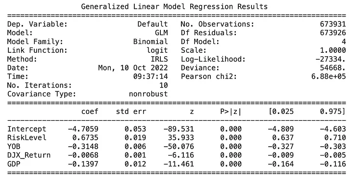
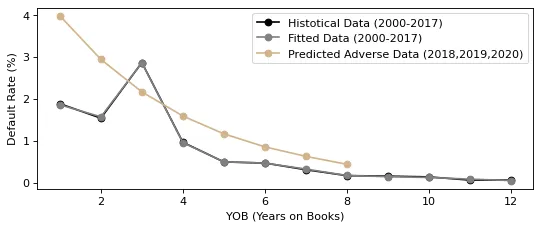

<h1 align="center">Modelos Lineares Generalizados (GLM)</h1>

O Modelo Linear Generalizado (GLM) é um dos muitos modelos para formar a relação linear entre a variável dependente e seus preditores. Os GLMs possuem três componentes: aleatório, sistemático e função de ligação. Existem muitos tipos de GLM: binomial, Poisson, gama, quasi, gaussiano, tweedie, etc. Os GLMs são recentemente um ótimo e fácil ponto de partida para metodologias estatísticas avançadas. Podemos usar GLMs, por exemplo, para extrapolação, onde o aumento de gradiente ou florestas aleatórias não funcionam bem. Podemos usar GLMs no setor financeiro para avaliar empréstimos ou ações, no setor de saúde ou em quaisquer outros casos com várias variáveis independentes. O conceito de GLM é direto em comparação com metodologias de ML e geralmente são necessárias mais transformações e compreensão antes de fazer uma conclusão.

O objetivo deste código Python é criar um GLM binomial (ou tweedie) simples e prever/prever valores de inadimplência para um departamento de crédito em um banco. O inadimplência é a variável de resposta/dependente, falhas no cumprimento de uma obrigação de empréstimo. Quanto maior o inadimplência, maior a chance de o empréstimo não ser reembolsado. As variáveis independentes são: RiskLevel, YOB (Years On Book), LGD (Loss Given Default), EAD (exposição em caso de inadimplência), ID (Chave Primária), Ano, Retorno DJX (Índice Dow Jones), PIB (Produto Interno Bruto).

Os conjuntos de dados estão localizados aqui:

<ul>
  <li>Empréstimos Pendentes (Outstanding Loans) - Colunas: RiskLevel, YOB, LGD, EAD</li>
  <li>Empréstimos Antigos (Old Loans) - Colunas: ID, RiskLevel, YOB, Ano, Inadimplência</li>
  <li>Histórico Simplificado do Fed (Simplified Fed History) (anos 2000 – 2017) - Colunas: Ano, Retorno DJX, PIB</li>
  <li>Adverso Simplificado (Simplified Adverse) (anos 2018, 2019, 2020) - Colunas: Ano, DJX, PIB</li>
</ul>
<h2 align="center">1. Código Python</h2>

O código Python completo está disponível nas refêrencias no primeiro link. Instale e importe bibliotecas no Google Colaboratory.

<pre>
%matplotlib inline
import numpy as np
import pandas as pd
import statsmodels.api as sm
import matplotlib.pyplot as plt
import statsmodels.formula.api as smf
</pre>

Prepare os dados para o trabalho.

<pre>
# Leia o portfólio de crédito. Portfólio de empréstimos para teste
myPortfolio = pd.read_excel("OutstandingLoans.xlsx")
# Leia empréstimos antigos
myLoanHistory = pd.read_excel("OldLoans.xlsx")
# Leia os dados econômicos e financeiros do Fed
FedHistory = pd.read_csv("Simplified_FedHistory.csv")
</pre>

Combine os dois conjuntos de dados, crie o modelo GLM e exiba os resultados. Você pode escolher entre as famílias GLM da biblioteca Statsmodels, Binomial, Tweedie ou Poisson, estas 3 fornecerão um ajuste muito bom. A diferença não é crítica, no entanto, Tweedie é recentemente considerado o mais projetado para questões de risco coletivo. A função de link do Tweedie não é logit, mas log.

<pre>
# Combine os dois conjuntos de dados para obter as variáveis para os valores históricos em 1 quadro de dados

combinedHistory = pd.merge(myLoanHistory, FedHistory, on = "Year")

#Criar MODELO LINEAR GENERALIZADO

#fórmula: Default representa o intercepto (variável dependente)
#O intercepto é o valor previsto das variáveis dependentes, quando todas as variáveis independentes / Nível de risco, YOB, DJX, PIB / são 0.
#Você também pode tentar a família Tweedie com sua função de link neste caso

model = smf.glm(formula = "Default ~ RiskLevel + YOB + DJX_Return + GDP", data = combinedHistory, family = sm.families.Binomial())

#De um Fit no modelo
result = model.fit()

#Exibir e interpretar os resultados
print(result.summary())

#Probabilidades estimadas de inadimplência
predictions = result.predict()
</pre>

Vamos agorta interpretar os resultados.

<b>Variáveis (Variables)</b> — as variáveis independentes são aquelas que selecionamos na Fórmula acima: RiskLevel, YOB, DJX_Return e GDP. A variável dependente é o Default, está na primeira linha chamada como Intercept, a que predizemos.

<b>Coeficientes (Coefficients)</b> — a partir da saída da regressão, podemos ver que o coeficiente de regressão para RiskLevel é 0.6735. Isso significa que, em média, cada nível de risco adicional está associado a um aumento de 0.6735 pontos no inadimplência final, assumindo que as outras variáveis preditoras YOB, DJX e PIB sejam mantidas constantes.

<b>Deviance</b> - é a variância não explicada pelo modelo. O deviance é uma métrica de qualidade do ajuste para modelos estatísticos, usada para GLMs. É a diferença entre o modelo saturado (perfeito) e o modelo proposto, o quanto de variação existe no modelo de dados proposto. Quanto menor o deviance, melhor o modelo.

<b>Df Model</b> - o Df Model é o número das nossas 4 variáveis ​​preditoras. Temos 4 preditores aqui: RiskLevel, YOB, DJX, GDP.

<b>Df Residuals</b> - é o tamanho da amostra menos o número de parâmetros sendo estimados, df(Residual) = n - (k+1) = n - k - 1. O Df Residuals é outro nome para nossos graus de liberdade no nosso modelo.

<b>Função de ligação (função canônica) (Link function)</b> - ela liga o seu preditor linear. A distribuição normal tem função de ligação identidade, a distribuição Poisson tem função de ligação log e a distribuição Binomial tem função de ligação logit. A melhor descrição é fornecida na biblioteca statsmodels.

<b>Escala (escala real) (Scale)</b>- na Binomial e Poisson, a escala é 1 sob a hipótese de especificação correta. Em gaussian e outros, temos um parâmetro de escala adicional não fixo em um. Em Poisson ou Binomial dispersos, também temos um parâmetro de escala adicional.

<b>[0.025 e 0.975]</b> - estes são intervalos de confiança simétricos. Para amostras menores, 0.025 é melhor/mais preciso do que 0.5, claro. 0.025 e 0.975 são medidas dos valores dos nossos coeficientes dentro de 97.5% dos nossos dados. Fora desses valores, geralmente podem ser considerados outliers. 97.5% da área de uma distribuição normal do coeficiente RiskLevel está entre os valores 0.637 e 0.710. Ou seja, há uma chance de 97.5% de que o coeficiente de YOB tenha um valor entre -0.327 e -0.303.

<b>Std err</b> - o std err é o erro padrão / desvio padrão da estimativa do ponto do coeficiente no GLM. É uma medida de incerteza sobre esta estimativa. Um erro muito grande significa que uma estimativa do coeficiente é calculada com muita imprecisão. Por exemplo, o coeficiente do DJX é estimado com mais precisão do que o coeficiente do PIB.

<b>P>|z|</b> - um dos dados estatísticos mais importantes no resumo do GLM. Ele usa as estatísticas z para gerar o valor p, uma medida de quão provável é que sua estimativa do ponto do coeficiente seja medida por meio do modelo GLM por acaso. O valor p de 0% para RiskLevel está dizendo que não há chance de que o RiskLevel não tenha efeito na variável dependente Default, portanto, os resultados não são produzidos por acaso. O valor p de, por exemplo, 0,256 para RiskLevel estaria dizendo que há uma chance de 25,6% de que a variável RiskLevel não tenha efeito na variável dependente, Default, e os resultados sejam produzidos por acaso. O P>|z| informa se nossa estimativa do ponto foi calculada "bem" para distingui-la de zero. Definimos "bem" usando o p < 0,05, porque uma alfa comum é 0,05. O P>|z| irá comparar o valor p a um valor alfa previamente estabelecido ou a um limiar z com o qual você aplica significância ao seu coeficiente.

<b>Pearson Chi2</b> - quanto maior o valor do Qui-quadrado, maior a probabilidade de que haja uma diferença significativa. O Chi2 é uma função dos graus de liberdade e da escala real. É um teste de independência e faz sentido comparar, por exemplo, 2 modelos GLM (escolha o modelo com o menor Chi2) ou comparar as contagens observadas com seus valores esperados sob a configuração multinomial. Quanto maior o valor do Qui-quadrado, maior a probabilidade de que realmente exista uma diferença significativa.

<b>Iterations</b> - quanto tempo levou para você ajustar a verossimilhança do log no modelo. Normalmente, o IRLS não leva mais do que 25 iterações e você deseja minimizar o tempo de computação. Com cada nova iteração, a verossimilhança do log é ligeiramente mais alta/melhor. Muitas outras metodologias iterativas estão tentando remover cálculos redundantes, lidar melhor com cálculos de matrizes tabuladas, incluir mais funções para validações cruzadas automatizadas, etc.

<b>Log likelihood</b> - é o logaritmo natural da probabilidade. A log-likelihood é uma indicação numérica da probabilidade de que seu modelo produzido produziu. Ele compara os valores dos coeficientes para cada variável no processo de criação do modelo. A probabilidade é o produto da densidade avaliada nas observações. Normalmente, a densidade assume valores menores que um, portanto, seu logaritmo será negativo como neste caso: -27334. Valores mais altos (valores menos negativos) correspondem a um melhor ajuste, porque você deseja maximizar a verossimilhança do intercepto. Por exemplo, um valor de log-likelihood de -3 é melhor do que -7. O logaritmo é uma função monotônica crescente de seu argumento, a maximização do log de uma função está correlacionada com a maximização da função em si.

<b>Z-score</b> - é uma medida numérica que descreve uma relação entre um valor e a média de um grupo de valores. É o desvio padrão da média. Se uma pontuação Z é 0, a pontuação do ponto de dados é idêntica à pontuação média.

Revisar AIC e BIC. O AIC (critério de informação de Akaike) tem valor menor quanto melhor ajustamos o modelo. Da mesma forma que BIC ou MDL, o AIC fornece a pontuação básica para escolher o melhor modelo. O BIC (critério de informação bayesiana) tem um valor menor, melhor o ajuste do modelo. O cálculo é semelhante ao MDL. Geralmente, há uma alta correlação entre AIC e BIC. MDL (descrição mínima) é outro critério para pontuar um modelo, valor menor, melhor o ajuste do modelo.

<pre>
# Calcule o Critério de Akaike
print(result.aic)
# Calcule o Critério de Informação Bayesiano
print(result.bic)
</pre>

Calcule esse valor padrão para os anos de 2000 a 2017.

<pre>
# Calcule as taxas históricas de inadimplência da carteira
Default = []
for i in range(np.shape(combinedHistory["YOB"].unique())[0]):
  YOB = combinedHistory.loc[combinedHistory["YOB"] == i + 1]
  DefaultFreq = YOB["Default"].value_counts()
  DefaultRate = (DefaultFreq.values[1]/(DefaultFreq.values[0] + DefaultFreq.values[1]))*100
  Default.append(DefaultRate)
# Dataframe contendo anos em que os ativos estão em livros e o modelo preditivo
myModel = pd.DataFrame({"YOB": np.array(combinedHistory["YOB"]), "estDefault": predictions})
</pre>

Calcule as taxas de inadimplência estimadas.

<pre>
estDefault = []
for i in range(np.shape(myModel["YOB"].unique())[0]):
  YOB = myModel.loc[myModel["YOB"] == i + 1]
  estDefaultFreq = YOB["estDefault"].mean()*100
  estDefault.append(estDefaultFreq)
</pre>

O arquivo de cenário econômico adverso possui valores do DJX e totais do PIB por anos em 2018, 2019 e 2020. O arquivo funciona como um grupo de controle. Entre os anos de 2000 e 2017, a economia está em expansão, e entre os anos de 2018 e 2020, a economia está em contração.

<pre>
AdverseScenario = pd.read_csv("Simplified_Adverse.csv")
  
#Carteira sob condições econômicas adversas
AdversePortfolio = myPortfolio.assign(Year = AdverseScenario.iloc[0, 0],DJX_Return = AdverseScenario.iloc[0, 1],GDP = AdverseScenario.iloc[0, 2])

#Probabilidades previstas de inadimplência em condições econômicas adversas. Usando o modelo GLM criado.
PD = result.predict(AdversePortfolio)

#Dataframe contendo anos em que os ativos estão em livros e o modelo preditivo
predPD = pd.DataFrame({"YOB": np.array(myPortfolio["YOB"]), "PD": PD})
</pre>

Veja o DJX e o PIB para os anos de 2000 a 2020.

<pre>
combined = pd.concat([FedHistory, AdverseScenario])
</pre>

Calcule as taxas de inadimplência previstas e a perda esperada.

<pre>
# Calcule as taxas previstas de inadimplência
predDefault = []
for i in range(np.shape(predPD["YOB"].unique())[0]):
  YOB = predPD.loc[predPD["YOB"] == i + 1]
  predDefaultFreq = YOB["PD"].mean()*100
  predDefault.append(predDefaultFreq)

#Calcule a perda esperada da carteira de empréstimos em condições econômicas adversas
ExpectedLoss = sum(AdversePortfolio["EAD"]*AdversePortfolio["LGD"]*PD)
</pre>

Plote a inadimplência por ano de origem (YOB). Se o YOB for o menor (as observações mais recentes), há uma alta probabilidade de inadimplência elevada. As taxas de inadimplência são muito mais altas em uma economia em contração (adversa, 2018–2020) do que em uma economia em expansão (histórica, 2000–2017). O modelo GLM criado é o melhor ajuste para os dados históricos e adversos, a linha preta está totalmente coberta pela linha cinza.

<pre>
#Visualização com matplotlib
from matplotlib.pyplot import figure
figure(figsize=(8, 3), dpi=80)

#arquivo original, valores históricos, base para criação do modelo GLM, grupo de treinamento, anos até 2017, economia em expansão
plt.plot(combinedHistory["YOB"].unique(), Default, "o-", color = "black", label = "Historical Data (2000-2017)")
plt.ylabel("Default Rate (%)")
plt.legend()

#resultado da previsão do GLM a partir dos dados históricos, semelhante ao grupo de validação, o modelo GLM é o melhor ajuste
plt.plot(myModel["YOB"].unique(), estDefault, "o-", color = "grey", label = "Fitted Data (2000-2017)")
plt.xlabel("YOB (Years on Books)")
plt.legend()

#resultado da previsão a partir da carteira adversa, semelhante ao grupo de controle, anos de 2018, 2019 e 2020, economia em contração
plt.plot(predPD["YOB"].unique(), predDefault, "o-", color = "tan", label = "Predicted Adverse Data (2018,2019,2020)")
plt.legend()
plt.show()
</pre>

<h2 align="center">2. Definições das Colunas</h2>

<b>YOB (anos nos livros)</b> - neste conjunto de dados, as informações do YOB são as mesmas que a idade do empréstimo. Todos os empréstimos começam com um YOB de 1. Outra variável frequentemente usada é o tempo que cada empréstimo foi observado (Anos Observados), que é o valor final da variável anos nos livros (YOB). Esses anos observados geralmente representam o número de anos até a inadimplência, ou até o final do período de observação (12 anos), ou até que o empréstimo seja retirado da amostra devido a pré-pagamento.

<b>Nível de Risco (Risk level)</b> - os produtos da carteira têm diferentes níveis de risco, baixo, médio ou alto. Os empréstimos mais arriscados são os empréstimos pessoais de crédito ruim, empréstimos de consolidação de crédito ruim, empréstimos de pagamento de salário, empréstimos com título de automóvel.

<b>LGD</b> - Perda em caso de inadimplência - a quantia estimada de dinheiro que um banco ou outra instituição financeira perde quando um mutuário não paga um empréstimo.

<b>EAD</b> - exposição em caso de inadimplência - EAD é a quantia prevista de perda à qual um banco pode estar exposto quando um devedor não paga um empréstimo.

<b>Inadimplência (Default)</b> - falha em cumprir uma obrigação, falha em pagar um empréstimo. Quanto maior a taxa de inadimplência, maior a probabilidade de o empréstimo não ser pago. É uma variável dependente da resposta, um indicador de inadimplência.

<b>Retorno do DJX</b> - Índice Dow Jones - um índice do mercado de ações composto por 30 empresas proeminentes listadas em bolsas de valores nos Estados Unidos. Para calcular o DJIA, a soma dos preços de todas as 30 ações é dividida por um divisor, o Dow Divisor.

<b>PIB</b> - Crescimento do produto interno bruto ano a ano.

<h2 align="center">3. Referências</h2>

<b>Primeiro vou deixar o código python completo a seguir no link:</b> https://github.com/spribylova/PythonBank/blob/main/Loan_test.ipynb

https://medium.com/@sarka.pribylova/generalized-linear-model-f607ac7f0ef5#:~:text=Generalised%20Linear%20Model%20(GLM)%20is,%2C%20gaussian%2C%20tweedie%2C%20etc.

https://www.casact.org/sites/default/files/2022-07/RM9_AtlernativestoTweedieDistributioninGLM.pdf

https://clas.ucdenver.edu/marcelo-perraillon/sites/default/files/attached-files/week_7_glm_and_costs_perraillon.pdf

https://www.sagepub.com/sites/default/files/upm-binaries/21121_Chapter_15.pdf

https://www.researchgate.net/post/When-and-in-what-situation-gamma-GLM-is-recommended

https://stats.stackexchange.com/questions/77579/log-linked-gamma-glm-vs-log-linked-gaussian-glm-vs-log-transformed-lm

https://www.jstatsoft.org/article/download/v033i01/361

https://scikit-learn.org/stable/modules/linear_model.html

http://www.science.smith.edu/~jcrouser/SDS293/labs/lab4-py.html

https://towardsdatascience.com/scikit-learns-generalized-linear-models-4899695445fa

https://stats.stackexchange.com/questions/77579/log-linked-gamma-glm-vs-log-linked-gaussian-glm-vs-log-transformed-lm

https://www.mathworks.com/matlabcentral/fileexchange/67771-stress-testing-predicting-loss-under-adverse-economic-conditions

https://github.com/KhalilBelghouat/StressTestingLoanPortfolio

https://assets.kpmg/content/dam/kpmg/cn/pdf/en/2020/02/stress-testing-loan-portfolios-in-times-of-crisis.pdf

https://www.bis.org/bcbs/events/rtf08bjrspres.pdf

https://cms.rmau.org/uploadedFiles/Credit_Risk/Library/RMA_Journal/Other_Topics_(1998_to_present)/Stress%20Testing%20the%20Commercial%20Loan%20Portfolio%20-%20Why%20and%20How.pdf

https://cmup.fc.up.pt/cmup/engmat/2012/seminario/artigos2012/alvaro/jrmv_assouan_web.pdf

https://www.researchgate.net/publication/23755208_Stress_Testing_of_Real_Credit_Portfolios

https://publications.gc.ca/Collection/FB3-2-106-47E.pdf

https://www.investopedia.com/terms/d/defaultrate.asp

https://www.investopedia.com/terms/a/adversely-classified-asset.asp

https://www.datarobot.com/wiki/training-validation-holdout/

https://www.cepal.org/sites/default/files/publication/files/41254/RVI120_MarquesMotta.pdf

https://www.statsmodels.org/dev/glm.html

https://www.investopedia.com/articles/basics/03/050203.asp

https://towardsdatascience.com/python-for-finance-an-implementation-of-the-modern-portfolio-theory-39cdbaeefbd4

https://medium.com/codex/creating-a-diversified-portfolio-with-correlation-matrix-in-python-7d7825255a2d

https://www.researchgate.net/publication/252914218_Pearson%27s_Idea_to_test_fitting_in_GLM

https://builtin.com/data-science/portfolio-optimization-python

https://www.kaggle.com/code/amlgroupproject/stock-portfolio-diversification-using-ml

https://www.statology.org/interpret-prz-logistic-regression-output-r/

https://jorgepit-14189.medium.com/portfolio-optimization-in-python-5c442df56ac4

https://www.iexcloud.io/community/blog/portfolio-risk-management-with-python-from-correlation-to-diversification

https://towardsdatascience.com/cryptocurrency-analysis-with-python-buy-and-hold-c3b0bc164ffa

https://link.springer.com/book/10.1007/978-3-030-53743-2

https://www.youtube.com/watch?v=KYm01d2hr6g

https://www.rairo-ro.org/articles/ro/pdf/2021/01/ro200347.pdf

https://developers.refinitiv.com/en/article-catalog/article/portfolio-optimisation-ii

https://www.listendata.com/2019/08/datasets-for-credit-risk-modeling.html

https://www.mathworks.com/help/risk/portfolioecl.html

https://www.bis.org/basel_framework/chapter/CRE/32.htm

https://en.wikipedia.org/wiki/Generalized_linear_model

https://glum.readthedocs.io/en/latest/motivation.html

https://www.foxbusiness.com/personal-finance/high-risk-loans

https://github.com/statsmodels/statsmodels/issues/3101

https://www.mathworks.com/help/risk/compare-pd-using-ttc-and-pit-models.html

https://www.mathworks.com/help/risk/stress-testing-retail-credit-default-probabilities-using-panel-data-1.html

https://www.mathworks.com/help/risk/modeling-probabilities-of-default-with-cox-proportional-hazards.html

https://core.ac.uk/download/48544724.pdf

https://en.wikipedia.org/wiki/Iteratively_reweighted_least_squares

https://en.wikipedia.org/wiki/Dow_Jones_Industrial_Average

https://medium.com/swlh/interpreting-linear-regression-through-statsmodels-summary-4796d359035a

https://www.fmx.nfkatzke.com/Projects/HRP.pdf

https://towardsdatascience.com/generalized-linear-models-9cbf848bb8ab

https://arxiv.org/abs/2204.02735

https://www.statlect.com/glossary/log-likelihood

