<h1 align="center">Regressão Polinomial</h1>

Nem sempre os dados estão relacionados de tal modo que tenhamos seus valores em uma escala crescente ou decrescente, de tal forma que podemos simplesmente ter uma reta que se aproxima da maioria dos valores.

Em muitos cenários os dados estão dispersos, nestes casos, ao invés de usar função linear de primeiro grau para resolver, podemos tentar usar função polinomial como uma função 2°, 3°, 4° grau, etc.

Neste exemplo, vou usar o <a href="https://www.kaggle.com/datasets/marlesson/bicycle-sharing-brazil-sp-gyn" target="_blank">Dataset Bicycle Sharing Brazil - SP</a>, GYN que possui um dataset com informações sobre aluguel de bicicletas na capital São Paulo e Goiânia. O sistema de aluguel de bicicletas desta empresa é composto por estações, nas quais você pode pegar ou deixar uma bicicleta que foi alugada em qualquer uma das estações da empresa, então é comum você usar para ir de um ponto a outro sem precisar retornar a bicicleta à estação de origem.

A ideia deste post é usar o dataset com os aluguéis de bicicletas de São Paulo e tentar prever as horas do dia que as estações ficam sem bicicletas para serem alugadas.

Para começar, vou usar o Pandas para carregar o arquivo sp_bike.csv:

<pre>
import pandas as pd

df = pd.read_csv('sp_bike.csv')
df.head()
</pre>

E visualizar as primeiras linhas deste dataset:

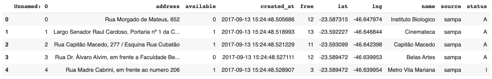

Um ponto que podemos notar é a coluna status que indica se a informação vem de uma estação de bicicletas que está ativa ou inativa. Podemos começar filtrando apenas as estações que estão ativas:

<pre>
df = df[df.status == 'A']
df.head()
</pre>
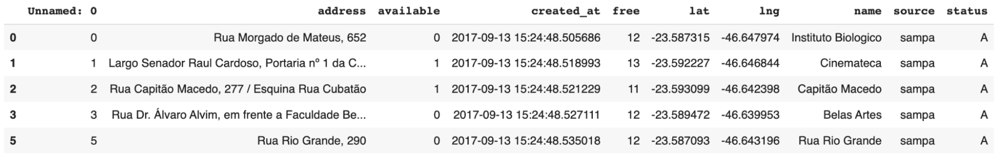

Como neste dataset temos informações de latitude e longitude, um gráfico interessante de olhar é um mapa com os locais das estações. Vamos então pegar o nome, latitude e longitude de cada estação:

<pre>
# Aqui removemos estações duplicadas porque só precisamos mostrar uma de cada no mapa.
df_estacoes = df[['name', 'lat', 'lng']].drop_duplicates()
df_estacoes.info()
</pre>

Para gerar o mapa com as estações de bicicletas, vou usar o Folium que é uma biblioteca em Python para gerar gráficos de mapas geográficos, ela internamente usa uma biblioteca famosa do JavaScript chamada <b>leaflet</b>.

<pre>
import folium

cord_center = [df_estacoes.lat.mean(), df_estacoes.lng.mean()]
mp = folium.Map(location=cord_center, zoom_start=13, tiles='cartodbpositron')
for i, location in df_estacoes.iterrows():
    folium.CircleMarker(
        location=[location['lat'],location['lng']],
        radius=2,
        popup=location['name']
    ).add_to(mp)
mp
</pre>

No mapa cliquei em uma estação que chama <b>Metrô Faria Lima</b>, porque era um local onde eu costumava alugar essas bicicletas.

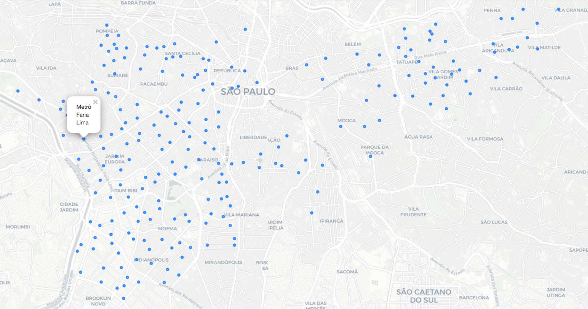
<h2 align="center">Verificar a disponibildade das bicicletas nas estações</h2>

Agora que já sabemos onde temos as estações que estão ativas, vamos verificar a disponibilidade das bicicletas nestas estações.

Vamos começar convertendo a coluna created_at para datetime, assim podemos obter algumas informações, como: o dia da semana (weekday) e a hora do dia (aplicando um formato de string que retorna apenas a hora).

<pre>
import datetime as dt

df['created_at'] = pd.to_datetime(df.created_at)
df['hora'] = df['created_at'].apply(lambda x: dt.datetime.strftime(x, '%H'))
df['dia_semana'] = df['created_at'].dt.weekday
df.head()
</pre>
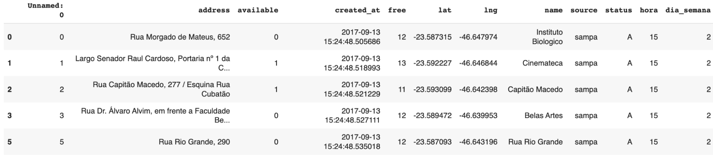

Com a feature de <b>hora</b> conseguimos calcular a média da quantidade de bicicletas disponíveis por hora em cada estação:

<pre>
df_media_hora = df.groupby(['name', 'hora', 'dia_semana'], as_index=False).agg('mean')
df_media_hora['available'] = df_media_hora['available'].astype(int)
df_media_hora.head()
</pre>

A feature available (quantidade disponível de bicicletas) foi deixada com o tipo inteiro, para arredondar o valor e saber se tem ou não bicicletas na estação. 

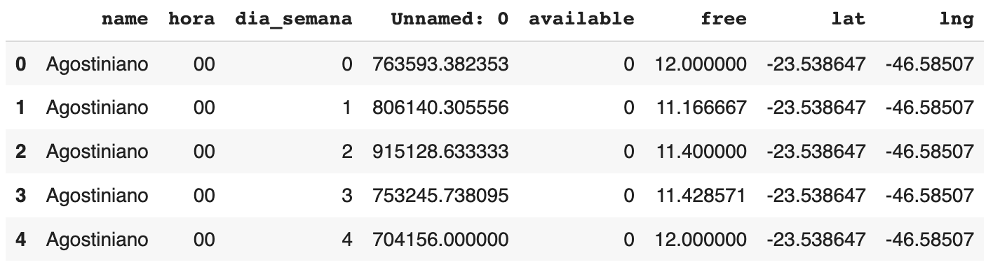

Podemos olhar a média da disponibilidade das bicicletas por hora e dia da semana de uma estação específica:

<pre>
df_media_hora[df_media_hora.name == 'Metrô Faria Lima']
</pre>
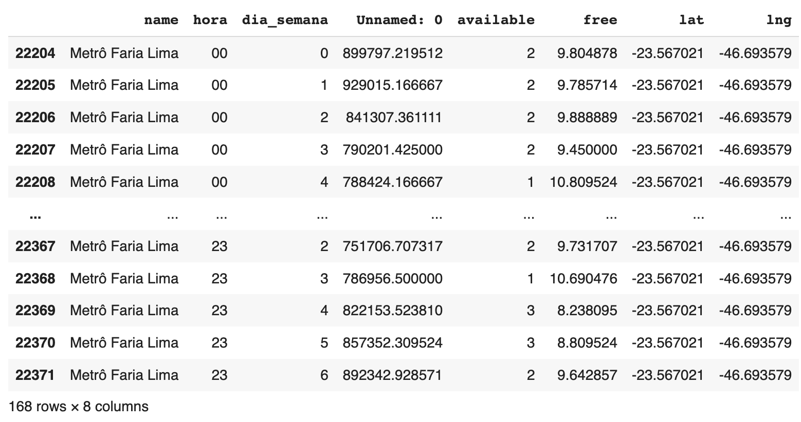

Se quiser deixar de modo mais genérico, podemos agrupar e verificar a média das bicicletas disponíveis por hora em todas as estações:

<pre>
df_hora = df_media_hora[['hora', 'available']].groupby(['hora'], as_index=False).agg('mean')
df_hora.head()
</pre>

Aqui o valor do available foi deixado com casas decimais, porque quando calculamos a disponibilidade média por hora de todas as estações temos um número muito próximo de zero. Aqui podemos identificar alguns cenários para isso ocorrer, como a empresa deixar a disponibilidade mínima em cada estação podendo às vezes ficar vazia, ou o uso da maioria das estações é tão intenso que diminui muito a média geral.

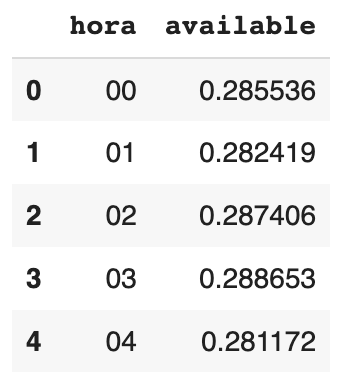

Mesmo tendo um número próximo do zero, vamos continuar e montar o gráfico para verificar o comportamento geral de todas as estações:

<pre>
import seaborn as sns
sns.lineplot(data=df_hora, x="hora", y="available");
</pre>
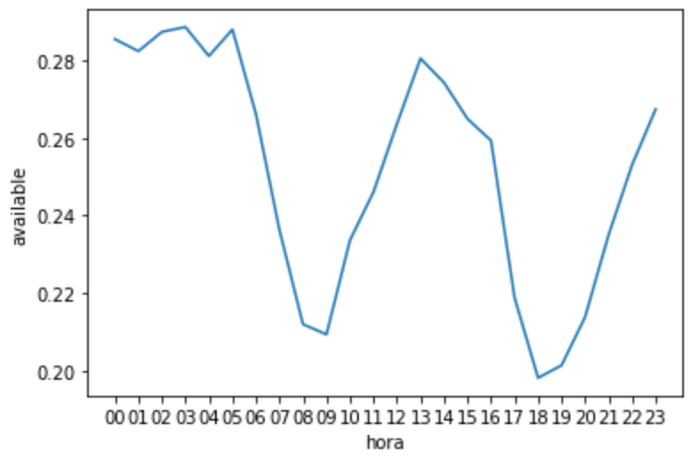

Agora que temos o comportamento do volume de bicicletas disponíveis por hora nas estações, podemos inferir que o comportamento é sempre esse mesmo durante todas as semanas e para todas as estações.

Mas vamos continuar aqui e montar um modelo preditivo, digamos que queremos criar um modelo de Regressão Linear para prever quando ficará sem bicicleta nas estações.

Para treinar o modelo vamos usar nas features de entradas, representadas pela matriz X, vamos utilizar apenas as horas do dia em que há aluguel de bicicletas, e para o resultado esperado, vetor y, vamos usar a disponibilidade média por hora das bicicletas:

<pre>
from sklearn.linear_model import LinearRegression

X = df_hora[['hora']].astype(int).values
y = df_hora[['available']].values

model = LinearRegression()
model.fit(X, y)

y_hora_linear = model.predict(X)
</pre>

Vamos criar um gráfico para ver como ficou a predição feita pela Regressão Linear:

<pre>
import matplotlib.pyplot as plt
sns.scatterplot(data=df_hora, x='hora', y='available');
plt.plot(X, y_hora_linear, color='r')
plt.show()
</pre>
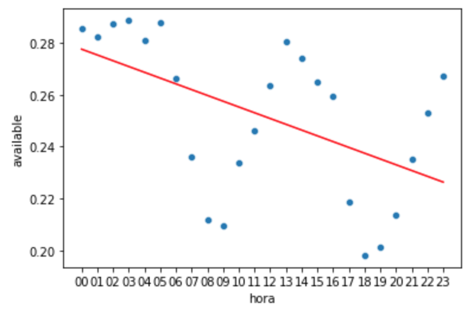

A predição ficou underfitting, isso porque a Regressão Linear tentou fazer uma reta, mas os dados estão muito dispersos, vamos ver como ficou a raiz quadrada do erro médio:

<pre>
from sklearn.metrics import mean_squared_error
mean_squared_error(y, y_hora_linear, squared=False)
</pre>

A raiz quadrada do erro médio deu:

<pre>
0.025457895127012985
</pre>

Agora, vamos tentar outra abordagem para montar esta regressão.

<h2 align="center">Regressão Polinomial</h2>

A sacada da Regressão Polinomial é adicionar novas features no seu dataset, mas essas novas features são as características elevadas ao quadrado, ao cubo, combinações entre as características, etc.

A matriz de características <b>X</b> usada neste exemplo, possui apenas o valor da coluna <b>hora</b>, então vamos obter novas features contendo a hora^2, hora^3, etc.

Se você tiver mais de uma característica, vai ocorrer uma combinação entre as características para gerar novas features, exemplo: digamos que temos as colunas x1, x2 e x3, se gerarmos novas features usando um grau dois (ao quadrado), temos também a opção de gerar combinações das features, vamos obter como resultado as colunas:

<pre>
x1, x2, x3, x1^2, x2^2, x3^2, x1*x2, x1*x3, x2*x3
</pre>

Um cuidado que você deve ter é com a quantidade de colunas que você vai gerar os polinômios e a quantidade de graus que você vai escolher para não ter uma explosão de novas features.

No Scikit-Learn temos a classe PolynomialFeatures que serve para gerar novas features até um grau definido via parâmetro.

Vamos começar criando novas features, vou usar neste exemplo degree = 3, o que significa que será gerado duas novas colunas, sendo uma com o valor da hora do dia elevado ao quadrado e outra coluna com o valor da hora do dia elevada ao cubo.

<pre>
from sklearn.preprocessing import PolynomialFeatures

polinomial = PolynomialFeatures(degree=7, include_bias=False)
X_polinomial = polinomial.fit_transform(X)
</pre>

Se quiser ter apenas combinação entre as características, podemos definir no construtor do PolynomialFeatures o valor de interaction_onlybool com o valor True.

Agora na matriz <b>X_polinomial</b> temos três features que vamos usar para treinar a regressão, por conta dessas novas features chamamos de Regressão Polinomial:

<pre>
model = LinearRegression()
model.fit(X_polinomial, y)

y_polinomial = model.predict(X_polinomial)
</pre>

Vamos gerar um novo gráfico para ver como ficou a predição feita pela Regressão Polinomial:

<pre>
sns.scatterplot(data=df_hora, x='hora', y='available');
plt.plot(X, y_polinomial, color='g')
plt.show()
</pre>

Veja como a regressão gerou valores bem mais próximos dos dados:

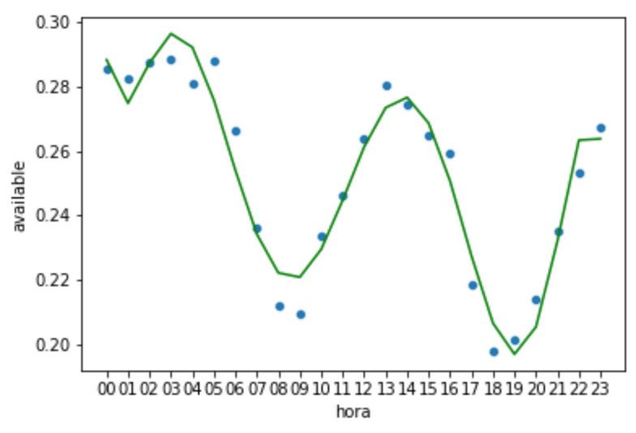

Cuidado para a predição não ficar muito justa ao dados e ter um overfitting, aqui não fiz uma comparação com um dataset de teste, mas quando você for usar sempre compare seu modelo com dados que ele nunca viu.

Vejamos como ficou a raiz quadrada do erro médio:

<pre>
mean_squared_error(y, y_polinomial, squared=False)
</pre>

Temos um valor bem menor se comparado a Regressão Linear:

<pre>
0.007408039578066162
</pre>
<h2 align="center">Treinando uma Regressão Polinomial para uma estação específica</h2>

No exemplo anterior treinamos a Regressão Polinomial levando em consideração os dados de todas as estações, como se disséssemos que todas as estações sempre tem o mesmo comportamento dos usuários. Agora vamos analisar os dados de uma estação e fazer uma Regressão Polinomial mais específica.

Usando o dataset com a média da disponibilidade das bicicletas por hora, vamos filtrar apenas os registros da estação “Metrô Faria Lima”:

<pre>
df_metro_fl = df_media_hora[df_media_hora.name == 'Metrô Faria Lima']
df_metro_fl.head()
</pre>
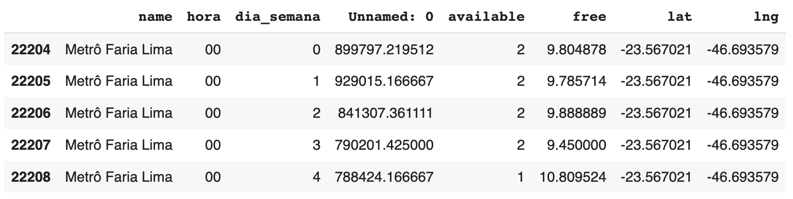

Vamos montar um gráfico para ver a disponibilidade das bicicletas por hora na estação ‘Metrô Faria Lima’, mas agrupando a disponibilidade nos dia da semana:

<pre>
sns.lineplot(data=df_metro_fl, x="hora", y="available", hue='dia_semana');
</pre>

O interessante deste gráfico é que vemos um comportamento diferente entre as cores mais claras (começo da semana) e as cores mais escuras (final da semana):

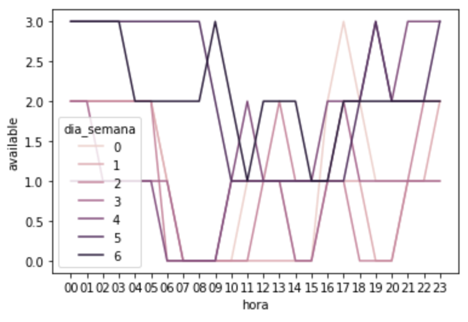

0 (zero) é Segunda-Feira, 1 é Terça-Feira, …, 6 é Domingo.

Vamos separar esses dados em dois datasets, neste primeiro vamos usar apenas os dias da semana de segunda-feira a sexta-feira:

<pre>
df_metro_fl_dia_semana = df_metro_fl[df_metro_fl.dia_semana < 5]
</pre>

Vamos montar um gráfico para ver a disponibilidade das bicicletas durante a semana, de segunda-feira a sexta-feira, na estação ‘Metrô Faria Lima’ por hora.

<pre>
sns.lineplot(data=df_metro_fl_dia_semana, x="hora", y="available", hue='dia_semana');
</pre>

Interessante ver o comportamento desta estação, porque durante a semana das 07:00 às 09:00 ela fica sem bicicletas e isso pode ocorrer devido ao volume de pessoas que circulam nesta região saindo do Metrô Faria Lima e pegando as bicicletas para se locomoverem.

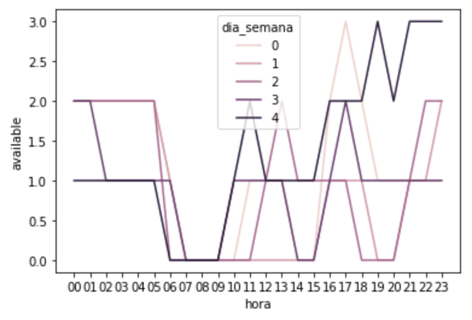

Vamos agora olhar a disponibilidade das bicicletas nesta estação durante o final de semana, sábado e domingo:

<pre>
df_metro_fl_fim_semana = df_metro_fl[df_metro_fl.dia_semana >= 5]
</pre>

Vamos montar o gráfico para verificar as bicicletas disponíveis durante o final de semana na estação ‘Metrô Faria Lima’:

<pre>
sns.lineplot(data=df_metro_fl_fim_semana, x="hora", y="available", hue='dia_semana'); 
</pre>

Nos finais de semana a estação não fica vazia, mas vemos uma queda na disponibilidade às 11:00 e às 16:00:

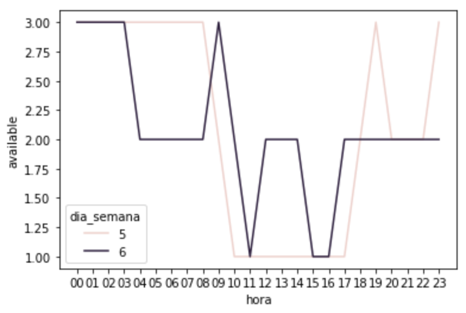

Agora vamos agrupar a disponibilidade das bicicletas formando dois grupos sendo um com os valores durante a semana e outro com os valores dos finais de semana:

<pre>
df_media_dia_semana = df_metro_fl_dia_semana.groupby(['hora'], as_index=False).agg('mean')
df_media_fim_semana = df_metro_fl_fim_semana.groupby(['hora'], as_index=False).agg('mean')
</pre>

E vamos montar um gráfico para ver como essas duas informações se combinam:

<pre>
plt.plot(df_media_dia_semana['hora'], df_media_dia_semana['available'], color='r')
plt.plot(df_media_fim_semana['hora'], df_media_fim_semana['available'], color='b')
plt.show()  
</pre>

Podemos ver que os comportamentos são parecidos ao longo do dia, há uma queda na disponibilidade na parte da manhã e depois volta a aumentar a disponibilidade na parte da tarde.

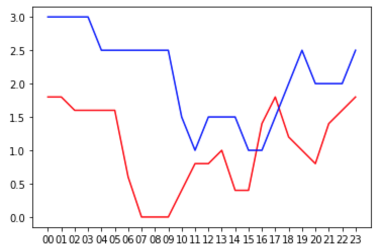

Se montar uma Regressão Linear Simples para tentar prever esse comportamento, provavelmente teremos uma linha reta similar a esta:

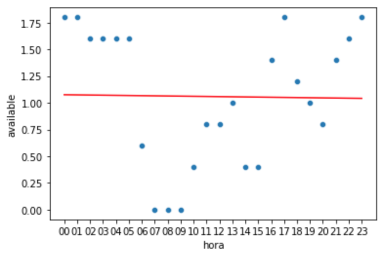

Similar ao exemplo anterior, isso ocorre porque a Regressão Linear Simples, vai criar uma reta que passa o mais próximo de todos os valores, mas este não é um bom caso de uso. Note que mesmo com menos informação, porque agrupamos os dias da semana e final de semana, a reta ainda fica longe do ideal.

Vamos então treinar duas Regressões Polinomiais, uma para os dias da semana e outra para o final de semana.

<h2 align="center">Treinando a Regressão Polinomial para os dias da semana</h2>

Vamos criar um DataFrame de treino X_dia_semana com o valor das horas que temos aluguel de bicicleta e no DataFrame de resultado y_dia_semana separamos a média da disponibilidade de bicicletas por hora dos dias da semana.

<pre>
X_dia_semana = df_media_dia_semana[['hora']].astype(int).values
y_dia_semana = df_media_dia_semana[['available']].values
</pre>

Vamos começar gerando os polinômios da média de disponibilidade das bicicletas durante a semana. Fiz alguns testes e achei um bom resultado usar degree = 7, sugiro que você faça seus testes usando outros graus de polinômios e veja o que você acha.

<pre>
polinomial = PolynomialFeatures(degree=7, include_bias=False)
X_dia_semana_polinomial = polinomial.fit_transform(X_dia_semana)
</pre>

Agora vamos treinar a Regressão Polinomial usando esse dataset que criamos:

<pre>
model = LinearRegression()
model.fit(X_dia_semana_polinomial, y_dia_semana)
</pre>

O conjunto de dados de entrada da Regressão Polinomial são as horas dos dias de semana que tem aluguel de bicicletas mais as features polinomiais geradas:

<pre>
y_dia_semana_polinomial = model.predict(X_dia_semana_polinomial)
</pre>

E vamos gerar um gráfico para visualizar como ficou a predição gerada:

<pre>
sns.scatterplot(data=df_media_dia_semana, x='hora', y='available');
plt.plot(X_dia_semana, y_dia_semana_polinomial, color='g')
plt.show()
</pre>
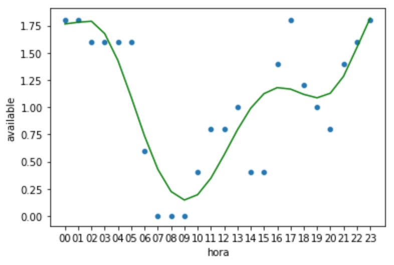

Vejamos como ficou a raiz quadrada do erro médio da Regressão Polinomial usando apenas os dados do dia da semana:

<pre>
mean_squared_error(y_dia_semana, y_dia_semana_polinomial, squared=False)
</pre>
<pre>
0.3172174759646521
</pre>
<h2 align="center">Treinando a Regressão Polinomial para o final de semana</h2>

Vamos realizar um treino similar, mas agora usando os dados apenas do final de semana.

Primeiro separamos no DataFrame de treino X o valor das horas que temos aluguel de bicicleta e no DataFrame de resultado y separamos a média da disponibilidade de bicicletas por hora do final de semana.

<pre>
X_fim_semana = df_media_fim_semana[['hora']].astype(int).values
y_fim_semana = df_media_fim_semana[['available']].values
</pre>

Para os dados de treino vamos também gerar polinômios até o degree = 7:

<pre>
polinomial = PolynomialFeatures(degree=7, include_bias=False)
X_fim_semana_polinomial = polinomial.fit_transform(X_fim_semana)
</pre>

Usando agora esse DataFrame de treino com as novas features vamos treinar a Regressão Polinomial para predição da disponibilidade das bicicletas no final de semana:

<pre>
model = LinearRegression()
model.fit(X_fim_semana_polinomial, y_fim_semana)
</pre>

Novamente, o conjunto de dados de entrada da Regressão Polinomial são as horas do final de semana que tem aluguel de bicicletas mais aa features polinomiais geradas para ver como será a predição feita:

<pre>
y_fim_semana_polinomial = model.predict(X_fim_semana_polinomial)
</pre>

Vamos plotar um gráfico para ver a predição feita em relação a disponibilidade das bicicletas no final de semana:

<pre>
sns.scatterplot(data=df_media_fim_semana, x='hora', y='available');
plt.plot(X_fim_semana, y_fim_semana_polinomial, color='g')
plt.show()
</pre>
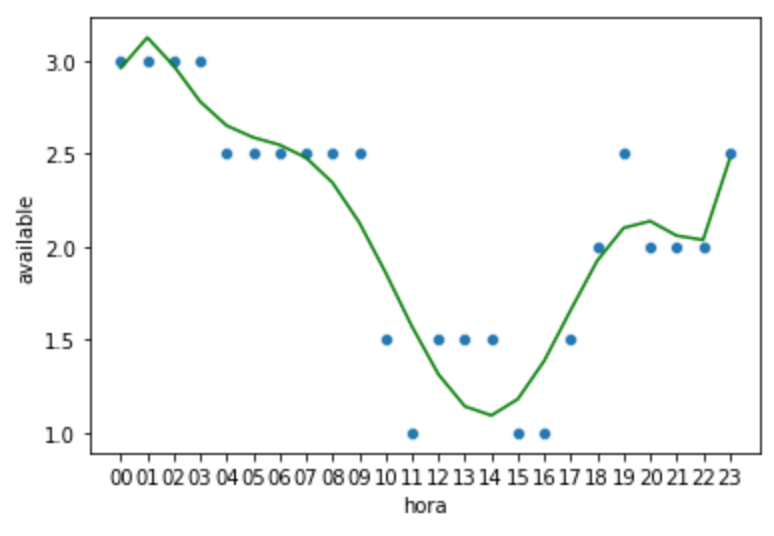

Vejamos a raiz quadrada do erro médio:

<pre>
mean_squared_error(y_fim_semana, y_fim_semana_polinomial, squared=False)
</pre>
<pre>
0.24513760524604158
</pre>

Agora talvez você esteja se perguntando, mas se for para treinar dois modelos para cada estação isso não vai escalar, e de tempos em tempos vou ter que retreinar isso tudo. Acho que você já entendeu a ideia da Regressão Polinomial, deixou aqui duas sugestões para você praticar:

1- usando os dados de todas as estações, separe em dia da semana e final de semana e treine os modelos usando dados separados e veja se o resultado ficou melhor do que no primeiro exemplo que mostrei aqui onde eu usei todos os dados juntos.

2- será que se primeiro dividir as estações entre mais ou menos frequentadas, conseguimos obter uma regressão melhor? Você pode tentar criar uma feature que representa o uso da estação e usar o k-Means para gerar dois clusters de estações, depois fazer a regressão para os dias da semana e para os finais de semana.

<h2 align="center">Referências</h2>

Dataset: https://www.kaggle.com/datasets/marlesson/bicycle-sharing-brazil-sp-gyn
  

https://www.sakurai.dev.br/regressao-polinomial/

