<h1 align="center">Naive Bayes</h1>
<h2 align="center">Introdução ao Algoritmo Naive Bayes</h2>

O Algoritmo Naive Bayes funciona como classificador e baseia-se na probabilidade de cada evento ocorrer, desconsiderando a correlação entre features. Por ter uma parte matemática relativamente simples, possui um bom desempenho e precisa de poucas observações para ter uma boa acurácia. Uma aplicação bastante comum é para identificar se um determinado e-mail é um spam ou não.

<h2 align="center">Matemática do Algoritmo</h2>

Digamos que estamos lidando com uma base de dados com apenas 1 feature composta por 0 ou 1 e a label pode ser 0 ou 1 também.

A tabela de probabilidade é montada da seguinte maneira:

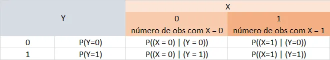

Para classificar, num caso geral com n features e m classificações, o algoritmo pegará os valores (x1, x2, …, xn) das features e calculará P(Y=y1 | X=x1, x2, x3, …, xn), P(Y=y2 | X=x1, x2, x3, …, xn), …, P(Y=ym | X=x1, x2, x3, …, xn). Ele escolherá o yk, 0 < k < m + 1, cuja probabilidade for maior. Como esse processo funciona será explicado a seguir.

<h2 align="center">Classificador Naive Bayes</h2>

Vemos aqui como o algoritmo funciona para classificar a label (ŷ) de um novo evento (X = x1, x2, …, xn).

Partiremos do Teorema de Bayes expandido para o caso de n features

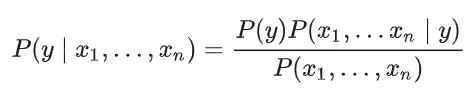

Sabendo que esse algoritmo irá considerar as features independentes duas a duas, pode-se concluir que a probabilidade de xi dado (y, x1, x2, …, xn) é a mesma probabilidade de xi dado y, pois não faz diferença o valor das outras features para a probabilidade da feature em questão:

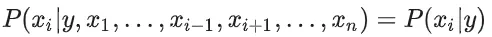

Assim, podemos dizer que P(x1, …, xn | y) = P( x1 | y ) * P(x2 | y) * … * P(xn | y):

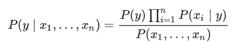

Como P(x1, …, xn) é constante, dado nosso input, podemos considerar que:

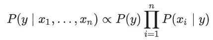

E, assim, nosso classificador escolherá o y cuja probabilidade (em outras palavras, o valor de P(y | x1, …, xn)) é maior:

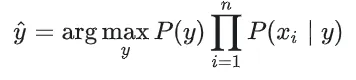
<h2 align="center">Acurácia do Classificador</h2>

A acurácia mede a eficácia do seu modelo, ou seja, o quão “bom” é o algoritmo ou modelo treinado para representar um outro conjunto de dados qualquer.

Você pode conferir sobre outros metodos de avaliação no primeiro capitulo deste modulo de modelagens de dados.

<h2 align="center">Distribuição de Probabilidade</h2>

Considerando um caso simples em que temos apenas 2 features com 2 valores possíveis {0, 1} cada e nossa label pode ser classificada como {0, 1}, precisamos calcular o seguinte para fazer a tabela de probabilidade:

P(X1 = 0, X2 = 0 | Y = 0) = ?; P(X1 = 0, X2 = 1 | Y = 0) = ?

P(X1 = 1, X2 = 0 | Y = 0) = ?; P(X1 = 1, X2 = 1 | Y = 0) = ?

P(X1 = 0, X2 = 0 | Y = 1) = ?; P(X1 = 0, X2 = 1| Y = 1) = ?

P(X1 = 1, X2 = 0 | Y = 1) = ?; P(X1 = 1, X2 = 1 | Y = 1) = ?

Cada uma dessas probabilidades será colocada na tabela de probabilidades.

Na prática, devido ao fato de lidarmos com as variáveis X de forma que são independentes duas a duas, temos, por exemplo, que

P(X1 = 0, X2 = 0 | Y = 0) = P(X1 = 0 | Y = 0) * P(X2 = 0 | Y = 0)

E é feito o mesmo procedimento de forma análoga às demais probabilidades enunciadas acima. Isso diminui o número de probabilidades que precisamos calcular, principalmente quando o número de features e valores possíveis aumenta.

Para a implementação desse modelo, temos 3 tipos de algoritmos Naive Bayes mais usados, os quais daremos mais detalhes. Cada algoritmo funcionará para calcular o P(xi | y) de modo que as features de cada observação estejam de acordo com um tipo de distribuição de probabilidade especificado pelo algoritmo escolhido.

<h2 align="center">Gaussian Naive Bayes</h2>

Nesse primeiro algoritmo, P(xi | y) é dado por:

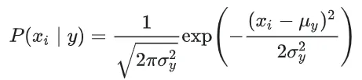

A média (μy) é o valor médio de xi, considerando as observações de classe y. E o desvio padrão (σy) é o desvio padrão da feature xi, considerando as observações da classe y.

<h2 align="center">Multinomial Naive Bayes</h2>

Esse algoritmo usa os dados em uma distribuição multinomial, que é uma generalização da distribuição binomial. Essa distribuição é parametrizada por vetores θyi=(θy1,…,θyn), θyi é a probabilidade do evento i ocorrer, dado que a classe é y. Podemos dizer que cada vetor θy representa uma observação e n é o número de features. Assim, θyi = P(xi | y) e é estimado pela seguinte fórmula:

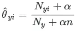

Nyi é o número de vezes que a feature xi aparece no conjunto de treinamento, Ny é o número de observações com classe y, n é o número de features e alfa é uma constante que contabiliza os recursos que não estão presentes nas amostras de aprendizado e impede que haja probabilidade igual a 0. Se alfa = 1, ele é chamado de Laplace smoothing e, se alfa > 1, é chamado Lidstone smoothing. Se alfa = 0, não há correção.

Para podermos visualizar mais facilmente a necessidade, em alguns casos, da correção, digamos que temos a seguinte tabela de probabilidade:

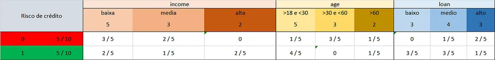

Se tentarmos classificar o caso em que X = (income = alta, age = >30 e <60, loan = medio), podemos perceber que:

P(Y = 0 | X = (income = alta, age = >30 e <60, loan = medio) = 0

P(Y = 1 | X = (income = alta, age = >30 e <60, loan = medio) = 0

Assim, é necessário fazer um additive smoothing (que pode ser Laplace smoothing ou Lidstone smoothing), que é uma correção que consiste em adicionar dados à base de treinamento para que não haja probabilidades iguais a 0. Tal processo é parametrizado pelo alfa.

<h2 align="center">Bernoulli Naive Bayes</h2>

Esse algoritmo se baseia numa base de dados de acordo com a Distribuição Multivariada de Bernoulli, que é composta por diversas features, as quais são valores binários, ou seja, podem assumir um valor dentre dois valores possíveis.

Se alguma feature não for composta por valores binários, BernoulliNB() irá transformá-la em uma feature composta por valores binários dependendo do parâmetro binarize.

Nesse modelo, o P(xi | y) é dado por:

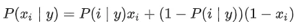

P(i | y) é o parâmetro p da distribuição de Bernoulli. Assim, P(i | y) = p se y = True, e P(i | y) = 1-p se y = False.

Repare que, ao contrário do Multinomial Naive Bayes, há uma penalidade no caso de não ocorrência da feature i.

<h2 align="center">Exemplo prático</h2>

Como já dito, o algoritmo Naive Bayes funciona calculando a probabilidade de cada evento. Mostraremos como esse processo é realizado em termos práticos.

Usaremos uma base de dados de apenas 10 observações para simplificar a explicação do modelo

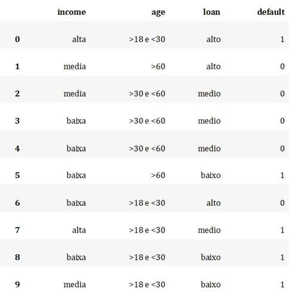

Digamos que a tabela de probabilidade dessa base de dados é a seguinte:

Testaremos a tabela para um novo indivíduo que tem income baixa, age >18 e <30 e loan alto:

P_parcial(Risco de crédito = 0) = (5 / 10) * (1/2) * (1/2) * 1 = 1/8

P_parcial(Risco de crédito = 1) = (5 / 10) * (4/8) * (4/8) * (1/8) = 1/32

P(Risco de crédito = 0) = (1/8) / ((1/8) + (1/32)) = 80%

P(Risco de crédito = 1) = (1/32) / ((1/8) + (1/32)) = 20%

Portanto, a label desse indivíduo será 0.

<h2 align="center">Programação</h2>

Agora vamos aplicar esse modelo usando o scikit-learn, sem nos preocupar tanto com a sua implementação.

<pre>
# Imports básicos
import pandas as pd
from sklearn.model_selection import cross_val_score
</pre>

Nesse exemplo, vamos testar o algoritmo no dataset Iris, que contém informações sobre as pétalas de três espécies de flores. O objetivo é utilizar essas informações para predizer classificar as flores de acordo com a sua espécie.

<pre>
df = pd.read_csv('Iris.csv')
</pre>
<pre>
df.head()
</pre>
<table>
  <thead>
    <tr>
      <th>Id</th>
      <th>SepalLengthCm</th>
      <th>SepalWidthCm</th>
      <th>PetalLengthCm</th>
      <th>PetalWidthCm</th>
      <th>Species</th>
    </tr>
  </thead>
  <tbody>
    <tr>
      <td>1</td>
      <td>5.1</td>
      <td>3.5</td>
      <td>1.4</td>
      <td>0.2</td>
      <td>Iris-setosa</td>
    </tr>
    <tr>
      <td>2</td>
      <td>4.9</td>
      <td>3.0</td>
      <td>1.4</td>
      <td>0.2</td>
      <td>Iris-setosa</td>
    </tr>
    <tr>
      <td>3</td>
      <td>4.7</td>
      <td>3.2</td>
      <td>1.3</td>
      <td>0.2</td>
      <td>Iris-setosa</td>
    </tr>
    <tr>
      <td>4</td>
      <td>4.6</td>
      <td>3.1</td>
      <td>1.5</td>
      <td>0.2</td>
      <td>Iris-setosa</td>
    </tr>
    <tr>
      <td>5</td>
      <td>5.0</td>
      <td>3.6</td>
      <td>1.4</td>
      <td>0.2</td>
      <td>Iris-setosa</td>
    </tr>
  </tbody>
</table>

Note que as features são valores contínuos (o comprimento da pétala da flor, por exemplo). Por isso, vamos utilizar um modelo capaz de lidar com valores contínuos: o GaussianNB, que utiliza uma distribuição normal (contínua) para modelar as features.

<pre>
# Seleção das features e target
x = df[['SepalLengthCm', 'SepalWidthCm', 'PetalLengthCm', 'PetalWidthCm']]
y = df['Species']
</pre>
<pre>
from sklearn.naive_bayes import GaussianNB

gnb = GaussianNB()
cross_val_score(gnb, x, y, cv=10).mean()
</pre>

0.9533333333333334

Com o algoritmo de naive bayes, conseguimos uma acurácia de 95,3%.

Como já falamos nesse post, a distribuição normal depende de:

<ul>
  <li>µxy, a média da feature i nas observações de classe y</li>
  <li>σxy o desvio padrão da feature nas observações de classe y</li>
</ul>

Abaixo, podemos ver os valores calculados pelo algoritmo.

<pre>
gnb.fit(x, y)
media = pd.DataFrame(gnb.theta_, columns=x.columns, index=gnb.classes_)
desv_padrao = pd.DataFrame(gnb.sigma_, columns=x.columns, index=gnb.classes_) 
</pre>
<pre>
# Médias
media
</pre>
<table>
  <thead>
    <tr>
      <th>Species</th>
      <th>SepalLengthCm</th>
      <th>SepalWidthCm</th>
      <th>PetalLengthCm</th>
      <th>PetalWidthCm</th>
    </tr>
  </thead>
  <tbody>
    <tr>
      <td>Iris-setosa</td>
      <td>5.006</td>
      <td>3.418</td>
      <td>1.464</td>
      <td>0.244</td>
    </tr>
    <tr>
      <td>Iris-versicolor</td>
      <td>5.936</td>
      <td>2.770</td>
      <td>4.260</td>
      <td>1.326</td>
    </tr>
    <tr>
      <td>Iris-virginica</td>
      <td>6.588</td>
      <td>2.974</td>
      <td>5.552</td>
      <td>2.026</td>
    </tr>
  </tbody>
</table>
<pre>
# Desvios padrões
desv_padrao
</pre>
<table>
  <thead>
    <tr>
      <th>Species</th>
      <th>SepalLengthCm</th>
      <th>SepalWidthCm</th>
      <th>PetalLengthCm</th>
      <th>PetalWidthCm</th>
    </tr>
  </thead>
  <tbody>
    <tr>
      <td>Iris-setosa</td>
      <td>0.121764</td>
      <td>0.142276</td>
      <td>0.029504</td>
      <td>0.011264</td>
    </tr>
    <tr>
      <td>Iris-versicolor</td>
      <td>0.261104</td>
      <td>0.096500</td>
      <td>0.216400</td>
      <td>0.038324</td>
    </tr>
    <tr>
      <td>Iris-virginica</td>
      <td>0.396256</td>
      <td>0.101924</td>
      <td>0.298496</td>
      <td>0.073924</td>
    </tr>
  </tbody>
</table>
<h2 align="center">Conclusão</h2>

Embora assuma independência entre as features e não proporcione estimativa de probabilidade muito boa, o classificador de Naive Bayes é um potente modelo de predição.

Isso porque não necessita de muitos dados, e na prática, funciona mesmo em alguns casos onde não há independência entre as features. Por esses motivos, é frequentemente implementado em aplicações, desde analise de textos até mecanismos de recomendação.

<h2 align="center">Programação</h2>

https://medium.com/turing-talks/turing-talks-16-modelo-de-predi%C3%A7%C3%A3o-naive-bayes-6a3e744e7986

