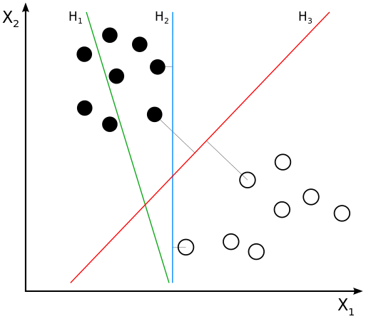
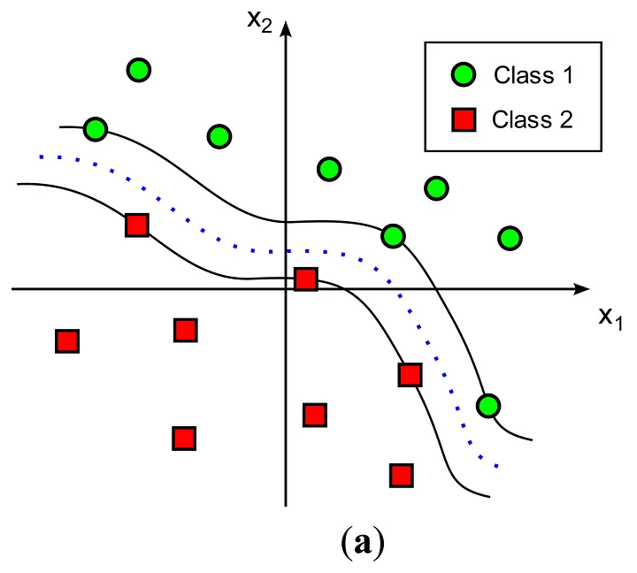
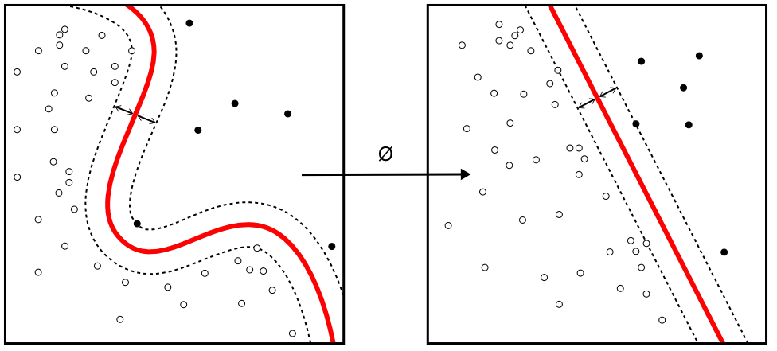
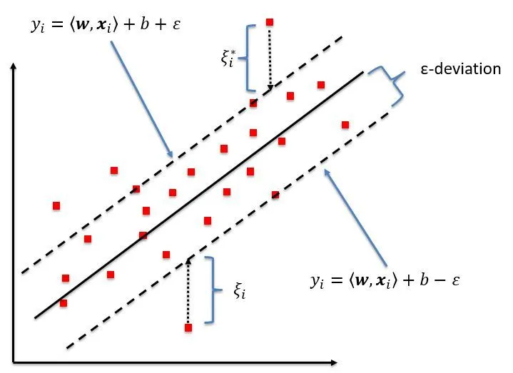
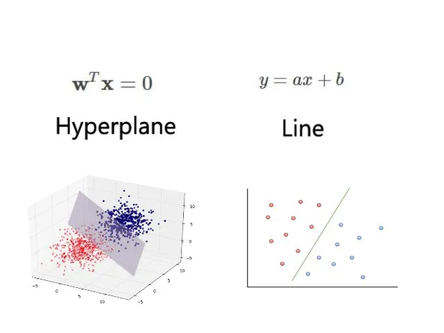
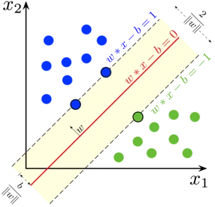
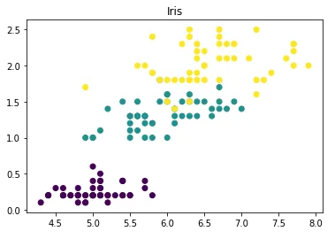
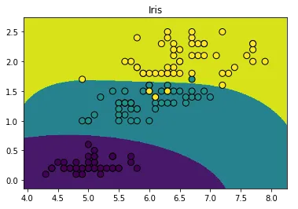

<h1 align="center">SVM (Support Vector Machine)</h1>

O SVM (Support Vector Machine), é um algoritmo de aprendizado supervisionado muito utilizado quando se quer classificar dados em grupos diferentes — mas que também pode ser utilizado para regressão.

<h2 align="center">O que é o SVM?</h2>

O SVM é um algoritmo que busca uma linha de separação entre duas classes distintas analisando os dois pontos, um de cada grupo, mais próximos da outra classe. Isto é, o SVM escolhe a reta — também chamada de hiperplano em maiores dimensões— entre dois grupos que se distancia mais de cada um (no caso abaixo, a reta vermelha).

A reta ótima (H3) é a mais distante dos dois grupos, considerando apenas os pontos de cada grupo mais próximos à reta (como indicado pelas linhas cinzas).

Após descoberta essa reta, o programa conseguirá predizer a qual classe pertence um novo dado ao checar de qual lado da reta ele está.

<h2 align="center">SVM Multiclasse</h2>

Quando temos que classificar nossos dados em mais de duas classes, precisamos de algum modo de simplificar o nosso trabalho. A maneira mais simples e comum é dividir nosso problema multiclasse em várias classificações binárias, que podem ser one vs one ou one vs all (também chamada de one vs rest).

A divisão em one vs one consiste em separar nossa situação em classificações binárias de cada par diferente. Ou seja, se tivermos as três classes A, B e C, faremos as comparações (A, B), (A, C) e (B, C), e a classe mais votada será a escolhida. Por exemplo, se o SVM escolheu A em (A, B), C em (A, C) e C em (B ,C), nosso resultado será (A, C, C) e a classe escolhida será a C.

A divisão em one vs all consiste em comparar cada classe com todo o resto. Ou seja, se tivermos as mesmas três classes A, B e C, dividiremos nosso problema nas comparações (A, B+C), (B, A+C) e (C, A+B), e a classe que ganhar do resto será escolhida. Utilizando o mesmo dado do exemplo passado, o resultado das nossas comparações seriam (B+C, A+C, C), e novamente a classe escolhida será a C.

<h2 align="center">SVM Não Linear</h2>

No entanto, existem grupos que não podem ser separados somente por hiperplanos, como os da imagem ao lado. Nesses casos, utilizamos o SVM não linear para delimitar as duas classes, que traçará uma ou mais linhas retas ou curvas para separar as classes da melhor forma possível.

Para separar esses tipos de exemplos, o algoritmo primeiro faz uma transformação não-linear do espaço para depois poder separar os grupos com um SVM linear. Dessa forma, apesar da separação ser um hiperplano no espaço das features (como chamamos o espaço depois da transformação), no espaço das entradas (como chamamos o espaço inicial) a separação é não-linear.

<h2 align="center">Regressão por SVM</h2>

Apesar de ser mais comumente utilizado para classificação, o SVM também pode ser utilizado para regressão, ou seja, para prever valores contínuos com base nos dados em vez de prever as classes às quais os dados pertencem.

Nesse caso, nosso objetivo é achar o hiperplano que mais se aproxime dos dados. Novamente, o SVM considera apenas um subconjunto dos dados. Se na classificação ele considera apenas os pontos mais próximos ao hiperplano, na regressão, ele considera apenas os pontos mais distantes. Isso quer dizer que, dada uma tolerância épsilon (Ɛ), o SVM considera apenas os pontos que estão a uma distância maior que épsilon do hiperplano. O objetivo é, então, encontrar o hiperplano mais próximo desses pontos. Para casos não lineares, podemos também usar a mesma técnica de transformação do SVM não-linear para fazer uma regressão não-linear.

<h2 align="center">Vantagens e Desvantagens do SVM</h2>

Assim como todos os outros modelos de predição, o SVM tem suas vantagens e suas desvantagens.

Esse tipo de modelo se destaca na classificação de dados espalhados de maneira não regular, já que a separação não precisa ser linear e nem a mesma para todos os dados. Esse algoritmo é muito interessante para iniciantes também porque não é necessário tanto conhecimento da base de dados para conseguir uma predição com boa acurácia. Além disso, o SVM funciona bem em espaços com muitas dimensões (muitas features) e é garantido a convergir para o melhor hiperplano possível, visto que seu algoritmo não se perde em mínimos locais como acontece com redes neurais (que veremos mais adiante).

Contudo, o resultado do SVM é dificilmente interpretável (mas possível) e, conforme o tamanho do dataset vai aumentando, o tempo necessário para fazer os cálculos cresce muito rapidamente e a interpretabilidade cai mais rápido ainda.

<h2 align="center">Vantagens e Desvantagens do SVM</h2>

Ao contrário da regressão linear, o SVM é mais capaz de trabalhar com dados não separáveis linearmente, então é a melhor escolha para datasets mais complexos. Além disso, o SVM sempre conseguirá achar o melhor hiperplano possível para separar duas classes, mas não confunda “melhor possível” com perfeito, às vezes o melhor hiperplano não consegue separar tão bem os dados.

Entretanto, por ser um modelo mais simples, a regressão linear consegue resultados bem mais rápidos conforme a quantidade de dados aumenta, quando comparada ao SVM não-linear.

<h2 align="center">Como acontecem os cálculos do SVM linear?</h2>

Antes de aprofundar essa parte de SVM, é importante esclarecer que entender a matemática desses algoritmos não é necessário para poder aplicá-los. No entanto, esse estudo pode ajudar a conhecer melhor suas limitações e seus usos ideais. Não se preocupe se você se perder nesses cálculos, se essa seção não te interessar recomendamos pular para a aplicação na próxima parte.

Primeiramente, cada dado é representado por um vetor (xᵢ, yᵢ), em que xᵢ é um vetor das coordenadas (features) de cada dado e yᵢ é a classe a qual o dado pertence (1 ou −1).

Assim como uma reta é representada por “y = ax + b”, um hiperplano é representado por “w·x + b = 0”, em que o w é um vetor normal ao hiperplano, que determina sua direção, b é responsável por deslocar linearmente o hiperplano no espaço, sem alterar sua direção, e o conjunto de pontos pertencentes ao hiperplano são todos aqueles pontos x que satisfazem à equação apresentada.

Mas por que “w·x + b = 0” forma um hiperplano? Bem, “w·x” é o produto escalar do vetor w com o vetor x (distância da origem até x), que será igual a zero quando w e x forem ortogonais. Dessa forma, os pontos x que satisfazem “w·x = 0” formarão um hiperplano que passa pela origem. Ao adicionar o b à equação, criaremos novos hiperplanos de mesma direção porém deslocados pra fora da origem.

E, como nosso alvo é achar o hiperplano que melhor separe as duas classes, isso significa que, matematicamente, precisamos encontrar o w e o b ideais.

Agora, para determinar o hiperplano ideal de separação entre duas classes, primeiro é necessário encontrar os hiperplanos que estão no limite de cada grupo (as margens). Para tal, utilizaremos os support vectors — os pontos de cada classe mais próximos do hiperplano de separação—por onde as margens devem passar. As representações destes são “w·x + b = 1” e “w·x + b = −1” para suas respectivas classes, como mostrado na imagem abaixo.

O hiperplano de separação está em vermelho, as margens em linhas tracejadas, e os support vectors são os 3 pontos que estão em cima das margens.

Assim, todos os dados da classe 1 satisfazem a inequação “w·x + b ≥ 1” e todos os dados da classe −1 satisfazem a inequação “w·x + b ≤ −1”. Juntando essas duas inequações temos que “yᵢ · (w·xᵢ + b) ≥ 1”.

Como a distância de um hiperplano até a origem é dada por b/|w|, a distância entre nossos dois hiperplanos será “(1 − b)/|w| − (−1 − b)/|w|”, cujo resultado é “2/|w|”. Já que o hiperplano ideal é aquele cuja distância a cada grupo é a maior possível, nosso w ideal é aquele valor para o qual “2/|w|” seja máximo.

Portanto, o w do nosso hiperplano ideal será o menor w que satisfaça a inequação “yᵢ · (w·xᵢ + b) ≥ 1” para todos os pontos i. A partir disso, utilizamos algum algoritmo de otimização como gradient descent ou Multiplicadores de Lagrange para encontrar o w e o b do melhor hiperplano.

<h2 align="center">Como programar uma classificação por SVM?</h2>

Antes de qualquer coisa, lembre-se de importar as bibliotecas que iremos utilizar para aplicar o SVM. As principais são pandas, numpy, matplotlib e scikit-learn.

Para exemplificar essa forma de classificação, usaremos a base de dados “Iris”, que contém dados sobre 150 flores de 3 espécies diferentes.

<pre>
import pandas as pd
import numpy as np
from matplotlib import pyplot as plt
</pre>
<pre>
from sklearn.datasets import load_iris
data = load_iris()
iris = pd.DataFrame(data['data'], columns=data.feature_names)
iris['target'] = data.target
</pre>

A princípio, é recomendável usar alguns comandos simples para entender melhor sua base de dados.

<pre>
#Apresenta os primeiros 5 indivíduos da base de dados
iris.head()
</pre>
<table>
  <thead>
    <tr>
      <th></th>
      <th>sepal length (cm)</th>
      <th>sepal width (cm)</th>
      <th>petal length (cm)</th>
      <th>petal width (cm)</th>
      <th>target</th>
    </tr>
  </thead>
  <tbody>
    <tr>
      <td class="highlight">0</td>
      <td>5.1</td>
      <td>3.5</td>
      <td>1.4</td>
      <td>0.2</td>
      <td>0</td>
    </tr>
    <tr>
      <td class="highlight">1</td>
      <td>4.9</td>
      <td>3.0</td>
      <td>1.4</td>
      <td>0.2</td>
      <td>0</td>
    </tr>
    <tr>
      <td class="highlight">2</td>
      <td>4.7</td>
      <td>3.2</td>
      <td>1.3</td>
      <td>0.2</td>
      <td>0</td>
    </tr>
    <tr>
      <td class="highlight">3</td>
      <td>4.6</td>
      <td>3.1</td>
      <td>1.5</td>
      <td>0.2</td>
      <td>0</td>
    </tr>
    <tr>
      <td class="highlight">4</td>
      <td>5.0</td>
      <td>3.6</td>
      <td>1.4</td>
      <td>0.2</td>
      <td>0</td>
    </tr>
  </tbody>
</table>
<pre>
#Fornece algumas estatísticas básicas da base de dados, como as médias, os mínimos e os máximos de cada coluna
iris.describe()
</pre>
<table>
  <thead>
    <tr>
      <th></th>
      <th>sepal length (cm)</th>
      <th>sepal width (cm)</th>
      <th>petal length (cm)</th>
      <th>petal width (cm)</th>
      <th>target</th>
    </tr>
  </thead>
  <tbody>
    <tr>
      <td class="highlight">count</td>
      <td>150.000000</td>
      <td>150.000000</td>
      <td>150.000000</td>
      <td>150.000000</td>
      <td>150.000000</td>
    </tr>
    <tr>
      <td class="highlight">mean</td>
      <td>5.843333</td>
      <td>3.057333</td>
      <td>3.758000</td>
      <td>1.199333</td>
      <td>1.000000</td>
    </tr>
    <tr>
      <td class="highlight">std</td>
      <td>0.828066</td>
      <td>0.435866</td>
      <td>1.765298</td>
      <td>0.762238</td>
      <td>0.819232</td>
    </tr>
    <tr>
      <td class="highlight">min</td>
      <td>4.300000</td>
      <td>2.000000</td>
      <td>1.000000</td>
      <td>0.100000</td>
      <td>0.000000</td>
    </tr>
    <tr>
      <td class="highlight">25%</td>
      <td>5.100000</td>
      <td>2.800000</td>
      <td>1.600000</td>
      <td>0.300000</td>
      <td>0.000000</td>
    </tr>
    <tr>
      <td class="highlight">50%</td>
      <td>5.800000</td>
      <td>3.000000</td>
      <td>4.350000</td>
      <td>1.300000</td>
      <td>1.000000</td>
    </tr>
    <tr>
      <td class="highlight">75%</td>
      <td>6.400000</td>
      <td>3.300000</td>
      <td>5.100000</td>
      <td>1.800000</td>
      <td>2.000000</td>
    </tr>
    <tr>
      <td class="highlight">max</td>
      <td>7.900000</td>
      <td>4.400000</td>
      <td>6.900000</td>
      <td>2.500000</td>
      <td>2.000000</td>
    </tr>
  </tbody>
</table>
<pre>
#Informa o tipo da base, o tipo de cada coluna, a memória ocupada e outras informações relevantes
iris.info()
</pre>
<pre>
<class 'pandas.core.frame.DataFrame'>
RangeIndex: 150 entries, 0 to 149
Data columns (total 5 columns):
sepal length (cm)    150 non-null float64
sepal width (cm)     150 non-null float64
petal length (cm)    150 non-null float64
petal width (cm)     150 non-null float64
target               150 non-null int32
dtypes: float64(4), int32(1)
memory usage: 5.4 KB
</pre>

Depois que entendemos o nosso dataset, já podemos testar a acurácia do nosso modelo, para saber se ele conseguirá predizer a realidade com uma boa precisão.

<pre>
#Importando o algoritmo de SVM
from sklearn.model_selection import cross_val_score
from sklearn.svm import SVC

svc = SVC(gamma="auto")
</pre>
<pre>
#Testando o modelo 'svc' na nossa base 'iris'
cv_result = cross_val_score(svc, iris, target, cv=10, scoring="accuracy")

#Retorna a acurácia em porcentagem do nosso modelo
print("Acurácia com cross validation:", cv_result.mean()*100)
</pre>
<pre>
Acurácia com cross validation: 98.00000000000001
</pre>

Finalmente! Testamos o nosso modelo e vimos que ele conseguiu uma acurácia de 98%! Agora, podemos começar a predizer dados cuja classe não sabemos.

<pre>
svc.fit(iris, target)

#Prediz a qual classe pertencerá a flor com sépala de comprimento 6.9 cm e de largura 2.8 cm, e com pétala de comprimento 6.1 cm e de largura 2.3 cm
svc.predict([[6.9,2.8,6.1,2.3]])
</pre>
<pre>
array([2])
</pre>

Pronto. De acordo com nosso modelo, podemos afirmar que essa flor é da espécie 2!

<h2 align="center">Visualização da classificação com SVM no Iris</h2>

Primeiro, o algoritmo recebe os dados das flores em um formato similar ao do gráfico abaixo (só que em mais dimensões).

Scatter plot das flores da base de dados ( sepal length x petal width)

Depois, para encontrar as delineações e separar as classes, ele transforma não linearmente a entrada para depois separá-la por um hiperplano. Assim, as delimitações no espaço das entradas, mostrado na imagem abaixo, são não lineares, como visto anteriormente.

Por fim, ele consegue predizer a qual grupo pertencerá um novo dado com base na área na qual ele se encontra.

<h2 align="center">Conclusão</h2>

Com as informações desse post você já consegue criar seu primeiro modelo de classificação! Mas se o SVM não atender suas necessidades, dê uma olhada nos outros modelos disponiveis nos tutoriais.

<h2 align="center">Refêrencias</h2>

https://medium.com/turing-talks/turing-talks-12-classifica%C3%A7%C3%A3o-por-svm-f4598094a3f1

