<h1 align="center">Métricas de Avaliação de Modelos</h1>
<h1 align="center">Métricas de Avaliação de Modelos de Classificação</h1>
<h2 align="center">Matriz de Confusão</h2>

Uma forma bastante simples de visualizar a performance de um modelo de classificação é através de uma matriz de confusão. Esta matriz indica quantos exemplos existem em cada grupo: falso positivo (FP), falso negativo (FN), verdadeiro positivo (TP) e verdadeiro negativo (TN). É interessante visualizar a contagem destes grupos tanto em números absolutos quanto em porcentagens da classe real, já que o número de exemplos em cada classe pode variar.

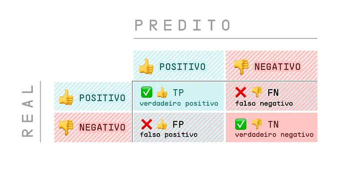

A matriz de confusão permite visualizar facilmente quantos exemplos foram classificados corretamente e erroneamente em cada classe, que ajuda a entender se o modelo está favorecendo uma classe em detrimento da outra. Isto é importante principalmente em situações em que os erros possuem custos diferentes. Um exemplo disso seria em um modelo para classificar exames de diagnóstico de câncer. Enquanto o erro por falso positivo (classificar uma paciente como doente enquanto ela está saudável) seria inconveniente dado que ela demoraria mais a receber alta, o erro por falso negativo (classificar uma paciente como saudável enquanto ela está doente) seria bem mais grave, dado que ela poderia receber alta e não ter o acompanhamento necessário.

O exemplo abaixo mostra uma situação em que o erro para a classe positiva é bem mais alto que para a classe negativa.

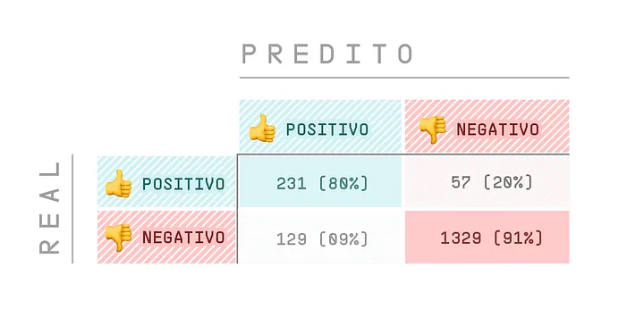
<h2 align="center">Acurácia (Accuracy)</h2>

A acurácia ou accuracy em inglês, nos diz quantos de nossos exemplos foram de fato classificados corretamente, independente da classe. Por exemplo, se temos 100 observações e 90 delas foram classificados corretamente, nosso modelo possui uma acurácia de 90%. A acurácia é definida pela fórmula abaixo:

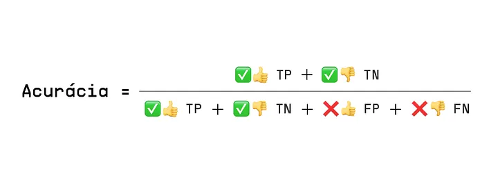

Na fórmula, podemos ver que esta métrica é definida pela razão entre o que o modelo acertou e todos os exemplos. Apesar da acurácia ser uma métrica simples, de fácil uso e interpretável, ela muitas vezes não é adequada na prática.

Uma das maiores desvantagens é que em alguns problemas a acurácia pode ser elevada mas, ainda assim, o modelo pode ter uma performance inadequada. Por exemplo, considere o modelo que classifica exames de câncer entre positivo ou negativo para a doença, e em nosso conjunto de dados temos 1000 exemplos, sendo 990 de pacientes sem câncer e 10 de pacientes com câncer. Caso nosso modelo seja ingênuo e sempre classifique todos os exemplos com negativo (sem câncer), ele ainda obteria uma acurácia de 99%. O que parece uma excelente métrica, mas na verdade não estamos avaliando nosso modelo de forma adequada. Para melhor avaliar modelos que lidam com conjuntos de dados desbalanceados como este, outras métricas que serão apresentadas em seguida devem ser utilizadas.

Outro ponto de atenção em relação à acurácia é que ela atribui o mesmo peso para ambos os erros. Por exemplo, considerando o mesmo exemplo de exame de câncer, suponha que o modelo tenha acertado 950 exemplos do total de 1000 exemplos. Os 50 exemplos errados podem ter sidos da classe positiva (falsos negativos) ou da classe negativa (falsos positivos). Em ambos os casos a acurácia seria de 95%, porém como mencionado anteriormente, o erro por falso negativo é bem mais grave neste problema, e isto não é refletido nesta métrica.

<h2 align="center">Precisão (Precision)</h2>

A precisão ou precision em inglês, também é uma das métricas mais comuns para avaliar modelos de classificação. Esta métrica é definida pela razão entre a quantidade de exemplos classificados corretamente como positivos e o total de exemplos classificados como positivos, conforme a fórmula abaixo:

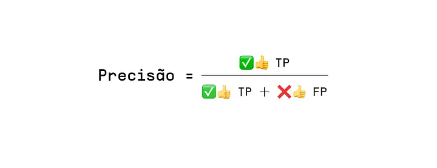

Olhando esta fórmula, podemos ver que a precisão dá um ênfase maior para os erros por falso positivo. Podemos entender a precisão como sendo a expressão matemática para a pergunta: dos exemplos classificados como positivos, quantos realmente são positivos? Voltando ao exemplo do modelo de câncer, se o valor para a precisão fosse de 90%, isto indicaria que a cada 100 pacientes classificados como positivo, é esperado que apenas 90 tenham de fato a doença.

<h2 align="center">Revocação (Recall)</h2>

Ao contrário da precisão, a revocação, ou recall em inglês e também conhecida como sensibilidade ou taxa de verdadeiro positivo (TPR), dá maior ênfase para os erros por falso negativo. Esta métrica é definida pela razão entre a quantidade de exemplos classificados corretamente como positivos e a quantidade de exemplos que são de fato positivos, conforme a fórmula abaixo:

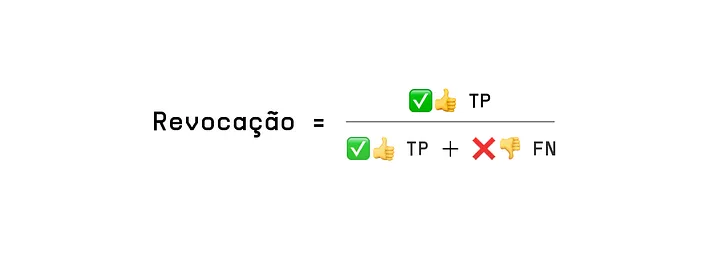

A revocação busca responder a seguinte pergunta: de todos os exemplos que são positivos, quantos foram classificados corretamente como positivos? Considerando o exemplo do modelo de câncer, se o valor para a revocação fosse de 95%, isto indicaria que a cada 100 pacientes que são de fato positivos, é esperado que apenas 95 sejam corretamente identificados como doentes.

<h2 align="center">Métrica F1 (F1 Score)</h2>

A métrica F1 ou F1 score em inglês e também conhecida como F-measure, leva em consideração tanto a precisão quanto a revocação. Ela é definida pela média harmônica entre as duas, como pode ser visto abaixo:

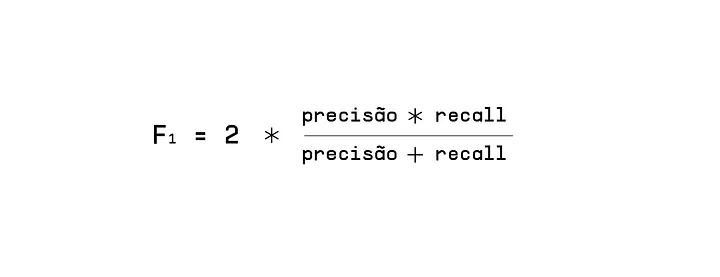

Uma das características da média harmônica é que se a precisão ou a revocação for zero ou muito próximos disso, o F1-score também será baixo. Desta forma, para que o F1-score seja alto, tanto a precisão como a revocação também devem ser altas. Ou seja, um modelo que apresenta um bom F1-score é um modelo capaz tanto de acertar suas predições (precisão alta) quanto de recuperar os exemplos da classe de interesse (revocação alta). Portanto, esta métrica tende a ser um resumo melhor da qualidade do modelo. Uma desvantagem é que a F1 acaba sendo menos interpretável que a acurácia.

No exemplo do modelo de câncer, se o valor para a precisão fosse de 90% e o da revocação fosse de 95%, o valor para a F1 seria de 92.43%.

<h2 align="center">Curva ROC</h2>

Dado um modelo que atribui uma probabilidade para a classe positiva, é necessário definir um limiar de classificação. Acima deste limiar, um exemplo é classificado como positivo, caso contrário, é classificado como negativo. O limiar de classificação influencia o valor das métricas mencionadas anteriormente (acurácia, precisão, etc), e sua escolha deve levar em consideração o custo de cada erro.

A curva ROC (do inglês Receiver Operating Characteristic) pode ser utilizada para avaliar a performance de um classificador para diferentes limiares de classificação. Ela é construída medindo a Taxa de Falso Positivo (FPR — False Positive Rate) e a Taxa de Verdadeiro Positivo (TPR — True Positive Rate) para cada limiar de classificação possível, conforme as expressões abaixo.

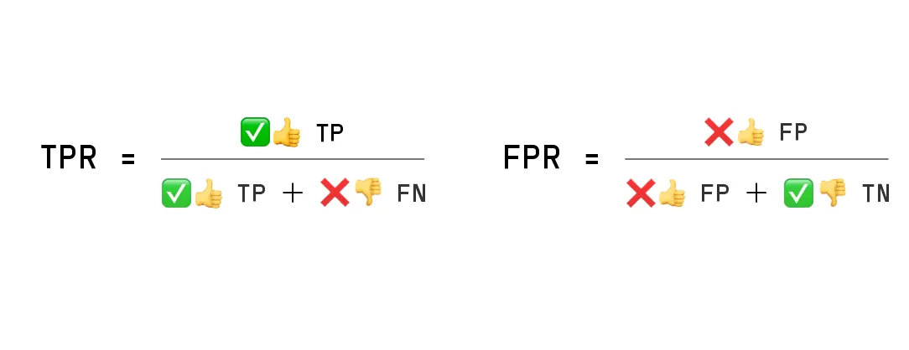

A curva ROC é então visualizada por meio de um gráfico, como mostra o exemplo abaixo. Ela mostra visualmente o compromisso entre falsos positivos e verdadeiro positivos na escolha do limiar. Quanto mais alto o limiar, maior é taxa de verdadeiro positivo (TP), porém a taxa de falso positivo (FP) também será maior. No caso extremo em que todos os exemplos são colocados na classe positiva, vemos que ambas as taxas chegam a 100%, enquanto no outro extremo, ambas ficam em 0%. Quanto mais próxima a curva estiver do canto superior esquerdo, melhor é a predição do modelo, dado que ele teria 100% de TPR e 0% de FPR. A linha tracejada indica qual seria curva de uma classificador que prevê classes de forma aleatória, e serve como um baseline de comparação.

A área sob a curva ROC (AUC — Area Under the Curve ou AUROC — Area Under the Receiver Operating Characteristic curve) pode ser utilizada como métrica de qualidade de um modelo, dado que quanto mais próxima a curva estiver do canto superior esquerdo, maior será a área sob a curva e melhor será o modelo. Uma vantagem desta métrica é que ela não é sensível ao desbalanço de classes, como ocorre com a acurácia. Por outro lado, a AUROC não é tão facilmente interpretável.

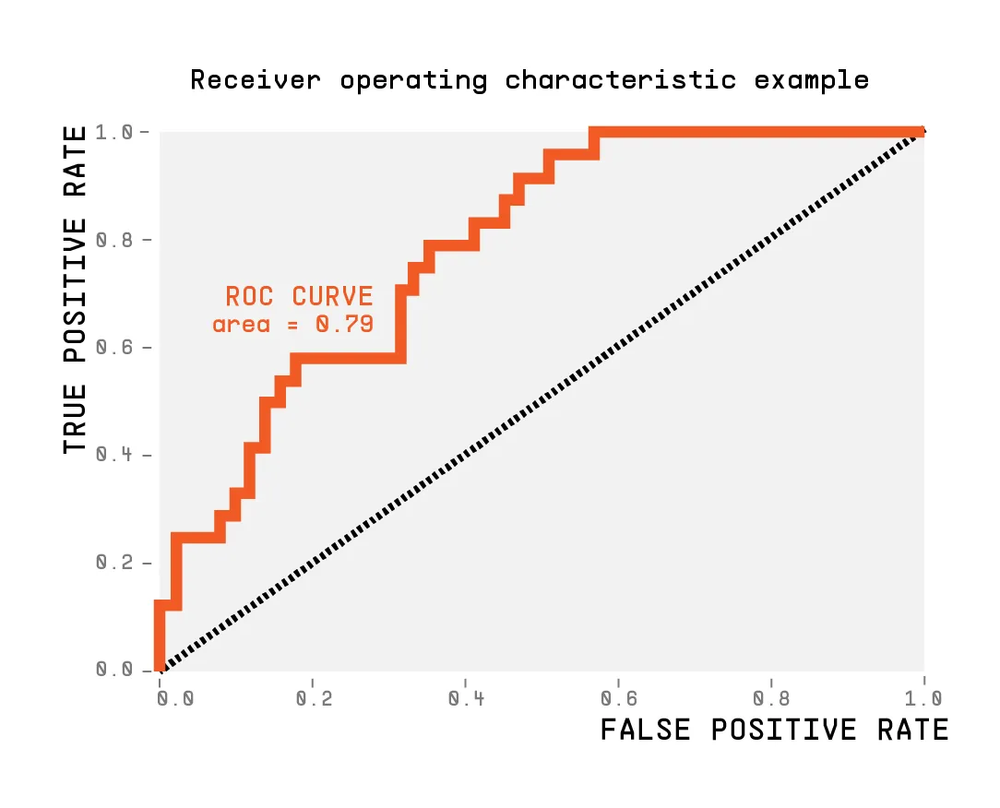
<h2 align="center">Perda Logarítmica (Log Loss)</h2>
<h3 align="center">O Que é Log Loss (Perda Logarítmica) e Como Interpretá-la?</h3>

Log loss (ou perda logarítmica) é uma métrica de avaliação de modelos de classificação em machine learning, tanto binários quanto multiclasse.

Ela brilha em casos em que é importante que as probabilidades emitidas pelo modelo estejam alinhadas com a proporção real de ocorrências do alvo.

Para ficar mais claro, imagine que você esteja criando um modelo para prever se vai chover ou não em um determinado dia.

O modelo faz uma previsão em forma de probabilidade, ou seja, ele diz que há uma determinada porcentagem de chance de chover no dia.

Otimizando a log loss, você estará otimizando o modelo para que as previsões se aproximem da porcentagem real de dias chuvosos.

Por exemplo, se você pegar 100 dias em que o modelo disse que havia 30% de chance de chuva, em aproximadamente 30 deles terá chovido.

Isso é o que chamamos de modelo calibrado: as probabilidades previstas se aproximam das probabilidades reais dos eventos acontecerem.

Ela é uma métrica negativa, ou seja, quanto menor, melhor. Ela varia entre 0 (previsões perfeitas) e ∞ (previsões completamente erradas).

Lembrando que, se seu modelo faz previsões perfeitas nos dados de validação, provavelmente tem algo errado na forma como você está avaliando os resultados.😉

<h3 align="center">Qual a Fórmula da Log Loss?</h3>
<h3 align="center">Classificação Binária</h3>

A fórmula da log loss para casos de classificação binária é a seguinte:

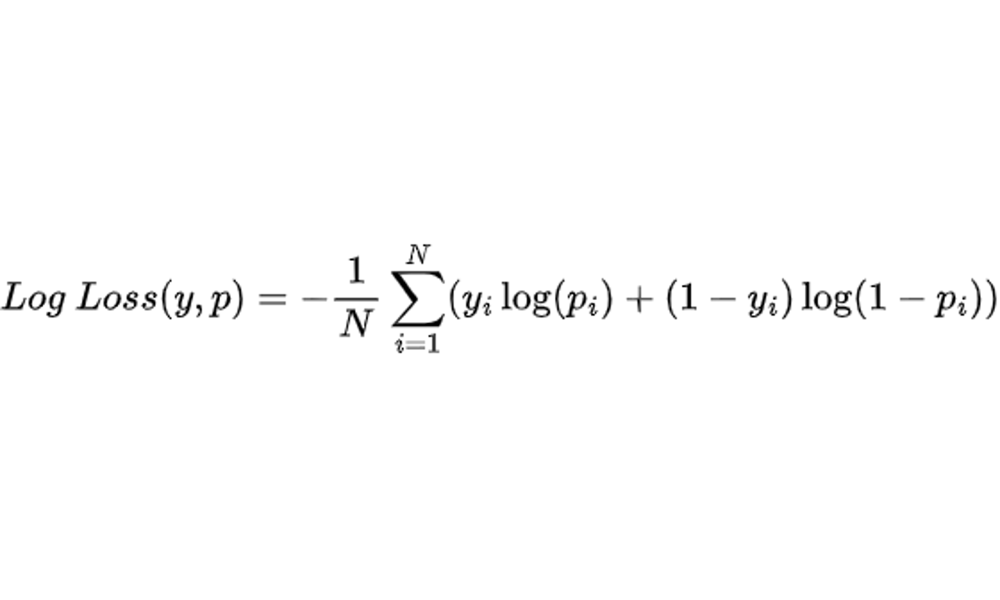

Onde:

<ul>
  <li>n é o número de amostras</li>
  <li>y é a classe real (0 ou 1)</li>
  <li>p é a probabilidade prevista pelo modelo (entre 0 e 1)</li>
</ul>

Primeiro você calcula o valor da log loss para cada exemplo, depois você faz a média de todos os exemplos nos quais você está avaliando o modelo e por fim multiplica por -1 para ter um número positivo que você possa minimizar.

Note que a penalidade para previsões erradas não é linear, mas cresce exponencialmente quanto mais confiante o modelo está numa previsão errada.

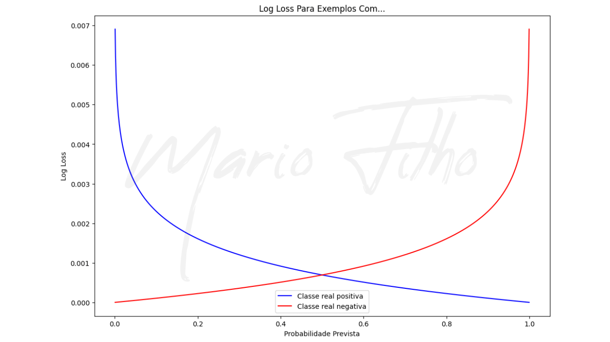

Se a classe real for positiva e a probabilidade prevista estiver próxima de zero, a penalização será enorme para puxar essa previsão para longe de zero.

Se a classe real for negativa e a probabilidade prevista estiver próxima de um, a penalização também será enorme para puxar essa previsão na direção do zero.

<h3 align="center">Classificação Multiclasse</h3>

É muito fácil expandi-la para casos em que você tem mais de duas classes.

Não importa quantas classes você tenha, considere apenas a probabilidade prevista pelo modelo para a classe real de cada exemplo.

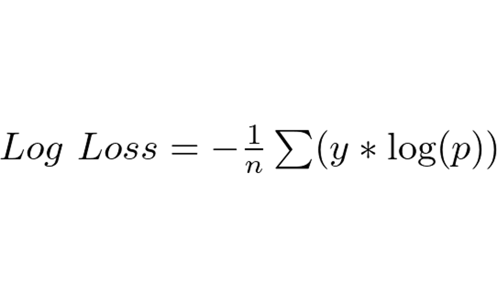

Onde:

<ul>
  <li>n é o número de amostras</li>
  <li>y é igual a 1 para a classe real e 0 para as outras (ou seja, podemos ignorar as probabilidades delas)</li>
  <li>p é a probabilidade prevista pelo modelo para a classe real da amostra</li>
</ul>

Na prática, isso significa que basta calcular o logaritmo da probabilidade prevista para a classe real para cada amostra.

Em seguida, você deve somar todos os valores obtidos e dividir pela quantidade de amostras.

<h3 align="center">Log Loss Durante o Treino vs Validação</h3>

A Log loss, diferente de outras métricas como acurácia e ROC AUC, pode ser usada tanto para otimizar o modelo durante o treino quanto para selecionar hiperparâmetros na validação.

Ela é a métrica padrão para otimizar modelos de classificação nas bibliotecas mais populares como o scikit-learn.

Durante o treino, a log loss geralmente é usada com gradiente descendente para ajustar os parâmetros internos do modelo.

Na validação, ela é usada para avaliar o desempenho do modelo treinado e selecionar os melhores hiperparâmetros.

Ou seja, você pode usá-la tanto diretamente na otimização do modelo sobre os dados de treino quanto na avaliação do modelo de treino em dados fora da amostra inicial.

<h1 align="center">Métricas de Avaliação de Modelos de Regressão</h1>
<h2 align="center">R²</h2>

A métrica R², também conhecida como <b>R-dois</b> ou <b>coeficiente de determinação</b>, representa o percentual da variância dos dados que é explicado pelo modelo. Os resultados variam de 0 a 1, geralmente também são expressos em termos percentuais, ou seja, variando entre 0% e 100%. Quanto maior é o valor de R², mais explicativo é o modelo em relação aos dados previstos. Na equação 2 é mostrado o cálculo desta métrica, no qual y e ŷ os valores reais e previstos, respectivamente, e y-barra representa a média dos valores reais.

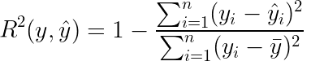

Porém, utilizando somente esta métrica, será que um valor de 0,5 já seria o suficiente para colocar o modelo em produção? Faz-se necessário aproximar ainda mais o seu resultado para 1? Para responder a essa e outras perguntas, deve-se sempre utilizar outras métricas para se ter uma visão global sobre a performance do modelo.

<h2 align="center">Erro Médio Absoluto (MAE — Mean Absolute Error)</h2>

O erro médio absoluto (MAE — do inglês Mean Absolute Error), como demonstrado na equação 3, mede a média da diferença entre o valor real com o predito. Mas por haver valores positivos e negativos, é adicionado um módulo entre a diferença dos valores. Além disso, esta métrica não é afetada por valores discrepantes — os denominados outliers.

O valor de saída da equação tem a mesma escala dos dados utilizados para previsão, logo fica mais fácil a sua interpretação. Se o valor de MAE resultante for igual a 10,01 m, por exemplo, este resultado significa que o modelo pode estar errando em média 10,01 m para mais quanto para menos em relação ao valor correto. Por isso que para uma previsão futura, este resultado precisa ser levado em consideração para a tomada de decisão. Contudo o quanto este erro representa em relação ao valor real percentualmente?

<h2 align="center">Erro Percentual Absoluto Médio (MAPE — Mean Absolute Percentual Error)</h2>

O erro percentual absoluto médio (MAPE — do inglês Mean Absolute Percentual Error) é uma métrica que mostra a porcentagem de erro em relação aos valores reais. Na equação 4 representa o cálculo de MAPE que basicamente se parece com MAE, mas com o acréscimo de uma divisão por |y|. Então se o resultado de MAPE for igual a 40% significa que o nosso modelo faz previsões que em média a diferença entre o valor previsto e o real equivale a 40% do valor real tanto para mais quanto para menos.

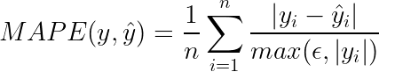

Ao observar a equação 4 nota-se que caso o valor de y seja 0, ocorrerá um erro, devido a divisão por zero. Por isso que a biblioteca scikit-learn utiliza a tratativa de colocar um número muito pequeno, representado por ε, cujo valor é 2,220446049250313e-16. A métrica MAPE é uma das métricas mais usadas para reportar a performance do modelo, trazendo uma compreensão mais abrangente do resultado de MAE.

<h2 align="center">Erro Quadrático Médio (MSE — Mean Squared Error)</h2>

O erro quadrático médio (MSE — do inglês Mean Squared Error) é uma métrica que calcula a média de diferença entre o valor predito com o real, como a métrica MAE. Entretanto, ao invés de usar o módulo do resultado entre o valor de y e ŷ, nesta métrica a diferença é elevada ao quadrado. Desta maneira penalizando valores que sejam muito diferentes entre o previsto e o real. Portanto, quanto maior é o valor de MSE, significa que o modelo não performou bem em relação as previsões.

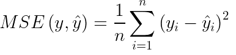

Apesar de sua ideia poderosa, a métrica MSE apresenta um problema de interpretabilidade. Por haver a elevação ao quadrado, a unidade fica distorcida, em outras palavras, se a unidade medida for metros (m), o resultado será em m². Por isso que uma adaptação da MSE é a RMSE que será apresentada abaixo.

<h2 align="center">Raiz do Erro Quadrático Médio (RMSE — Root Mean Squared Error)</h2>

A raiz do erro quadrático médio (RMSE — do inglês, Root Mean Squared Error) é basicamente o mesmo cálculo de MSE, contendo ainda a mesma ideia de penalização entre diferenças grandes do valor previsto e o real. Porém, para lidar com o problema da diferença entre unidades, é aplicada a raiz quadrática como demonstrado na equação 6. Assim a unidade fica na mesma escala que o dado original, resultando em uma melhor interpretabilidade do resultado da métrica.

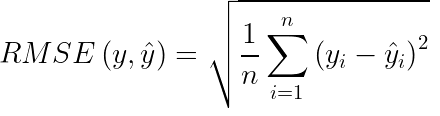

Apesar do valor ter a mesma unidade, ele não costuma se assemelhar ao resultado encontrado de MAE, demonstrando como os outliers podem estar impactando nas previsões do modelo. Mas a sua interpretabilidade pode seguir a mesma lógica, onde o resultado da métrica sendo igual a 80,0 m, significa que o modelo pode estar errando em 80,0 m para mais ou para menos. Por essa razão, esta métrica pode ser uma boa opção quando é preciso ter uma avaliação mais criteriosa sobre as previsões do modelo.

<h3 align="center">Referências:</h3>

Trevor Hastie, Robert Tibshirani, Jerome Friedman. 2001. The Elements of Statistical Learning. New York, NY, USA: Springer New York Inc.

Christopher M. Bishop. 2006. Pattern Recognition and Machine Learning (Information Science and Statistics). Springer-Verlag, Berlin, Heidelberg.

Kai Ming Ting. 2011. Encyclopedia of machine learning. Springer. ISBN 978–0–387–30164–8.

https://medium.com/kunumi/m%C3%A9tricas-de-avalia%C3%A7%C3%A3o-em-machine-learning-classifica%C3%A7%C3%A3o-49340dcdb198

https://mariofilho.com/guia-completo-da-log-loss-perda-logaritmica-em-machine-learning/

https://medium.com/data-hackers/prevendo-n%C3%BAmeros-entendendo-m%C3%A9tricas-de-regress%C3%A3o-35545e011e70

