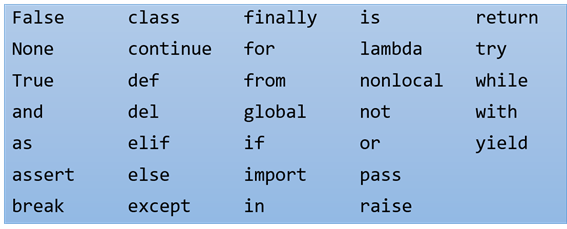

<h1>Variáveis</h1>

<b>Variáveis são um dos recursos mais básicos das linguagens de programação.</b>Utilizadas para armazenar valores em memória, elas nos permitem gravar e ler esses dados com facilidade a partir de um nome definido por nós.

Neste documento aprenderemos a declarar e atribuir valores a<b> variáveis em Python.</b>

<b>Declaração e Atribuição</b>

Assim como em outras linguagens, <b>o Python pode manipular variáveis básicas como strings</b> (palavras ou cadeias de caracteres), inteiros e reais (float). Para criá-las, basta utilizar um comando de atribuição, que define seu tipo e seu valor, conforme vemos no código abaixo:

<pre>mensagem = 'Exemplo de mensagem!'</pre>
<pre>n = 25</pre>
<pre>pi = 3.141592653589931</pre>

Nesse trecho foram feitas três atribuições. Na linha 1 foi atribuída uma string para uma nova variável chamada mensagem. Na linha 2 foi atribuído o valor inteiro 25 para n e na terceira linha foi atribuído um valor decimal para a variável pi.

Observe que não foi necessário fazer uma declaração explícita de cada variável, indicando o tipo ao qual ela pertence, pois isso é definido pelo valor que ela armazena, conforme vemos no código abaixo:

<pre>type (mensagem)</pre>
<pre># (class 'str')</pre>
<pre>type (n)</pre>
<pre># (class 'int')</pre>
<pre>type (pi)</pre>
<pre># (class 'float')</pre>

Nesse código, a linha 2 indica que a variável pertence à classe string. A linha 4 indica que a variável representa a classe de inteiros. Por sua vez, a sexta linha indica que a variável pi é do tipo float.

Para exibir o conteúdo dessas variáveis utilizamos o comando de impressão print, da seguinte forma:

<pre>print(mensagem)</pre>
<pre># Exemplo de mensagem!</pre>
<pre>print (n)</pre>
<pre># 25</pre>
<pre>print (pi)</pre>
<pre># 3.141592653589931</pre>

<b>Nomeando Variáveis</b>

As variáveis podem ser nomeadas conforme a vontade do programador, com nomes longos, contendo letras e números. No entanto, elas devem necessariamente começar com letras minúsculas.

Além dessa regra é importante também estar atento às palavras reservadas da linguagem <b>(Figura 1)</b>, que não podem ser utilizadas para nomear variáveis.

<h2>Referências</h2>

https://www.devmedia.com.br/python-trabalhando-com-variaveis/38644

