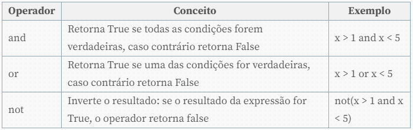

<h1 align="center">Operadores</h1>

Os operadores são usados na construção de expressões, as quais contém um número variado de operandos. Por exemplo, na expressão a + b, temos o operador de aritmético + e operandos são as variáveis a e b.

Na linguagem Python temos a seguinte separação entre os diferentes tipos de operadores:

<ul>
  <li>Operadores Aritméticos</li>
  <li>Operadores de Atribuição</li>
  <li>Operadores de Comparação</li>
  <li>Operadores Lógicos</li>
  <li>Operadores de Identidade</li>
  <li>Operadores de associação</li>
</ul>

A seguir veremos cada um deles.

<h2 align="center">Operadores Aritméticos</h2>

Os operadores aritméticos são utilizados na execução de operações matemáticas, tais como a soma e a subtração, por exemplo. Vejamos na <b>Tabela 1</b> a lista deles.

O <b>Código 1</b> mostra um exemplo com os operadores aritméticos usados no Python.

<pre>
numero_1 = 5
numero_2 = 2

soma = numero_1 + numero_2
subtracao = numero_1 - numero_2
multiplicacao = numero_1 * numero_2
divisao = numero_1 / numero_2
divisao_inteira = numero_1 // numero_2
modulo = numero_1 % numero_2
exponenciacao = numero_1 ** numero_2

print(soma) # 7
print(subtracao) # 3
print(multiplicacao)  # 10
print(divisao) # 2.5
print(divisao_inteira) # 2
print(modulo)  # 1
print(exponenciacao) # 25
</pre>

Uma característica importante a ser observada quando falamos dos operadores matemáticos é a precedência. Essa característica é relativa à ordem da execução deles e acontece quando mais de um operador está presente numa expressão. Segue a precedência dos operadores no Python.

1. As expressões contidas em parênteses têm a precedência maior na linguagem Python. Isso permite que uma expressão execute antes de outra. Ex.:

<pre>print((2 + 5) * 3) # O resultado será 21</pre>

2. Após os parênteses, o próximo operador com maior precedência é o de exponenciação. Ex.:

<pre>print( 1 + 5**2 ) # O resultado será 26</pre>

3. Multiplicação e divisão têm precedência sobre a adição e subtração: como já é conhecido na matemática, divisão e multiplicação são executadas antes das operações de adição e subtração. Ex.:

<pre>print(5 * 3 + 8) # O resultado será 23</pre>

4. Ordem de precedência é avaliada da esquerda para a direita. Portanto, após os operadores anteriores, a sequência da execução será da esquerda para a direita. Ex.:

<pre>print(8 + 5 - 10) # O resultado será 3</pre>
<h2 align="center">Operadores de Atribuição</h2>

Os operadores de atribuição atribuem valor a uma variável. Na <b>Tabela 2</b> temos uma lista desses operadores.

No <b>Código 2</b> temos um exemplo do uso de operadores de atribuição.

<pre>
numero_1 = 5

numero_1 += 5

print(numero_1) # O resultado será 10
</pre>

Acima, vemos que a variável numero_1 recebe na linha 3 o valor dela mesmo somado a 5. Isso fará com que o resultado impresso na linha 5 seja igual a 10.

<h2 align="center">Operadores de Comparação</h2>

Os operadores de comparação são usados para comparar valores, o que vai retornar True ou False, dependendo da condição. A seguir, na <b>Tabela 3</b> temos exemplos de alguns usados no Python.

Usando a comparação que é feita com esses operadores, podemos criar condições para os códigos. No exemplo abaixo, vemos como isso acontece na prática:

<pre>
numero_1 = 2
numero_2 = 4

soma = numero_1 + numero_2

if soma < 10:
    print("soma não é maior que 10")
else:
    print("soma é maior ou igual a 10")
</pre>

Como podemos ver no <b>Código 3</b>, duas variáveis são somadas e esse resultado é atribuído à variável soma. Na linha 6, fazemos uma comparação dessa variável verificando se ela é menor do que 10. Vejamos a seguir, uma operação que faz comparação de igualdade entre duas variáveis:

<pre>
soma_1 = 7 + 8
soma_2 = 10 + 5

if soma_1 == soma_2:
    print("Os resultados são iguais")
else:
    print("Os resultados são diferentes")
</pre>

No <b>Código 4</b>, criamos duas variáveis e comparamos seus valores, o que pode resultar em dois resultados distintos. Dessa forma, podemos criar estruturas condicionais com o auxílio desses operadores.

<h2 align="center">Operadores Lógicos</h2>

Os operadores lógicos são usados para unir duas ou mais expressões condicionais. Isso é feito por meio de conectivos, como podemos ver na <b>Tabela 4</b>.

Vejamos a seguir, um exemplo que utiliza os operadores lógicos:

<pre>
idade_lucas = 21
idade_carolina = 19

# OPERADOR OR
if idade_lucas >= 18 or idade_carolina >= 18:
    print("Pelo menos um dos dois é maior de idade")
else:
    print("Lucas e Carolina não são maiores de idade")

# OPERADOR AND
if idade_lucas >= 18 and idade_carolina >= 18:
    print("Lucas e Carolina são maiores de idade")
else:
    print("Pelo menos um dos dois não é maior de idade")
</pre>

No <b>Código 5</b> temos um exemplo no qual usamos os operadores or e and. Com o operador or, apenas uma das condições precisa ser verificadas. Já no operador and, todas as condições precisam ser satisfeitas. Com a execução do código teremos a impressão das mensages “Lucas e Carolina são maiores de idade” e "Pelo menos um dos dois é maior de idade".

<h2 align="center">Operadores de Identidade</h2>

Os operadores de identidade servem para a comparação de objetos. Nessa comparação é verificado se eles ocupam a mesma posição na memória, o que significará que se trata do mesmo objeto, como vemos isso na <b>Tabela 5</b>.

Vejamos com mais detalhes o uso dos operadores de identidade:

<pre>
time_carlos = 'Botafogo'
time_luciano = 'Flamengo'
time_fabricia = 'Botafogo'

if time_carlos is time_luciano:
    print("time_carlos - time_luciano = mesmo objeto")
else:
    print("time_carlos - time_luciano = objetos diferentes")

if time_carlos is time_fabricia:
    print("time_carlos - time_fabricia = mesmo objeto")
else:
    print("time_carlos - time_fabricia = objetos diferentes") 
</pre>

No <b>Código 6</b> temos um exemplo do operador is no Python. Com ele, o que está sendo verificado é se as variáveis apontam para o mesmo objeto. Quando declaramos uma string no Python, o seu valor é guardado num local especial da memória. Assim, quando usamos esse valor repetidas vezes como nas linhas 1 e 3, o Python pode utilizar o mesmo objeto em cada uma delas. Por esse motivo is dirá que time_carlos e time_fabricia apontam para o mesmo objeto, enquanto que time_luciano aponta para um objeto diferente.

<h2 align="center">Operadores de Associação</h2>

Os operadores de associação são utilizados para verificar se uma sequência contém um objeto. Na Tabela 6 temos os exemplos.

No <b>Código 7</b>, vamos ver um exemplo usando os operadores de associação.

<pre>
frutas = ["banana","laranja","uva","ameixa"]

fruta_1 = "ameixa"
fruta_2 = "melancia"

print(fruta_1 in frutas) # True
print(fruta_2 in frutas) # False
</pre>

O exemplo acima verifica a existência de variáveis dentro de uma lista. Na linha 6 estamos checando se fruta_1 está contido em frutas. Da mesma forma, fazemos isso na linha 7, só que dessa vez com fruta_2.

<h2 align="center">Conclusão</h2>

Ao usar os operadores no Python, podemos atribuir valores a variáveis, criar condições, fazer comparações etc. Essas características fazem parte dos princípios básicos para montar algoritmos nessa linguagem. É importante dominar esses conceitos sobre os operadores, pois eles são amplamente usados no dia a dia do desenvolvedor.

<h2>Referências</h2>

https://www.devmedia.com.br/operadores-no-python/40693

