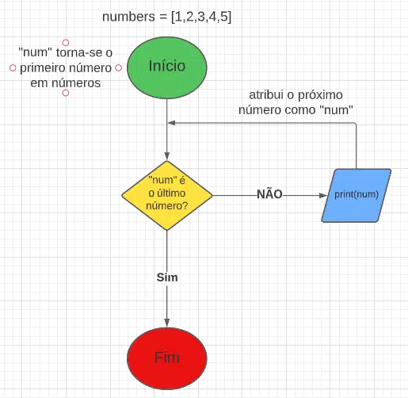
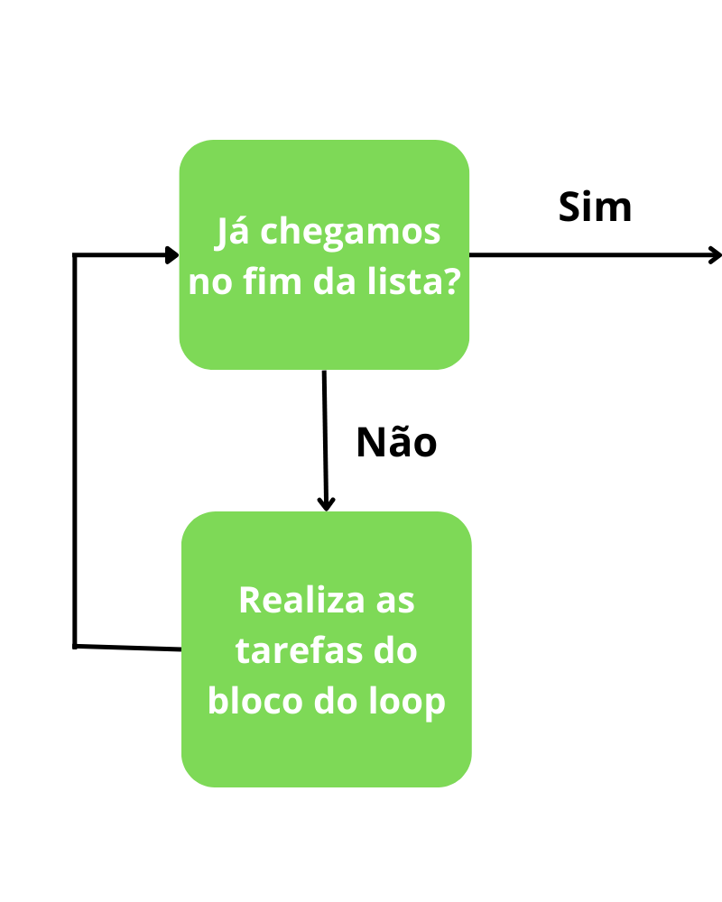
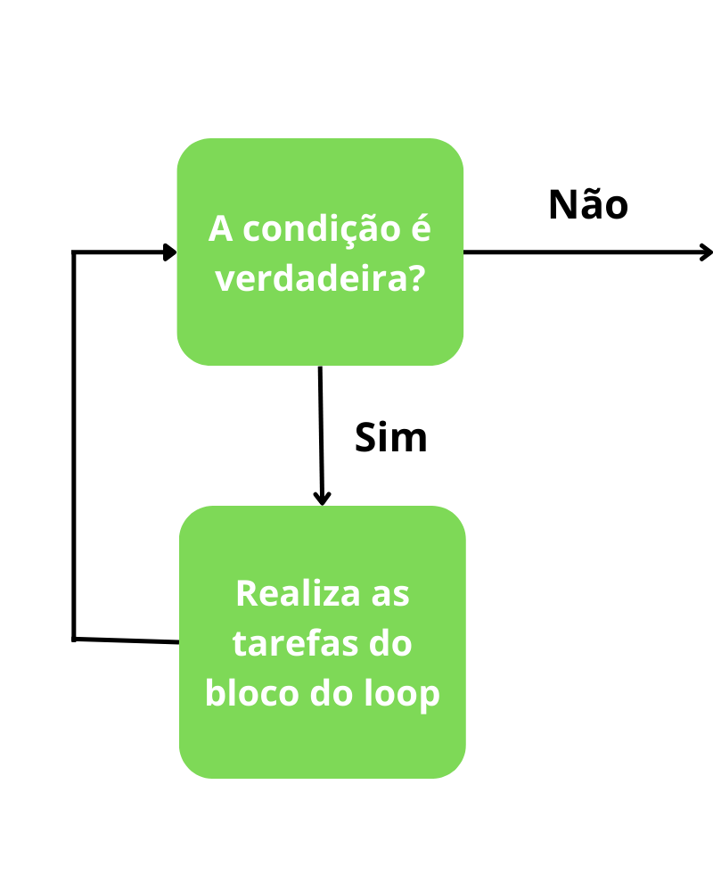

<h1 align="center">Estruturas de Repetição</h1>

Ao desenvolvermos uma aplicação em Python, é comum haver a necessidade de executarmos uma mesma instrução por várias vezes. O comando Python for é uma das estruturas de repetições disponíveis na linguagem que permite a execução de um mesmo comando até que uma determinada condição seja atendida.

As pessoas programadoras precisam entender como esse recurso funciona para identificar com facilidade qual o melhor momento para utilizá-lo ao desenvolver um programa.

<h2 align="center">O que são Estruturas de Repetição e para que servem?</h2>

Na linguagem de programação Python, os laços de repetição <b>for</b> também são chamados de <b>loops definidos</b> porque executam a instrução um certo número de vezes. Isso contrasta com os loops <b>while</b>, ou <b>loops indefinidos</b>, que executam uma ação até que uma condição seja atendida e eles sejam instruídos a parar.

For loops são úteis quando você deseja executar o mesmo código para cada item em uma determinada sequência. Com um loop for, você pode iterar sobre qualquer dado iterável, como listas, conjuntos, tuplas, dicionários, intervalos e até strings.

Para entendermos melhor o funcionamento de um for em Python, vejamos a seguir, um exemplo utilizando um fluxograma. Sabemos que um loop for repete instruções enquanto o último item no intervalo ainda não foi alcançado. Logo, Vamos criar um loop for simples usando Python. Este loop imprime os números de uma lista:

<pre>
numbers = [1, 2, 3, 4, 5]
for number in numbers:
&emsp;print(number)
</pre>

<b>Resultado:</b>

<pre>
1
2
3
4
5
</pre>

Aqui, a instrução <b>print(number)</b> é executada enquanto houver números restantes na lista. O fluxograma que descreve o processo é o seguinte: 

<h2 align="center">O que é Iteração?</h2>

A iteração é um processo de repetição que executa o mesmo bloco de código até o <b>for loop</b> chegar no final da iteração, ou seja, no último valor. De outro modo, a iteração pode chegar ao fim quando tem a sua condição falsa.

<h2 align="center">O que é Iteração Definida?</h2>

A iteração definida é uma repetição que tem como base um objeto iterável, por exemplo, uma <b>lista</b>, um <b>objeto</b>, uma <b>Collection</b>, um <b>Iterator</b>, etc. Nessa iteração, realizamos as operações de um bloco de código do início ao fim do objeto iterável.

Essa iteração pode ser utilizada de diversas formas, conseguimos ler os valores individuais, editá-los e até mesmo usá-los para realizar alguma operação única. No Python, o <b>for loop</b> é o único capaz de realizar essa lógica.

<h2 align="center">O que é Iteração Indefinida?</h2>

A iteração indefinida realiza operações repetitivas com base em uma condicional, semelhante a declaração <b>if e else</b>.

Essa iteração pode ser muito perigosa já que se a condicional não tiver o valor falso, o loop não se fechará e poderá até mesmo travar o processamento da aplicação. Aqui, o <b>while loop</b> é o único capaz de realizar essa lógica no Python.

É importante entender o conceito de <b>iterável</b> em Python. Basicamente, um objeto iterável é aquele que tem a capacidade de retornar cada um de seus elementos de forma individual. Uma forma de identificar se um objeto é iterável é conferir se ele implementa os métodos <b>__iter__()</b>, que obtém um objeto iterador e o <b>__next__()</b>, que faz a passagem para o próximo elemento.

Outro conceito importante é o de <b>iterador</b>, que além de representar um item do fluxo de dados, também é um objeto iterável e, portanto, implementa as funções <b>__iter__()</b> e <b>__next__()</b>. Essa implementação é transparente para nós, pois ela é feita e controlada pelo for loop.

Na prática, quando o laço for é inicializado, ele executa a instrução ou o bloco de códigos uma vez e utiliza uma referência, que funciona como um índice, para indicar o próximo elemento da sequência. Internamente, ele usa as funções <b>__iter__()</b> e <b>__next__()</b> para que a estrutura de repetição funcione. Por isso, os objetos manipulados com essa estrutura precisam ser iteráveis.

<h2 align="center">Como usar o Python for loop?</h2>

Antes de demonstrarmos como o comando for loop atua, é importante fazer um comparativo com outras linguagens de programação, pois essa estrutura funciona um pouco diferente em Python.

Em algumas linguagens de programação, como em C, JavaScript etc, o for loop é utilizado com uma variável do tipo inteiro, que funciona como um índice e serve para controlar a quantidade de vezes que a repetição será feita. É algo como:

<pre>
for i = 1 to 10
&emsp;print(i)
</pre>

<b>O for loop não funciona dessa maneira em Python. O código feito como o do exemplo acima retorna um erro de execução, pois a estrutura de repetição for só funciona com os tipos de dados que permitem iterações e o tipo numérico não tem essa característica.</b>

<h2 align="center">Qual a sintaxe básica do Python for loop?</h2>

A sintaxe básica da estrutura de repetição for em Python é diferente. Veja a seguir:

<pre>
for (item) in (conjunto_de_itens):
&emsp;(bloco_de_codigo)
</pre>

No qual:

<ul>
  <li><b>Item:</b> corresponde a cada elemento presente na variável que permite a iteração;</li>
  <li><b>Conjunto de itens:</b> pode ser uma lista, uma string, uma tupla, um dicionário ou um objeto que permita iterações.</li>
</ul>

Veja um código de exemplo:

<pre>
frutas = ['Abacaxi', 'Morango', 'Uva']
for fruta in frutas:
&emsp;print(fruta)
# Resultado
Abacaxi
Morango
Uva
</pre>

No código fonte acima utilizamos uma lista, que é um tipo de dados em Python que permite iterações. Perceba que a variável “frutas” foi declarada anteriormente no código para que o laço de repetição funcione. Outra opção seria escrever a lista diretamente na instrução, como mostramos abaixo:

<pre>
for fruta in ['Abacaxi', 'Morango', 'Uva']:
&emsp;print(fruta)
'''
Resultado:
Abacaxi
Morango
Uva
'''
</pre>
<h2 align="center">Repetindo os caracteres de uma string!</h2>

Como mencionamos, um dos tipos de dados que podem ser utilizados com a estrutura de repetição for é a string. A linguagem Python separa cada caractere como um elemento iterável e podemos utilizar o loop para acessar o seu conteúdo. Veja um exemplo:

<pre>
palavra = "Vamos estudar Python"
for letra in palavra:
    print(letra)
''' 
Resultado:
V
a
m
o
s

e
s
t
u
d
a
r

P
y
t
h
o
n
'''
</pre>

Ao executarmos o código de exemplo acima, perceba que o caractere de espaço também foi considerado válido e a linha correspondente ficou em branco.

<h2 align="center">Configurando onde o loop deve parar: break</h2>

Por padrão, a estrutura de repetição só termina depois de ler o último elemento da variável iterável. Entretanto, é possível modificar essa condição e interromper o loop no meio do caminho. Para isso, utilizamos a instrução <b>break</b>, que encerra a execução do loop ao encontrar uma condição específica.

Devemos utilizar a instrução <b>break</b> em conjunto com uma estrutura condicional, como a <b>if/else</b> ou até mesmo com outro laço de repetição <b>for</b>. Veja como fica a sintaxe da estrutura de repetição quando utilizamos o break:

<pre>
for (item) in (conjunto_de_itens):
&emsp;(bloco_de_codigo)
&emsp;if (condicao_verdadeira):
&emsp;&emsp;(outras_instrucoes)
&emsp;&emsp;break
</pre>

Veja em um exemplo prático:

<pre>
pessoas = [({'nome': 'João', 'cidade': 'Belo Horizonte'}),
&emsp;&emsp;&emsp;({'nome': 'Maria', 'cidade': 'São Paulo'}),
&emsp;&emsp;&emsp;({'nome': 'Pedro', 'cidade': 'Curitiba'})]
contador = 0
for pessoa in pessoas:
&emsp;contador += 1
&emsp;print(contador)
&emsp;if pessoa['nome'] == 'Maria':
&emsp;&emsp;print(pessoa['nome'], "mora em", pessoa['cidade'])
&emsp;&emsp;break
'''
Resultado:
1
2
Maria mora em São Paulo
'''
</pre>

No código acima, utilizamos o tipo de dados dicionário, que é usado para armazenar valores em pares. Nele, o primeiro elemento corresponde à chave e o segundo, ao valor.

Perceba que criamos uma lista de pessoas e utilizamos a estrutura de repetição <b>for</b> para percorrer cada item da lista. Também usamos a estrutura condicional <b>if</b> para verificar em cada pessoa da lista a que tem o nome de Maria. Ao encontrá-la, exibimos na tela a frase “Maria mora em São Paulo”. A seguir usamos a instrução <b>break</b> para interromper o loop, pois já encontramos a pessoa que queríamos.

Além disso, repare que criamos uma variável chamada contador que imprime o número de vezes que o loop foi executado. Isso foi feito para demonstrar o funcionamento da instrução <b>break</b>, pois sem ela o loop seria executado três vezes, já que temos uma lista com três pessoas.

<h2 align="center">Interrompendo o loop e continuando no próximo objeto: continue</h2>

Assim como podemos interromper a execução da estrutura de repetição, também podemos pular para o próximo item. Isso é feito por meio da instrução <b>continue</b> em conjunto com uma validação, que pode ser feita com uma estrutura condicional ou outro laço de repetição. Veja o exemplo abaixo:

<pre>
pessoas = [({'nome': 'João', 'cidade': 'Belo Horizonte'}),
&emsp;&emsp;&emsp;({'nome': 'Maria', 'cidade': 'São Paulo'}),
&emsp;&emsp;&emsp;({'nome': 'Pedro', 'cidade': 'Curitiba'})]
contador = 0
for pessoa in pessoas:
&emsp;contador += 1
&emsp;if pessoa['nome'] == 'Maria':
&emsp;&emsp;continue
&emsp;print(contador)
&emsp;print(pessoa['nome'], "mora em", pessoa['cidade'])
'''
Resultado:
1
João mora em Belo Horizonte
3
Pedro mora em Curitiba
'''
</pre>

Perceba que modificamos o código do exemplo anterior. Agora, pulamos para o próximo item ao encontrarmos a pessoa de nome “Maria”. Veja que exibimos na tela o contador e a frase com o nome e a cidade de cada elemento da lista. Como utilizamos a instrução <b>continue</b>, a exibição do contador e a frase não foram exibidas para o segundo elemento.

<h2 align="center">Retornando uma sequência de números: range().</h2>

Antes de falarmos sobre o <b>range()</b> na estrutura de repetição <b>for</b>, vamos ver brevemente o que ele faz. A função <b>range()</b> retorna uma série de números consecutivos. Por padrão, ela inicia no número 0 e é incrementada adicionando 1.

O comando range(4), por exemplo, retornará o seguinte valor : “0, 1, 2, 3”, pois ao chegar ao número 4, o loop será concluído. A sintaxe da função <b>range()</b> é:

<pre>
range(início, parada, incremento)
</pre>

No qual:

<ul>
  <li><b>Início:</b> é um valor opcional e corresponde a partir de qual número o range será iniciado;</li>
  <li><b>Parada:</b> é um valor obrigatório e indica o número de parada do range;</li>
  <li><b>Incremento:</b> é opcional e indica o valor que queremos adicionar entre um item e outro.</li>
</ul>

A função <b>range()</b> é utilizada na estrutura de repetição for para executarmos um determinado conjunto de instruções pela quantidade de vezes indicadas na função. Veja um exemplo:

<pre>
for numero in range(10):
&emsp;if numero % 2 == 0:
&emsp;&emsp;print("O número", numero, "é par")
'''
Resultado:
O número 0 é par
O número 2 é par
O número 4 é par
O número 6 é par
O número 8 é par
'''
</pre>

No código acima, utilizamos a função <b>range()</b> para descobrir os números pares em um determinado intervalo numérico. Perceba que no resultado do processamento o número 10 não foi listado. Como mencionamos, a função <b>range()</b> inicia a contagem a partir do número 0 e o valor 10 corresponde ao ponto de parada do loop.

Portanto, se quiséssemos considerar o número 10 nesse código, teríamos que adequar o valor da função para range(11). Também podemos definir um escopo diferente para o range. Veja o código a seguir:

<pre>
for numero in range(10, 21):
&emsp;if numero % 2 == 0:
&emsp;&emsp;print("O número", numero, "é par")
Resultado:
O número 10 é par
O número 12 é par
O número 14 é par
O número 16 é par
O número 18 é par
O número 20 é par
'''
</pre>

Perceba que nesse exemplo utilizamos o range(10, 21). Na prática, dissemos ao compilador para considerar que o primeiro número será o 10 e o ponto de parada será no número 21. Nesse caso, o número 20 foi listado como número par.

<h2 align="center">Executando um código quando o loop chega ao fim: else no loop for.</h2>

A estrutura de repetição <b>for</b> também pode ser utilizada com a cláusula <b>else</b>. Na prática, ela funciona quando o loop é encerrado sem nenhuma interrupção, como se utilizássemos a instrução <b>break</b>. É importante dizer que a cláusula <b>else</b> na estrutura de repetição <b>for</b> é opcional. Veja a sintaxe do loop <b>for</b> com a instrução <b>else</b>:

<pre>
for (item) in (conjunto_de_itens):
&emsp;(bloco_de_codigo)
else:
&emsp;(novo_bloco_de_codigo)
</pre>

Veja um pequeno exemplo:

<pre>
frutas = ['Abacaxi', 'Morango', 'Uva']
for fruta in frutas:
&emsp;print(fruta)
else:
&emsp;print("Laço de repetição finalizado.")
'''
Resultado:
Abacaxi
Morango
Uva
Laço de repetição finalizado.
'''
</pre>
<h2 align="center">Usando um loop dentro do outro: laços aninhados</h2>

Existem situações em que precisamos percorrer outra variável iterável dentro de uma estrutura de repetição. Para isso, utilizamos um loop dentro do outro. Vale ressaltar que é importante ter cuidado com esse tipo de implementação para não criar códigos com muitas repetições aninhadas, pois ele se torna confuso e de difícil manutenção. Entretanto, é preciso entender como utilizar laços aninhados. Veja um exemplo:

<pre>
for numero_coluna1 in range(2, 5):
&emsp;print("Tabuada do ", numero_coluna1)
&emsp;for numero_coluna2 in range(11):
&emsp;&emsp;print(numero_coluna1, "x", numero_coluna2, " = ", numero_coluna1 * numero_coluna2)
'''
 Resultado:
 Tabuada do 2
 2 x 0 = 0
 2 x 1 = 2
 2 x 2 = 4
 2 x 3 = 6
 2 x 4  = 8
 2 x 5 = 10
 2 x 6 = 12
 2 x 7 = 14
 2 x 8 = 16
 2 x 9 = 18
 2 x 10 = 20
 Tabuada do 3
 3 x 0 = 0
 3 x 1 = 3
 3 x 2 = 6
 3 x 3 = 9
 3 x 4 = 12
 3 x 5 = 15
 3 x 6 = 18
 3 x 7 = 21
 3 x 8 = 24
 3 x 9 = 27
 3 x 10 = 30
 Tabuada do 4
 4 x 0 = 0
 4 x 1 = 4
 4 x 2 = 8
 4 x 3 = 12
 4 x 4 = 16
 4 x 5 = 20
 4 x 6 = 24
 4 x 7 = 28
 4 x 8 = 32
 4 x 9 = 36
 4 x 10 = 40
 '''
</pre>

No código acima utilizamos a estrutura de repetição <b>for</b> para construir a tabuada dos números 2, 3 e 4. Perceba que também utilizamos a função <b>range()</b> para delimitar os números da tabuada.

<h2 align="center">Como executar um loop sem conteúdo: pass</h2>

Quando utilizamos a estrutura de repetição <b>for</b> na linguagem Python, não podemos deixá-la em branco, ou seja, sem executar nenhuma instrução. Porém isso pode ser necessário, ainda mais durante a etapa de desenvolvimento de uma aplicação, em que queremos deixar a implementação interna para um segundo momento, mas queremos sinalizar que será preciso ter um loop naquele ponto do código.

Uma forma de fazer isso é por meio da instrução <b>pass</b>. Na prática, ela permite a criação da instrução sem que nenhuma ação seja executada. Veja um exemplo:

<pre>
for numero in range(10):
&emsp;pass
</pre>

A estrutura de repetição Python <b>for é usada com objetos iteráveis para repetirmos uma ou várias instruções com cada item de uma sequência. Ela contém características próprias da linguagem, como a utilização das declarações <b>break, continue, else e pass</b>, além do uso da função <b>range()</b>, que permite determinar a quantidade de repetições.

<h2>Referencias</h2>

https://blog.betrybe.com/python/python-for/

