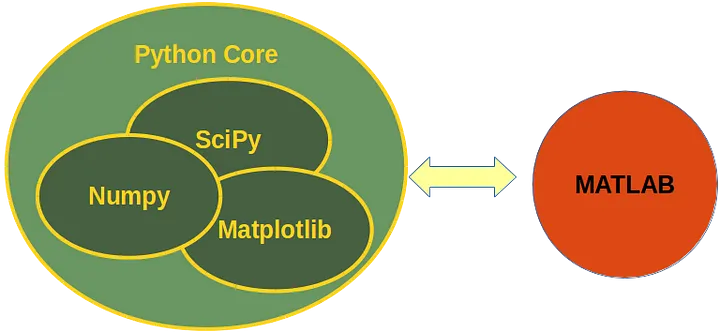
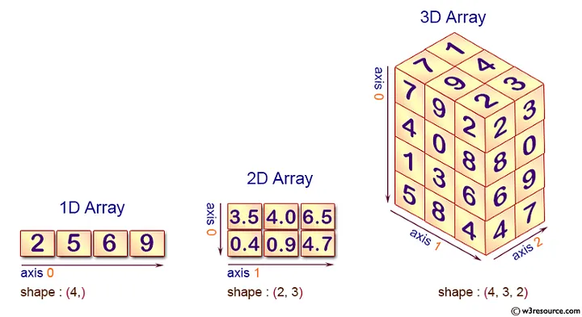
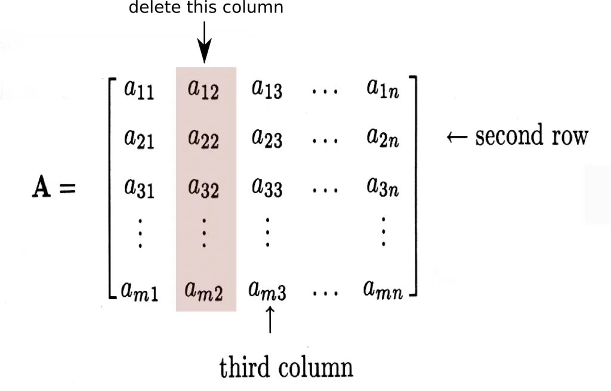

<h1 align="center">Numpy</h1>
<h2 align="center">O que é o NumPy?</h2>

NumPy, que significa Numerical Python, é uma poderosa biblioteca da linguagem de programação Python, que consiste em objetos chamados de arrays (matrizes), que são multidimensionais. Além disso, essa biblioteca vem com uma coleção de rotinas para processar esses arrays.

O NumPy fornece um grande conjunto de funções e operações de biblioteca que ajudam os programadores a executar facilmente cálculos numéricos. Esses tipos de cálculos numéricos são amplamente utilizados em tarefas como:

<ul>
  <li><b>Modelos de Machine Learning:</b> Ao escrever algoritmos de Machine Learning, supõe-se que se realize vários cálculos numéricos. Por exemplo, multiplicação, transposição, adição, etc. O NumPy fornece uma excelente biblioteca para cálculos fáceis (em termos de escrita de código) e rápidos (em termos de velocidade). Os Arrays do NumPy são usados para armazenar os dados de treinamento, bem como os parâmetros dos modelos de Machine Learning.</li>
  <li><b>Processamento de Imagem e Computação Gráfica:</b> O NumPy fornece algumas excelentes funções de biblioteca para rápida manipulação de imagens. Alguns exemplos são o espelhamento de uma imagem, a rotação de uma imagem por um determinado ângulo etc.</li>
  <li><b>Tarefas matemáticas:</b> NumPy é bastante útil para executar várias tarefas matemáticas como integração numérica, diferenciação, interpolação, extrapolação e muitas outras. O NumPy possui também funções incorporadas para álgebra linear e geração de números aleatórios. É uma biblioteca que pode ser usada em conjuto do SciPy e Mat-plotlib. Substituindo o MATLAB quando se trata de tarefas matemáticas.</li>
</ul>

<h2 align="center">Instalação da biblioteca NumPy</h2>

O único pré-requisito para instalar o NumPy é ter instalado o próprio Python em sua máquina. Se você ainda não possui o Python, e deseja uma maneira simples e prática de começar, recomendo usar a Distribuição Anaconda, ela inclui Python, NumPy e muitos outros pacotes comumente usados ​​para computação científica e ciência de dados. Disponível para Windows, Mac OS e Linux.

O NumPy pode ser instalado com pip, no comando no shell:

<pre>
pip install numpy
</pre>

Isso instalará a versão mais recente e mais estável do NumPy em sua máquina. Instalar através do pip é a maneira mais simples de instalar qualquer pacote Python.

No núcleo do pacote NumPy, está o objeto ndarray . Isso encapsula arrays n -dimensionais de tipos de dados homogêneos, com muitas operações sendo executadas em código compilado para desempenho. Existem várias diferenças importantes entre os arrays NumPy e as sequências padrão do Python. Mas não vamos nos aprofundar tanto nesses detalhes.

Na matemática e na física, a dimensão refere-se as coordenadas mínimas de um espaço matemático ou objeto definido de um forma informal para especificar qualquer ponto dentro dele.

Mas em Numpy, as dimensões são chamadas de eixos. O número de eixos é classificado. Em termos mais simples, quando você tem mais de uma matriz unidimensional, então o conceito do eixo surge. Por exemplo, a matriz 2-D tem 2 eixos.

Dessa forma, como mostrado na imagem acima, o eixo 0 atuará em todas as LINHAS de cada COLUNA. E o eixo 1 atuará em todas as COLUNAS de cada LINHA.

Outro exemplo, as coordenadas de um ponto no espaço 3D [1,2,1] têm um eixo. Esse eixo tem 3 elementos, então dizemos que ele tem um comprimento de 3. No exemplo mostrado abaixo, a Array tem 2 eixos. O primeiro eixo tem um comprimento de 2, o segundo eixo tem um comprimento de 3:

<pre>
[[ 1., 0., 0.] 
[ 0., 1., 2.]]
</pre>

Exemplificando, vamos imaginar que os eixos seja como uma tabela que fazemos no Excel por exemplo, onde temos linhas e colunas. No exemplo acima, temos 2 linhas e 3 colunas por assim dizer.

Ou seja, no exemplo da estrutura de elementos que visualizamos anteriormente tem o primeiro eixo com o comprimento de 2, sendo essas as linhas. O segundo eixo com o comprimento de 3 sendo assim as colunas. Olhando dessa maneira e mentalizando essa ideia, fica bem mais simples de aplica um ‘slicing’ ou fatiamento em uma Array Numpy.

Um Array NumPy é uma extensão de um Array Python, que lida apenas com Arrays Unidimensionais e oferece menos funcionalidade. Os Arrays NumPy são equipados com um grande número de funções e operadores que ajudam a escrever rapidamente códigos de alto desempenho para vários tipos de cálculos que discutimos acima. Vamos ver a seguir como podemos definir rapidamente um Array NumPy Unidimensional.

<h2 align="center">Arrays NumPy Unidimensional</h2>

Vamos começar com o seguinte código:

<pre>
import numpy as np 
my_array = np.array([1, 2, 3, 4, 5]) 
print(my_array)
</pre>

No exemplo acima, nós importamos a biblioteca NumPy usando import numpy as np, veja que essa forma de importar e nomear como np é uma forma padrão muito utilizada. Então seguindo adiante nós criamos um Array NumPy simples de 5 números inteiros e depois o imprimimos. Vá em frente e experimente em sua própria máquina. Use as etapas na seção “Instalação da biblioteca NumPy”, descrita acima para certificar-se de que você instalou a biblioteca NumPy em sua máquina. Vamos ver agora o que podemos fazer com esse Array NumPy em particular.

<pre>
my_array = np.array([1, 2, 3, 4, 5])
print(my_array.shape)
</pre>

Isso imprimirá a forma da array que criamos tendo como resultado:

<pre>
(5,)
</pre>

Isso indica que my_array é uma Array com 5 elementos. O atributo shape retorna uma tupla que consiste nas dimensões da Array, mostrando quantas linha e colunas temos para exemplificar. Percebemos que na saída mostrou apenas 5 elementos, por conta de existir apenas um linha ou por ser uma unica dimensão por assim dizer. Caso fosse uma Array Bidimensional por exemplo seria algo como:

Input:

<pre>
my_array = np.array([[1, 2, 3, 4, 5], [1, 2, 3, 4, 5]]) 

print(my_array)
</pre>

Output:

<pre>
(2, 5)
</pre>

Agora ele retorna mostrando que temos 2 dimensões com 5 elementos.

Também podemos usar o atributo reshape para redimensionar a Array NumPy:

<pre>
a = np.arange(6).reshape((3, 2))
print(a)
</pre>

Output:

<pre>
array([[0, 1],
       [2, 3],
       [4, 5]])
</pre>

Podemos também imprimir os elementos individuais. Assim como um Array Python, os Arrays NumPy são indexados começando do 0.

<pre>
print(my_array[0]) 
print(my_array[1]) 
</pre>

Os comandos acima imprimirão 1 e 2 respectivamente no terminal. Falaremos mais sobre indexação logo adiante.

Também podemos modificar os elementos de um Array. Por exemplo, suponha que escrevamos o seguinte comando:

<pre>
my_array[0] = -1 
print(my_array)
</pre>

Output:

<pre>
[-1, 2, 3, 4, 5]
</pre>

Agora, suponha que queremos criar uma Array NumPy vazia? podemos usar a função empty, Ele cria uma Array não inicializada e dtype especificados:

<pre>
np.empty(shape, dtype = float, order = 'C')
</pre>

O código a seguir mostra um exemplo de uma Array NumPy vazia:

<pre>
import numpy as np 
x = np.empty([3,2], dtype = int) 
print(x)
</pre>

Output:

<pre>
[[22649312    1701344351] 
 [1818321759  1885959276] 
 [16779776    156368896]]
</pre>

Os elementos acima mostram valores aleatórios, pois não são inicializados.

Agora digamos que queremos criar um Array NumPy que retorne todos os valores 0? Sim e possível!

A função zeros torna isso simples e fácil, vejamos um exemplo a seguir:

<pre>
my_new_array = np.zeros((5)) 
print(my_new_array)
</pre>

Output:

<pre>
[0, 0, 0, 0, 0]
</pre>

Semelhante a função zeros nós também temos a função ones e de forma semelhante retornaremos:

<pre>
[1, 1, 1, 1, 1]
</pre>

E se quisermos criar uma Array de valores aleatórios?

<pre>
my_random_array = np.random.random((5)) 
print(my_random_array)
</pre>

Output:

<pre>
[0.48691037 0.70332792 0.8123029 0.18101876 0.82146451]
</pre>

Vamos imprimir números aleatorios que esteja entre 0 e 10:

<pre>
a = np.floor(10*np.random.random((3,4))) 
print(a)
</pre>

Output:

<pre>
[[7. 9. 0. 3.]
 [4. 0. 9. 1.]
 [1. 7. 9. 6.]]
</pre>

E claro que a saída que você terá pode variar já que estamos usando uma função aleatória que atribui a cada elemento um valor aleatório.

Vamos voltar a falar um pouco mais sobre indexação.

<pre>
my_array2 = np.array([3, 2, 8, 22, 127]) 
my_array2[3]
</pre>

Output:

<pre>
(22,)
</pre>

Elemento que se encontra no índice 3.

Podemos ir mais a fundo por fatiar mais elementos dentro da Array, por exemplo:

<pre>
my_array2 = np.array([3, 2, 8, 22, 127]) 
print(my_array2[1:])
</pre>

Output:

<pre>
array([ 2, 8, 22, 127])
</pre>

Acima fatiamos todos os elementos a partir do índice 1, o mesmo pode ser feito de com o exemplo a seguir:

<pre>
my_array2 = np.array([3, 2, 8, 22, 127]) 
print(my_array2[2:4])
</pre>

Output:

<pre>
array([ 8, 22])
</pre>

Agora fatiamos do índice 2 ao 4, porém o elemento 4 não será incluído como podemos ver na saída acima.

<h2 align="center">Arrays NumPy Bidimensionais</h2>

Criando uma Array Numpy bidimensionais:

<pre>
my_array3 = np.zeros((2, 3)) 
print(my_array3)
</pre>

Output:

<pre>
[[0. 0. 0.]
[0. 0. 0.]]
</pre>

Agora vamos usar a função ones em nosso array bidimensionais:

<pre>
my_array4 = np.ones((2, 4)) 
print(my_array4)
</pre>

Output:

<pre>
[[1. 1. 1. 1.]
 [1. 1. 1. 1.]]
</pre>

Vamos prosseguir:

<pre>
my_array = np.array([[4, 5], [6, 1]])
print(my_array[0][1])
</pre>

A saída do trecho de código acima é 5, uma vez que é o elemento presente na coluna 0 do índice e na coluna do índice 1.

Você também pode imprimir a forma de my_array da seguinte maneira:

<pre>
print(my_array.shape)
</pre>

A saída é (2, 2), indicando que há 2 linhas e 2 colunas na matriz.

O NumPy fornece uma maneira poderosa de extrair linhas/colunas de um array multidimensional. Por exemplo, considere o exemplo my_array que definimos acima.

<pre>
my_array = np.array([[4, 5], [6, 1]])
print(my_array)
</pre>

Output:

<pre>
[[4 5]
 [6 1]]
</pre>

Suponha que queremos extrair todos os elementos da segunda coluna (índice 1) dela. Aqui, como pode ser visto, a segunda coluna é composta de dois elementos: 5 e 1. Para fazer isso, podemos fazer o seguinte:

<pre>
my_array_column_2 = my_array[:, 1]
print(my_array_column_2)
</pre>

Observe que, em vez de um número de linha, fornecemos dois-pontos ( : ) e, para o número da coluna, usamos o valor 1. A saída será: [5, 1].

Podemos similarmente extrair uma linha de um array NumPy multidimensional. Agora, vamos ver o poder que o NumPy oferece quando se trata de realizar cálculos em vários arrays.

<h2 align="center">Manipulando Arrays NumPy</h2>

Usando o NumPy, você pode facilmente executar cálculos matemáticos em Arrays. Por exemplo, você pode somar Arrays NumPy, subtraí-los, multiplicá-los e até dividi-los. Aqui estão alguns exemplos disso:

<pre>
import numpy as np
a = np.array([[1.0, 2.0], [3.0, 4.0]])
b = np.array([[5.0, 6.0], [7.0, 8.0]])
sum = a + b # Soma
difference = a - b # Subtração
product = a * b # Multiplicação
quotient = a / b # Divisão
print('Sum = \n', + sum)
print('\n')
print('Difference = \n', + difference)
print('\n')
print('Product = \n', + product)
print('\n')
print('Quotient = \n', + quotient)
</pre>

Output:

<pre>
Sum = 
 [[ 6.  8.]
 [10. 12.]]
Difference = 
 [[-4. -4.]
 [-4. -4.]]
Product = 
 [[ 5. 12.]
 [21. 32.]]
Quotient = 
 [[0.2        0.33333333]
 [0.42857143 0.5       ]]
</pre>

Como você pode ver, o operador de multiplicação executa a multiplicação por elementos em vez da multiplicação de arrays. Para executar a multiplicação de arrays, você pode fazer o seguinte:

<pre>
matrix_product = a.dot(b) 
 
print('Matrix Product = \n', + matrix_product)
</pre>

Output:

<pre>
Matrix Product = 
 [[19. 22.]
 [43. 50.]]
</pre>

A função dot executa a multiplicação de Arrays.

<h2 align="center">Conclusão</h2>

Como você pode ver, o NumPy é realmente poderoso em termos da função de biblioteca que ele fornece. Você pode executar grandes cálculos em uma única linha de código com a excelente interface que o NumPy expõe. Isto é o que torna uma ferramenta elegante para vários cálculos numéricos. Você deve definitivamente considerar dominá-lo se quiser desenvolver uma carreira como matemático ou como cientista de dados. Você precisa conhecer o Python antes de se tornar proficiente no NumPy é claro.

<h2 align="center">Referências</h2>

https://medium.com/ensina-ai/entendendo-a-biblioteca-numpy-4858fde63355

