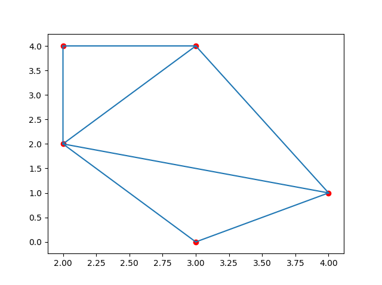
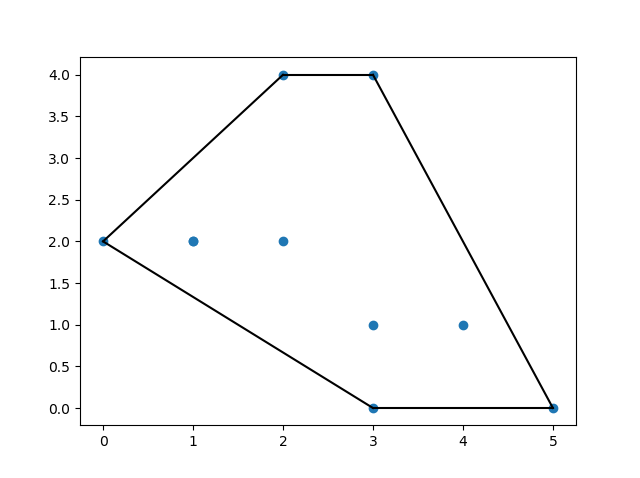

<h1 align="center">Scipy</h1>
<h2 align="center">O que é SciPy?</h2>

SciPy é um conjunto de ferramentas open-source utilizadas principalmente para computação científica de alta performance. Esse conjunto de ferramentas nos fornece um ambiente para trabalho ideal para quem está no mundo de aprendizado de máquina e científico também. Os pacotes básicos de instalação do SciPy são:

<ul>
  <li>NumPy;</li>
  <li>Biblioteca SciPy;</li>
  <li>Matplotlib;</li>
  <li>IPython;</li>
  <li>Pandas;</li>
  <li>Sympy;</li>
  <li>Nose.</li>
</ul>

SciPy é uma biblioteca de computação científica que usa NumPy embaixo.

SciPy significa Scientific Python.

Ele fornece mais funções de utilitário para otimização, estatísticas e processamento de sinais.

Como o NumPy, o SciPy é de código aberto para que possamos usá-lo livremente.

O SciPy foi criado pelo criador do NumPy, Travis Olliphant.

<h2 align="center">Por que usar SciPy?</h2>

Para mim, os motivos principais que tornam esse conjunto bastante poderoso são:

<ul>
  <li>Todos os pacotes de SciPy são muito intuitivos, o tornando também muito fácil de se aprender;</li>
  <li>O SciPy otimizou e adicionou funções que são frequentemente usadas no NumPy e na Data Science;</li>
  <li>O SciPy tem uma comunidade muito ativa.</li>
</ul>
<h2 align="center">Instalação do SciPy</h2>
<pre>
pip install scipy
</pre>
<h2 align="center">Instalação do SciPy</h2>
<pre>
import scipy
</pre>

Exemplo:

<pre>
from scipy import constants

print(constants.liter)
</pre>
<h2 align="center">SciPy Constantes</h2>
<h3 align="center">Constantes no SciPy</h3>

Como o SciPy é mais focado em implementações científicas, ele fornece muitas constantes científicas internas.

Essas constantes podem ser úteis quando você trabalha com a Data Science.

<h3 align="center">Unidades de constante</h3>

Uma lista de todas as unidades no módulo de constantes pode ser vista usando o dir() função.

<pre>
from scipy import constants

print(dir(constants))
</pre>
<h3 align="center">Categorias de unidade</h3>

As unidades são colocadas nessas categorias:

<ul>
  <li>Métrica</li>
  <li>Binário</li>
  <li>Massa</li>
  <li>Ângulo</li>
  <li>Tempo</li>
  <li>Comprimento</li>
  <li>Pressão</li>
  <li>Volume</li>
  <li>Velocidade</li>
  <li>Temperatura</li>
  <li>Energia</li>
  <li>Potência</li>
  <li>Força</li>
</ul>
<h3 align="center">Métrico ( SI ) Prefixos:</h3>

Retorne a unidade especificada em <b>metro</b> ( p. centi retorna 0.01)

<pre>
from scipy import constants

print(constants.yotta)    #1e+24
print(constants.zetta)    #1e+21
print(constants.exa)      #1e+18
print(constants.peta)     #1000000000000000.0
print(constants.tera)     #1000000000000.0
print(constants.giga)     #1000000000.0
print(constants.mega)     #1000000.0
print(constants.kilo)     #1000.0
print(constants.hecto)    #100.0
print(constants.deka)     #10.0
print(constants.deci)     #0.1
print(constants.centi)    #0.01
print(constants.milli)    #0.001
print(constants.micro)    #1e-06
print(constants.nano)     #1e-09
print(constants.pico)     #1e-12
print(constants.femto)    #1e-15
print(constants.atto)     #1e-18
print(constants.zepto)    #1e-21
</pre>
<h3 align="center">Prefixos binários:</h3>

Retorne a unidade especificada em <b>bytes</b> ( p. kibi retorna 1024)

<pre>
from scipy import constants

print(constants.kibi)    #1024
print(constants.mebi)    #1048576
print(constants.gibi)    #1073741824
print(constants.tebi)    #1099511627776
print(constants.pebi)    #1125899906842624
print(constants.exbi)    #1152921504606846976
print(constants.zebi)    #1180591620717411303424
print(constants.yobi)    #1208925819614629174706176
</pre>
<h3 align="center">Massa:</h3>

Retorne a unidade especificada em <b>kg</b> ( p. gram retorna 0.001)

<pre>
from scipy import constants

print(constants.gram)        #0.001
print(constants.metric_ton)  #1000.0
print(constants.grain)       #6.479891e-05
print(constants.lb)          #0.45359236999999997
print(constants.pound)       #0.45359236999999997
print(constants.oz)          #0.028349523124999998
print(constants.ounce)       #0.028349523124999998
print(constants.stone)       #6.3502931799999995
print(constants.long_ton)    #1016.0469088
print(constants.short_ton)   #907.1847399999999
print(constants.troy_ounce)  #0.031103476799999998
print(constants.troy_pound)  #0.37324172159999996
print(constants.carat)       #0.0002
print(constants.atomic_mass) #1.66053904e-27
print(constants.m_u)         #1.66053904e-27
print(constants.u)           #1.66053904e-27
</pre>
<h3 align="center">Ângulo:</h3>

Retorne a unidade especificada em <b>radianos</b> ( p. degree retorna 0.017453292519943295)

<pre>
from scipy import constants

print(constants.degree)     #0.017453292519943295
print(constants.arcmin)     #0.0002908882086657216
print(constants.arcminute)  #0.0002908882086657216
print(constants.arcsec)     #4.84813681109536e-06
print(constants.arcsecond)  #4.84813681109536e-06
</pre>
<h3 align="center">Tempo:</h3>

Retorne a unidade especificada em <b>segundos</b> ( p. hour retorna 3600.0)

<pre>
from scipy import constants

print(constants.minute)      #60.0
print(constants.hour)        #3600.0
print(constants.day)         #86400.0
print(constants.week)        #604800.0
print(constants.year)        #31536000.0
print(constants.Julian_year) #31557600.0
</pre>
<h3 align="center">Comprimento:</h3>

Retorne a unidade especificada em <b>metros</b> ( p. nautical_mile retorna 1852.0)

<pre>
from scipy import constants

print(constants.inch)              #0.0254
print(constants.foot)              #0.30479999999999996
print(constants.yard)              #0.9143999999999999
print(constants.mile)              #1609.3439999999998
print(constants.mil)               #2.5399999999999997e-05
print(constants.pt)                #0.00035277777777777776
print(constants.point)             #0.00035277777777777776
print(constants.survey_foot)       #0.3048006096012192
print(constants.survey_mile)       #1609.3472186944373
print(constants.nautical_mile)     #1852.0
print(constants.fermi)             #1e-15
print(constants.angstrom)          #1e-10
print(constants.micron)            #1e-06
print(constants.au)                #149597870691.0
print(constants.astronomical_unit) #149597870691.0
print(constants.light_year)        #9460730472580800.0
print(constants.parsec)            #3.0856775813057292e+16
</pre>
<h3 align="center">Pressão:</h3>

Retorne a unidade especificada em <b>pascal</b> ( p. psi retorna 6894.757293168361)

<pre>
from scipy import constants

print(constants.atm)         #101325.0
print(constants.atmosphere)  #101325.0
print(constants.bar)         #100000.0
print(constants.torr)        #133.32236842105263
print(constants.mmHg)        #133.32236842105263
print(constants.psi)         #6894.757293168361
</pre>
<h3 align="center">Área:</h3>

Retorne a unidade especificada em <b>metros quadrados</b> ( p. hectare retorna 10000.0)

<pre>
from scipy import constants

print(constants.hectare) #10000.0
print(constants.acre)    #4046.8564223999992
</pre>
<h3 align="center">Volume:</h3>

Retorne a unidade especificada em <b>metros cúbicos</b> ( p. liter retorna 0.001)

<pre>
from scipy import constants

print(constants.liter)            #0.001
print(constants.litre)            #0.001
print(constants.gallon)           #0.0037854117839999997
print(constants.gallon_US)        #0.0037854117839999997
print(constants.gallon_imp)       #0.00454609
print(constants.fluid_ounce)      #2.9573529562499998e-05
print(constants.fluid_ounce_US)   #2.9573529562499998e-05
print(constants.fluid_ounce_imp)  #2.84130625e-05
print(constants.barrel)           #0.15898729492799998
print(constants.bbl)              #0.15898729492799998
</pre>
<h3 align="center">Velocidade:</h3>

Retorne a unidade especificada em <b>metros por segundo</b> ( p. speed_of_sound retorna 340.5)

<pre>
from scipy import constants

print(constants.kmh)            #0.2777777777777778
print(constants.mph)            #0.44703999999999994
print(constants.mach)           #340.5
print(constants.speed_of_sound) #340.5
print(constants.knot)           #0.5144444444444445
</pre>
<h3 align="center">Temperatura:</h3>

Retorne a unidade especificada em <b>Kelvin</b> ( p. zero_Celsius retorna 273.15)

<pre>
from scipy import constants

print(constants.zero_Celsius)      #273.15
print(constants.degree_Fahrenheit) #0.5555555555555556
</pre>
<h3 align="center">Energia:</h3>

Retorne a unidade especificada em <b>Joules</b> ( p. calorie retorna 4.184)

<pre>
from scipy import constants

print(constants.eV)            #1.6021766208e-19
print(constants.electron_volt) #1.6021766208e-19
print(constants.calorie)       #4.184
print(constants.calorie_th)    #4.184
print(constants.calorie_IT)    #4.1868
print(constants.erg)           #1e-07
print(constants.Btu)           #1055.05585262
print(constants.Btu_IT)        #1055.05585262
print(constants.Btu_th)        #1054.3502644888888
print(constants.ton_TNT)       #4184000000.0
</pre>
<h3 align="center">Poder:</h3>

Retorne a unidade especificada em <b>watts</b> ( p. horsepower retorna 745.6998715822701)

<pre>
from scipy import constants

print(constants.hp)         #745.6998715822701
print(constants.horsepower) #745.6998715822701
</pre>
<h3 align="center">Força:</h3>

Retorne a unidade especificada em <b>Newton</b> ( p. kilogram_force retorna 9.80665)

<pre>
from scipy import constants

print(constants.dyn)             #1e-05
print(constants.dyne)            #1e-05
print(constants.lbf)             #4.4482216152605
print(constants.pound_force)     #4.4482216152605
print(constants.kgf)             #9.80665
print(constants.kilogram_force)  #9.80665
</pre>
<h2 align="center">Otimizadores noScipy</h2>

Otimizadores são um conjunto de procedimentos definidos no SciPy que encontram o valor mínimo de uma função ou a raiz de uma equação.

<h3 align="center">Otimizando funções</h3>

Essencialmente, todos os algoritmos do Machine Learning nada mais são do que uma equação complexa que precisa ser minimizada com a ajuda de dados fornecidos.

<h3 align="center">Raízes de uma equação</h3>

O NumPy é capaz de encontrar raízes para polinômios e equações lineares, mas não consegue encontrar raízes para não equações lineares, como esta:

<pre>
x + cos(x)
</pre>

Para isso, você pode usar o SciPy's optimze.root função.

Esta função usa dois argumentos necessários:

<b>Diversão</b> - uma função representando uma equação.

<b>x0</b> - um palpite inicial para a raiz.

A função retorna um objeto com informações sobre a solução.

A solução real é fornecida no atributo x do objeto retornado:

<b>Exemplo</b>

Encontre raiz da equação x + cos(x):

<pre>
from scipy.optimize import root
from math import cos

def eqn(x):
&emsp;&emsp;return x + cos(x)

myroot = root(eqn, 0)

print(myroot.x)
</pre>

<b>Solução</b>

<pre>
[-0.73908513]
</pre>
<h3 align="center">Minimizando uma função</h3>

Uma função, neste contexto, representa uma curva, as curvas têm pontos altos e pontos baixos.

Pontos altos são chamados maxima.

Pontos baixos são chamados mínimos.

O ponto mais alto de toda a curva é chamado máximos globais, enquanto o resto deles é chamado maxima local.

O ponto mais baixo de toda a curva é chamado mínimos globais, enquanto o resto deles é chamado mínimos locais.

<h3 align="center">Encontrando mínimos</h3>

Nós podemos usar scipy.optimize.minimize() função para minimizar a função.

O minimize() A função usa os seguintes argumentos:

<b>Diversão</b> - uma função representando uma equação.

<b>x0</b> - um palpite inicial para a raiz.

<b>Método</b> - nome do método a ser usado. Valores legais:

<pre>
'CG'
'BFGS'
'Newton-CG'
'L-BFGS-B'
'TNC'
'COBYLA'
'SLSQP'
</pre>

<b>Retorno de Chamada</b> - função chamada após cada iteração de otimização.

<b>Opções</b> - um dicionário que define parâmetros extras:

<pre>
{
&emsp;&emsp;&emsp;&emsp;"disp": boolean - print detailed description
&emsp;&emsp;&emsp;&emsp;"gtol": number - the tolerance of the error
  }
</pre>
<h2 align="center">Dados Esparsos no SciPy</h2>
<h3 align="center">O que são dados esparsos</h3>

Dados esparsos são dados que têm elementos principalmente não utilizados ( que não transportam nenhuma informação ).

Pode ser uma matriz como esta:

<pre>
[1, 0, 2, 0, 0, 3, 0, 0, 0, 0, 0, 0]
</pre>
<ul>
  <li><b>Dados Esparsos</b>: é um conjunto de dados em que a maioria dos valores do item é zero.</li>
  <li><b>Matriz Densa</b>: é o oposto de uma matriz esparsa: a maioria dos valores é não zero.</li>
</ul>

Na computação científica, quando estamos lidando com derivados parciais na álgebra linear, encontraremos dados esparsos.

<h3 align="center">Como Trabalhar com Dados Esparsos</h3>

O SciPy possui um módulo, scipy.sparse que fornece funções para lidar com dados esparsos.

Existem principalmente dois tipos de matrizes esparsas que usamos:

<b>CSC</b> - coluna esparsa comprimida. Para aritmética eficiente, fatiamento rápido da coluna.

<b>RSE</b> - Linha esparsa comprimida. Para fatiar rapidamente a linha, mais rápido produtos vetoriais matriciais

Vamos usar o <b>RSE</b> matriz neste tutorial.

<h3 align="center">Matriz de RSE</h3>

Podemos criar matriz de CSR passando uma matriz para a função scipy.sparse.csr_matrix().

<b>Exemplo</b>

Crie uma matriz CSR a partir de uma matriz:

<pre>
import numpy as np
from scipy.sparse import csr_matrix

arr = np.array([0, 0, 0, 0, 0, 1, 1, 0, 2])

print(csr_matrix(arr))
</pre>

O exemplo acima retorna:

<pre>
( 0, 5 ) 1
( 0, 6 ) 1
( 0, 8 ) 2
</pre>

A partir do resultado, podemos ver que existem 3 itens com valor.

O item 1. está na linha 0 posição 5 e tem o valor 1.

O item 2. está na linha 0 posição 6 e tem o valor 1.

O item 3. está na linha 0 posição 8 e tem o valor 2.

<h3 align="center">Métodos de Matriz Esparsa</h3>

Exibindo dados armazenados ( não os itens zero ) com o data propriedade:

<b>Exemplo</b>

<pre>
import numpy as np
from scipy.sparse import csr_matrix

arr = np.array([[0, 0, 0], [0, 0, 1], [1, 0, 2]])

print(csr_matrix(arr).data)
</pre>

Contando nonzeros com o count_nonzero() método:

<b>Exemplo</b>

<pre>
import numpy as np
from scipy.sparse import csr_matrix

arr = np.array([[0, 0, 0], [0, 0, 1], [1, 0, 2]])

print(csr_matrix(arr).count_nonzero())
</pre>

Remoção de entradas zero da matriz com a eliminate_zeros() método:

<b>Exemplo</b>

<pre>
import numpy as np
from scipy.sparse import csr_matrix

arr = np.array([[0, 0, 0], [0, 0, 1], [1, 0, 2]])

mat = csr_matrix(arr)
mat.eliminate_zeros()

print(mat)
</pre>

Eliminando entradas duplicadas com o sum_duplicates() método:

<b>Exemplo</b>

Eliminando duplicatas adicionando-as:

<pre>
import numpy as np
from scipy.sparse import csr_matrix

arr = np.array([[0, 0, 0], [0, 0, 1], [1, 0, 2]])

mat = csr_matrix(arr)
mat.sum_duplicates()

print(mat)
</pre>

Convertendo de csr para csc com o tocsc() método:

<b>Exemplo</b>

<pre>
import numpy as np
from scipy.sparse import csr_matrix

arr = np.array([[0, 0, 0], [0, 0, 1], [1, 0, 2]])

newarr = csr_matrix(arr).tocsc()

print(newarr)
</pre>
<h2 align="center">SciPy Gráficos</h2>
<h3 align="center">Trabalhando com gráficos</h3>

Os gráficos são uma estrutura de dados essencial.

O SciPy nos fornece o módulo scipy.sparse.csgraph para trabalhar com essas estruturas de dados.

<h3 align="center">Matriz de Adjacência</h3>

Matriz de adjacência é uma nxn matriz onde n é o número de elementos em um gráfico.

E os valores representam a conexão entre os elementos.

<b>Exemplo:</b>

Para um gráfico como este, com os elementos A, B e C, as conexões são:

A & B estão conectados com o peso 1.

A & C estão conectados com o peso 2.

C & B não está conectado.

A Matriz de Adjência ficaria assim:

<pre>
&emsp;&emsp;&emsp;&emsp;A B C
&emsp;&emsp;A: [ 0 1 2 ]  
&emsp;&emsp;B: [ 1 0 0 ]
&emsp;&emsp;C: [ 2 0 0 ]
</pre>

Abaixo, seguem alguns dos métodos mais usados para trabalhar com matrizes de adjacência.

<h3 align="center">Componentes conectados</h3>

Encontre todos os componentes conectados com o connected_components() método.

<b>Exemplo</b>

<pre>
import numpy as np
from scipy.sparse.csgraph import connected_components
from scipy.sparse import csr_matrix

arr = np.array([
  [0, 1, 2],
  [1, 0, 0],
  [2, 0, 0]
])

newarr = csr_matrix(arr)

print(connected_components(newarr))
</pre>
<h3 align="center">Dijkstra</h3>

Use o dijkstra método para encontrar o caminho mais curto em um gráfico de um elemento para de outro.

São necessários os seguintes argumentos:

<ul>
  <li>return_predecessors: booleano ( É verdade que retorna todo o caminho do transversal caso contrário, False ).</li>
  <li>indices: índice do elemento para retornar todos os caminhos apenas desse elemento.</li>
  <li>limite: peso máximo do caminho.</li>
</ul>

<b>Exemplo</b>

Encontre o caminho mais curto do elemento 1 para 2:

<pre>
import numpy as np
from scipy.sparse.csgraph import dijkstra
from scipy.sparse import csr_matrix

arr = np.array([
  [0, 1, 2],
  [1, 0, 0],
  [2, 0, 0]
])

newarr = csr_matrix(arr)

print(dijkstra(newarr, return_predecessors=True, indices=0))
</pre>
<h3 align="center">Floyd Warshall</h3>

Use o floyd_warshall() método para encontrar o caminho mais curto entre todos os pares de elementos.

<b>Exemplo</b>

Encontre o caminho mais curto entre todos os pares de elementos:

<pre>
import numpy as np
from scipy.sparse.csgraph import floyd_warshall
from scipy.sparse import csr_matrix

arr = np.array([
  [0, 1, 2],
  [1, 0, 0],
  [2, 0, 0]
])

newarr = csr_matrix(arr)

print(floyd_warshall(newarr, return_predecessors=True))
</pre>
<h3 align="center">Bellman Ford</h3>

O bellman_ford() O método também pode encontrar o caminho mais curto entre todos os pares de elementos, mas esse método também pode lidar com pesos negativos.

<b>Exemplo</b>

Encontre o caminho mais curto do elemento 1 a 2 com um gráfico fornecido com um peso negativo:

<pre>
import numpy as np
from scipy.sparse.csgraph import bellman_ford
from scipy.sparse import csr_matrix

arr = np.array([
  [0, -1, 2],
  [1, 0, 0],
  [2, 0, 0]
])

newarr = csr_matrix(arr)

print(bellman_ford(newarr, return_predecessors=True, indices=0))
</pre>
<h3 align="center">Profundidade Primeira Ordem</h3>

O depth_first_order() método retorna uma profundidade primeiro transversal de um nó.

Esta função usa os seguintes argumentos:

<ul>
  <li>O gráfico.</li>
  <li>O elemento inicial para atravessar o gráfico de.</li>
</ul>

<b>Exemplo</b>

Atravesse a profundidade do gráfico primeiro para a matriz de adjacência especificada:

<pre>
import numpy as np
from scipy.sparse.csgraph import depth_first_order
from scipy.sparse import csr_matrix

arr = np.array([
  [0, 1, 0, 1],
  [1, 1, 1, 1],
  [2, 1, 1, 0],
  [0, 1, 0, 1]
])

newarr = csr_matrix(arr)

print(depth_first_order(newarr, 1))
</pre>
<h3 align="center">Primeira Ordem da Largura</h3>

O breadth_first_order() método retorna uma largura primeiro transversal de um nó.

Esta função usa os seguintes argumentos:

<ul>
  <li>O gráfico.</li>
  <li>O elemento inicial para atravessar o gráfico de.</li>
</ul>

<b>Exemplo</b>

Atravesse primeiro a largura do gráfico para obter a matriz de adjacência especificada:

<pre>
import numpy as np
from scipy.sparse.csgraph import breadth_first_order
from scipy.sparse import csr_matrix

arr = np.array([
  [0, 1, 0, 1],
  [1, 1, 1, 1],
  [2, 1, 1, 0],
  [0, 1, 0, 1]
])

newarr = csr_matrix(arr)

print(breadth_first_order(newarr, 1))
</pre>
<h2 align="center">Dados Espaciais no Scipy</h2>
<h3 align="center">Trabalhando com dados espaciais</h3>

Dados espaciais referem-se a dados representados em um espaço geométrico.

Por exemplo. aponta para um sistema de coordenadas.

Lidamos com problemas de dados espaciais em muitas tarefas.

Por exemplo. descobrir se um ponto está dentro de um limite ou não.

O SciPy nos fornece o módulo scipy.spatial, que tem funções para trabalhar com dados espaciais.

<h3 align="center">Triangulação</h3>

Uma triangulação de um polígono é dividir o polígono em múltiplo triângulos com os quais podemos calcular uma área do polígono.

Uma triangulação com pontos significa criar triângulos compostos por superfície nos quais todos dos pontos dados estão em pelo menos um vértice de qualquer triângulo na superfície.

Um método para gerar essas triangulações através de pontos é o Delaunay() Triangulação.

<b>Exemplo</b>

Crie uma triangulação a partir dos seguintes pontos:

<pre>
import numpy as np
from scipy.spatial import Delaunay
import matplotlib.pyplot as plt

points = np.array([
  [2, 4],
  [3, 4],
  [3, 0],
  [2, 2],
  [4, 1]
])

simplices = Delaunay(points).simplices

plt.triplot(points[:, 0], points[:, 1], simplices)
plt.scatter(points[:, 0], points[:, 1], color='r')

plt.show()
</pre>

<b>Resultado:</b>

<h3 align="center">Casco convexo</h3>

Um casco convexo é o menor polígono que cobre todos os pontos indicados.

Use o ConvexHull() método para criar um casco convexo.

<b>Exemplo</b>

Crie um casco convexo para os seguintes pontos:

<pre>
import numpy as np
from scipy.spatial import ConvexHull
import matplotlib.pyplot as plt

points = np.array([
  [2, 4],
  [3, 4],
  [3, 0],
  [2, 2],
  [4, 1],
  [1, 2],
  [5, 0],
  [3, 1],
  [1, 2],
  [0, 2]
])

hull = ConvexHull(points)
hull_points = hull.simplices

plt.scatter(points[:,0], points[:,1])
for simplex in hull_points:
&emsp;&emsp;plt.plot(points[simplex,0], points[simplex,1], 'k-')

plt.show()
</pre>

<b>Resultado:</b>

<h3 align="center">KDTrees</h3>

KDTrees é uma estrutura de dados otimizada para consultas de vizinhos mais próximas.

Por exemplo. em um conjunto de pontos usando o KDTrees, podemos perguntar com eficiência quais pontos estão mais próximos de um determinado ponto.

O KDTree() método retorna um objeto KDTree.

O query() método retorna a distância para o vizinho mais próximo e a localização dos vizinhos.

<b>Exemplo</b>

Encontre o vizinho mais próximo para apontar ( 1,1 ):

<pre>
from scipy.spatial import KDTree

points = [(1, -1), (2, 3), (-2, 3), (2, -3)]

kdtree = KDTree(points)

res = kdtree.query((1, 1))

print(res)
</pre>

<b>Resultado:</b>

<pre>
( 2.0, 0 )
</pre>
<h3 align="center">Matriz de Distância</h3>

Existem muitas métricas de distância usadas para encontrar vários tipos de distâncias entre dois pontos na ciência de dados, distsância euclidiana, distsância de cosseno etc.

A distância entre dois vetores pode não ser apenas o comprimento da linha reta entre eles, também pode ser o ângulo entre eles desde a origem ou o número de etapas da unidade necessárias etc.

Muito do desempenho do algoritmo de aprendizado de máquina depende muito das métricas de distância. Por exemplo. "K vizinhos mais próximos" ou "K Means" etc.

Vejamos alguns dos Métricos de Distância:

<h3 align="center">Distância Euclidiana</h3>

Encontre a distância euclidiana entre os pontos indicados.

<b>Exemplo</b>

<pre>
from scipy.spatial.distance import euclidean

p1 = (1, 0)
p2 = (10, 2)

res = euclidean(p1, p2)

print(res)
</pre>

<b>Resultado:</b>

<pre>
 9.21954445729
</pre>
<h3 align="center">Distância do Cityblock ( Distância de Manhattan )</h3>

A distância é calculada usando 4 graus de movimento.

Por exemplo. só podemos nos mover: para cima, para baixo, para a direita ou para a esquerda, não na diagonal.

<b>Exemplo</b>

Encontre a distância do bloco da cidade entre os pontos indicados:

<pre>
from scipy.spatial.distance import cityblock

p1 = (1, 0)
p2 = (10, 2)

res = cityblock(p1, p2)

print(res)
</pre>

<b>Resultado:</b>

<pre>
11
</pre>
<h3 align="center">Distância do cosseno</h3>

É o valor do ângulo de cosseno entre os dois pontos A e B.

<b>Exemplo</b>

Encontre a distensão do cosseno entre os pontos indicados:

<pre>
from scipy.spatial.distance import cosine

p1 = (1, 0)
p2 = (10, 2)

res = cosine(p1, p2)

print(res)
</pre>

<b>Resultado:</b>

<pre>
0,019419324309079777
</pre>

<h3 align="center">Distância de Hamming</h3>

É a proporção de bits em que dois bits são diferentes.

É uma maneira de medir a distância para sequências binárias.

<b>Exemplo</b>

Encontre a distância de presunto entre os pontos indicados:

<pre>
from scipy.spatial.distance import hamming

p1 = (True, False, True)
p2 = (False, True, True)

res = hamming(p1, p2)

print(res)
</pre>

<b>Resultado:</b>

<pre>
0,66666666667
</pre>
<h2 align="center">SciPy Matlab Arrays</h2>
<h3 align="center">Trabalhando com matlab matrays</h3>

Sabemos que o NumPy nos fornece métodos para persistir os dados em formatos legíveis para Python. Mas o SciPy também nos fornece interoperabilidade com o Matlab.

O SciPy nos fornece o módulo scipy.io, que tem funções para trabalhar com Matlab matrays.

<h3 align="center">Exportando dados no formato Matlab</h3>

O savemat() função nos permite exportar dados em Formato Matlab.

O método usa os seguintes parâmetros:

<ul>
  <li><b>nome do arquivo</b> - o nome do arquivo para salvar dados.</li>
  <li><b>mdict</b> - um dicionário contendo os dados.</li>
  <li><b>compressão</b> - um valor booleano que especifica se deve comprimir o resultado ou não. Falso padrão.</li>
</ul>

<b>Exemplo</b>

Exporte a seguinte matriz como nome de variável "vec" para um arquivo mat:

<pre>
from scipy import io
import numpy as np

arr = np.arange(10)

io.savemat('arr.mat', {"vec": arr})
</pre>
<h3 align="center">Importar dados do formato Matlab</h3>

O loadmat() função nos permite importar dados de um Arquivo Matlab.

A função usa um parâmetro necessário:

<b>nome do arquivo</b> - o nome do arquivo dos dados salvos.

Ele retornará uma matriz estruturada cujas chaves são os nomes das variáveis e os valores correspondentes são os valores das variáveis.

<b>Exemplo</b>

Importe a matriz do seguinte arquivo mat.:

<pre>
from scipy import io
import numpy as np

arr = np.array([0, 1, 2, 3, 4, 5, 6, 7, 8, 9,])

#Export:
io.savemat('arr.mat', {"vec": arr})

#Import:
mydata = io.loadmat('arr.mat')

print(mydata)
</pre>

<b>Resultado:</b>

<pre>
{
&emsp;&emsp;'__header__': b'MATLAB 5.0 MAT-file Plataforma: nt, Criado em: Ter 22 de setembro 13:12:32 2020',
&emsp;&emsp;'__version__': '1.0',
&emsp;&emsp;'__globals__': [ ],
&emsp;&emsp;'vec': matriz ( [ [ 0, 1, 2, 3, 4, 5, 6, 7, 8, 9 ] ] )
 }
</pre>

Use o nome da variável "vec" para exibir apenas a matriz dos dados do matlab:

<b>Exemplo</b>

<pre>
...

print(mydata['vec'])
</pre>

<b>Resultado:</b>

<pre>
[ [ 0 1 2 3 4 5 6 7 8 9 ] ]
</pre>

<b>Nota:</b> Podemos ver que a matriz originalmente era 1D, mas na extração aumentou uma dimensão.

Para resolver isso, podemos passar um argumento adicional squeeze_me=True:

<b>Exemplo</b>

<pre>
#Import:
mydata = io.loadmat('arr.mat', squeeze_me=True)

print(mydata['vec'])
</pre>

<b>Resultado:</b>

<pre>
[ 0 1 2 3 4 5 6 7 8 9 ]
</pre>
<h2 align="center">Interpolação no SciPy</h2>
<h3 align="center">O que é a interpolação?</h3>

A interpolação é um método para gerar pontos entre determinados pontos.

Por exemplo: para os pontos 1 e 2, podemos interpolar e encontrar os pontos 1.33 e 1.66.

A interpolação tem muito uso, no Machine Learning, geralmente lidamos com dados ausentes em um conjunto de dados, a interpolação é frequentemente usada para substituir esses valores.

Esse método de preenchimento de valores é chamado imputação.

Além da imputação, a interpolação é frequentemente usada onde precisamos suavizar os pontos discretos em um conjunto de dados.

<h3 align="center">Como implementá-lo no SciPy?</h3>

O SciPy nos fornece um módulo chamado scipy.interpolate que tem muitas funções para lidar com a interpolação:

<h3 align="center">Interpolação 1D</h3>

A função interp1d() é usado para interpolar uma distribuição com 1 variável.

Leva x e y pontos e retornos uma função exigível que pode ser chamada com novo x e retorna correspondente y.

<b>Exemplo</b>

Para valores interpolados de xs e ys fornecidos de 2.1, 2.2 ... a 2.9:

<pre>
from scipy.interpolate import interp1d
import numpy as np

xs = np.arange(10)
ys = 2*xs + 1

interp_func = interp1d(xs, ys)

newarr = interp_func(np.arange(2.1, 3, 0.1))

print(newarr)
</pre>

<b>Resultado:</b>

<pre>
[ 5,2 5,4 5,6 5,8 6.   6,2 6,4 6,6 6,8 ]
</pre>
<h3 align="center">Interpolação Spline</h3>

Na interpolação 1D, os pontos são adequados para curva única enquanto na interpolação de Spline os pontos são montados contra um bit a pouco função definida com polinômios chamados splines.

O UnivariateSpline() função leva xs e ys e produza um funciton exigível que pode ser chamado com novo xs.

<b>Exemplo</b>

Encontre interpolação de spline univariada para 2.1, 2.2... 2.9 para os seguintes pontos não lineares:

<pre>
from scipy.interpolate import UnivariateSpline
import numpy as np

xs = np.arange(10)
ys = xs**2 + np.sin(xs) + 1

interp_func = UnivariateSpline(xs, ys)

newarr = interp_func(np.arange(2.1, 3, 0.1))

print(newarr)
</pre>

<b>Resultado:</b>

<pre>
[ 5.62826474 6.03987348 6.47131994 6.92265019 7.3939103 7.88514634
   8.39640439 8.92773053 9.47917082 ]
</pre>
<h3 align="center">Interpolação com função de base radial</h3>

Função de base radial é uma função definida correspondente a um ponto de referência fixo.

O Rbf() função também leva xs e ys como argumentos e produz uma função exigível que pode ser chamada com novo xs.

<b>Exemplo</b>

Interpolar após xs e ys usando rbf e encontrar valores para 2.1, 2.2 ... 2.9:

<pre>
from scipy.interpolate import Rbf
import numpy as np

xs = np.arange(10)
ys = xs**2 + np.sin(xs) + 1

interp_func = Rbf(xs, ys)

newarr = interp_func(np.arange(2.1, 3, 0.1))

print(newarr)
</pre>

<b>Resultado:</b>

<pre>
[ 6.25748981 6.62190817 7.00310702 7.40121814 7.8161443 8.24773402
   8.69590519 9.16070828 9.64233874 ]
</pre>
<h2 align="center">Interpolação no SciPy</h2>
<h3 align="center">O que é o Teste de Significado Estatístico?</h3>

Nas estatísticas, significância estatística significa que o resultado produzido tem uma razão por trás, não foi produzido aleatoriamente ou por acaso.

O SciPy nos fornece um módulo chamado scipy.stats, que tem funções para executar testes de significância estatística.

Aqui estão algumas técnicas e palavras-chave que são importantes ao executar esses testes:

<h3 align="center">Hipótese em Estatística</h3>

Hipótese é uma suposição sobre um parâmetro na população.

<h3 align="center">Hipótese Nula</h3>

Supõe que a observação não é estatisticamente significativa.

<h3 align="center">Hipótese Alternativa</h3>

Ele pressupõe que as observações sejam devidas a algum motivo.

É alternativo à hipótese nula.

<b>Exemplo:</b>

Para uma avaliação de um aluno, tomaríamos:

"estudante é pior que a média" - como hipótese nula, e:

"estudante é melhor que a média" - como uma hipótese alternativa.

<h3 align="center">Um teste de cauda</h3>

Quando nossa hipótese está testando apenas um lado do valor, ela é chamada de "teste de uma cauda".

<b>Exemplo:</b>

Para a hipótese nula:

"a média é igual a k", podemos ter hipóteses alternativas:

"a média é menor que k", ou:

"a média é maior que k"

<h3 align="center">Teste de duas caudas</h3>

Quando nossa hipótese está testando para os dois lados dos valores.

<b>Exemplo:</b>

Para a hipótese nula:

"a média é igual a k", podemos ter hipóteses alternativas:

"a média não é igual a k"

Nesse caso, a média é menor ou maior que k e os dois lados devem ser verificados.

<h3 align="center">Valor Alfa</h3>

O valor alfa é o nível de significância.

<b>Exemplo:</b>

Quão perto dos extremos os dados devem estar para que a hipótese nula seja rejeitada.

Geralmente é tomado como 0,01, 0,05 ou 0,1.

<h3 align="center">Valor P</h3>

O valor P informa o quão perto dos dados são realmente extremos.

O valor P e os valores alfa são comparados para estabelecer a significância estatística.

Se o valor de p <= alfa, rejeitamos a hipótese nula e dizemos que os dados são estatisticamente significativos. caso contrário, aceitamos a hipótese nula.

<h3 align="center">Teste T</h3>

Testes T são usados para determinar se há deferência significativa entre meios de duas variáveis e nos avise se eles pertencem à mesma distribuição.

É um teste de duas caudas.

A função ttest_ind() pega duas amostras do mesmo tamanho e produz uma tupla de t-estatística e valor p.

<b>Exemplo</b>

Encontre se os valores fornecidos v1 e v2 são da mesma distribuição:

<pre>
import numpy as np
from scipy.stats import ttest_ind

v1 = np.random.normal(size=100)
v2 = np.random.normal(size=100)

res = ttest_ind(v1, v2)

print(res)
</pre>

<b>Resultado:</b>

<pre>
Ttest_indResult ( estatístico = 0,40833510339674095, valor = 0,68346891833752133 )
</pre>

Se você deseja retornar apenas o valor p, use o pvalue propriedade:

<b>Exemplo</b>

<pre>
...
res = ttest_ind(v1, v2).pvalue

print(res)
</pre>

<b>Resultado:</b>

<pre>
0,68346891833752133
</pre>
<h3 align="center">Teste KS</h3>

O teste KS é usado para verificar se determinados valores seguem uma distribuição.

A função leva o valor a ser testado e o CDF como dois parâmetros.

A <b>CDF</b> pode ser uma sequência ou uma função exigível que retorna a probabilidade.

Pode ser usado como um teste de uma cauda ou duas caudas.

Por padrão, são duas caudas. Podemos passar a alternativa de parâmetro como uma sequência de um dos dois lados, menos ou maior.

<b>Exemplo</b>

Encontre se o valor fornecido segue a distribuição normal:

<pre>
import numpy as np
from scipy.stats import kstest

v = np.random.normal(size=100)

res = kstest(v, 'norm')

print(res)
</pre>

<b>Resultado:</b>

<pre>
KstestResult ( estatístico = 0,047798701221956841, valor = 0,97630967161777515 )
</pre>
<h3 align="center">Descrição Estatística dos Dados</h3>

Para ver um resumo dos valores em uma matriz, podemos usar o describe() função.

Retorna a seguinte descrição:

<ul>
  <li>número de observações ( nobs )</li>
  <li>valores mínimos e máximos = minmax</li>
  <li>mean (média)</li>
  <li>variance (variância)</li>
  <li>skewness</li>
  <li>kurtosis</li>
</ul>

<b>Exemplo</b>

Mostrar descrição estatística dos valores em uma matriz:

<pre>
import numpy as np
from scipy.stats import describe

v = np.random.normal(size=100)
res = describe(v)

print(res)
</pre>

<b>Resultado:</b>

<pre>
  DescreverResult (
    nobs = 100,
    minmax = ( -2.0991855456740121, 2.1304142707414964 ),
    mean = 0,11503747689121079,
    variance = 0,99418092655064605,
    skewness = 0,013953400984243667,
    kurtosis = -0,671060517912661
  )
</pre>
<h3 align="center">Testes de normalidade ( Skewness e Kurtosis )</h3>

Os testes de normalidade são baseados na inclinação e na kurtosia.

O normaltest() função retorna valor p para a hipótese nula:

"x vem de uma distribuição normal".

<b>Skewness:</b>

Uma medida de simetria nos dados.

Para distribuições normais, é 0.

Se for negativo, significa que os dados são distorcidos para a esquerda.

Se for positivo, significa que os dados estão distorcidos corretamente.

<b>Kurtosis:</b>

Uma medida sobre se os dados são pesados ou levemente direcionados para uma distribuição normal.

Kurtose positiva significa cauda pesada.

Kurtose negativa significa levemente caudal.

<b>Exemplo</b>

Encontre a inclinação e a kurtosis dos valores em uma matriz:

<pre>
import numpy as np
from scipy.stats import skew, kurtosis

v = np.random.normal(size=100)

print(skew(v))
print(kurtosis(v))
</pre>

<b>Resultado:</b>

<pre>
0.11168446328610283
-0,1879320563260931
</pre>

<b>Exemplo</b>

Descubra se os dados vêm de uma distribuição normal:

<pre>
import numpy as np
from scipy.stats import normaltest

v = np.random.normal(size=100)

print(normaltest(v))
</pre>

<b>Resultado:</b>

<pre>
NormaltestResult ( estatístico = 4.4783745697002848, valor = 0.10654505998635538 )
</pre>
<h2>Refêrencias</h2>

https://www.w3schools.com/python/scipy/scipy_intro.php

https://www.ferrari.pro.br/home/documents/FFerrari-ecosistema-python.pdf

https://machinelearningbrasil.wordpress.com/2015/01/14/introducao-a-python-e-scipy-para-aprendizado-de-maquina/

