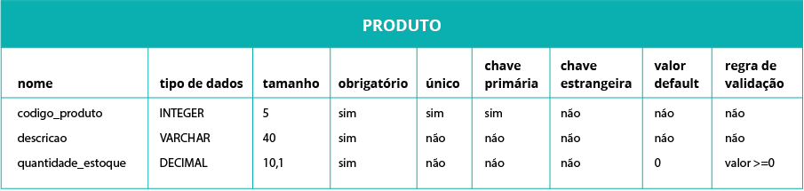

<h1 align="center">Introdução a Banco de Dados</h1>
<h2 align="center">O que são Banco de Dados?</h2>

O conceito de banco de dados relaciona-se ao armazenamento, manutenção e resgate de informações em um sistema. A necessidade de organizar informações está presente em diversos contextos cotidianos como por exemplo no uso de ferramentas digitais, como celulares e computadores, quando precisamos organizar arquivos virtuais ou até mesmo em casa, quando precisamos organizar documentos como manuais de eletrodomésticos ou folhetos de delivery.

Em outras palavras, bancos de dados são conjuntos de informações inter-relacionadas sobre determinado assunto, armazenados de modo a permitir o acesso organizado por parte dos usuários. Segundo a definição de Elmasri e Navathe (2011), “um banco de dados representa algum aspecto do mundo real, às vezes chamado de minimundo ou de universo de discurso (UoD – Universe of Discourse).”

Os bancos de dados têm como objetivo proporcionar agilidade, uniformidade e segurança em todas as suas fases. Ao juntarmos o conhecimento pré-existente à velocidade de processamento e à capacidade de armazenamento de informações proporcionadas pela informática, é possível criar modelos interessantes para o usuário: fáceis de usar, com rápida consulta e resposta, e baixo custo de manutenção

O desenvolvedor de sistemas tem a importante tarefa de criar bancos de dados íntegros, concisos e seguros para suas aplicações.

<h2 align="center">Banco de Dados ou Banco de Informações?</h2>

Agora que você já conhece a definição e viu exemplos de banco de dados, procure responder: por que chamamos “banco de dados”? Não poderia ser “banco de informações”?

<ul>
  <li><b>Dados</b>: São fatos que podem ser registrados e têm um significado. Constituem a matéria prima da informação, ou seja, é a informação não tratada.</li>
  <li><b>Informações</b>: É um conjunto de dados organizados, que passam algum conhecimento e referência sobre um determinado acontecimento, fato ou fenômeno.</li>
</ul>

Tomando como exemplo uma pesquisa eleitoral: cada entrevistado fornece opiniões conforme as suas preferências entre os candidatos, mas essa opinião individual não significa muita coisa no contexto da eleição. A opinião de um entrevistado único é um dado. Porém, depois de ser integrada às opiniões dos demais respondentes, torna-se algo com significado, uma informação.

Agora, tomando como exemplo um número de telefone: (11) 58899.3587 é um número, mas não carrega significado por si só; é um dado. Já na frase “O número do telefone da Viviane é (11) 58899.3587”, temos uma informação!

<h2 align="center">A estrutura de um banco de dados</h2>

Agora, conheça a estrutura de um banco de dados, ou seja, como ele funciona. Analise a imagem abaixo:

Você notou que um banco de dados é composto por dados contidos em campos que são organizados em tabelas? Também percebeu a importância do Sistema Gerenciador do Banco de Dados? Ele é um programa que permite ao usuário interagir com o banco, ou seja, permite que o usuário inclua, manipule e consulte sua base de dados.

Compreender a estrutura dos bancos de dados ajudará você a entender como funcionará a instalação do software SGBD e a linguagem SQL na prática. Vamos abordar esses conceitos para que você possa entender melhor!

<h2 align="center">Sistema Gerenciador de Banco de Dados (SGBD)</h2>

Como você viu, um Sistema Gerenciador de Banco de Dados (SGBD) é um pacote de ferramentas com o propósito geral de facilitar os processos de definição, construção, compartilhamento e manipulação de um banco de dados entre vários usuários e aplicações.

A construção de um banco de dados é o processo que permite armazenar os dados em alguma mídia apropriada controlada pelo SGBD. A manipulação inclui funções como: pesquisar em banco de dados para recuperar um dado específico, atualizar o banco para refletir as mudanças no minimundo e gerar relatórios dos dados.

O compartilhamento permite aos múltiplos usuários acessarem, de forma concorrente (simultânea), o banco de dados.

Alguns SGBDs existentes no mercado são PostgreSQL, Microsoft SQL Server, MySQL, ORACLE.

Algumas das funções básicas dos SGBD estão listadas abaixo.

<h3 align="center">Métodos de Acesso</h3>

Métodos de Acesso são as formas que o usuário utiliza para comunicar-se com o SGBD, com o objetivo de:

<ul>
  <li>Criar a estrutura do banco de dados, ou seja, definir os tipos de dados, índices etc. (DDL);</li>
  <li>Manipular os dados do banco, realizando inclusões, exclusões e alterações de dados (DML) ou;</li>
  <li>Consultar os dados do banco (DQL).</li>
</ul>

Agora, você verá os três principais métodos de acesso existentes em ferramentas SGBD: as linguagens DDL, DML e DQL.

<b>1. Linguagem de Definição de Dados</b>

Também conhecida como LDD ou DDL, do inglês Data Definition Language, é utilizada para a definição de estrutura de dados, ou seja, para criar os campos e tabelas que conterão os dados no banco. Consiste na definição do nome, dos tipos de dados, tamanho e formatos de cada campo.

A LDD compõe o esquema do banco de dados, abrangendo os comandos create, alter e drop.

<b>2. Linguagem de Manipulação de Dados</b>

Também conhecida como DML, do inglês Data Manipulation Language, a linguagem de manipulação de dados consiste em um conjunto de comandos que permite a atualização de informações do banco, como a inclusão e a remoção de informações. A DML interage diretamente com os dados dentro das tabelas. Os bancos de dados mudam à medida que informações são inseridas ou apagadas.

A coleção de informações armazenadas no banco de dados em um determinado momento é chamada de instância do banco de dados:

Então, ao realizar um cadastro em um aplicativo, por exemplo, dizemos que os dados são “instanciados”, ou seja, inseridos no BD.

A Linguagem de Manipulação de Dados (DML) abrange os comandos insert, update e delete.

<b>3. Linguagem de Consulta de dados</b>

Também é conhecida como DQL, do inglês Data Query Language, a Linguagem de Consulta de Dados tem como principal instrução SQL o select, comando que realiza consultas no SGBD. O conceito será melhor estudado em unidades futuras.

<h3 align="center">Restrições de Integridade</h3>

Você já deve ter ouvido falar que uma pessoa é íntegra, não é mesmo? Sabe o que isso significa? Que aquela pessoa é honesta, imparcial, correta. Então, quando falamos em “restrições de integridade” estamos nos referindo a práticas que buscam garantir que as informações do banco de dados sejam corretas e confiáveis!

As três formas mais comuns à integridade são: de domínio, de entidade e referencial.

<b>1. Integridade de Domínio</b>

É responsável por verificar se os valores inseridos no banco de dados estão corretos por meio de atributos e de acordo com as regras de validação estabelecidas. Veja os exemplos a seguir:

Imagine um formulário para cadastro de funcionários em uma empresa. Ele provavelmente pedirá o número do telefone e a quantidade de filhos da pessoa cadastrada. Imagine se quem estiver preenchendo esse formulário inserir um texto no lugar do telefone? Ou ainda, acidentalmente indicar “-1 filho” (menos um filho) ao invés de “1 filho”?

Ou ainda: pense em uma fabricante de alimentos que registre em seu sistema o lote, a data de fabricação e a data de validade de seus produtos. Imagine a confusão que poderia ocorrer se um funcionário cadastrasse uma data de validade anterior à data de fabricação!

Para tratar esses problemas, é muito comum usar regras de validação. Essas regras impedem que o sistema aceite valores fora da faixa de permissão e não admitem inclusões sem a presença de todos os atributos obrigatórios.

Você verá esse conceito com maior profundidade adiante.

<b>2. Integridade de Entidade</b>

A integridade de entidade valida os dados permitidos a partir de valores que já foram inseridos no banco e permite a inserção de novos registros apenas após essa verificação. Veja os exemplos a seguir:

Lembre da última vez que você foi buscar um livro na biblioteca. Em sistemas informatizados, o sistema impede o empréstimo de um livro que já esteja reservado para outro aluno.

Ainda no contexto escolar: sistemas que utilizam validações de integridade de entidade não permitem que mais de um aluno seja cadastrado com o mesmo número de matrícula.

<b>3. Integridade Referencial</b>

A integridade referencial é responsável por verificar se as operações no banco de dados atendem às regras de relacionamento que já foram definidas para as tabelas do banco. Ela garante que haja consistência entre os registros. Veja o exemplo a seguir:

Pense no banco de dados de um cartório, que registra nascimentos e descendências. Toda vez que um novo nascimento é registrado, o bebê é vinculado ao pai. Agora, imagine que indevidamente o nome de um homem fosse apagado. Para manter a consistência, os filhos relacionados a esse homem também seriam excluídos do banco.

<h3 align="center">Segurança de Dados</h3>

Um SGBD deve manter um sistema de segurança para proteger a base de dados de acessos não autorizados. Para isso, são impostas regras de confiabilidade que visam certificar que somente pessoas autorizadas terão acesso a determinadas informações.

Segundo Sêmola (2003, p. 45), “toda informação deve ser protegida de acordo com o grau de sigilo de seu conteúdo, visando à limitação de seu acesso e uso apenas pelas pessoas para quem elas são destinadas”.

O sistema de segurança do SGBD também deve garantir que a informação mantenha todas as características originais. Para isso são impostas regras de integridade que definem quais pessoas podem ter acesso à base de dados e quais operações podem realizar. Por exemplo, um cliente pode consultar o extrato da sua conta bancária, mas não pode alterá-lo.

O SGBD deve dispor de procedimentos de segurança física e lógica que permitem efetuar cópias e recuperação de dados em caso de falhas, de modo a garantir a segurança e a integridade dos dados. Veja alguns exemplos:

As funções se dividem em dois tipos: funções de linha e funções de assessoria.

<b>1. Segurança Física</b>

<ul>
  <li>Proteção dos dados contra roubo;</li>
  <li>Destruição mal-intencionada;</li>
  <li>Atualização não autorizada;</li>
  <li>Incêndios;</li>
  <li>Desastres naturais;</li>
  <li>Furto.</li>
</ul>

<b>2. Segurança Lógica</b>

<ul>
  <li>Proteção por meio de dados criptografados, como senhas (passwords);</li>
  <li>Assinatura digital.</li>
</ul>
<h3 align="center">Controle de Concorrência</h3>

O controle de concorrência é utilizado para fazer o controle de transações que são acessadas ao mesmo tempo por usuários distintos, ou seja, quando dois usuários acessam simultaneamente a mesma informação. Um SGBD multiusuário deve permitir que vários usuários possam acessar os dados ao mesmo tempo, havendo o controle de concorrência deve-se evitar o acesso desordenado ao banco. Dessa maneira, os resultados das atualizações estarão sempre corretos. Veja no exemplo a seguir a importância dessa funcionalidade:

Imagine que você tenha uma conta bancária conjunta com alguém e que ambos resolvem sacar o valor existente na conta, em caixas eletrônicos diferentes. Se o SGBD do banco não tivesse um sistema de controle de concorrência, permitiria que vocês sacassem o dobro do saldo, mesmo não tendo limite de crédito

<h3 align="center">Independência de Dados</h3>

Chegamos à ultima função básica de SGBDs!

Independência de dados é a capacidade de conseguir isolar o usuário de detalhes internos do banco de dados (abstração de dados) e prover independência de dados às aplicações (estrutura física de armazenamento e estratégia de acesso)

Quando um usuário utiliza um banco de dados, ele não faz ideia da quantidade de informações que está manipulando. Isso porque o SGBD oculta certos detalhes de como os dados são armazenados ou mantidos, proporcionando ao usuário uma visão abstrata dos dados. Os bancos de dados são frequentemente utilizados por pessoas sem conhecimentos sobre sistemas da informação, então é preciso que o SGBD manipule dados complexos e apresente ao usuário apenas as telas com dados de seu interesse e permissão de acesso.

Existem três níveis de abstração:

<b>1. Nível Físico</b>

<ul>
  <li>Menor nível de abstração. Representa com detalhes as estruturas complexas de baixo nível. Em outras palavras, descreve como os dados são armazenados.</li>
</ul>

<b>2. Nível Conceitual</b>

<ul>
  <li>Descreve quais dados são realmente armazenados no banco de dados e o relacionamento entre esses dados.</li>
</ul>

<b>3. Nível Visão</b>

<ul>
  <li>Nível mais alto da abstração, no qual se expõe apenas parte do BD. Podem existir diferentes visões para um mesmo banco de dados. São as diferentes “telas” que você enxerga quando acessa um determinado sistema. Por exemplo, quando você acessa a página do seu YouTube e seleciona sua playlist favorita, sem precisar se preocupar com o modo como as informações foram armazenadas e manipuladas.</li>
</ul>
<h2 align="center">Modelos de Banco de Dados</h2>

Os modelos de um banco de dados são descrições dos tipos de informações que estarão armazenadas nesse banco. Eles podem, por exemplo, informar que o banco guarda informações sobre produtos e que, para cada produto, são registrados dados como o código, o preço e a descrição.

Para construir um modelo usa-se uma linguagem de modelagem de dados. Existem linguagens textuais e linguagens gráficas e é possível descrever os modelos em diferentes níveis de abstração e com objetivos distintos. Conheça os três modelos existentes, conceitual, lógico e físico, a seguir. A modelagem de dados é um assunto muito interessante e será detalhado em uma unidade futura!

<h3 align="center">Modelo Conceitual</h3>

Utilizado no momento inicial de criação do banco de dados, é a fase em que se busca representar o mundo real por meio de uma visão simplificada dos dados e relacionamentos. Nesse modelo são determinadas quais informações serão armazenadas no banco, sem se preocupar com o Sistema Gerenciador de Banco de Dados (SGBD) que será utilizado. Veja os exemplos a seguir:

<ul>
  <li>Cadastro de um cliente de uma loja – Quais são os dados necessários para esse cadastro? CPF do cliente, nome, endereço e demais dados importantes para a loja.</li>
  <li>Cadastro de uma compra realizada pelo cliente de uma loja – Quais são os dados necessários para esse cadastro? Código da compra, data, quantidade, preço e demais dados importantes da compra que o cliente realizou na loja.</li>
</ul>

Nesse nível é possível descrever os tipos de dados requeridos, os relacionamentos entre si e as regras de consistência.

Veja um exemplo de definição de nome do dado, tipo e tamanho:

Agora, procure descrever um modelo conceitual para armazenar os dados de um produto.

<h3 align="center">Modelo Lógico</h3>

Esse modelo compreende uma descrição das estruturas que serão armazenadas no banco e que resultam em uma representação gráfica dos dados, de maneira lógica, inclusive nomeando os componentes e ações que exercem uns sobre os outros. Nesse nível, o projeto ainda é independente do SGBD e posteriormente poderá ser adequado ao SGBD que for escolhido. Veja esse exemplo de modelo lógico:

Nesse exemplo, o modelo lógico está representado pelo Diagrama Entidade e Relacionamento (DER). No modelo já é possível compreender como os dados se comportarão no sistema a ser desenvolvido. Analisando o modelo, temos a informação de que o cliente tem um CPF, um nome e um endereço e que esse cliente pode comprar produtos. Pela informação da letra N, representada entre os relacionamentos, compreende-se que um cliente pode comprar muitos produtos e que um tipo de produto pode ser comprado por muitos clientes. O modelo lógico também pode ser representado de forma textual.

Você estudará o Diagrama Entidade e Relacionamento nas próximas unidades e compreenderá melhor as representações utilizadas!

<h3 align="center">Modelo Físico</h3>

A partir da definição do modelo lógico é desenvolvido o modelo físico, que detalha os componentes de estrutura física do banco de dados: tabelas, campos, tipos de valores, regras de restrições etc. Nesse momento, estamos prontos para criar o banco de dados propriamente dito, usando o SGBD escolhido. Veja esse exemplo de modelo físico:

Agora, veja a criação da tabela “Produto” a partir do modelo físico acima, usando o SGBD MySQL:

<h2 align="center">Quando utilizar um SGBD?</h2>

Até aqui você conheceu as definições, os exemplos e as funções que um Sistema Gerenciador de Banco de Dados executa, mas você pode estar pensando:

<b>Sempre que uma empresa ou um cliente tiver um sistema, precisará desenvolver um SGBD?</b>

<b>Há casos em que não se deve utilizar um SGBD?</b>

Apesar de todas as funcionalidades e vantagens apresentadas até o momento, existem algumas situações em que o SGBD pode envolver custos não compatíveis com as possibilidades e necessidades da empresa. Veja algumas situações:

<ul>
  <li>Implantar um SGBD envolve alto investimento inicial em hardware, software e treinamento;</li>
  <li>Também pode haver necessidade de um hardware adicional;</li>
  <li>Se o banco de dados for simples e bem definido, o custo de implantar o SBGD não se justifica;</li>
  <li>Quando o uso do banco ocorrer somente de acesso centralizado (ou seja, um único usuário), também pode não ser necessário implantar um SGBD;</li>
  <li>Em algumas situações não há necessidade de esforço adicional para oferecer funções de segurança, controle, recuperação e integridade de dados, podendo-se abrir mão do SGBD</li>
</ul>
<h2 align="center">Características de um banco de dados</h2>

Agora que você já conhece a definição de banco de dados, o que é um SGBD e tem noções iniciais sobre modelagem de dados, conheça 6 caracterísitcas dos bancos de dados:

<h3 align="center">1. Tem um propósito específico e é modelável</h3>

Um BD é projetado, construído e “preenchido” com dados para um propósito específico. Existe sempre um grupo de usuários e um conjunto de aplicações pré-estabelecidas que vão trabalhar em torno de um BD.

Primeiro você tem uma ideia de como será o BD, começa a imaginar, pensar como ele deve ser e, em seguida, começa a modelá-lo. Modelar vem de modelo. Modelo é um protótipo em escala menor do produto que queremos implementar ou da solução que desejamos obter. O modelo do banco de dados nos permite criar, testar funcionalidades novas e avaliar o projeto com um baixo custo, antes de sua implementação.

<h3 align="center">2. Representa algum aspecto do mundo real</h3>

Um BD representa alguns aspectos do mundo real. Toda mudança que ocorrer no mundo real deverá ser “levada” ao banco de dados. Por exemplo, se você pensar em um banco de dados que registre o projeto de uma casa, deverá idealizá-lo com todas as informações necessárias: quais cômodos a casa terá, qual a metragem, o tipo de casa (térrea ou sobrado) etc.

<h3 align="center">3. Pode variar em tamanho e complexidade</h3>

A depender da situação, problema e empresa ou cliente, um BD pode variar em tamanho e complexidade. Por exemplo, o banco de dados da Receita Federal é muito maior em tamanho e em complexidade comparado com o banco de dados de uma microempresa, não é?

<h3 align="center">4. Deve ter controle de redundância</h3>

Ou seja, um BD não deve ter dados em duplicidade. No processamento de dados tradicional, cada grupo de usuários mantém seus próprios arquivos. Isso leva ao armazenamento múltiplo dos mesmos dados, causando problemas de espaço e inconsistência dos dados. Assim ocorrem redundâncias que prejudicam os sistemas, tais como:

<ul>
  <li>Toda vez que é necessário atualizar um arquivo de um grupo de usuários, deve-se tomar o cuidado de atualizar os arquivos dos demais grupos para manter a integridade dos dados no ambiente como um todo;</li>
  <li>A redundância desnecessária de dados acaba levando ao armazenamento excessivo de informações, ocupando um espaço que poderia ser utilizado com outras informações.</li>
</ul>
<h3 align="center">5. Deve permitir o uso de dados simultaneamente</h3>

Um BD deve compartilhar os dados, ou seja, deve permitir que vários usuários acessem os dados ao mesmo tempo. Por exemplo: ao acessar uma rede social, você e seus colegas podem manipular os mesmos dados simultaneamente sem problema algum.

<b>Atenção!</b> Conforme já foi comentado, o SGBD deve incluir um software de controle de concorrência para evitar o acesso desordenado ao BD, fazendo com que os resultados das atualizações sejam sempre corretos.

<h3 align="center">6. Deve ser padronizado</h3>

O BD deve manter um padrão em nível de elementos de dados, telas, estruturas de documentos, entre outros. É mais fácil manter a padronização em um BD centralizado, ou seja, que é controlado por apenas um usuário, do que em um ambiente no qual cada grupo de usuário mantém controle sobre seus arquivos e softwares.

Em unidades futuras, você estudará modelos de classes, cujos atributos descritos nas classes podem se transformar em colunas de tabelas. Tenha atenção porque, quando não for adotada uma padronização nas classes, pode-se gerar confusão.

Existem vários exemplos da importância da padronização que não são derivados de modelos de classes. Há casos de tabelas com nomes indecifráveis como “XX”, “tblTeste” ou “tbl_001”. Também é comum colunas com os mesmos problemas de entendimento que, na grande maioria das vezes, não apresentam comentários explicativos, dificultando ainda mais o entendimento

<h2 align="center">Os usuários dos Bancos de Dados</h2>

Você conheceu as características principais e fundamentais para que o BD e o SGBD trabalhem juntos em harmonia. Porém, sempre surge uma dúvida: quem são as pessoas responsáveis por gerenciar, projetar e manipular os bancos de dados? São aqueles que interagem direta ou indiretamente com o SBDB:

<h3 align="center">Admininstrador de Banco de Dados</h3>

Um grande banco de dados precisa de uma grande equipe trabalhando para que se mantenha íntegro e coeso. Para isso, é necessário uma pessoa que mantenha o controle central dos dados e dos programas que acessam esses dados, o chamado DBA, também responsável pela concessão de autorização para acesso aos dados.

<h3 align="center">Projetista de Banco de Dados</h3>

Esse profissional tem como função principal identificar os dados a serem armazenados e definir a estrutura apropriada para representar e registrar esses dados. Ele deve interagir com os usuários para descobrir suas necessidades e encontrar a solução ideal para as mesmas. O projeto final do banco de dados deve ser capaz de atender as necessidades de todos os grupos de usuários.

<h3 align="center">Usuários Finais</h3>

São divididos em alguns grupos:

<ul>
  <li><b>Usuários Simples:</b> são usuários que precisam dos programas de aplicações para interagir com o sistema.</li>
  <li><b>Usuários Ocasionais:</b> são usuários habituados ao uso do SGBD e que não utilizam programas, elaborando suas consultas diretamente em linguagens de consultas.</li>
  <li><b>Usuários Especializados:</b> são usuários que elaboram sistemas altamente especializados, interagindo indiretamente com o SGBD.</li>
</ul>
<h2>Refêrencias</h2>

https://apps.univesp.br/novotec/introducao-a-banco-de-dados/

https://www.devmedia.com.br/conceitos-fundamentais-de-banco-de-dados/1649

