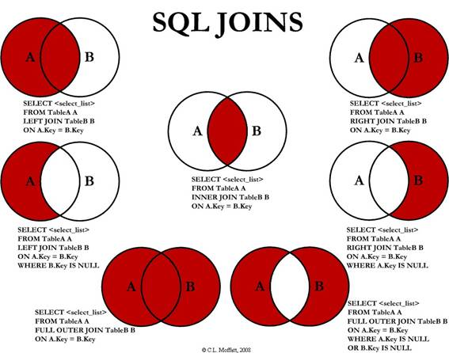

<h1 align="center">Joins</h1>

Agora vamos aprofundar ainda mais sobre Joins.

Muitos desenvolvedores têm a dificuldade de saber qual resultado é retornado por cada join no SQL e, portanto, quando devem utilizar cada um. Para facilitar esse entendimento, a Figura abaixo traz uma representação gráfica, baseada na Teoria dos Conjuntos, muito conhecida na matemática. Nessa imagem, temos a representação de duas tabelas (A e B) e o resultado esperado por cada tipo de join (a área em vermelho representa os registros retornados pela consulta).

Nesse artigo analisaremos cada join individualmente, bom base em exemplos, e veremos seus resultados. Assim, podemos comparar seu funcionamento e decidir quando devemos usar cada um.

<h2 align="center">Preparando o Ambiente de Testes</h2>

Para demonstrar o funcionamento dos métodos de junção (joins), precisaremos criar duas tabelas entre as quais deve haver algum relacionamento para que possamos "cruzar" os dados. Como o objetivo aqui não é concentrar em boas práticas, modelagem ou normalização, criaremos apenas duas tabelas contendo uma coluna Nome, que será comum entre elas. O script abaixo cria essa estrutura.

<pre>
CREATE TABLE TabelaA(
  Nome varchar(50) NULL
)

GO

CREATE TABLE TabelaB(
  Nome varchar(50) NULL
)
</pre>

Em seguida, precisaremos adicionar nas tabelas recém criadas alguns dados que nos permitam colocar à prova as junções. Sendo assim, vamos inserir, com o script abaixo alguns registros de forma que haja nomes que estão presentes apenas em uma tabela, e também nomes que sejam comuns às duas.

<pre>
INSERT INTO TabelaA VALUES('Fernanda')
INSERT INTO TabelaA VALUES('Josefa')
INSERT INTO TabelaA VALUES('Luiz')
INSERT INTO TabelaA VALUES('Fernando')
</pre>
<pre>
INSERT INTO TabelaB VALUES('Carlos')
INSERT INTO TabelaB VALUES('Manoel')
INSERT INTO TabelaB VALUES('Luiz')
INSERT INTO TabelaB VALUES('Fernando')
</pre>
<h2 align="center">Inner Join</h2>

O Inner Join é o método de junção mais conhecido e, como ilustração abaixo, retorna os registros que são comuns às duas tabelas.

No script abaixo temos um exemplo de consulta com esse tipo de join, abaixo do nosso script podemos ver seu resultado.

<pre>
SELECT a.Nome, b.Nome
FROM TabelaA as A
INNER JOIN TabelaB as B
&emsp;&emsp;&emsp;&emsp;&emsp;&emsp;on a.Nome = b.Nome
</pre>

<h2 align="center">Left Join</h2>

O Left Join, cujo funcinamento é ilustrado na abaixo, tem como resultado todos os registros que estão na tabela A (mesmo que não estejam na tabela B) e os registros da tabela B que são comuns à tabela A.

Para compreender melhor seu uso, temos um exemplo no script abaixo, cujo resultado é apresentado abaixo de nosso script.

<pre>
SELECT a.Nome, b.Nome
FROM TabelaA as A
LEFT JOIN TabelaB as B
&emsp;&emsp;&emsp;&emsp;&emsp;&emsp;on a.Nome = b.Nome
</pre>

<h2 align="center">Right Join</h2>

Usando o Right Join, conforme mostra a imagem abaixo, teremos como resultado todos os registros que estão na tabela B (mesmo que não estejam na tabela A) e os registros da tabela A que são comuns à tabela B.

No script abaixo temos um exemplo desse tipo de consulta, e na imagem abaixo do nosso script vemos seu resultado.

<pre>
SELECT a.Nome, b.Nome
FROM TabelaA as A
RIGHT JOIN TabelaB as B
&emsp;&emsp;on a.Nome = b.Nome
</pre>

<h2 align="center">Outer Join</h2>

O Outer Join (também conhecido por Full Outer Join ou Full Join), conforme mostra na imagem abaixo, tem como resultado todos os registros que estão na tabela A e todos os registros da tabela B.

Para obter esse resultado, devemos executar a consulta seguindo a estrutura que é demonstrada no script abaixo, e cujo retorno é apresentado na imagem abaixo do script.

<pre>
SELECT a.Nome, b.Nome
FROM TabelaA as A
FULL OUTER JOIN TabelaB as B
&emsp;&emsp;on a.Nome = b.Nome
</pre>

Nesse código, a palavra reservada OUTER é opcional. Portanto, se a removermos, deixando apenas a expressão FULL JOIN, o resultado será o mesmo.

<h2 align="center">Left Excluding Join</h2>

Na imagem abaixo temos a representação gráfica do Left Excluding Join, que retorna como resultado todos os registros que estão na tabela A e que não estejam na tabela B.

Os comandos desse join podem ser vistos no script abaixo, e seu resultado é apresentado na imagem logo abaixo ao nosso script.

<pre>
SELECT a.Nome, b.Nome
FROM TabelaA as A
LEFT JOIN TabelaB as B
&emsp;&emsp;&emsp;&emsp;&emsp;&emsp;on a.Nome = b.Nome
WHERE b.Nome is null
</pre>

<h2 align="center">Right Excluding Join</h2>

O Right Excluding Join, como ilustra abaixo, retorna como resultado todos os registros que estão na tabela B e que não estejam na tabela A. Para vermos isso na prática, podemos executar os comandos do script abaixo. Como resultado, teremos os mesmos registros apresentados na imagem abaixo do script.

<pre>
SELECT a.Nome, b.Nome
FROM TabelaA as A
RIGHT JOIN TabelaB as B
&emsp;&emsp;on a.Nome = b.Nome
WHERE a.Nome is null
</pre>

<h2 align="center">Outer Excluding Join</h2>

Usando o Outer Excluding Join, conforme mostra abaixo, teremos como resultado todos os registros que estão na tabela B, mas que não estejam na tabela A, e todos os registros que estão na tabela A, mas que não estejam na tabela B.

O código abaixo mostra a sintaxe necessária para executar esse tipo de consulta. Nesse caso o termo OUTER é optativo e, se removido, deixando apenas FULL JOIN, o resultado será o mesmo.

<pre>
SELECT a.Nome, b.Nome
FROM TabelaA as A
FULL OUTER JOIN TabelaB as B
&emsp;&emsp;on a.Nome = b.Nome
WHERE a.Nome is null or b.Nome is null
</pre>

O resultado dessa consulta pode ser visto na imagem abaixo.

As cláusulas JOIN na linguagem SQL são extremamente úteis e utilizadas com muita frequência, portanto, seu conhecimento é fundamental para quem trabalha com bancos de dados relacionais com o <b>SQL Server, o MySQL, o Firebird, etc.</b>

<h2>Referencias</h2>

https://www.devmedia.com.br/sql-join-entenda-como-funciona-o-retorno-dos-dados/31006

