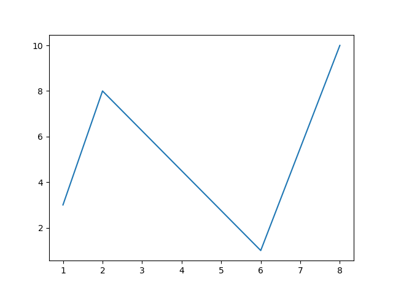
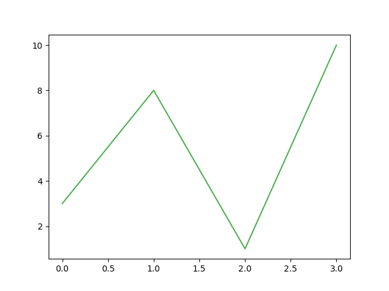
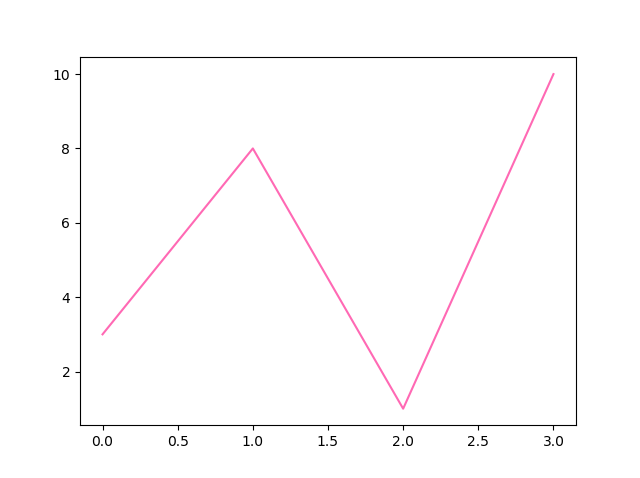
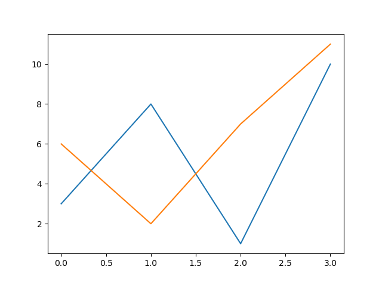
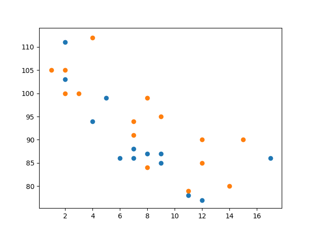
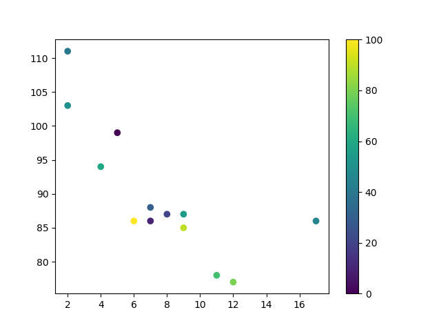
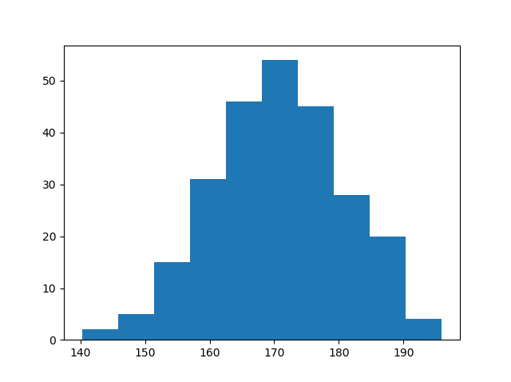

<h1 align="center">Gráficos Básicos com Matplotlib</h1>
<h1 align="center">Pyplot</h1>

A maioria das utilidades do Matplotlib está no submódulo pyplot e geralmente é importada com o apelido "plt":

<pre>
import matplotlib.pyplot as plt
</pre>

Agora, o pacote Pyplot pode ser referenciado como "plt".

<b>Exemplo:</b>

Agora usando o Pyplot desenhe uma linha em um diagrama da posição (0,0) até a posição (6,250):

<pre>
import matplotlib.pyplot as plt
import numpy as np

xpoints = np.array([0, 6])
ypoints = np.array([0, 250])

plt.plot(xpoints, ypoints)
plt.show()
</pre>

<b>Resultado:</b>

<h1 align="center">Plotting</h1>
<h2 align="center">Plotando pontos x e y</h2>

A função plot() é usada para desenhar pontos (marcadores) em um diagrama.

Por padrão, a função plot() desenha uma linha de ponto a ponto.

A função aceita parâmetros para especificar os pontos no diagrama.

O Parâmetro 1 é uma matriz(array) contendo os pontos no eixo x.

O Parâmetro 2 é uma matriz(array) contendo os pontos no eixo y.

Se precisarmos desenhar uma linha de (1, 3) para (8, 10), precisamos passar duas matrizes(array) [1, 8] e [3, 10] para a função plot.

<b>Exemplo:</b>

Desenhe uma linha em um diagrama da posição (1, 3) até a posição (8, 10):

<pre>
import matplotlib.pyplot as plt
import numpy as np

xpoints = np.array([1, 8])
ypoints = np.array([3, 10])

plt.plot(xpoints, ypoints)
plt.show()
</pre>

<b>Resultado:</b>

O <b>eixo x</b> é o eixo horizontal.

O <b>eixo y</b> é o eixo vertical.

<h2 align="center">Plotagem Sem Linha</h2>

Para plotar apenas os marcadores, você pode usar a notação de string abreviada 'o', que significa 'anéis'('rings').

<b>Exemplo:</b>

Desenhe dois pontos no diagrama, um na posição (1, 3) e outro na posição (8, 10):

<pre>
import matplotlib.pyplot as plt
import numpy as np

xpoints = np.array([1, 8])
ypoints = np.array([3, 10])

plt.plot(xpoints, ypoints, 'o')
plt.show()
</pre>

<b>Resultado:</b>

Você aprenderá mais sobre marcadores no próximo módulo: <b>2.Personalização e Anotações</b>.

<h2 align="center">Múltiplos Pontos</h2>

Você pode plotar quantos pontos desejar, apenas certifique-se de ter o mesmo número de pontos em ambos os eixos.

<b>Exemplo:</b>

Desenhe uma linha em um diagrama da posição (1, 3) até (2, 8), depois para (6, 1) e finalmente para a posição (8, 10):

<pre>
import matplotlib.pyplot as plt
import numpy as np

xpoints = np.array([1, 2, 6, 8])
ypoints = np.array([3, 8, 1, 10])

plt.plot(xpoints, ypoints)
plt.show()
</pre>

<b>Resultado:</b>

<h2 align="center">Padrão dos Pontos no Eixo X</h2>

Se não especificarmos os pontos no eixo x, eles receberão os valores padrão 0, 1, 2, 3 etc., dependendo do comprimento dos pontos no eixo y.

Portanto, se pegarmos o mesmo exemplo acima e deixarmos de fora os pontos no eixo x, o diagrama ficará assim:

<b>Exemplo:</b>

Plotagem sem pontos no eixo x:

<pre>
import matplotlib.pyplot as plt
import numpy as np

ypoints = np.array([3, 8, 1, 10, 5, 7])

plt.plot(ypoints)
plt.show()
</pre>

<b>Resultado:</b>

Os pontos no eixo x no exemplo acima são [0, 1, 2, 3, 4, 5].

<h1 align="center">Gráficos de Linha (Line Plots)</h1>
<h2 align="center">Estilo da linha (Linestyle)</h2>

Você pode usar o argumento de palavra-chave "linestyle" ou a abreviação "ls" para alterar o estilo da linha plotada:

<b>Exemplo:</b>

Use uma linha pontilhada:

<pre>
import matplotlib.pyplot as plt
import numpy as np

ypoints = np.array([3, 8, 1, 10])

plt.plot(ypoints, linestyle = 'dotted')
plt.show()
</pre>

<b>Resultado:</b>

<b>Exemplo:</b>

Use uma linha tracejada:

<pre>
plt.plot(ypoints, linestyle = 'dashed')
</pre>

<b>Resultado:</b>

You can choose any of these styles:

<table>
  <tr>
    <th>Estilo</th>
    <th>Ou</th>
  </tr>
  <tr>
    <td>'solid' (Sólido)</td>
    <td>'-'</td>
  </tr>
  <tr>
    <td>'dotted' (Pontilhado)</td>
    <td>':'</td>
  </tr>
  <tr>
    <td>'dashed' ('tracejado')</td>
    <td>'--'</td>
  </tr>
  <tr>
    <td>'dashdot' ('tracejado-ponto')</td>
    <td>'-.'</td>
  </tr>
  <tr>
    <td>'None' ('Nenhum')</td>
    <td>'' ou ' '</td>
  </tr>
</table>
<h2 align="center">Sintaxe Abreviada (Shorter Syntax)</h2>

O estilo da linha pode ser escrito em uma sintaxe mais curta:

"linestyle" pode ser escrito como "ls".

"dotted" pode ser escrito como ":".

"dashed" pode ser escrito como "--".

<b>Exemplo:</b>

Sintaxe mais curta:

<pre>
plt.plot(ypoints, ls = ':')
</pre>

<b>Resultado:</b>

<h2 align="center">Cor da Linha (Line Color)</h2>

Você pode usar o argumento de palavra-chave "color" ou a abreviação "c" para definir a cor da linha:

<b>Exemplo:</b>

Defina a cor da linha como vermelho:

<pre>
import matplotlib.pyplot as plt
import numpy as np

ypoints = np.array([3, 8, 1, 10])

plt.plot(ypoints, color = 'r')
plt.show()
</pre>

<b>Resultado:</b>

Você também pode usar <a href="https://www.w3schools.com/colors/colors_hexadecimal.asp">valores de cor hexadecimal:</a>

<b>Exemplo:</b>

Traçar com uma linda linha verde:

<pre>
...
plt.plot(ypoints, c = '#4CAF50')
...
</pre>

<b>Resultado:</b>

Ou qualquer um dos <a href="https://www.w3schools.com/colors/colors_names.asp">140 nomes de cores suportados.</a>

<b>Exemplo:</b>

Traçar com a cor chamada "hotpink":

<pre>
...
plt.plot(ypoints, c = 'hotpink')
...
</pre>

<b>Resultado:</b>

<h2 align="center">Largura da Linha (Line Width)</h2>

Você pode usar o argumento de palavra-chave linewidth ou a abreviação lw para alterar a largura da linha.

O valor é um número flutuante, em pontos:

<b>Exemplo:</b>

Desenhe uma linha larga de 20,5 pontos:

<pre>
import matplotlib.pyplot as plt
import numpy as np

ypoints = np.array([3, 8, 1, 10])

plt.plot(ypoints, linewidth = '20.5')
plt.show()
</pre>

<b>Resultado:</b>

<h2 align="center">Múltiplas Linhas (Multiple Lines)</h2>

Você pode plotar quantas linhas desejar, simplesmente adicionando mais funções plt.plot():

<b>Exemplo:</b>

Desenhe duas linhas especificando uma função plt.plot() para cada linha:

<pre>
import matplotlib.pyplot as plt
import numpy as np

y1 = np.array([3, 8, 1, 10])
y2 = np.array([6, 2, 7, 11])

plt.plot(y1)
plt.plot(y2)

plt.show()
</pre>

<b>Resultado:</b>

Você também pode plotar muitas linhas adicionando os pontos para o eixo x e y para cada linha na mesma função plt.plot().

(Nos exemplos acima, especificamos apenas os pontos no eixo y, o que significa que os pontos no eixo x receberam os valores padrão (0, 1, 2, 3).)

Os valores de x e y são fornecidos em pares:

<b>Exemplo:</b>

Desenhe duas linhas especificando os valores dos pontos x e y para ambas as linhas:

<pre>
import matplotlib.pyplot as plt
import numpy as np

x1 = np.array([0, 1, 2, 3])
y1 = np.array([3, 8, 1, 10])
x2 = np.array([0, 1, 2, 3])
y2 = np.array([6, 2, 7, 11])

plt.plot(x1, y1, x2, y2)
plt.show()
</pre>

<b>Resultado:</b>

<h1 align="center">Gráficos de Dispersão (Scatter Plots)</h1>
<h2 align="center">Criando Gráficos de Dispersão (Scatter Plots)</h2>

Com o Pyplot, você pode usar a função scatter() para desenhar um gráfico de dispersão.

A função scatter() representa um ponto para cada observação. Ela requer dois arrays de comprimento igual, um para os valores do eixo x e outro para os valores no eixo y:

<b>Exemplo:</b>

Um gráfico de dispersão simples:

<pre>
import matplotlib.pyplot as plt
import numpy as np

x = np.array([5,7,8,7,2,17,2,9,4,11,12,9,6])
y = np.array([99,86,87,88,111,86,103,87,94,78,77,85,86])

plt.scatter(x, y)
plt.show()
</pre>

<b>Resultado:</b>

A observação no exemplo acima é o resultado de 13 carros passando.

O eixo X mostra a idade do carro.

O eixo Y mostra a velocidade do carro ao passar.

Existem alguma relação entre as observações?

Parece que quanto mais novo o carro, mais rápido ele anda, mas isso poderia ser uma coincidência, afinal, só registramos 13 carros.

<h2 align="center">Comparar Gráficos</h2>

No exemplo acima, parece haver uma relação entre a velocidade e a idade, mas e se plotarmos as observações de outro dia também? O gráfico de dispersão nos dirá algo diferente?

<b>Exemplo:</b>

Desenhe dois gráficos na mesma figura:

<pre>
import matplotlib.pyplot as plt
import numpy as np

#day one, the age and speed of 13 cars:
x = np.array([5,7,8,7,2,17,2,9,4,11,12,9,6])
y = np.array([99,86,87,88,111,86,103,87,94,78,77,85,86])
plt.scatter(x, y)

#day two, the age and speed of 15 cars:
x = np.array([2,2,8,1,15,8,12,9,7,3,11,4,7,14,12])
y = np.array([100,105,84,105,90,99,90,95,94,100,79,112,91,80,85])
plt.scatter(x, y)

plt.show()
</pre>

<b>Resultado:</b>

<b>Observação:</b> Os dois gráficos são plotados com cores diferentes, por padrão azul e laranja. Você aprenderá a alterar as cores mais tarde neste capítulo.

Comparando os dois gráficos, acredito que é seguro dizer que ambos nos dão a mesma conclusão: quanto mais novo o carro, mais rápido ele anda.

<h2 align="center">Cores</h2>

Comparando os dois gráficos, acredito que é seguro dizer que ambos nos dão a mesma conclusão: quanto mais novo o carro, mais rápido ele anda.

<b>Exemplo:</b>

Defina sua própria cor para os marcadores:

<pre>
import matplotlib.pyplot as plt
import numpy as np

x = np.array([5,7,8,7,2,17,2,9,4,11,12,9,6])
y = np.array([99,86,87,88,111,86,103,87,94,78,77,85,86])
plt.scatter(x, y, color = 'hotpink')

x = np.array([2,2,8,1,15,8,12,9,7,3,11,4,7,14,12])
y = np.array([100,105,84,105,90,99,90,95,94,100,79,112,91,80,85])
plt.scatter(x, y, color = '#88c999')

plt.show()
</pre>

<b>Resultado:</b>

<h2 align="center">Colorir Cada Ponto</h2>

Você pode até definir uma cor específica para cada ponto usando um array de cores como valor para o argumento c:

<b>Observação: </b>Você não pode usar o argumento color para isso, apenas o argumento c.

<b>Exemplo:</b>

Defina sua própria cor para os marcadores:

<pre>
import matplotlib.pyplot as plt
import numpy as np

x = np.array([5,7,8,7,2,17,2,9,4,11,12,9,6])
y = np.array([99,86,87,88,111,86,103,87,94,78,77,85,86])
colors = np.array(["red","green","blue","yellow","pink","black","orange","purple","beige","brown","gray","cyan","magenta"])

plt.scatter(x, y, c=colors)

plt.show()
</pre>

<b>Resultado:</b>

<h2 align="center">Mapa de Cores</h2>

O módulo Matplotlib possui vários mapas de cores disponíveis.

Um mapa de cores é como uma lista de cores, onde cada cor possui um valor que varia de 0 a 100.

Aqui está um exemplo de um mapa de cores:

Este mapa de cores é chamado 'viridis' e, como você pode ver, varia de 0, que é uma cor roxa, até 100, que é uma cor amarela.

<h3 align="center">Como Usar o Mapa de Cores</h3>

Você pode especificar o mapa de cores com o argumento de palavra-chave cmap com o valor do mapa de cores, neste caso 'viridis', que é um dos mapas de cores incorporados disponíveis no Matplotlib.

Além disso, você deve criar um array com valores (de 0 a 100), um valor para cada ponto no gráfico de dispersão:

<b>Exemplo:</b>

Crie um array de cores e especifique um mapa de cores no gráfico de dispersão:

<pre>
import matplotlib.pyplot as plt
import numpy as np

x = np.array([5,7,8,7,2,17,2,9,4,11,12,9,6])
y = np.array([99,86,87,88,111,86,103,87,94,78,77,85,86])
colors = np.array([0, 10, 20, 30, 40, 45, 50, 55, 60, 70, 80, 90, 100])

plt.scatter(x, y, c=colors, cmap='viridis')

plt.show()
</pre>

<b>Resultado:</b>

Você pode incluir o mapa de cores no desenho incluindo a declaração plt.colorbar():

<b>Exemplo:</b>

Inclua o mapa de cores real:

<pre>
import matplotlib.pyplot as plt
import numpy as np

x = np.array([5,7,8,7,2,17,2,9,4,11,12,9,6])
y = np.array([99,86,87,88,111,86,103,87,94,78,77,85,86])
colors = np.array([0, 10, 20, 30, 40, 45, 50, 55, 60, 70, 80, 90, 100])

plt.scatter(x, y, c=colors, cmap='viridis')

plt.colorbar()

plt.show()
</pre>

<b>Resultado:</b>

<h3 align="center">Mapas de Cores Disponíveis</h3>

Você pode escolher qualquer um dos mapas de cores incorporados:

<table>
  <tr>
    <th>Name</th>
    <th>Reverse</th>
  </tr>
  <tr>
    <td>Accent</td>
    <td>Accent_r</td>
  </tr>
  <tr>
    <td>Blues</td>
    <td>Blues_r</td>
  </tr>
  <tr>
    <td>BrBG</td>
    <td>BrBG_r</td>
  </tr>
  <tr>
    <td>BuGn</td>
    <td>BuGn_r</td>
  </tr>
  <tr>
    <td>BuPu</td>
    <td>BuPu_r</td>
  </tr>
  <tr>
    <td>BuGn</td>
    <td>BuGn_r</td>
  </tr>
  <tr>
    <td>CMRmap</td>
    <td>CMRmap_r</td>
  </tr>
  <tr>
    <td>Dark2</td>
    <td>Dark2_r</td>
  </tr>
  <tr>
    <td>GnBu</td>
    <td>GnBu_r</td>
  </tr>
  <tr>
    <td>Greens</td>
    <td>Greens_r</td>
  </tr>
  <tr>
    <td>Greys</td>
    <td>Greys_r</td>
  </tr>
  <tr>
    <td>OrRd</td>
    <td>OrRd_r</td>
  </tr>
  <tr>
    <td>Oranges</td>
    <td>Oranges_r</td>
  </tr>
  <tr>
    <td>PRGn</td>
    <td>PRGn_r</td>
  </tr>
  <tr>
    <td>Paired</td>
    <td>Paired_r</td>
  </tr>
  <tr>
    <td>Pastel1</td>
    <td>Pastel1_r</td>
  </tr>
  <tr>
    <td>BuGn</td>
    <td>BuGn_r</td>
  </tr>
  <tr>
    <td>Pastel2</td>
    <td>Pastel2_r</td>
  </tr>
  <tr>
    <td>PiYG</td>
    <td>PiYG_r</td>
  </tr>
  <tr>
    <td>PuBu</td>
    <td>PuBu_r</td>
  </tr>
  <tr>
    <td>PuBuGn</td>
    <td>PuBuGn_r</td>
  </tr>
  <tr>
    <td>PuOr</td>
    <td>PuOr_r</td>
  </tr>
  <tr>
    <td>PuRd</td>
    <td>PuRd_r</td>
  </tr>
  <tr>
    <td>Purples</td>
    <td>Purples_r</td>
  </tr>
  <tr>
    <td>RdBu</td>
    <td>RdBu_r</td>
  </tr>
  <tr>
    <td>RdGy</td>
    <td>RdGy_r</td>
  </tr>
  <tr>
    <td>RdPu</td>
    <td>RdPu_r</td>
  </tr>
  <tr>
    <td>RdYlBu</td>
    <td>RdYlBu_r</td>
  </tr>
  <tr>
    <td>RdYlGn</td>
    <td>RdYlGn_r</td>
  </tr>
  <tr>
    <td>Reds</td>
    <td>Reds_r</td>
  </tr>
  <tr>
    <td>Set1</td>
    <td>Set1_r</td>
  </tr>
  <tr>
    <td>Set2</td>
    <td>Set2_r</td>
  </tr>
  <tr>
    <td>Set3</td>
    <td>Set3_r</td>
  </tr>
  <tr>
    <td>Spectral</td>
    <td>Spectral_r</td>
  </tr>
  <tr>
    <td>Wistia</td>
    <td>Wistia_r</td>
  </tr>
  <tr>
    <td>YlGn</td>
    <td>YlGn_r</td>
  </tr>
  <tr>
    <td>YlGnBu</td>
    <td>YlGnBu_r</td>
  </tr>
  <tr>
    <td>YlOrBr</td>
    <td>YlOrBr_r</td>
  </tr>
  <tr>
    <td>YlOrRd</td>
    <td>YlOrRd_r</td>
  </tr>
  <tr>
    <td>afmhot</td>
    <td>afmhot_r</td>
  </tr>
  <tr>
    <td>autumn</td>
    <td>autumn_r</td>
  </tr>
  <tr>
    <td>binary</td>
    <td>binary_r</td>
  </tr>
  <tr>
    <td>bone</td>
    <td>bone_r</td>
  </tr>
  <tr>
    <td>brg</td>
    <td>brg_r</td>
  </tr>
  <tr>
    <td>bwr</td>
    <td>bwr_r</td>
  </tr>
  <tr>
    <td>cividis</td>
    <td>cividis_r</td>
  </tr>
  <tr>
    <td>cool</td>
    <td>cool_r</td>
  </tr>
  <tr>
    <td>coolwarm</td>
    <td>coolwarm_r</td>
  </tr>
  <tr>
    <td>copper</td>
    <td>copper_r</td>
  </tr>
  <tr>
    <td>cubehelix</td>
    <td>cubehelix_r</td>
  </tr>
  <tr>
    <td>flag</td>
    <td>flag_r</td>
  </tr>
  <tr>
    <td>gist_earth</td>
    <td>gist_earth_r</td>
  </tr>
  <tr>
    <td>gist_gray</td>
    <td>gist_gray_r</td>
  </tr>
  <tr>
    <td>gist_heat</td>
    <td>gist_heat_r</td>
  </tr>
  <tr>
    <td>gist_ncar</td>
    <td>gist_ncar_r</td>
  </tr>
  <tr>
    <td>gist_rainbow</td>
    <td>gist_rainbow_r</td>
  </tr>
  <tr>
    <td>gist_stern</td>
    <td>gist_stern_r</td>
  </tr>
  <tr>
    <td>gist_yarg</td>
    <td>gist_yarg_r</td>
  </tr>
  <tr>
    <td>gnuplot</td>
    <td>gnuplot_r</td>
  </tr>
  <tr>
    <td>gnuplot2</td>
    <td>gnuplot2_r</td>
  </tr>
  <tr>
    <td>gray</td>
    <td>gray_r</td>
  </tr>
  <tr>
    <td>hot</td>
    <td>hot_r</td>
  </tr>
  <tr>
    <td>hsv</td>
    <td>hsv_r</td>
  </tr>
  <tr>
    <td>inferno</td>
    <td>inferno_r</td>
  </tr>
  <tr>
    <td>jet</td>
    <td>jet_r</td>
  </tr>
  <tr>
    <td>magma</td>
    <td>magma_r</td>
  </tr>
  <tr>
    <td>nipy_spectral</td>
    <td>nipy_spectral_r</td>
  </tr>
  <tr>
    <td>ocean</td>
    <td>ocean_r</td>
  </tr>
  <tr>
    <td>pink</td>
    <td>pink_r</td>
  </tr>
  <tr>
    <td>plasma</td>
    <td>plasma_r</td>
  </tr>
  <tr>
    <td>prism</td>
    <td>prism_r</td>
  </tr>
  <tr>
    <td>rainbow</td>
    <td>rainbow_r</td>
  </tr>
  <tr>
    <td>seismic</td>
    <td>seismic_r</td>
  </tr>
  <tr>
    <td>spring</td>
    <td>spring_r</td>
  </tr>
  <tr>
    <td>summer</td>
    <td>summer_r</td>
  </tr>
  <tr>
    <td>tab10</td>
    <td>tab10_r</td>
  </tr>
  <tr>
    <td>tab20</td>
    <td>tab20_r</td>
  </tr>
  <tr>
    <td>tab20b</td>
    <td>tab20b_r</td>
  </tr>
  <tr>
    <td>tab20c</td>
    <td>tab20c_r</td>
  </tr>
  <tr>
    <td>terrain</td>
    <td>terrain_r</td>
  </tr>
  <tr>
    <td>twilight</td>
    <td>twilight_r</td>
  </tr>
  <tr>
    <td>twilight_shifted</td>
    <td>twilight_shifted_r</td>
  </tr>
  <tr>
    <td>viridis</td>
    <td>viridis_r</td>
  </tr>
  <tr>
    <td>winter</td>
    <td>winter_r</td>
  </tr>
</table>
<h2 align="center">Tamanho</h2>

Você pode alterar o tamanho dos pontos com o argumento s.

Assim como as cores, certifique-se de que o array de tamanhos tenha o mesmo comprimento dos arrays para os eixos x e y:

<b>Exemplo:</b>

Defina o seu próprio tamanho para os marcadores:

<pre>
import matplotlib.pyplot as plt
import numpy as np

x = np.array([5,7,8,7,2,17,2,9,4,11,12,9,6])
y = np.array([99,86,87,88,111,86,103,87,94,78,77,85,86])
sizes = np.array([20,50,100,200,500,1000,60,90,10,300,600,800,75])

plt.scatter(x, y, s=sizes)

plt.show()
</pre>

<b>Resultado:</b>

<h2 align="center">Alfa (Alpha)</h2>

Você pode ajustar a transparência dos pontos com o argumento alfa.

Assim como as cores, certifique-se de que o array de tamanhos tenha o mesmo comprimento dos arrays para os eixos x e y:

<b>Exemplo:</b>

Defina a sua própria transparência para os marcadores:

<pre>
import matplotlib.pyplot as plt
import numpy as np

x = np.array([5,7,8,7,2,17,2,9,4,11,12,9,6])
y = np.array([99,86,87,88,111,86,103,87,94,78,77,85,86])
sizes = np.array([20,50,100,200,500,1000,60,90,10,300,600,800,75])

plt.scatter(x, y, s=sizes, alpha=0.5)

plt.show()
</pre>

<b>Resultado:</b>

<h2 align="center">Combine Cor, Tamanho e Alfa</h2>

Você pode combinar um mapa de cores com diferentes tamanhos dos pontos. Isso é melhor visualizado se os pontos forem transparentes:

<b>Exemplo:</b>

Crie arrays aleatórios com 100 valores para os pontos x, pontos y, cores e tamanhos:

<pre>
import matplotlib.pyplot as plt
import numpy as np

x = np.random.randint(100, size=(100))
y = np.random.randint(100, size=(100))
colors = np.random.randint(100, size=(100))
sizes = 10 * np.random.randint(100, size=(100))

plt.scatter(x, y, c=colors, s=sizes, alpha=0.5, cmap='nipy_spectral')

plt.colorbar()

plt.show()
</pre>

<b>Resultado:</b>

<h1 align="center">Gráficos de Barras (Bar Plots)</h1>
<h2 align="center">Criando Gráficos de Barras (Bar Plots)</h2>

Com Pyplot, você pode usar a função bar() para desenhar gráficos de barras:

<b>Exemplo:</b>

Desenhe 4 barras:

<pre>
import matplotlib.pyplot as plt
import numpy as np

x = np.array(["A", "B", "C", "D"])
y = np.array([3, 8, 1, 10])

plt.bar(x,y)
plt.show()
</pre>

<b>Resultado:</b>

A função bar() aceita argumentos que descrevem o layout das barras.

As categorias e seus valores são representados pelo primeiro e segundo argumentos como arrays.

<b>Exemplo:</b>

<pre>
x = ["APPLES", "BANANAS"]
y = [400, 350]
plt.bar(x, y)
</pre>
<h2 align="center">Barras Horizontais</h2>

Se você deseja que as barras sejam exibidas horizontalmente em vez de verticalmente, use a função barh():

<b>Exemplo:</b>

Desenhe 4 barras horizontais:

<pre>
import matplotlib.pyplot as plt
import numpy as np

x = np.array(["A", "B", "C", "D"])
y = np.array([3, 8, 1, 10])

plt.barh(x, y)
plt.show()
</pre>

<b>Resultado:</b>

<h2 align="center">Cor das Barras</h2>

As funções bar() e barh() aceitam o argumento de palavra-chave color para definir a cor das barras:

<b>Exemplo:</b>

Desenhe 4 barras vermelhas:

<pre>
import matplotlib.pyplot as plt
import numpy as np

x = np.array(["A", "B", "C", "D"])
y = np.array([3, 8, 1, 10])

plt.bar(x, y, color = "red")
plt.show()
</pre>

<b>Resultado:</b>

<h2 align="center">Nomes das Cores</h2>

Você pode usar qualquer um dos 140 nomes de cores suportados.

<b>Exemplo:</b>

Desenhe 4 barras "rosa quente":

<pre>
import matplotlib.pyplot as plt
import numpy as np

x = np.array(["A", "B", "C", "D"])
y = np.array([3, 8, 1, 10])

plt.bar(x, y, color = "hotpink")
plt.show()
</pre>

<b>Resultado:</b>

<h2 align="center">Cores em Hexadecimal</h2>

Ou você pode usar valores de cores em hexadecimal:

<b>Exemplo:</b>

Desenhe 4 barras com uma bela cor verde:

<pre>
import matplotlib.pyplot as plt
import numpy as np

x = np.array(["A", "B", "C", "D"])
y = np.array([3, 8, 1, 10])

plt.bar(x, y, color = "#4CAF50")
plt.show()
</pre>

<b>Resultado:</b>

<h2 align="center">Largura das Barras</h2>

A função bar() aceita o argumento de palavra-chave width para definir a largura das barras:

<b>Exemplo:</b>

Desenhe 4 barras muito finas:

<pre>
import matplotlib.pyplot as plt
import numpy as np

x = np.array(["A", "B", "C", "D"])
y = np.array([3, 8, 1, 10])

plt.bar(x, y, width = 0.1)
plt.show()
</pre>

<b>Resultado:</b>

O valor padrão de largura é 0.8

<b>Observação:</b> Para barras horizontais, use height em vez de width.

<h2 align="center">Altura das Barras</h2>

A função barh() aceita o argumento de palavra-chave height para definir a altura das barras:

<b>Exemplo:</b>

Desenhe 4 barras muito finas:

<pre>
import matplotlib.pyplot as plt
import numpy as np

x = np.array(["A", "B", "C", "D"])
y = np.array([3, 8, 1, 10])

plt.barh(x, y, height = 0.1)
plt.show()
</pre>

<b>Resultado:</b>

O valor padrão de altura é 0.8

<h1 align="center">Histogramas (Histograms)</h1>
<h2 align="center">Histograma (Histogram)</h2>

Um histograma é um gráfico que mostra a distribuição de frequência.

É um gráfico que mostra o número de observações em cada intervalo dado.

Exemplo: Digamos que você pergunte a altura de 250 pessoas, você pode acabar com um histograma como este:

Você pode ler no histograma que existem aproximadamente:

2 pessoas de 140 a 145cm

5 pessoas de 145 a 150cm

15 pessoas de 151 a 156cm

31 pessoas de 157 a 162cm

46 pessoas de 163 a 168cm

53 pessoas de 168 a 173cm

45 pessoas de 173 a 178cm

28 pessoas de 179 a 184cm

21 pessoas de 185 a 190cm

4 pessoas de 190 a 195cm

<h2 align="center">Criar um Histograma</h2>

No Matplotlib, usamos a função hist() para criar histogramas.

A função hist() usará uma matriz de números para criar um histograma, e a matriz é enviada para a função como argumento.

Para simplificar, usamos o NumPy para gerar aleatoriamente uma matriz com 250 valores, onde os valores se concentram em torno de 170 e o desvio padrão é 10.

<b>Exemplo:</b>

Uma Distribuição de Dados Normal pelo NumPy:

<pre>
import numpy as np

x = np.random.normal(170, 10, 250)

print(x)
</pre>

<b>Resultado:</b>

Isso gerará um resultado aleatório e pode se parecer com isso:

<pre>
[167.62255766 175.32495609 152.84661337 165.50264047 163.17457988
 162.29867872 172.83638413 168.67303667 164.57361342 180.81120541
 170.57782187 167.53075749 176.15356275 176.95378312 158.4125473
 187.8842668  159.03730075 166.69284332 160.73882029 152.22378865
 164.01255164 163.95288674 176.58146832 173.19849526 169.40206527
 166.88861903 149.90348576 148.39039643 177.90349066 166.72462233
 177.44776004 170.93335636 173.26312881 174.76534435 162.28791953
 166.77301551 160.53785202 170.67972019 159.11594186 165.36992993
 178.38979253 171.52158489 173.32636678 159.63894401 151.95735707
 175.71274153 165.00458544 164.80607211 177.50988211 149.28106703
 179.43586267 181.98365273 170.98196794 179.1093176  176.91855744
 168.32092784 162.33939782 165.18364866 160.52300507 174.14316386
 163.01947601 172.01767945 173.33491959 169.75842718 198.04834503
 192.82490521 164.54557943 206.36247244 165.47748898 195.26377975
 164.37569092 156.15175531 162.15564208 179.34100362 167.22138242
 147.23667125 162.86940215 167.84986671 172.99302505 166.77279814
 196.6137667  159.79012341 166.5840824  170.68645637 165.62204521
 174.5559345  165.0079216  187.92545129 166.86186393 179.78383824
 161.0973573  167.44890343 157.38075812 151.35412246 171.3107829
 162.57149341 182.49985133 163.24700057 168.72639903 169.05309467
 167.19232875 161.06405208 176.87667712 165.48750185 179.68799986
 158.7913483  170.22465411 182.66432721 173.5675715  176.85646836
 157.31299754 174.88959677 183.78323508 174.36814558 182.55474697
 180.03359793 180.53094948 161.09560099 172.29179934 161.22665588
 171.88382477 159.04626132 169.43886536 163.75793589 157.73710983
 174.68921523 176.19843414 167.39315397 181.17128255 174.2674597
 186.05053154 177.06516302 171.78523683 166.14875436 163.31607668
 174.01429569 194.98819875 169.75129209 164.25748789 180.25773528
 170.44784934 157.81966006 171.33315907 174.71390637 160.55423274
 163.92896899 177.29159542 168.30674234 165.42853878 176.46256226
 162.61719142 166.60810831 165.83648812 184.83238352 188.99833856
 161.3054697  175.30396693 175.28109026 171.54765201 162.08762813
 164.53011089 189.86213299 170.83784593 163.25869004 198.68079225
 166.95154328 152.03381334 152.25444225 149.75522816 161.79200594
 162.13535052 183.37298831 165.40405341 155.59224806 172.68678385
 179.35359654 174.19668349 163.46176882 168.26621173 162.97527574
 192.80170974 151.29673582 178.65251432 163.17266558 165.11172588
 183.11107905 169.69556831 166.35149789 178.74419135 166.28562032
 169.96465166 178.24368042 175.3035525  170.16496554 158.80682882
 187.10006553 178.90542991 171.65790645 183.19289193 168.17446717
 155.84544031 177.96091745 186.28887898 187.89867406 163.26716924
 169.71242393 152.9410412  158.68101969 171.12655559 178.1482624
 187.45272185 173.02872935 163.8047623  169.95676819 179.36887054
 157.01955088 185.58143864 170.19037101 157.221245   168.90639755
 178.7045601  168.64074373 172.37416382 165.61890535 163.40873027
 168.98683006 149.48186389 172.20815568 172.82947206 173.71584064
 189.42642762 172.79575803 177.00005573 169.24498561 171.55576698
 161.36400372 176.47928342 163.02642822 165.09656415 186.70951892
 153.27990317 165.59289527 180.34566865 189.19506385 183.10723435
 173.48070474 170.28701875 157.24642079 157.9096498  176.4248199 ]
</pre>

A função hist() lerá a matriz e produzirá um histograma:

<b>Exemplo:</b>

Um histograma simples:

<pre>
import matplotlib.pyplot as plt
import numpy as np

x = np.random.normal(170, 10, 250)

plt.hist(x)
plt.show() 
</pre>

<b>Resultado:</b>

<h2 align="center">Refêrencias</h2>

https://www.w3schools.com/python/matplotlib_bars.asp

https://www.w3schools.com/python/matplotlib_plotting.asp

https://www.w3schools.com/python/matplotlib_line.asp

https://www.w3schools.com/python/matplotlib_scatter.asp

https://www.w3schools.com/python/matplotlib_histograms.asp

