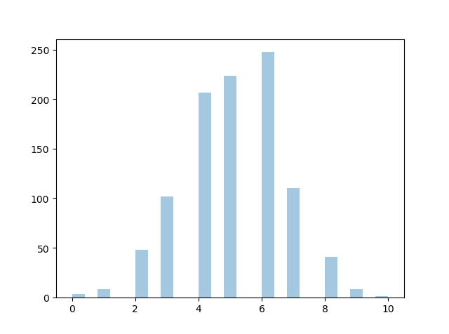
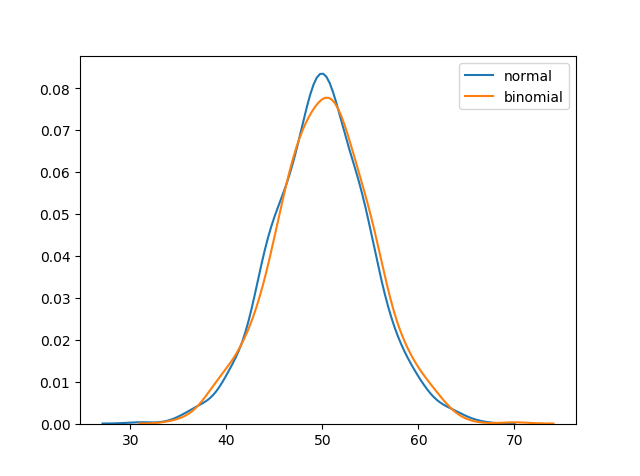

<h1 align="center">Distribuições Fundamentais</h1>
<h1 align="center">Distribuição (Gaussiana) Normal</h1>

A Distribuição Normal é uma das distribuições mais importantes.

Também é chamada de Distribuição Gaussiana em homenagem ao matemático alemão Carl Friedrich Gauss.

Ela se ajusta à distribuição de probabilidade de muitos eventos, como Pontuações de QI, Batimentos Cardíacos, etc.

Use o método random.normal() para obter uma Distribuição de Dados Normal.

Ela possui três parâmetros:

<ul>
  <li><b>loc</b> - (Média) onde o pico do sino se encontra.</li>
  <li><b>scale</b> - (Desvio Padrão) o quão achatada a distribuição gráfica deve ser.</li>
  <li><b>size</b> - A forma do array retornado.</li>
</ul>

<b>Exemplo:</b>

Gere uma distribuição normal aleatória de tamanho 2x3:

<pre>
from numpy import random

x = random.normal(size=(2, 3))

print(x)
</pre>

<b>Exemplo:</b>

Gere uma distribuição normal aleatória de tamanho 2x3 com média 1 e desvio padrão de 2:

<pre>
from numpy import random

x = random.normal(loc=1, scale=2, size=(2, 3))

print(x)
</pre>
<h2 align="center">Visualização de uma Distribuição Normal</h2>

<b>Exemplo:</b>

<pre>
from numpy import random
import matplotlib.pyplot as plt
import seaborn as sns

sns.distplot(random.normal(size=1000), hist=False)

plt.show()
</pre>

<b>Resultado:</b>

<b>Observação:</b> A curva de uma Distribuição Normal também é conhecida como a Curva em Forma de Sino devido à sua forma de sino.

<h1 align="center">Distribuição Binomial</h1>

A Distribuição Binomial é uma Distribuição Discreta.

Ela descreve o resultado de cenários binários, por exemplo, o lançamento de uma moeda, que resultará em cabeça ou coroa.

Ela possui três parâmetros:

<ul>
  <li><b>n</b> - número de tentativas.</li>
  <li><b>p</b> - probabilidade de ocorrência de cada tentativa (por exemplo, para o lançamento de uma moeda, 0.5 cada).</li>
  <li><b>size</b> - A forma do array retornado.</li>
</ul>

<b>Distribuição Discreta:</b> A distribuição é definida em um conjunto separado de eventos, por exemplo, o resultado do lançamento de uma moeda é discreto, pois pode ser apenas cabeça ou coroa, enquanto a altura das pessoas é contínua, pois pode ser 170, 170,1, 170,11 e assim por diante.

<b>Exemplo:</b>

Dado 10 tentativas de lançamento de moeda, gere 10 pontos de dados:

<pre>
from numpy import random

x = random.binomial(n=10, p=0.5, size=10)

print(x)
</pre>
<h2 align="center">Visualização da Distribuição Binomial</h2>

<b>Exemplo:</b>

<pre>
from numpy import random
import matplotlib.pyplot as plt
import seaborn as sns

sns.distplot(random.binomial(n=10, p=0.5, size=1000), hist=True, kde=False)

plt.show()
</pre>

<b>Resultado:</b>

<h2 align="center">Diferença Entre Distribuição Normal e Binomial</h2>

A principal diferença é que a distribuição normal é contínua, enquanto a binomial é discreta, mas se houver dados suficientes, ela será bastante semelhante à distribuição normal com determinados loc e escala.

<b>Exemplo:</b>

<pre>
from numpy import random
import matplotlib.pyplot as plt
import seaborn as sns

sns.distplot(random.normal(loc=50, scale=5, size=1000), hist=False, label='normal')
sns.distplot(random.binomial(n=100, p=0.5, size=1000), hist=False, label='binomial')

plt.show()
</pre>

<b>Resultado:</b>

