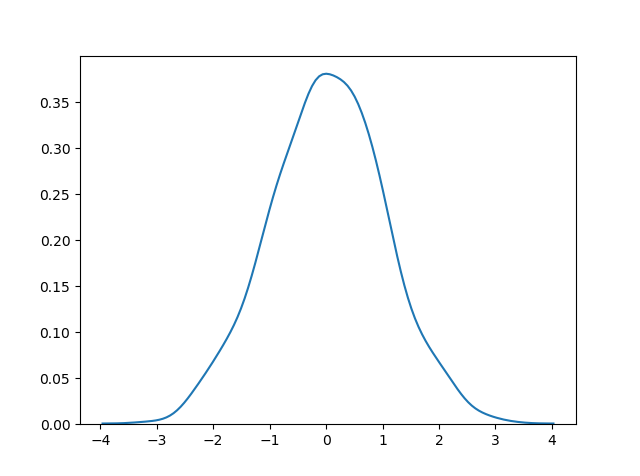

<h1 align="center">Distribuições Fundamentais</h1>
<h1 align="center">Distribuição (Gaussiana) Normal</h1>

A Distribuição Normal é uma das distribuições mais importantes.

Também é chamada de Distribuição Gaussiana em homenagem ao matemático alemão Carl Friedrich Gauss.

Ela se ajusta à distribuição de probabilidade de muitos eventos, como Pontuações de QI, Batimentos Cardíacos, etc.

Use o método random.normal() para obter uma Distribuição de Dados Normal.

Ela possui três parâmetros:

<ul>
  <li><b>loc</b> - (Média) onde o pico do sino se encontra.</li>
  <li><b>scale</b> - (Desvio Padrão) o quão achatada a distribuição gráfica deve ser.</li>
  <li><b>size</b> - A forma do array retornado.</li>
</ul>

<b>Exemplo:</b>

Gere uma distribuição normal aleatória de tamanho 2x3:

<pre>
from numpy import random

x = random.normal(size=(2, 3))

print(x)
</pre>

<b>Exemplo:</b>

Gere uma distribuição normal aleatória de tamanho 2x3 com média 1 e desvio padrão de 2:

<pre>
from numpy import random

x = random.normal(loc=1, scale=2, size=(2, 3))

print(x)
</pre>
<h2 align="center">Visualização de uma Distribuição Normal</h2>

<b>Exemplo:</b>

<pre>
from numpy import random
import matplotlib.pyplot as plt
import seaborn as sns

sns.distplot(random.normal(size=1000), hist=False)

plt.show()
</pre>

<b>Resultado:</b>

<b>Observação:</b> A curva de uma Distribuição Normal também é conhecida como a Curva em Forma de Sino devido à sua forma de sino.

