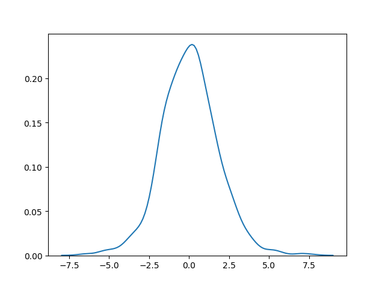
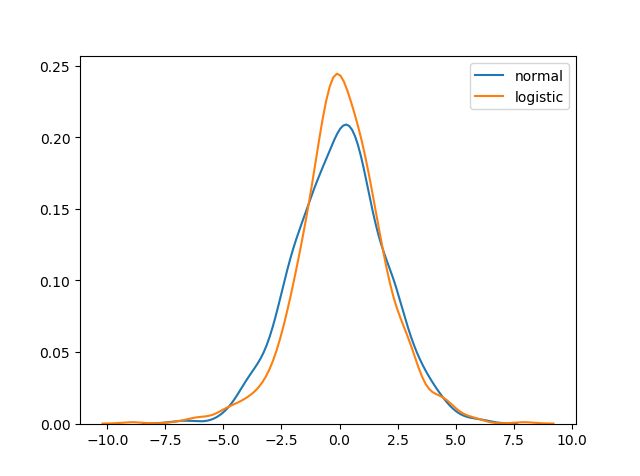
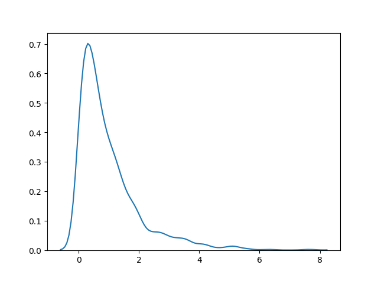

<h1 align="center">Distribuições de Probabilidade</h1>
<h1 align="center">Distribuição Logística - (Logistic Distribution)</h1>

A Distribuição Logística é usada para descrever o crescimento.

É amplamente usada em aprendizado de máquina em regressão logística, redes neurais, etc.

Possui três parâmetros:

<ul>
  <li><b>loc</b> - média, onde está o pico. Padrão 0.</li>
  <li><b>scale</b> - desvio padrão, a planicidade da distribuição. Padrão 1.</li>
  <li><b>size</b> - A forma do conjunto retornado.</li>
</ul>

<b>Exemplo:</b>

Desenhe amostras de uma distribuição logística de 2x3 com média 1 e desvio padrão 2.0:

<pre>
from numpy import random

x = random.logistic(loc=1, scale=2, size=(2, 3))

print(x)
</pre>
<h2 align="center">Visualização da Distribuição Logística</h2>

<b>Exemplo:</b>

<pre>
from numpy import random
import matplotlib.pyplot as plt
import seaborn as sns

sns.distplot(random.logistic(size=1000), hist=False)

plt.show()
</pre>

<b>Resultado:</b>

<h2 align="center">Diferença entre Distribuição Logística e Normal</h2>

Ambas as distribuições são quase idênticas, mas a distribuição logística tem mais área sob as caudas, o que significa que representa uma maior possibilidade de ocorrência de um evento mais afastado da média.

Para um valor maior de escala (desvio padrão), as distribuições normais e logísticas são quase idênticas, exceto pelo pico.

<b>Exemplo:</b>

<pre>
from numpy import random
import matplotlib.pyplot as plt
import seaborn as sns

sns.distplot(random.normal(scale=2, size=1000), hist=False, label='normal')
sns.distplot(random.logistic(size=1000), hist=False, label='logistic')

plt.show()
</pre>

<b>Resultado:</b>

<h1 align="center">Distribuição Multinomial - (Multinomial Distribution)</h1>

A distribuição multinomial é uma generalização da distribuição binomial.

Ela descreve os resultados de cenários multinomiais, ao contrário da distribuição binomial, onde os cenários devem ser apenas um de dois, por exemplo, o tipo sanguíneo de uma população ou o resultado de rolar um dado.

Possui três parâmetros:

<ul>
  <li><b>n</b> - número de resultados possíveis (por exemplo, 6 para o resultado de um dado).</li>
  <li><b>pvals</b> - número de resultados possíveis (por exemplo, 6 para o resultado de um dado).</li>
  <li><b>size</b> - número de resultados possíveis (por exemplo, 6 para o resultado de um dado).</li>
</ul>

<b>Exemplo:</b>

Gere uma amostra para o resultado de um dado:

<pre>
from numpy import random

x = random.multinomial(n=6, pvals=[1/6, 1/6, 1/6, 1/6, 1/6, 1/6])

print(x)
</pre>

<b>Observação:</b> As amostras multinomiais NÃO produzirão um único valor! Elas produzirão um valor para cada pval.

<b>Observação:</b> Como são uma generalização da distribuição binomial, sua representação visual e semelhança com a distribuição normal é a mesma que a de várias distribuições binomiais.

<h1 align="center">Distribuição Exponencial - (Exponential Distribution)</h1>

A distribuição exponencial é usada para descrever o tempo até o próximo evento, por exemplo, falha/sucesso, etc.

Ela possui dois parâmetros:

<ul>
  <li><b>scale</b> - inverso da taxa (veja lam na distribuição de Poisson), padrão 1.0.</li>
  <li><b>size</b> - A forma do conjunto retornado.</li>
</ul>

<b>Exemplo:</b>

Gere uma amostra para a distribuição exponencial com escala de 2.0 e tamanho 2x3:

<pre>
from numpy import random

x = random.exponential(scale=2, size=(2, 3))

print(x)
</pre>
<h2 align="center">Visualização de uma Distribuição Exponencial</h2>

<b>Exemplo:</b>

<pre>
from numpy import random
import matplotlib.pyplot as plt
import seaborn as sns

sns.distplot(random.exponential(size=1000), hist=False)

plt.show()
</pre>

<b>Resultado:</b>

<h2 align="center">Relação entre a Distribuição de Poisson e a Distribuição Exponencial</h2>

A distribuição de Poisson lida com o número de ocorrências de um evento em um período de tempo, enquanto a distribuição exponencial lida com o tempo entre esses eventos.

<h2 align="center">Refêrencias:</h2>

https://www.w3schools.com/python/numpy/numpy_random_logistic.asp

https://www.w3schools.com/python/numpy/numpy_random_multinomial.asp

https://www.w3schools.com/python/numpy/numpy_random_exponential.asp

