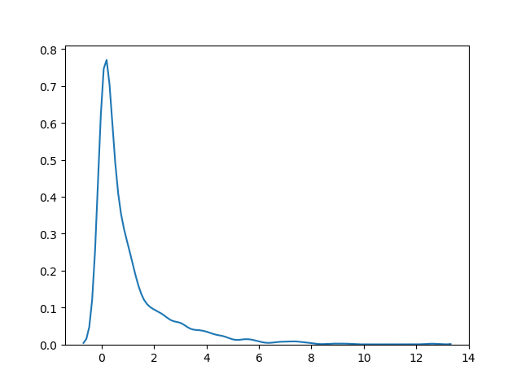
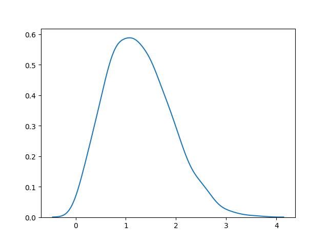
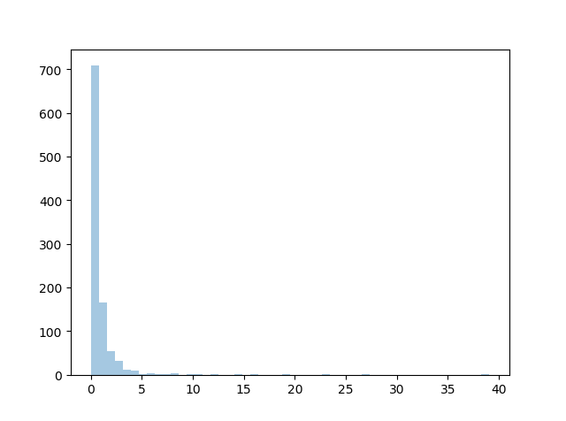

<h1 align="center">Distribuições Estatística</h1>
<h1 align="center">Distribuição Qui-Quadrado (Chi-Square Distribution)</h1>

A distribuição qui-quadrado é usada como base para verificar a hipótese.

Ela possui dois parâmetros:

<ul>
  <li>df - (grau de liberdade).</li>
  <li>size - A forma do array retornado.</li>
</ul>

<b>Exemplo:</b>

Desenhe uma amostra para a distribuição qui-quadrado com grau de liberdade 2 e tamanho 2x3:

<pre>
from numpy import random

x = random.chisquare(df=2, size=(2, 3))

print(x)
</pre>
<h2 align="center">Visualização da Distribuição Qui-Quadrado</h2>

<b>Exemplo:</b>

<pre>
from numpy import random
import matplotlib.pyplot as plt
import seaborn as sns

sns.distplot(random.chisquare(df=1, size=1000), hist=False)

plt.show()
</pre>

<b>Resultado:</b>

<h1 align="center">Distribuição Rayleigh (Rayleigh Distribution)</h1>

A distribuição Rayleigh é usada em processamento de sinais.

Ela possui dois parâmetros:

<ul>
  <li>scale - (desvio padrão) decide quão achatada será a distribuição (padrão 1,0).</li>
  <li>size - A forma do array retornado.</li>
</ul>

<b>Exemplo:</b>

Desenhe uma amostra para a distribuição Rayleigh com escala de 2 e tamanho 2x3:

<pre>
from numpy import random

x = random.rayleigh(scale=2, size=(2, 3))

print(x)
</pre>
<h2 align="center">Visualização da Distribuição Rayleigh</h2>

<b>Exemplo:</b>

<pre>
from numpy import random
import matplotlib.pyplot as plt
import seaborn as sns

sns.distplot(random.rayleigh(size=1000), hist=False)

plt.show()
</pre>

<b>Resultado:</b>

<h2 align="center">Similaridade Entre as Distribuições Rayleigh e Qui-Quadrado</h2>

Com desvio padrão unitário e 2 graus de liberdade, Rayleigh e qui-quadrado representam as mesmas distribuições.

<h1 align="center">Distribuição de Pareto (Pareto Distribution)</h1>

Uma distribuição que segue a lei de Pareto, ou seja, distribuição 80-20 (20% dos fatores causam 80% dos resultados).v

Ela possui dois parâmetros:

<ul>
  <li>a - parâmetro de forma.</li>
  <li>size - A forma do array retornado.</li>
</ul>

<b>Exemplo:</b>

Desenhe uma amostra para a distribuição de Pareto com parâmetro de forma igual a 2 e tamanho 2x3:

<pre>
from numpy import random

x = random.pareto(a=2, size=(2, 3))

print(x)
</pre>
<h2 align="center">Visualização da Distribuição de Pareto</h2>

<b>Exemplo:</b>

<pre>
from numpy import random
import matplotlib.pyplot as plt
import seaborn as sns

sns.distplot(random.pareto(a=2, size=1000), kde=False)

plt.show()
</pre>

<b>Resultado:</b>

<h2 align="center">Refêrencias:</h2>

https://www.w3schools.com/python/numpy/numpy_random_chisquare.asp

https://www.w3schools.com/python/numpy/numpy_random_rayleigh.asp

https://www.w3schools.com/python/numpy/numpy_random_pareto.asp

