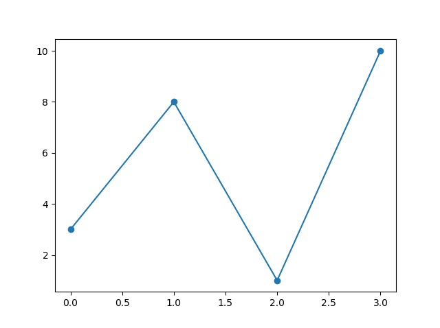
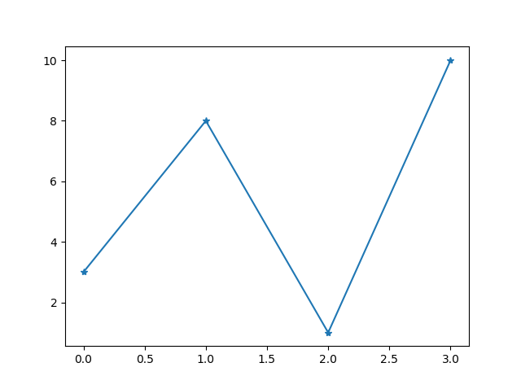
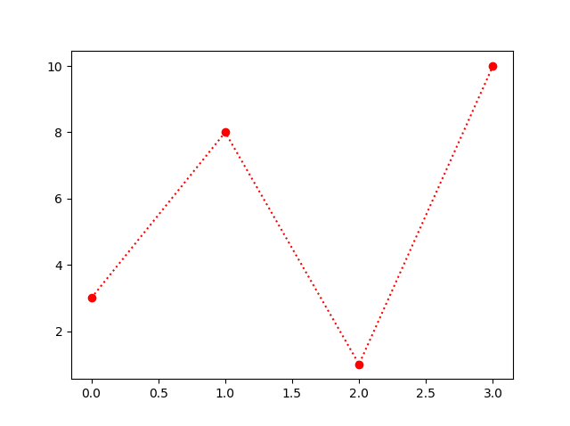
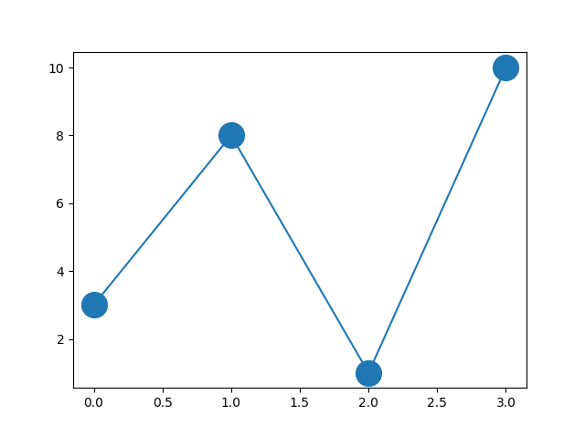
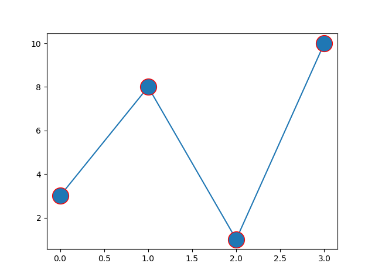
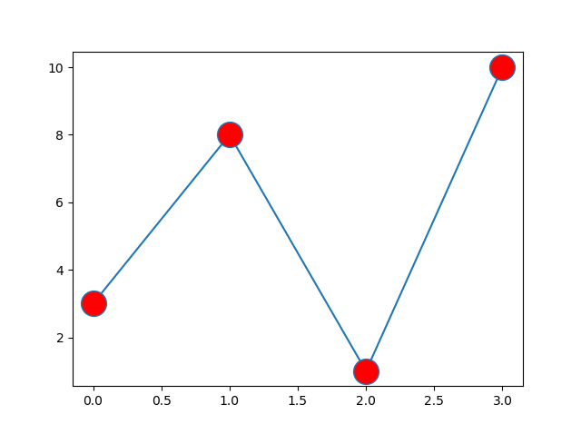
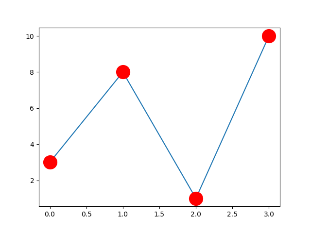
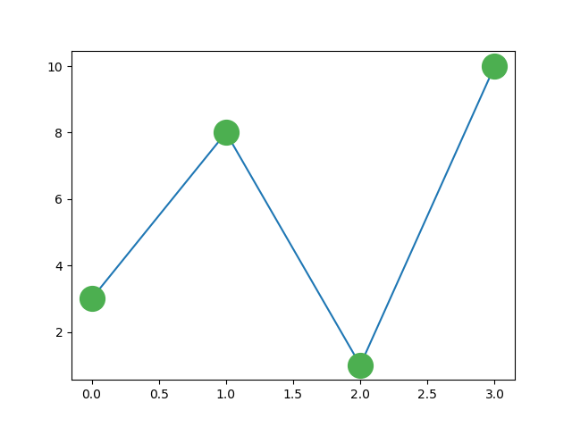
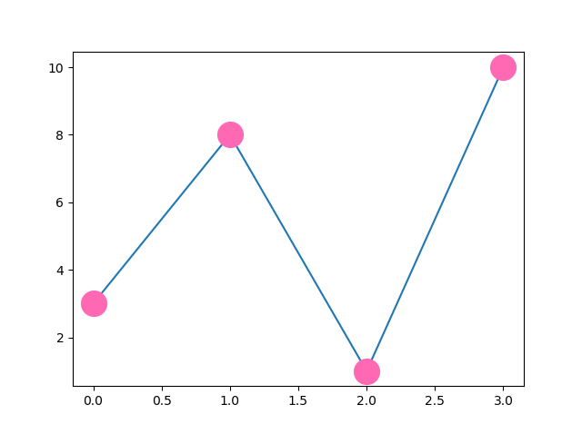

<h1 align="center">Personalizando Cores e Estilos</h1>
<h1 align="center">Marcadores</h1>

Você pode usar o argumento de palavra-chave "marker" para enfatizar cada ponto com um marcador especificado:

<b>Exemplo:</b>

Marcar cada ponto com um círculo:

<pre>
import matplotlib.pyplot as plt
import numpy as np

ypoints = np.array([3, 8, 1, 10])

plt.plot(ypoints, marker = 'o')
plt.show()
</pre>

<b>Resultado:</b>

<b>Exemplo:</b>

Marcar cada ponto com uma estrela:

<pre>
import matplotlib.pyplot as plt
import numpy as np

ypoints = np.array([3, 8, 1, 10])

plt.plot(ypoints, marker = '*')
plt.show()
</pre>

<b>Resultado:</b>

<h2 align="center">Referência de Marcadores</h2>

Você pode escolher qualquer um desses marcadores:

<table>
  <tr>
    <th>Marker</th>
    <th>Description</th>
  </tr>
  <tr>
    <td>'o'</td>
    <td>Circle</td>
  </tr>
  <tr>
    <td>'*'</td>
    <td>Star</td>
  </tr>
  <tr>
    <td>'.'</td>
    <td>Point</td>
  </tr>
  <tr>
    <td>','</td>
    <td>Pixel</td>
  </tr>
  <tr>
    <td>'x'</td>
    <td>X</td>
  </tr>
  <tr>
    <td>'X'</td>
    <td>X (filled)</td>
  </tr>
  <tr>
    <td>'+'</td>
    <td>Plus</td>
  </tr>
  <tr>
    <td>'P'</td>
    <td>Plus (filled)</td>
  </tr>
  <tr>
    <td>'s'</td>
    <td>Square</td>
  </tr>
  <tr>
    <td>'D'</td>
    <td>Diamond</td>
  </tr>
  <tr>
    <td>'d'</td>
    <td>Diamond (thin)</td>
  </tr>
  <tr>
    <td>'p'</td>
    <td>Pentagon</td>
  </tr>
  <tr>
    <td>'H'</td>
    <td>Hexagon</td>
  </tr>
  <tr>
    <td>'h'</td>
    <td>Hexagon</td>
  </tr>
  <tr>
    <td>'v'</td>
    <td>Triangle Down</td>
  </tr>
  <tr>
    <td>'^'</td>
    <td>Triangle Up</td>
  </tr>
  <tr>
    <td>'&lt;'</td>
    <td>Triangle Left</td>
  </tr>
  <tr>
    <td>'&gt;'</td>
    <td>Triangle Right</td>
  </tr>
  <tr>
    <td>'1'</td>
    <td>Tri Down</td>
  </tr>
  <tr>
    <td>'2'</td>
    <td>Tri Up</td>
  </tr>
  <tr>
    <td>'3'</td>
    <td>Tri Left</td>
  </tr>
  <tr>
    <td>'4'</td>
    <td>Tri Right</td>
  </tr>
  <tr>
    <td>'|'</td>
    <td>Vline</td>
  </tr>
  <tr>
    <td>'_'</td>
    <td>Hline</td>
  </tr>
</table>
<h2 align="center">Strings de Formato fmt</h2>

Você também pode usar o parâmetro de notação de string de atalho para especificar o marcador.

Esse parâmetro também é chamado de "fmt" e é escrito com a seguinte sintaxe:

marker|line|color (marcador|linha|cor)

<b>Exemplo:</b>

Marcar cada ponto com um círculo:

<pre>
import matplotlib.pyplot as plt
import numpy as np

ypoints = np.array([3, 8, 1, 10])

plt.plot(ypoints, 'o:r')
plt.show()
</pre>

<b>Resultado:</b>

O valor do marcador pode ser qualquer um dos valores do Marcador de Referência acima.

O valor da linha pode ser um dos seguintes:

<h2 align="center">Referência da Linha</h2>
<table>
  <tr>
    <th>Line Syntax</th>
    <th>Description</th>
  </tr>
  <tr>
    <td>'-'</td>
    <td>Sólida</td>
  </tr>
  <tr>
    <td>':'</td>
    <td>Pontilhada</td>
  </tr>
  <tr>
    <td>'--'</td>
    <td>Tracejada</td>
  </tr>
  <tr>
    <td>'-.'</td>
    <td>Tracejada/Pontilhada</td>
  </tr>
</table>

<b>Observação:</b> Se você deixar de fora o valor da linha no parâmetro fmt, nenhuma linha será desenhada.

O valor da cor curta pode ser um dos seguintes:

<h2 align="center">Referência de Cores</h2>
<table>
  <tr>
    <th>Color Syntax</th>
    <th>Description</th>
  </tr>
  <tr>
    <td>'r'</td>
    <td>Vermelho</td>
  </tr>
  <tr>
    <td>'g'</td>
    <td>Verde</td>
  </tr>
  <tr>
    <td>'b'</td>
    <td>Azul</td>
  </tr>
  <tr>
    <td>'c'</td>
    <td>Ciano</td>
  </tr>
  <tr>
    <td>'m'</td>
    <td>Magenta</td>
  </tr>
  <tr>
    <td>'y'</td>
    <td>Amarelo</td>
  </tr>
  <tr>
    <td>'k'</td>
    <td>Preto</td>
  </tr>
  <tr>
    <td>'w'</td>
    <td>Branco</td>
  </tr>
</table>
<h2 align="center">Tamanho do Marcador</h2>

Você pode usar o argumento de palavra-chave markersize ou a versão mais curta, ms, para definir o tamanho dos marcadores:

<b>Exemplo:</b>

Defina o tamanho dos marcadores como 20:

<pre>
import matplotlib.pyplot as plt
import numpy as np

ypoints = np.array([3, 8, 1, 10])

plt.plot(ypoints, marker = 'o', ms = 20)
plt.show()
</pre>

<b>Resultado:</b>

<h2 align="center">Cor do Marcador</h2>

Você pode usar o argumento de palavra-chave markeredgecolor ou o mais curto mec para definir a cor da borda dos marcadores:

<b>Exemplo:</b>

Defina a cor da BORDA como vermelho:

<pre>
import matplotlib.pyplot as plt
import numpy as np

ypoints = np.array([3, 8, 1, 10])

plt.plot(ypoints, marker = 'o', ms = 20, mec = 'r')
plt.show()
</pre>

<b>Resultado:</b>

Você pode usar o argumento de palavra-chave markerfacecolor ou o mais curto mfc para definir a cor dentro da borda dos marcadores:

<b>Exemplo:</b>

Defina a cor do INTERIOR como vermelho:

<pre>
import matplotlib.pyplot as plt
import numpy as np

ypoints = np.array([3, 8, 1, 10])

plt.plot(ypoints, marker = 'o', ms = 20, mfc = 'r')
plt.show()
</pre>

<b>Resultado:</b>

Use ambos os argumentos mec e mfc para colorir todo o marcador:

<b>Exemplo:</b>

Defina a cor tanto da borda quanto do interior como vermelho:

<pre>
import matplotlib.pyplot as plt
import numpy as np

ypoints = np.array([3, 8, 1, 10])

plt.plot(ypoints, marker = 'o', ms = 20, mec = 'r', mfc = 'r')
plt.show()
</pre>

<b>Resultado:</b>

Você também pode usar <a href="https://www.w3schools.com/colors/colors_names.asp">valores de cor hexadecimal</a>:

<b>Exemplo:</b>

Marque cada ponto com uma bela cor verde:

<pre>
import matplotlib.pyplot as plt
import numpy as np

ypoints = np.array([3, 8, 1, 10])

plt.plot(ypoints, marker = 'o', ms = 20, mec = '#4CAF50', mfc = '#4CAF50')
plt.show()
</pre>

<b>Resultado:</b>

Ou qualquer um dos <a href="https://www.w3schools.com/colors/colors_names.asp">140 nomes de cores suportados</a>.

<b>Exemplo:</b>

Marque cada ponto com a cor chamada "hotpink":

<pre>
import matplotlib.pyplot as plt
import numpy as np

ypoints = np.array([3, 8, 1, 10])

plt.plot(ypoints, marker = 'o', ms = 20, mec = 'hotpink', mfc = 'hotpink')
plt.show()
</pre>

<b>Resultado:</b>

<h1 align="center">Rótulos e Legendas (Labels)</h1>
