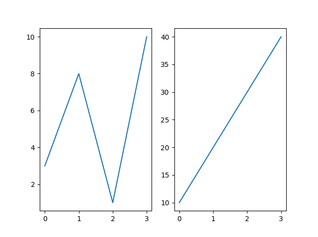
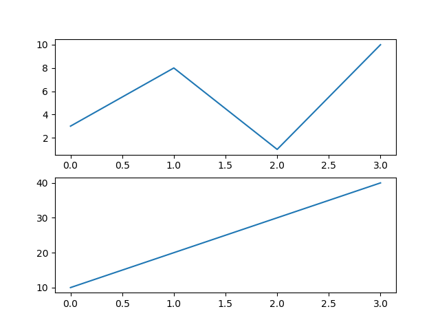
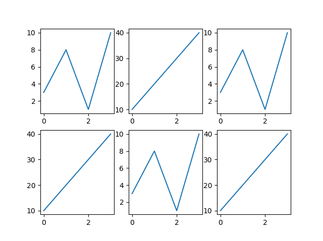
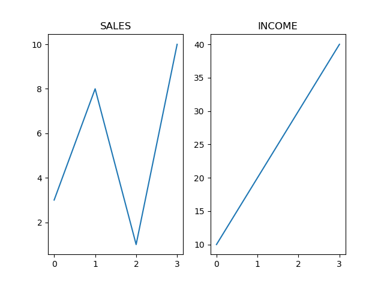
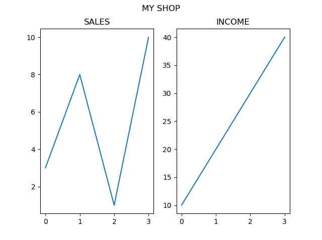

<h1 align="center">Trabalhando com Múltiplos Gráficos</h1>
<h2 align="center">Exibir Múltiplos Gráficos</h2>

Com a função subplot(), é possível desenhar vários gráficos em uma única figura:

<b>Exemplo:</b>

Desenhe 2 gráficos:

<pre>
import matplotlib.pyplot as plt
import numpy as np

#plot 1:
x = np.array([0, 1, 2, 3])
y = np.array([3, 8, 1, 10])

plt.subplot(1, 2, 1)
plt.plot(x,y)

#plot 2:
x = np.array([0, 1, 2, 3])
y = np.array([10, 20, 30, 40])

plt.subplot(1, 2, 2)
plt.plot(x,y)

plt.show()
</pre>

<b>Resultado:</b>

<h2 align="center">A Função subplot()</h2>

A função subplot() recebe três argumentos que descrevem o layout da figura.

O layout é organizado em linhas e colunas, que são representadas pelo primeiro e segundo argumento.

O terceiro argumento representa o índice do gráfico atual.

<pre>
plt.subplot(1, 2, 1)
#A figura possui 1 linha, 2 colunas, e este gráfico é o primeiro gráfico.
</pre>
<pre>
plt.subplot(1, 2, 2)
#A figura possui 1 linha, 2 colunas, e este gráfico é o segundo gráfico.
</pre>

Portanto, se desejarmos uma figura com 2 linhas e 1 coluna (significando que os dois gráficos serão exibidos um em cima do outro em vez de lado a lado), podemos escrever a sintaxe da seguinte maneira:

<b>Exemplo:</b>

Desenhe 2 gráficos um em cima do outro:

<pre>
import matplotlib.pyplot as plt
import numpy as np

#plot 1:
x = np.array([0, 1, 2, 3])
y = np.array([3, 8, 1, 10])

plt.subplot(2, 1, 1)
plt.plot(x,y)

#plot 2:
x = np.array([0, 1, 2, 3])
y = np.array([10, 20, 30, 40])

plt.subplot(2, 1, 2)
plt.plot(x,y)

plt.show()
</pre>

<b>Resultado:</b>

É possível desenhar quantos gráficos desejar em uma única figura, basta descrever o número de linhas, colunas e o índice do gráfico.

<b>Exemplo:</b>

Desenhe 6 gráficos:

<pre>
import matplotlib.pyplot as plt
import numpy as np

x = np.array([0, 1, 2, 3])
y = np.array([3, 8, 1, 10])

plt.subplot(2, 3, 1)
plt.plot(x,y)

x = np.array([0, 1, 2, 3])
y = np.array([10, 20, 30, 40])

plt.subplot(2, 3, 2)
plt.plot(x,y)

x = np.array([0, 1, 2, 3])
y = np.array([3, 8, 1, 10])

plt.subplot(2, 3, 3)
plt.plot(x,y)

x = np.array([0, 1, 2, 3])
y = np.array([10, 20, 30, 40])

plt.subplot(2, 3, 4)
plt.plot(x,y)

x = np.array([0, 1, 2, 3])
y = np.array([3, 8, 1, 10])

plt.subplot(2, 3, 5)
plt.plot(x,y)

x = np.array([0, 1, 2, 3])
y = np.array([10, 20, 30, 40])

plt.subplot(2, 3, 6)
plt.plot(x,y)

plt.show()
</pre>

<b>Resultado:</b>

<h2 align="center">Título</h2>

É possível adicionar um título a cada gráfico com a função title():

<b>Exemplo:</b>

2 gráficos, com títulos:

<pre>
import matplotlib.pyplot as plt
import numpy as np

#plot 1:
x = np.array([0, 1, 2, 3])
y = np.array([3, 8, 1, 10])

plt.subplot(1, 2, 1)
plt.plot(x,y)
plt.title("SALES")

#plot 2:
x = np.array([0, 1, 2, 3])
y = np.array([10, 20, 30, 40])

plt.subplot(1, 2, 2)
plt.plot(x,y)
plt.title("INCOME")

plt.show()
</pre>

<b>Resultado:</b>

<h2 align="center">Título Principal</h2>

Você pode adicionar um título para a figura inteira com a função suptitle():

<b>Exemplo:</b>

Adicione um título para a figura inteira:

<pre>
import matplotlib.pyplot as plt
import numpy as np

#plot 1:
x = np.array([0, 1, 2, 3])
y = np.array([3, 8, 1, 10])

plt.subplot(1, 2, 1)
plt.plot(x,y)
plt.title("SALES")

#plot 2:
x = np.array([0, 1, 2, 3])
y = np.array([10, 20, 30, 40])

plt.subplot(1, 2, 2)
plt.plot(x,y)
plt.title("INCOME")

plt.suptitle("MY SHOP")
plt.show()
</pre>

<b>Resultado:</b>

